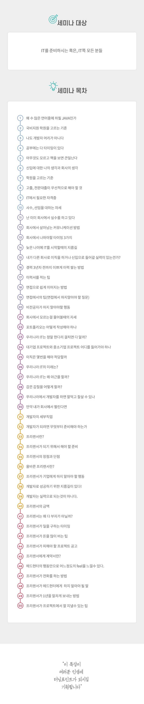

# Developer Servival
> 2019-02-06 Developer Servival Seminar 8Hour(12:00 ~ 20:00)
> Seoul  Mapo-gu  Mapo-daero

[52th Developer Servival Seminar](https://cafe.naver.com/amunamuna/7967)

## Developer Servival Curriculum

## Seminar details

1. 개발언어 선택
    * 현 시장 수요(앞도적인 Java 시장)
    * 국가가 선택한 국가 개발언어 - Python(향후 약 5~6년 뒤 추세)

2. 회사생활
    * 과거 내 회사생활이 떠올랐다.
      내 첫 회사는 드론회사에서 시작했다. 드론 펌웨어 연구 및 개발. 드론에 대한 관심은 가득했고 열정은 누구보다 뜨거웠지만, 개발자로서 나는 정말이지 초라하고 작았다.
      의욕도 앞서고 정말 열심히 하고 싶은데, 몰라도 너무 몰랐다. 당연히 순탄하게 진행되지 않았지만, 물어보고 싶어도 뭘 물어볼지 모르고 캄캄했고 모른다는 것이 창피한 나는 끝 없이 숨고 숨기려고 했다. 점점 작아지는 내가 초라해지는 숨막히는 시간을 보냈던 그 때가 떠오르는 강의였으며, 그때의 나에게 위로를, 방향을, 혹은 격려를 해주고 싶은 감정이 들었다.
    * 똑똑한 회사생활을 하고 싶다.
    * 개발자의 연차의 급은 1~5년차, 6년차, 7~10년차 그 이후로 나뉜다.
      6년차의 실력, 능력은 당연히 1~5년차의 경험, 노력, 배움에서 나타나겠지.
    * 인기 있는 개발자가 되고싶다면, 인정받는 6년차 개발자가 첫 목표
    * 편한 일만하고 싶은 나약한 생각은 전혀 없다. 새로운 환경, 새로운 개발, 새로운 분야를 접하면서 다양한 경험을 쌓자.
    * 과거의 나처럼 모르는 것에 대해 두려워 하지 말고, 개선하자.
    * 좋은 인성도 개발자로서 중요한 요소 중 하나일 것이다.
    * 데일리 보고를 통한 좋은 커뮤니케이션 관계를 만들어 보자.
      사실 일일보고라는게 상당히 어려운 것이겠지만, 지금 내 위치에서는 일일보고를 통해 팀 간의 커뮤니케이션이 상당히 중요하다고 판단한다. 좋은 결과물을 위해서라도 더 노력해보자.
    * 현재 맡은 택시관제프로그램을 개발하면서 포기하고싶은 적이 굉장히 많았지만, 다시, 좀더 책임감을 가지고 반드시 좋은 결과를 낼 수 있는 마무리를 할 것이다.

3. 이직(이력서, 면접)
    * 웃는 이력서 사진(이미 있지만, 하나더 찍고싶다)
    * 당당한 면접을 보기위해 노력하자
    * 특히 돈에 관련된 사항은 항상 면접때 제일 어려운 부분이지만 그만큼 이 사항에 대해서 말할때는 더 자심감있고 당당하게 말하자.
    * 면접 - 결과 사항에 있어서 아래에서 확인하려 하지말고, 헤드헌터(혹은 기업 인사담당자)에 우위에 서서 면접 - 연봉 - 결과를 조율하고 결정하자.
        + 우위에 서서 조율하는 방법
        더 당당하고 솔직해지자. 이미 다른곳 면접을 봤으며, 합격했다는 연락을 받았다. 그리고 솔직한 연봉 혹은 환경에 대한 소신을 말하면서, 더 끌리는곳을 가고 싶어 거절의사를 명확하게 밝히자.
        + 면접을 볼때 역시 중요하다. 면접을 보면서 이미 다른곳 면접을 본 상태이며, 면접에서 합격했다는 연락을 받았다는 것을 밝히며, 합격 여부에 대한 소식을 빠르게 받을 수 있냐는 양해를 구하자(그래야 붙은 곳에 못간다는 연락을 빠르게 전할 수 있으니) 반드시 여기에 다니고 싶은 의지를 보여주며, 결과 후에는 내 마음이 가는 곳으로 조율을 하며, 각 면접사에 솔직한 피드백을 반드시 주자.
    * 누구나 가고싶은 대기업은 고민할 문제가 없겠지만, 그렇지 못한 경우에는 당연히 기업문화, 환경, 그리고 연봉이 가장 중요한 요소겠지. 그리고 더 중요한 것은 면접을 통한 인상 그리고 합리적인 조율이 필요하다.

## Review

불과 6개월 이후 다시 듣는 생존전략이지만, 상황이 많이 변해있음을 느꼈다.

좋은 방향, 내용도 있지만, 불안과 방황이 존재하는 불쾌한 현실이다.

좋은 개발자가 되기 위한 노력은 멈추지 않겠지만, 어쩌면 좀더 현실적인 방향을 제시해주는 강의가 너무 감사하고 도움이 되지만 상세한 현실을 마주쳐보자 약간은 두려움이 들었다. 내가 아직도 내 개발실력을 믿지 못하는 뜻이기도 하다.

너무 먼곳으로 한번에 가려는 욕심보다는 차근차근 새로운 경험을 토대로 차곡차곡 쌓여 나가는 개발자가 되고싶다. 누구보다 견고하고 튼튼한 탑처럼 쌓여가는 개발자가 될 것이다. 자신감을 불어넣어주는 의지와 개발의 즐거움으로 하루하루 채워나가자.

사실 두려운 속내는 아주 사소하고 작은 문제이지만, 이 작은 욕심이 어쩌면 나를 좀더 멀고 높은곳으로 데려다 줄것이라 믿으며, 좀더 타이트 하고 발전해 나가는 개발자가 되어보자.
