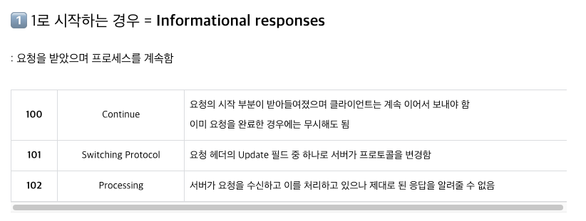
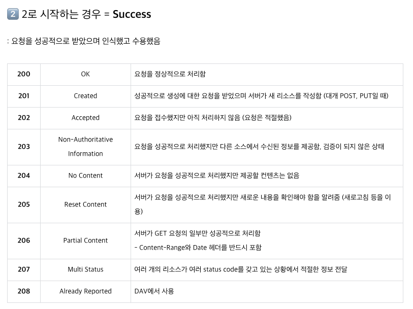
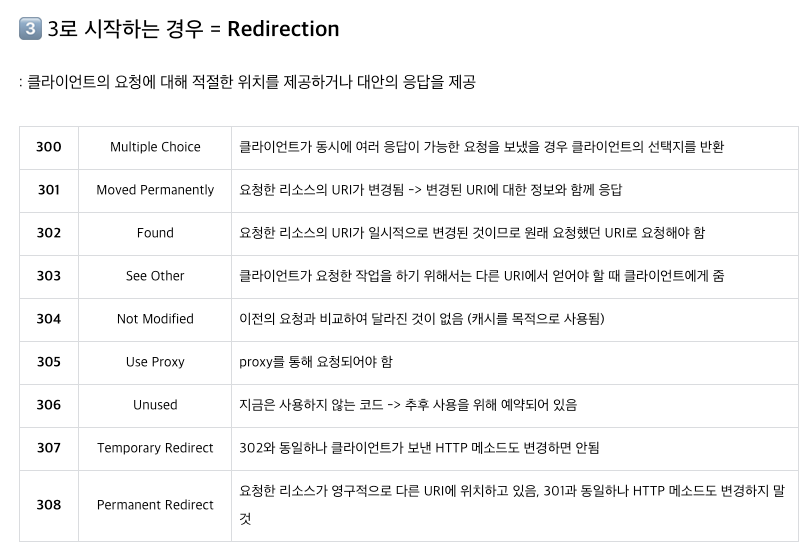
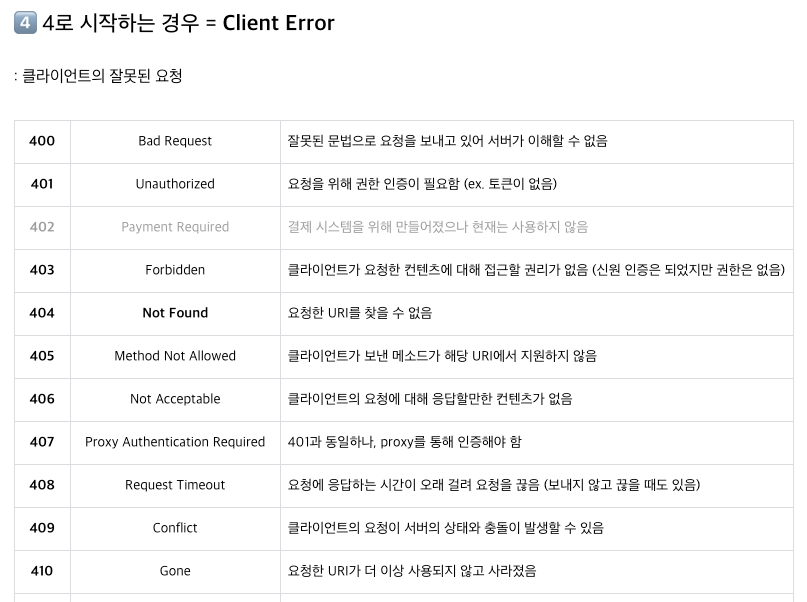
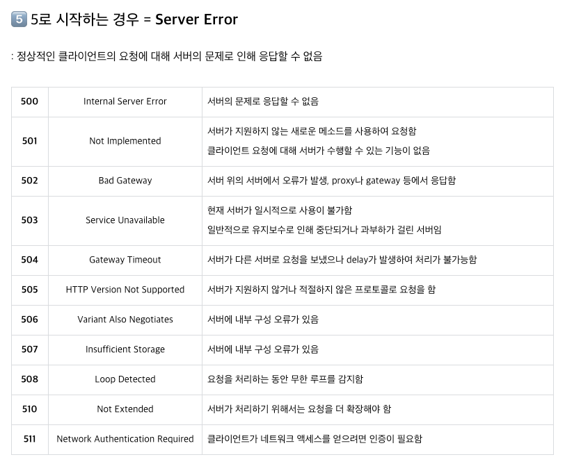
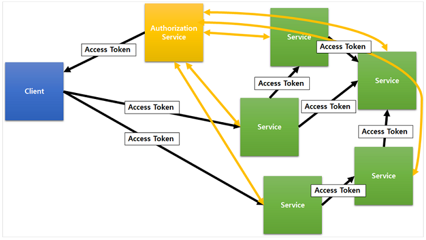
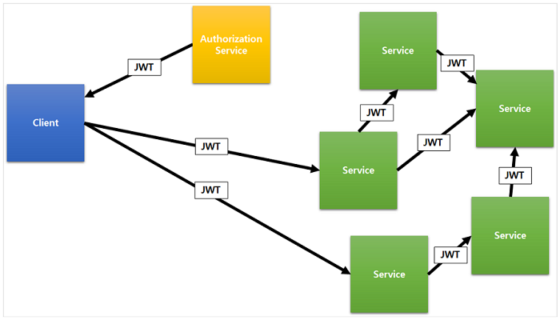
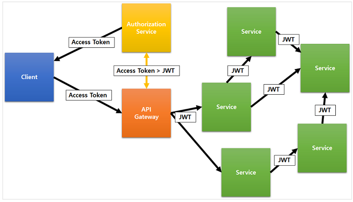
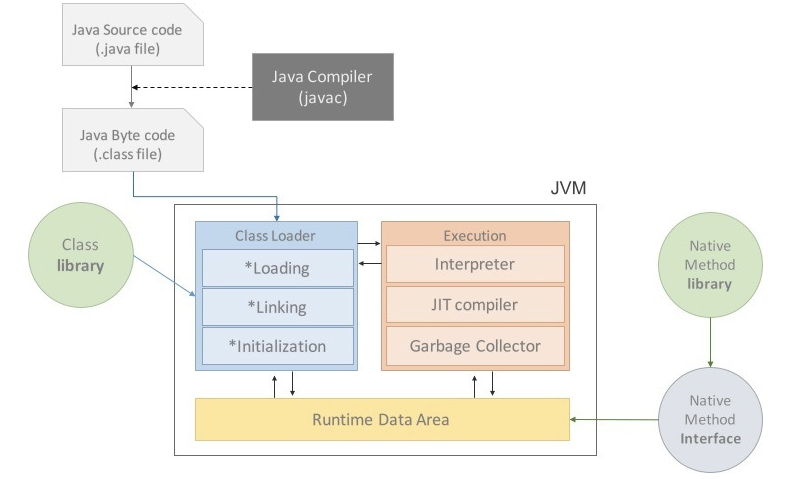

# Interview

* [Development common sense](#development-common-sense)

# Development common sense

## Object Oriented Programming

객체 지향 프로그래밍 이전의 프로그래밍 패러다임을 살펴보면, 컴퓨터가 중심으로 있었다. 컴푸터가 사고하는대로 프로그래밍을 하는 것이다.
하지만 객체지향 프로그래밍이란 인간 중심적 프로그래밍 패러다임이라고 할 수 있다. 즉 현실 세계를 프로그래밍ㅇ으로 옮겨와 프로그래밍하는 것을 말한다.
현실 세계의 사물들을 객체라고 보고, 그 객체로부터 개발하고자 하는 애플리케이션에 필요한 특징들을 뽑아와  프로그래밍 하는 것이다. 이것을 **추상화**라 한다.

`OOP`로 코드를 작성하면 이미 작성한 코드에 대한 재사용성이 아주 높다. 자주 사용되는 로직을 라이브러리로 만들어두면 계속해서 사용할 수 있으며, 그 신뢰성을 확보할 수 있다.
또한 라이브러리를 각종 예외상황에 맞게 잘 만들어두면, 개발자가 사소한 실수를 하더라도 그 에러를 컴파일 단계에서 잡아낼 수 있으므로 버그 발생이 줄어든다.
또한 내부적으로 어떻게 동작하는지 몰라도, 개발자는 라이브러리가 제공하는 기능들을 사용할 수 있기 때문에 생산성이 높아지게 된다.
객체 단위로 코드가 나눠져 작성되기 때문에 디버깅이 쉽고 유지보수에 용이하다. 또한 데이터 모델링을 할 때 객체와 매핑하는 것이 수월하기  때문에 요구사항을 보다 명확하게 파악하여 프로그래밍 할 수 있다.

객체 간의 정보 교환이 모두 메세지 교환을 통해 일어나므로, 실행 시스템에 많은 `overhead` 가 발생하게 된다. 하지만 이것은 하드웨어의 발전으로 많은 부분 보완되었다.
객체 지향 프로그래밍의 치명적인 단점은 함수형 프로그래밍 패러다임의 등장 배경을 통해서 알 수 있다. **바로 객체가 상태를 갖는다는 것이다.**
변수가 존재하고, 이 변수를 통해 객체가 예측할 수 없는 상태를 갖게 되어 애플리케이션 내부에서 버그를 발생시킨다는 것이다. 이러한 이유로 함수형 패러다임이 다시 주목받고 있다.

### 객체 지향적 설계 원칙

1. SRP(Single Responsibility Principle): 단일 책임 원칙- 클래스는 단 하나의 책임을 가져야하며, 클래스를 변경하는 이유는 단 하나의 이유여야 한다.
2. OCP(Open-Closed Principle): 개방-폐쇄 원착- 확장에는 열려 있어야 하고, 변경에는 닫혀 있어야 한다.
3. LSP(Liskov Substitution Principle): 리스코프 치환 원칙- 상위 타입의 객체를 하위 타입의 객체로 치환해도, 상위 타입을 사용하는 프로그램은 정상적으로 동작해야 한다.
4. ISP(Interface Segregation Principle): 인터페이스 분리 원칙- 인터페이스는 그 인터페이스를 사용하는 클라이언트를 기준으로 분리해야 한다.
5. DIP(Dependency Inversion Principle): 의존 역전 원칙- 고수준 모듈은 저수준 모듈의 구현에 의존해서는 안된다.

---

# Network

## 웹 통신의 흐름

1. 브라우저가 URL의 값일 파싱해서 `HTTP Request Message`를 만들어 `OS`에 전송을 요청
2. 이 때, `Domain` 으로 요청을 보낼 수 없기 때문에 DNS Lookup을 수행
    + DNS Lookup: 브라우저 -> hosts 파일 -> DNS cache 순서로 도메인에 매칭되는 ip를 서치
3. 이 요청은 프로토콜 스택이라는 OS에 내장된 네트워크 제어용 소프트웨어에 의해 패킷에 담기고, 패킷에 제어정보를 덧붙여 LAN 어댑터에 전송하고, LAN 어댑터는 이를 전기신호로 변환시켜 송출
4. 패킷은 스위칭 허브 등을 경유하여 인터넷 접속용 라우터에서 ISP로 전달되고, 인터넷으로 이동
5. 엑세스 회선에 의해 통신사용 라우터로 운반되고 인터넷의 핵심부로 전달
6. 핵심부를 통과한 패킷은 목적지의 LAN에 도착하고, 방화벽이 패킷을 검사한 후 캐시 서버로 보내어 웹 서버에 갈 필요가 있는지 검사
7. 웹 서버에 도착한 패킷은 프로토콜 스택이 패킷을 추출하여 메세지를 복원하고, 웹 서버 어플리케이션에 전달
8. 웹 서버 애플리케이션은 요청에 대한 응답 데이터를 클라이언트로 회송하고, 이는 전달된 방식 그대로 다시 클라이언트에게 전달

## TCP와 UDP의 차이
* `TCP`
  + 연결 지향형 프로토콜(`3way handshake`, `4way handshake`)
  + 가상 회선을 만들어 신뢰성을 보장하도록(흐름 제어, 혼잡 제어, 오류 제어)하는 프로토콜
  + 신뢰성을 보장하귀 위한 절차가 필요해 `UDP` 보다 통신 속도가 느림

* `UDP`
  + 데이터 그램 단위 전송 프로토콜
  + 자체적으로 신뢰성을 보장하지 않지만, 추가적인 정의를 통해 개발자가 직접 신뢰성을 보장하도록 할 수 있다.

> TCP는 주로 신뢰성이 중요한 서비스에 사용되고, UPD는 스트리밍, RTP 같이 연속성이 더 중요한 서비스에 사용

## TCP 3, 4 way handshake

* `TCP`의 가상회선을 생성 및 제거하는 과정
* `3 way handshake`
  
  + 가상회선을 수립하는 단계로, 클라이언트는 서버에 요청을 전송할 수 있는지, 서버는 클라이언트에게 응답할 수 있는지 확인하는 과정
  + SYN, ACK 패킷을 주고 받으며, 임의의 난수 SYN 플래그를 전송하고, ACK 플래그에는 1을 더한 값을 전송
  + 클라이언트가 서버에 SYN(n)을 전송하고, SYN(m), ACK(n + 1) 응답을 대기한다
  + 요청을 받은 서버는 연결을 수락한다는 응답을 클라이언트에게 ACK(n + 1), SYN(m) 보낸다
  + 클라이언트는 응답을 잘 받았다는 ACK(m + 1) 을 보내고, 연결이 이루어져 데이터가 오간다
  + SYN(n) -> ACK(n + 1), SYN(m) -> ACK(m + 1) 순서로 동작
  + 연결이 다 되었을 때 상태를 `ESTABLISHED` 라고 한다.
* `4 way handshake`
  
  + `3 way handshake`는 연결을 초기화 할 때 사용된다면, `4 way handshake`는 연결 세션을 종료할 때 사용
  + 클라이언트가 연결 종료 요청 `FIN` 플래그를 전송
  + 서버는 연결 종료 요청 확인(ACK)를 응답하고, 통신이 끝낼때 까지 기다린다.
  + 서버의 연결이 종료되면, `FIN` 플래그를 전송
  + 클라이언트가 연결 종료 확인(ACK) 전송

> * 만약 Server에서 FIN을 전송하기 전에 전송한 패킷이 Routing 지연이나 패킷 유실로 인한 재전송 등으로 인해 FIN 패킷보다 늦게 도착하는 상황이 발생한다면?
> * Client 입장에서는 세션을 종료시킨 후 뒤늦게 도착하는 패킷이 있다면, 이패킷은 Drop되고 데이터는 유실될 것이다.
> * 이러한 현상에 대비해 Client는 Server로 부터 FIN을 수신하더라도 일정시간(Deafult:240초) 동안 세션을 남겨놓고 잉여 패킷을 기다리는 과정을 가진다.

## HTTP

`HTTP`는 따로 암호화 과정을 거치지 않기 때문에, 중간에 패킷을 가로챌 수 있고, 수정도 가능
따라서 보완이 취약해 질 수 있어 이를 보완하기 위해 HTTPS가 나왔다.
`HTTPS`는 중간에 암호화 계층을 거쳐서 패킷을 암호화 한다.

## HTTPS
`HTTPS`는 `HTTP`에 보안 계층을 추가한 통신으로, 제3자 인증, 공개키 암호화, 비밀키 암호화를 사용

* 제 3자 인증: 믿을 수 있는 인증기관에 등록된 인증서만 신뢰
* 공개키 암호화: 비밀키를 공유하기 위해 사용
* 비밀키 암호화: 통신하는 데이터를 암호화하는데 사용
* 클라이언트는 `TCP 3 way handshake`를 수행 후 서버는 인증서를 보낸다.
* 클라이언트는 받은 인증서를 신뢰하기 위해서 등록된 인증기관인지 확인ㄴ
* 이 인증서는 인증기관의 개인키로 암호화되어있고, 공개키로 검증 할 수 있다.
* 클라이언트는 사이트 정보와 서버의 공개키를 얻을 수 있다.

## GET & POST

* `GET`
  + get 방식은 요청하는 데이터가 `HTTP Request Message`의 `Header` 부분에 url이 담겨서 전송
  + 그렇기 떄문에, `url`상의 `?`뒤에 데이터가 붙어 `request`를 보내게 된다.
  + 이러한 방식은 `url`이라는 공간에 담겨가기 때문에, 전송할 수 있는 데이터의 크기가 제한적
  + 또한 보안이 필요한 데이터에 대해서는 데이터가 `url`에 그대로 노출되기 때문에 이러한 경우 `GET`방식은 적절하지 않음
  + 즉 `GET`방식은 주로 서버에서 어떤 데이터를 가져오는 상황에 주로 사용되며, **서버의 값이나 상태 등을 변경하지 않는다.**
  + 또한 `GET` 방식의 요청은 브라우저에서 `Caching`gkf tn dlTek.

* `POST`
  + post 방식은 요청하는 데이터가 `HTTP Request Message`의 `Body` 부분에 데이터가 담겨서 전송
  + 그렇기 떄문에, 바이너리 데이터를 요청하는 경우 `POST` 방식으로 보내야 한다.
  + 데이터 크기에 대해 자유롭고, `GET` 방식보다 보안성이 좋다(하지만 보안적인 측면에서 중요 데이터는 암호화)
  + 즉 `POST`방식은 주로 서버에 값이나 상태를 변경하기 위해서 또는 추가하기 위해서 사용

# RESTful API

* `REST`란
  + REpresentational State Transfer 의 약자
  + 여기서 `~ful` 이라는 형용사형 어미를 붙여 ~한 API 라는 표현으로 사용
  + 즉 REST의 기본 원칙을 성실히 지킨 서비스 디자인은 `RESTful` 하다고 표현
* `REST` 구성
  + 자원(Resource) - URL
  + 행위(Verb) - HTTP Method
  + 표현(Representations)
* `REST`가 디자인 패턴으로, 아키텍쳐다.
  + 좀더 정확하게 표현하면, `REST`는 `Resource Oriented Architecture`로, API 설계 중심에 자원(Resource)이 있고, `HTTP Method`를 통해 자원을 처리하도록 설계

## RESTful API 설계

1. 리소스와 행위를 명시적으로 직관적으로 분리
  + 리소스는 `URI`로 표현되는데, 리소스가 가리키는 것은 `명사`로 표현
  + 행위는  `HTTP Method`로 표현하고, `GET(조회)`, `POST(생성)`, `PUT(entity 전체 수정)`,`PATCH(entity 일부 수정)`, `DELETE`를 분명한 목적으로 사용
2. `Message`는 `Header`와 `Body`를 명확하게 분리해서 사용
  + Entity에 대한 내용은 `Body`에 담는다.
  + 애플리케이션 서버가 행동할 판단의 근거가 되는 컨트롤 정보인 API버전 정보, 응답받고자 하는 MIME 타입 등은 `Header`에 담는다.
  + header 와 body 는 http header 와 http body 로 나눌 수도 있고, http body 에 들어가는 json 구조로 분리할 수도 있다.
3. API 버전을 관리
  + 환경은 항상 변하기 때문에 API의 signature가 변경될 수도 있음을 유의
  + 특정 API를 변경할 때는 반드시 하위호환성을 보장
4. 서버와 클라이언트가 같은 방식을 사용해서 요청
  + 브라우저 또는 모바일 환경 등 다양한 클라이언트 환경을 고려해, 서버와 클라이언트 간의 데이터 교환 타입을 json, form-data 등 같이 한가지 방식으로 통일
  + `URI`가 플랫폼 중립적으로 구성

## POST, PUT, PATCH 차이
* POST: 자원의 생성(Create) 요청 -> 동일 요청시 계속 새로운 자원 생성, 특정 리소스 구분 ID x
* PUT: 자원의 전체 필드 수정(Update) -> 동일 요청시, 한가지 자원 수정
  + 특정 리소스를 구분하는 ID가 필요
  + 자원 수정 시 자원의 모든 필드 필요
* PATCH: 자원의 일부만 수정(Update) 요청
  + 특정 리소스를 구분하는 ID가 필요
  + 수정하려는 자원의 필드만 필요

## HTTP 응답 상태 코드
* 1xx (정보): 요청을 받았으며 프로세스를 계속 진행합니다.
* 2xx (성공): 요청을 성공적으로 받았으며 인식했고 수용하였습니다.
* 3xx (리다이렉션): 요청 완료를 위해 추가 작업 조치가 필요합니다.
* 4xx (클라이언트 오류): 요청의 문법이 잘못되었거나 요청을 처리할 수 없습니다.
* 5xx (서버 오류): 서버가 명백히 유효한 요청에 대해 충족을 실패했습니다.

## 장점
* Open API를 제공하기 쉽다.
* 멀티플랫폼 지원 및 연동이 쉽고 용이
* 원하는 타입으로 데이터를 교환
* 기존 웹 인프라를 그대로 사용 가능

## OSI 7 계층
* 네트워크 통신을 구성하는 요소 7가지를 계층으로 표준화 한 것
* 표준화를 통해 통신이 일어나는 과정을 단계별로 파악할 수 있고, 이를 토대로 문제 해결이 용이
* 실제로 우리가 사용하는 네트워크 TCP/IP는 4계층
* 통신에 실제로 사용되는 1, 2계층이 1계층,  5, 6, 7 계층이 4계층으로 운영

---

* 7 계층 - 응용 계층(Application)
  + 최종 사용자에게 보이는 계층
  + 7계층에서 작동하는 응용프로그램은 사용자와 직접적으로 상호작용
  + 크롬, 파이어폭스, 사파리 등 웹 브라우저와 스카이프, 아웃룩, 오피스 등의 응용 프로그램
  + 직렬화 시작
  + 프로그램(포트)
* 6 계층 - 표현 계층(Presentation)
  + 응용 계층(7계층) 데이터 표현에서 독집적인 부분을 타나낸다
  + 응용프로그램이나 네트워크를 위해 데이터를 `표현`하는 계층
  + 데이터를 안전하게 전송하기 위해서 암호화, 복호화하는 과정
  + 인코딩(<-> 디코딩), 암호화
* 5 계층 - 세션 계층(Session)
  + 서버와 클라이언트간의 통신을 위해 필요한 세션을 만들어 주는 계층
  + 이 계층에서는 세션에 관련된 설정으로, 조율(시스템의 응답 대기 기간), 세션 마지막에 응용프로그램 간의 종료 등의 기능
  + 동기화
* 4 계층 - 전송 계층(Transport)
  + 전송 계층은 최종 시스템 및 호스트 간의 데이터 전송을 조율을 담당
  + 보낼 데이터의 용량과 속도, 목적지 등을 처리
  + TCP는 인터넷 프로토콜 위에 구축되는데, 4계층에서 전송 제어 프로토콜이 사용된다.
  + 데이터를 보냈는데, 어느 정도 시간이 흘러도 응답이 없으면, 똑같은 데이터를 다시 보냄
    - 서킷스위칭: A와 B가 연결될 때, 하나의 선으로 연결, C도 추가로 연결시키고 싶으면 선을 추가로 연결, 단점은 선이 계속 늘어난다
    - 패킷스위칭: 하나의 선으로 다양한 데이터를 보내는 것, 패킷으로 쪼개서 보내기 떄문에 데이터를 동시에 보낼 수 있음(데이터가 쪼개져서 섞여서 들어옴), 패킷 데이터의 header로 구분해서 데이터를 재조립
* 3 계층 - 네트워크 계층(Network)
  + 라우터 기능 대부분이 네트워크 계층에 자리잡는다.
  + 이 계층은 여러 라우터를 통한 라우팅(가장 빠른 경로 찾기)을 비롯한 패킷 전달을 담당
  + IP를 통해 노리적인 경로를 만드는 것
* 2 계층 - 데이터 링크 계층(Data Link)
  + 두 개의 직접 연결된 노드 간 데이터 전송을 제동하며, 물리 계층의 오류 수정 처리도 한다.
  + 여기에는 2개의 부계층이 존재한다.
  + 매체 접근 제어`MAC` 계층과 논리적 연결 제어`LLC` 계층
  + 대부분의 스위치가 2 계층에서 작동
  + LAN의 고유한 번호 `MAC`주소
* 1 계층 - 물리 계층(Physical)
  + 시스템의 전기적, 물리적 표현을 나태낸다.
  + 케이블 종류, 무선 주파수 링크, 핀 배치, 전압, 물리 요건 등이 포함
  + 데이터가 전송될 때 다시 역직렬화가 일어남

> * 직렬화: 기계가 이해할 수 있는 데이터로 변환
> * 역직렬화: 인간이 이해할 수 있는 데이터로 변환

> 네트워크에 문제가 발생하면,케이블 연결 확인, 스위치나 라우터 확인, 서버 컴퓨터의 작동 여부 확인

## Apache, Nginx

웹 서버 소프트웨어(Apache, Nginx)는 OSI 7계층 중 어디서 작동하는지
웹 서버 소프트웨어(Apache, Nginx)의 서버 간 라우팅 기능은 OSI 7계층 중 어디서 작동하는지

* `Apache`
  + 스레드 / 프로세스 기반 구조: 클라이언트 요청 하나당 스레드 하나가 처리하는 구조로, 사용자가 많으면 스레드 생성, 메모리 및 CPU 낭비가 심함
  + MPM 방식 처리(Multi Processing Module) 구조
    - Prefork MPM: 하나의 자식 프로세스(자식 프로세스는 최대 1024개)가 하나의 스레드를 갖는 구조로, 스레드 간 메모리를 공유 하지 않음, 일반적으로 Single or Dual CPU에 성능 적합
    - Worker MPM: Prefork 보다 메모리 사용량이 적고, 통신량이 많거나, 동시 접속자가 많은 사이트에 적합, 프로세스당 스레드가 최대 64개의 스레드가 처리 가능하고, 각 스레드는 한 번에 한 연결을 담당, 스레드 간에 메모리 공유, 일반적으로 Multi CPU에 성능 적합

* `NginX`
  + Event-Driven 처리 기반 구조: 여러 개의 커넥션을 모두 Event-Handler를 통해 비동식 방ㅅ힉으로 처리해, 먼저 처리되는 것부터 로직이 진행, 이러한 기법의 주 사용 목적은 대화형 프로그램을 만드는 데 PCP 처리와 유사
  + Event-Driven 처리 방식을 사용하다 보니 프로세스를 Fork 하거나 스레드를 사용하는 아파치와 달리 CPU와 관계없이 모든 IO들을 전부 Event Listener로 전달하기 떄문에, 흐름이 끊기지 않고 응답이 빠르게진행 되어 1개의 프로세스로 더 빠른 작업이 가능하게 될 수 있다.
  + 그렇기 떄문에 Nginx는 메모리 측면에서 System Resource를 적게 처리한다는 장점

---

# 운영체제(OS)

## 프로세스와 스레드 차이
프로그램이란, 파일이 저장 장치에 저장되어 있지만, 메모리에 올라가 있지 않은 정적인 상태로 프로그램을 실행하면, 운영체제로 부터 메모리에 하나의 프로세스가 등록되면서 부여 받는다.

* 프로세스
  + 운영체제로 부터 자원을 할당받는 작업의 단위
  + 프로세스는 각각 Code, Data, Stack, Heap 구조로 되어 있는 독립된 메모리 영역을 할당
  + 기본적으로 프로세스당 최소 1개의 스레드(메인 스레드)를 가지고 있다.

* 스레드
  
  + 할당 받은 자원(프로세스)내에서 실행되는 여러 흐름의 단위
  + 스레드는 프로세스 내에서 각각 `Stack`을 할당받고, 프로세스 내의 Code, Data Heap 영역은 공유
  + 스레드는 한 프로세스 내에서 동작되는 여러 실행의 흐름으로, 프로세스 내의 주소 공간이나 자원들(힙공간)을 스레드끼리 공유하며 실행
  + 한 스레드가 프로세스 자원을 별경한다면, 다른 스레드도 그 변경 결과가 즉시 반영

## Context Switching

* `Context Switching`
  + 한 Task가 끝날 때까지 기다리는 것이 아니라, 여러 작업을 번갈아가면서 실행하여, 동시에 처리될 수 있도록 하는 방법
  + 주로 `Context Swithcing`은 `Interrupt`에 의해 발생되는데, 하드웨어를 통한 I/O 요청이나, OS/Driver 레벨의 Timer 기반 Scheduling에 의해 발생
  + 디테일하게, CPU가 한 개의 Task(Process/Thread)를 실행하고 있는 상태에서 인터럽트 요청에 의해 다른 Task로 실행이 전환되는 과정에서 기존의 Task 상태 및 Register 값들에 대한 정보(Context)를 저장하고 새로운 Task의 Context 정보로 교체하는 작업
  + 여기서 Process/Thread 처리하는 `Context Swithcing`은 조금 다르다.
    - `Process` : `Context Switching` 가 OS에서 스케줄링되는 PCB(Process control Block)에서 관리
    - `Thread` : `Context Switching` 가 `Process` 내부의 TCB(Task Control Block)에서 관리
  + Task의 PCB 정보는 Process Stack, Ready Queue 라는 자료구조로 관리가 되며 `CS`시 ㅖ츄 정보를 바탕으로 이전에 수행하던 작업  혹은 신규 작업의 수행이 가능하게 된다.
  + `Context Switching`시 `Context Switching` 수행하는 CPU는 Cache를 초기화하고, Memory Mapping을 초기화 하는 작업을 거치는 등 아무 작업을 하지 못하므로 잦은 `Context Switching`은 성능 저하를 가져온다.
    - `Process Context Switching`: 프로세스는 각각의 독립된 메모리 영역을 할달받았기 때문에, 캐쉬 메모리 초기화 등 무거운 작업이 진행
    - `Thread Context Switching`: 쓰레드 사이의 공유된 자원외에 스택영역만 초기화하면 되므로, 프로세스에 비해 훨신 속도가 빠르다.

## 멀티 프로세스와 멀티 스레드

### 멀티 프로세스
* 멀티 프로세스란
  + 하나의 응용프로그램을 여러 개의 프로세스로 구성하여, 각 프로세스가 하나의 작업을 처리
* 장점
  + 여러 개의 자식 프로세스 중 하나에 문제가 발생하면, 그 자식 프로세스만 죽는 것 이상으로 다른 영향이 확산되지 않는다.
* 단점
  + `Context Switching`에서의 오버헤드
    - `Context Switching` 과정에서 캐쉬 메모리 초기화 등 무거운 작업이 진행되고 많은 시간이 소모되는 등 오버헤드가 발생
    - 프로세스는 각각의 독립된 메모리 영역을 할당받았기 떄문에, 프로세스 사이의 공유되는 메모리가 없기 떄문에 `Context Switching`이 발생하면, 캐쉬에 있는 모든 데이터를 리셋하고 다시 캐쉬 정보를 불러와야 한다.
  + 프로세스 사이의 어렵고 복잡한 통신 기법
    - 프로세스는 각각의 독립된 메모리 영역을 할당받았기 떄문에 하나의 프로그램에 속하는 프로세스들 사이의 변수를 공유할 수 없다.

### 멀티 스레드
* 멀티 스레드란
  + 하나의 프로세스에 여러 개의 스레드를 구성하고, 각 스레드로 하여금 하나의 작업을 처리하도록 지시
  + 윈도우, 리눅스 등 많은 운영체제들이 멀티 프로세싱을 지원하고 있지만, 멀티 스레딩을 기본으로 설정
  + 웹 서버는 대표적인 멀티 스레드 응용 프로그램
* 장점
  + 시스템 자원 소모 감소(자원의 효율성 증가)
  + 시스템 처리량 증가(처리 비용 감소)
    - 스레드 간 데이터를 주고 받는 것이 간단해지고, 시스템 자원 소모가 줄어들게 된다.
    - 스레드 사이의 작업량이 작아 `Context Switching`이 빠르다.
  + 간단한 통신 방법으로 인한 프로그램 응답 시간 단축
    - 스레드는 프로세스 내의 Stack 영역을 제외한 모든 메모리를 공유하기 떄문에 통신의 부담이 적다
* 단점
  * 주의 깊은 설계
  * 멀티 스레드 간의 자원 공유 문제가 발생(동기화 문제)
  * 하나의 스레드에 문제가 발생하면, 전체 프로세스에 영향

### 멀티 프로세스 대신 멀티 스레드를 사용하는 이유

* 자원의 효울성 증대
  + 멀티 프로세스로 실행되는 작업을 멀티 스레드로 실행할 경우, 프로세스를 생성하여, 자원을 할당하는 시스템 콜이 줄어들어, 자원을 효율적으로 관리 가능
  + 프로세스 간의 `Context Switching`시 많은 오버헤드가 발생하는데 비해 스레드 `Context Switching`은 Stack 영역만 처리하기 떄문에 매우 빠르다.
  + 스레드 간의 통신비용이 적게 들어간다.
* 주의할 점
  + 동기화 문제(Synchronization Issue)
  + 스레드 간의 자원 공유는 전역 변수를 이용하므로, 함께 사용할 때, 충돌이 발생할 수 있다.

## 자바 스레드
* 일반 스레드와 거이 차이가 없으며, JVM이 운영체제 역활을 한다
* 자바에는 프로세스가 존재하지 않고, 스레드만 존재하며, 자바 스레드는 JVM에 의해 스케줄되는 실행 단위 코드 블록
* 자바에서 스레드 스케줄링은 전적으로 JVM에 의해 이루어 진다.
  + 스레드가 몇 개 존재하는지
  + 스레드로 실행되는 프로그램 코드의 메모리 위치는 어디인지
  + 스레드의 상태는 무엇인지
  + 스레드 우선순위는 얼마인지
* 즉 개발자는 자바 스레드로 작동할 스레드 코드를 작성하고, 스레드 코드가 생명을 가지고 실행을 시작하도록 JVM에 요청하는 일 뿐이다.

---

# 암호학/보안

## 비대칭키 암호화, 대칭키 암호화
* 비대칭키 암호화란
  + 공개키 암호화라고도 하며, 공개키는 외부에 공개되어있고, 비밀키는 내부적으로 가지고 있는 구조
  + 서로 각각의 키로 암호화하거나, 해제할 수 있는 방식
    - `공개키` 암호화: 데이터 보완에 중점 -> 비밀키로 복호화
    - `비밀키` 암호화: 인증 과정에 중점 -> 공개키로 복호화
      - 암호화된 데이터가 공개키로 복호화된다는 것은 공개키와 쌍을 이루는 개인키에 의하여 암호화되었다는 것을 의미
      - **즉 데이터의 제공자의 신원 확인이 보장**
  + 이 방식은 대칭키를 공유하는 방식보다 비교적 안전함
  + 대신 상대적으로 더 높은 연산성능이 필요해 속도가 느림
* 대칭키 암호화란
  + 양측이 동일한 키를 가지고 있으며, 암호화 및 해제를 동일한 키로 해제
  + 이 방식은 비밀키가 노출되는 문제가 발생 할 수 있는 위험요소가 있다.
  + 상대적으로 빠른 연산으로 속도가 빠름

## 단방향 암호화
* 단방향 암호화란
  + 복호화 불가능한 암호화
  + 해시 알고리즘을 이용해 구현하며, 민감정보를 데이터베이스에 저장할 때 해당 방식을 사용
  + 단방향 암호화는 빠른 성능을 보여, 무차별 대입 공격에 취약
    - 따라서 이런 정보를 저장하기 위해 bcrypt 같은 방식을 사용
  + 해시란 말에서 알 수 있듯이 충돌 가능성
  + 복호화 불가능한 암호화 방식이 위험하다는 것은 채시 충돌을 일으켰다 라는 뜻

## JWT
* JWT란
  + Json Web Token 의 약자로 전자 서명된 URL-safe(URL로 이용할 수 있는 문자열:base64 url)
  + URL-safe한 문자열이기 때문에, HTTP(url, header, body)등 어디에도 위치할 수 있다.
  + 사용 용도는 클라이언트와 서버, 서비스와 서비스 사이 통신 시 권한 인가를 위해 사용되는 토큰
  + JWT의 3가지 구조 - 헤더, 페이로드, 시그니처, 세 부분을 점(`.`)으로 구분
  
    - 헤더: 토큰의 타입, 암호화 알고리즘
      - JWT를 어떻게 검증(`Verify`)하는가에 대한 내용으로(`alg`: 서명 시 사용 알고리즘, `kid`: 서명 시 사용하는 키(`Public/Private Key`)를 식별하는 값)
    - 페이로드: 토큰의 정보, 서버와 클라이언트 간 주고 받을 내용
    - 시그니처: 토큰의 정보가 신뢰할 수 있는지 판단 기준 정보, 비밀키로 암호화 한다
      - 점(`.`)을 구분자로 `헤더`,  `페이로드`를 합친 문자열을 서명한 값
      - 서명은 헤더의 `alg`에서 정의된 알고리즘과 비밀 키를 이용해 생성
  + 검증
    - JWT의 검증은 공개키로 서명을 검증한다.
    - 공개키로 검증하는 이유: 비대칭키의 비밀키로 암호화 -> 공개키로 복호화
    - 공개키로 복호화가 된다면, 공개키와 쌍을 이루는 비밀키에 의해 암호화 되었다는 것을 의미하고, 이는 데이터 제공자의 신원이 검증되기 때문
  + JWT는 세션 기반 인증과 주로 대비
    - 세션기반 인증: 서버에서 세션 정보를 관리해야 하는 비용, 분산환경에서 관리의 어려움
    - JWT기반 인증: JWT 자체로 정보를 가지고 있기 때문에, 세션의 단점을 보완

## JWT in MSA

### 1. Access Token in MSA

* 일반적으로 권한에 따른 접근 제어가 필요한 웹 서비스는 로그인을 통해 사용자 인증을 진행
* 권한 서비스(Authorization Service)는 인증을 통과한 클라리언트에게 엑세스 토큰(Access Token) 발급
* 보통 엑세스 토큰은 권한을 가르키는 임의의 문자열로 구성되어, 권한을 참조한다는 의미로 참조 토큰이라 부른다.
* 모놀리스 아키텍처에서는 참조 토큰을 엑세스 토큰으로 사용하면 큰 문제가 없다
  + 그러나 `MSA`아키텍처 환경에서는 엑세스 토큰이 가리키는 권한을 확인하기 위해서 모든 `서비스` 들이 `권한 서비스(Authroization Service)`와 통신을 해야 한다.
  + 서비스가 늘어날수록, 이용자가 늘어날수록 권한 서버가 받는 부하가 기하급수적으로 늘어날 위험이 있다.

### 2. JWT as Access Token in MSA

* 참초 토큰 대신 JWT를 엑세스 토큰으로 사용
* JWT는 자체적으로 필요한 정보를 모두 담을 수 있어, 값 토큰(`By Value Token`)이라 한다.
* 각각의 서비스에서는 JWT에 포함된 값을 기준으로 권한을 확인
* 서비스와 `권한 서비스(Authroization Service)`의 통신은 JWT 서명을 인증하기 위해 공개키를 조회하는게 전부이다.
* 단점
  + 사용자에 대한 권한이나 정보가 변경되는 경우 JWT를 새로 발급
  + 경우에 따라서는 JWT 크기가 커질 수 있다.
  + **JWT의 헤더나 페이로드는 디코딩하면 바로 내용을 확인 할 수 있기 떄문에, 클라이언트에서 JWT의 모든 값들이 공개된다**
    - 외부에 노출되어서는 안되거나, 민감한 값이 노출될 수 있기때문에 보안 문제에 취약한 점이 있다.

### 3. API Gateway between Access Token and JWT in MSA

* 클라이언트, 권한 서비스, 서비스 사이에 `API Gateway`를 구성
  + 클라이언트에게 JWT를 숨기면서 서비스간 인증 통신 시 사용 가능
* `API Gateway`는 클라이언트에게 받은 엑세스 토큰을 권한 서비스를 통해 JWT로 받아 엑세스 토큰 대신 서비스로 전달

## OAuth
* OAuth 란
  + 제3자 인증방식으로,
  + 기본적으로 사용자와 서버는 서로를 신뢰할 수 없다
  + 그렇기 떄문에 민감정보를 작성하는 것이 꺼려지는 환경
  + 사용자의 민감정보를 관리하는 것은 리소스가 필요
  + 그래서 OAuth를 사용해서 신뢰할 수 있는 서버에게 정보를 맡겨놓고 접근할 수 있는 권한을 주는 것
  + 그렇게하면 민감정보를 굳이 입력하지 않아도 서비스를 사용할 수 있고, 서버측에서도 민감정보를 굳이 관리하지 않아도 되는 이점
* OAuth 아키텍쳐
* 스프링 시큐리티 + OAuth -> 인증 및 허가 관리

# JAVA

## JVM

* JVM이란?
  + 자바 애플리케이션을 클래스 로더를 통해 읽어 자바 API와 함께 실행
  + 메모리 관리(GC)를 수행하는 스택기반 가상머신
* JVM 구성
  + 클래스 로더(class loader)
    - JVM 내로 클래스(.class)를 로드하고, 링크를 통해 배치하는 작업을 수행하는 모듈
    - `Runtime`시에 동적으로 클래스를 로드
    - jar 파일 내 저장된 클래스들을 JVM위에 탑재하고 사용하지 않는 클래스들은 메모리에서 삭제(컴파일러 역활)
  + 실행 엔진(Execution Engine): 바이트 코드를 실행시키는 역활
    - 바이트코드를 실제 JVM 내부에서 기계가 실행할 수 있는 형태로 변경
    - 인터프리터: 바이트 코드를 한줄 씩 실행
    - JIT(Just In Time): 인터프리터 효율을 높이기 위한 컴파일러로 인터프리터가 반복되는 코드를 발견하면 JIT 컴파일러가 반복되는 코드를 네이티브 코드르 변경
    - GC: 힙 영역에서 사용되지 않는 객체들을 제거하는 역활
  + Runtime Data Areas: 프로그램 실행 중에 사용되는 다양한 영역
    - PC Register: Tread가 시작할 때 생성되며 현재 수행중인 JVM 명령의 주소를 갖고 있다
    - Stack Area: 지역 변수, 파라미터 등이 생성되는 영역, 실제 객체는 Heap에 할당되고, 레퍼런스만 Stack에 저장
    - Heap Area: 동적으로 생성된 오브젝트와 배열이 저장되는 곳, GC의 대상
    - Method Area: 클래스 맴버 변수, 메소드 정보, Type 정보, Constant, static, final 변수 등이 생성,
  + Java Native Interface: 자바 애플리케이션이 c,c++, 어셈블리어로 작성된 함수를 사용하도록 제공(Native 키워드)
  + Native Method Library: c,c++ 로 작성된 라이브러리
* Java 실행 방식
  + 자바 컴파일러(javac)가 자바 코드(.java)를 바이트코드(.class)로 변환
  + 클래스로더를 통해 바이트코드(.class)파일들을 JVM으로 로딩
  + 로딩된 클래스파일들은 실행 엔진을 통해 해석
  + 해석된 바이트코드는 런타임 데이터 영역에 배치되어 실질적인 수행

## GC
* GC?
  + JVM의 `Heap` 영역에서 사용하지않는 객체들을 제거하는 작업
* GC의 구조: Old Generation, Young Generation 으로 구성
  + Young Generation: Eden, Survivor 영역으로 구성
    - 생명 주기가 짧은 객체를 GC 대상으로 하는 영역
    - 새로 생성한 대부분 객체는 Eden 영역에 위치
    - Eden 영역에서 GC가 발생하면, 살아남은 객체는 Survivor 영역으로 이동
    - 하나의 Survivor 영역이 가득 차게 되면 살아남은 객체를 다른 Survivor 영역으로 이동
    - 이 과정을 반복하다가 계속해서 살아남아 있는 객체는 Old 영역으로 이동
  + Old Gerneration: Young Gerneration 영역에 있는 객체가 오래되서 저장되는 공간
    - 이 영역에서 객체가 사라질 때는 Major GC(Full GC) 수행
* Old 영역 GC 종류
  + Serial GC
    - 적은 메모리와 CPU 코어 개수가 적을때 적합한 방식
    - 운영 서버에서 절대 사용하면 안되는 방식
  + Parallel GC (java 7)
    - Serial GC와 기본적인 알고리즘은 같다
    - Parallel GC는 메모리가 충분하고 코어의 개수가 많을 때 유리
  + G1 GC (java 8)
    - Young 영역과 Old 영역이 아닌, 바둑판의 각 영역에 객체를 할당하고 GC를 수행
    - 여러 CPU와 아주 큰 메모리에서 효과적은 GC 수행하기 위해 사용

## GC 작동의 문제를 진단과 해결방법
* Survivor 영역 중 하나는 반드시 비어 있는 상태로 남아있어야 하지만,
* 두 Survivor 영역에 모두 데이터가 존재하거나, 두 영역 사용량이 0이라면 시스템이 정상적인 상황이 아니라고 판단

## GC 시스템 중단 시간을 줄이는 방법
* 힙 영역의 크기를 높여 GC의 빈도를 줄이는 것
* 개발자 코드를 변경하여 GC 성능 높이기
  + Collection 등을 사용할 때 객체의 크기 명시해주기
  + 불변(Immutable) 객체 사용하기

## 오버라이딩, 오버로딩
* 오버라이딩: 상위 클래스의 메소드를 재정의, 런타임 다형성
* 오버로딩: 같은 클래스 내에 매개변수의 타입, 개수를 다르게 메소드 구현, 컴파일 타임 다형성
    + @Override: 컴파일 타임에 오버라이딩에 대한 안정성을 부여해주기 떄문에 반드시 사용하는 것이 좋다

## 제네릭
* 컴파일 과정에서 타입체크를 해주는 기능으로 객체의 타입을 컴파일 시에 체크하기 떄문에 객체의 타입 안정성을 높이고 형변환의 번거로움을 줄여준다.
* 자바의 타입 안정성을 위해 사용

## @어노테이션
* 인터페이스를 기반으로 한 문법으로 주석처럼 코드에 달아 클래스에 특별한 의미를 부여하거나 기능을 주입

## 클래스, 객체, 인스턴스
* 클래스: 객체를 정의하기 위한 틀
* 객체: 클래스 기반으로 선언된 대상
* 인스턴스: 객체에 메모리가 할당된 실제 객체

## 인터페이스, 추상클래스
* 인터페이스: 구현 객체가 같은 동작을 한다는 것을 보장하기 위해서 사용 - **ex) 결제 인터페이스**
* 추상클래스: 객체의 추상적인 상위 개념으로 공통된 개념을 표현할 때 사용, 단일 상속만 가능
* 공통점
  + 선언만 있고, 구현 내용이 없는 클래스
  + 인스턴스 생성 불가
* 차이점
  + 추상 클래스는 extends, 인터페이스는 implements 로 상속
  + 추상 클래스: 단일 상속, 인터페이스 다중 상속

## 접근제어자
* Private: 해당 클래스 내에서만 접근 가능
* Default: 해당 패키지
* Protected: 상속한 클래스
* Public: 전체

## 객체지향
* 객체지향은 의존성 관리
* 객체지향으로 의존성을 관리함으로 변경 영향을 최소화하고, 새로운 기능을 개발 가능

## 동일성과 동등성 (`equals()`, `==`)
* `equals()`: 동일성은 객체의 주소를 비교
* `==`: 동등성은 객체의 값을 비교

## 원시타입과 참조타입
* 원시타입은 Java에서 8개만 존재하는 예약어(char, boolean, int, long, float, double, byte, short), stack 영역에 저장
* 나머지 타입은 전부 참조 타입으로, null 값을 가질 수 있으며, heap 영역에 저장

## String, StringBuffer, StringBuilder
* String
  + 불변 타입의 객체
* StringBuffer
  + 가변
  + 동기화 지원(멀티 쓰레드 환경)
  + 속도가 느리지만 병렬 상황에 사용
* StringBuilder
  + 가변
  + 속도는 빠르지만 병렬 상황에서 안전하지 않다.

## Collection List, Set, Map 차이
* List - Collection 상속
  + 데이터를 순차적으로 저장
  + 데이터 중복을 허용
  + 데이터 null 저장 허용
* Set - Collection 상속
  + 순서없이 Key로 데이터 저장
  + Key의 중복을 허용하지 않는다.
  + Key의 null을 허용하지 않는다.
* Map
  + 순서없이 key, value 저장
  + value는 중복허용, key는 x
  + key의 null을 허용하지 않는다.

## Vector, ArrayList 차이
* Vector
  + 한번에 하나의 스레드만 접근 가능(동기화)
  + 동기화 떄문에 속도가 느림
  + 현재 크기의 100% 증가
* ArrayList
  + 동시에 여러 스레드 접근 가능(비동기화)
  + 동기화를 하지 않아 속도가 빠름
  + 현재 크기의 50% 증가
  + 멀티쓰레드가 아닌 경우, ArrayList가 유리하다

## synchornized
* 여러 쓰레드가 하나의 자원을 이용하고자 할 때, 한 쓰레드가 자원을 사용중인 경우, 자원에 접근할 수 없도록 막아주는 키워드
* 병렬 상황에사 자원의 접근을 안전하게 한다

## Java8 추가 기능
* lambda: 함수형 프로그래밍
* Stream: 코드를 간결하고 가독성 있게, 병렬처리로 빠른 속도
* optional: 리턴 타입을 null로 반환하지 않도록 하는 안전한 타입

---

# Spring

## Spring DI/IoC
* IoC(Inversion Of Control) - 제어의 역전
  + 프로그램의 제어 흐름을 직접 제어하는 것이 아닌, 외부에서 관리하는 것으로 스프링 프레임워크의 제어
* DI(Dependency Injection) - 의존성 주입
  + 클래스 사이의 의존관계를 빈 설정 정보 바탕으로 컨테이너가 자동으로 연결
    - 생성자 주입
    - Setter 주입
    - @Autowire

## Spring Bean
* IoC 컨테이너에 등록되 있는 객체로, 애플리케이션이 최초 로드될 때, `@ComponentScan`을 통해 `@Component`들을 `@Bean`으로 등록
* 생존주기(스코프)
  + 싱글톤: 기본 스코프로 스프링 컨테이너 시작과 종료까지 유지되는 스코프
  + 프로토타입
    - request: 웹 요청이 들어오고 나갈때 까지 유지
    - session: 웹 세션이 생성, 종료할 떄 까지 유지
    - application: 웹 서블릿 컨텍스트와 같은 번위로 유지

## Servlet Filter & Interceptor 차이

* Interceptor 와 filter는 servlet 단위에서 실행
* 실행 순서는 filter -> interceptor -> @AOP 순이다
* filter
  + 요청과 응답을 거른뒤 정제하는 역활
  + 인코등 변환 처리
* interceptor
  + 스프링 컨텍스트 내부에서 요청과 응답에 대해 처리
  + 스프링의 모든 빈 객체에 접근 가능
  + 여러개 사용 가능하며, 로그인체크, 권한체크, 요청처리 시간 계산, 로그작업
* @AOP
  + 로깅, 트랜잭션, 에러 처리 등

## @AOP
* 프록시 패턴 기반의 AOP 구현체
* @Aspect
  * 빈으로 등록해야 함(@Component 추가)
* @PointCut
  * 3가지 표현방법
    1. execution: 정규식으로 패키지 위치나, 클래스, 메소드 별 적용
    2. **@annotaion: 유저 어노테이션을 생성하여, 원하는 위치에 어노테이션 선언**
      + Retentaion 설정: class 까지
    3. bean: 등록되 있는 빈들 중에 원하는 빈에 적용
* @Advice
  * 적용된 AOP 빈들이 해야하는 작업
  * @Before: 빈이 실행되기 전에
  * @AfterReturning: 빈이 실행된 후
  * @AfterThrowing: 빈 에러가 난 후
  * @Around: 빈을 감싸는 전체 범위(모든 경우의 수를 포함한다.) -> 빈 생성 전, 후 등

---

# JPA

## JPA 영속성 컨텍스트
* 1차 캐시: 조회가 가능하며, 1차 캐시에 없으면 DB에서 조회하여 1차 캐시에 저장
* 동일성 보장(==)
* 쓰기 지연: 트랜잭션을 지원하는 쓰기 지연이 가능하며, 커밋전까지는 SQL를 보내지 않고 모았다가 전송
* 변경 감지: 스냅샷을 1차 캐시에 저장, 엔티티가 변경되면 update 쿼리 전송
* 지연 로딩: 엔티티에서 해당 엔티티를 불러오는 순간에 쿼리를 날려 조회

## JPA Propagation 전파단계
* 트랜잭션 동작 도중 다른 트랜잭션을 호출하는 상황에 선택하는 옵션
  + Required(dafault) 옵션: 부모 트랜젝션 내에서 실행하며, 부모 트랜잭션이 없을 경우 새로운 트랜잭션 생성

## JPA N + 1
* 엔티티 조회 시 연관관계로 인한 지연 로딩 때문에 발생
* 해결책
  - 기본적으로 @OneToMany 매핑을 하지 않을 수 있다면 최선의 예방책
  - Fetch Join을 사용: 엔티티를 지연로딩하지 않고, 즉시로딩
  - 글로벌 페치 전략 - LAZY 사용

---

# 👨‍💻 회사에 궁금한 점은 없으신가요?

# 💁‍♂️ 역할 (The Role)

* `on-call`에 대한 계획 또는 시스템이 있나요? 있다면 어떻게 될까요? (그에 대한 대가는 무엇이 있나요?)
  + `on-call`: 팀에서 업무 시간 외에 문제를 해결할 사람을 로테이션으로 지정하는 문화
* 평상 시 업무에는 어떠한 것들이 있나요? 제가 맡게 될 업무에는 어떠한 것들이 있을까요?
* 팀의 주니어 / 시니어 구성 밸런스는 어떻게 되나요? (그것을 바꿀 계획이 있나요?)
* `온보딩(onboarding)`은 어떻게 이루어지나요?
  + `onboarding`: 조직 내 새로 합류한 사람이 빠르게 조직의 문화를 익히고 적응하도록 돕는 과정
* 제공된 목록에서 작업하는 것과 비교하여 얼마나 독립적 인 행동이 예상됩니까?
* 기대하는 근무시간, 핵심 근무 시간(core work hours)은 몇 시간인가요? 몇시부터 몇시까지 인가요?
  + `core work hours` :  자율 출퇴근 시 출퇴근 시간이 사람마다 다를 수 있는데 이 때, 오피스에 상주하거나 회의에 참석할 수 있는 시간
* (제가 지원한) 이 포지션의 '성공'에 대한 정의는 무엇인가요? 개발 조직 (또는 팀)에서 목표로 하고 있는 `KPI`가 있나요?
  + `KPI` : Key Performance Indicator의 줄임말로 핵심 성과 지표, 개인이나 조직의 전략 달성에 대한 기여도를 측정하는 지표
* 제 지원에 대해 혹시 우려 사항이 있을까요?
* 제가 가장 가까이 일할 사람에 대해서 이야기해 주실 수 있을까요?
* 제 직속 상사와 그 위 상사의 관리 스타일은 어떤가요? (마이크로 매니징 혹은 매크로 매니징)

---
