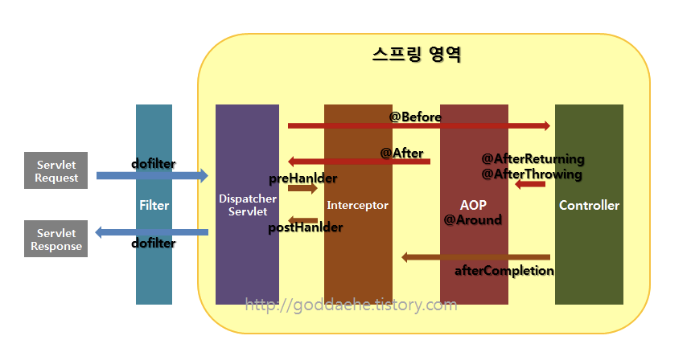

* 5년차 개발자 이중근
* 아마노 코리아에서 약 1년 동안 인천공항 프로젝트를 진행했으며,
  4개월동안 유지보수 진행한 인천공항 차량관제 시스템
  - 인천 공항의 모든 차량을 관리 및 관제서는 프로젝트로, 차량 관리 서버 하위로 각 기능을 담당하는 서버로 구성
  - 그 중 저는 주차 관제 서버, 택시 자동 배차, 키오스크를 담당하여 개발
  - 차량을 관제하기 위해서는 다양한 클라이언트와의 유기적인 서비스가 필요
  - 차량 인식 검지기, 번호 인식 카메라, 차량 입출차 게이트, 주차유도카메라, 결제키오스크 등
  - 대규모 서비스에서 중요한 요소중에 안정적인 서비스
  - 각 클라이언트는 연결되 있는 하드웨어를 실시간으로 하트비트 상태 체크를 하고
  - 장애 발생시 연결 서버로 장애알림을 전달
  - 각 기능 서버는 연결되 있는   모든 클라이언트를 실시간으로 관리 감독 합니다.
  - 장애 발생 시 장애 알림 서비스와 유기적인 장애 제어 전환 서비스를 제공했습니다.
  -> 실시간으로 대응 하며 안정적인 서비스에 기여
  - 택시 자동배차
  - 택시 번호를 인식해, 지역에 맞는 손님을 매칭
  - 장거리, 단거리 효율
  - 국토교통부에 제제로 개편 서비스를 개발해야했고,
  - 이를 해결하기 위해 기사님이 지역을 선택해여 운행할 수 있는 시스템을 개발하여, 성공적으로 준공
* 이트리소프트 SI 업체 -> 리치앤코 파견으로 카플래너 개편 프로젝트 10개월
  - 자동차 딜러 대상, 자동차 관련 보힘 및 캐피털 서비스 제공 어플리케이션
  - 특징으로, 리치엔코는 보험회사가 아닌 보험 중계 회사로, 다양한 보험사와, 캐피털사와의 제휴하여 서비스를 제공
  - 다양한 타사와의 협업으로 제휴사 통합 API를 설계 및 개발
  - 결제 서비스를 연동 -> 과거 보험을 중계해주는 서비스 -> 즉시 보험을 가입하고, 결제까지 하는 서비스를 유치
  - 자동차노동조합 15만 명 -> 약 1000 명 ->
  - 좋은 기획의도와 안정적인 서비스로 약 2만여명의 회원을 유치했습니다.

>
> 저는 시스템 개발에 성능과 안정성이 중요하다고 생각합니다.
> 이 두가지를 충속하면서 팀을 잘 받쳐주는 인정받는 개발자가 되고싶습니다.


---


# WebSocket

실시간 양방향 통신을 위한 WebSocket 기술을 흡족하게 사용하면서 2가지 문제를 직면했습니다.
1. WebSocket 미지원 웹 브라우저: 과거 브라우저를 많이 사용하는 보험 환경 이슈(구 익스플로러)-> Socket.io, sockJS
2. 웹 브라우져가 아닌 클라이언트 -> STOMP

## 정의
* 표준 WebSocket의 API는 W3C에서 관장하고, 프로토콜은 IETF에서 관장
* WebSocket은 HTTP(S)를 사용하여 연결요청, UTF-8 및 이진 메시지를 모두 지원하는 웹을 통해 클라이언트와 서버 간의 빠르고 안전한 양방향 통신을 위한 메커니즘
  - HTTP 통신으로 80 or 443포트로 통신
  - 과정을 handshake라고 하며, http를 Websocket 프로토콜로 바꾸는 Protocol switching
  - 단일 소켓 연결으로, 실시간으로 두 엔드포인트에서 데이터를 주고 받을 수 있음
  - 서버와 클라이언트의 양방향 통신이 가능
  - 상태를 유지하는 프롤토콜(Stateful protocol)으로 서버와 클라이언트 간에 Socket Connection을 유지해 언제든 통신 및 데이터 전송 가능

## 오버헤드 비교
폴링(Polling) 방식:
요청/응답 헤더 데이터 용량: (871 Byte)

1. 1000명 *  헤더 데이터 용량  = 871,000  Byte
2. 10000명 *  헤더 데이터 용량  = 8,710,000  Byte
3. 100000명 *  헤더 데이터 용량  = 87,100,000 Byte

WebSocket 방식:
메시지 데이터 용량: (2 Byte)
1. 1000명 *   메시지 데이터 용량   = 2,000  Byte
2. 10000명 *   메시지 데이터 용량   = 20,000  Byte
3. 100000명 *   메시지 데이터 용량   = 200,000 Byte

출처: https://mohwaproject.tistory.com/entry/ㅁㅁㅁ


## 연결 설정
서버와 클라이언트 간의 WebSocket 연결은 HTTP 기반 핸드쉐이크가 필요
* 클라이언트 요청
  ```http
  GET /chat HTTP/1.1
  Host: server.example.com
  Upgrade: websocket
  Connection: Upgrade
  Sec-WebSocket-Key: x3JJHMbDL1EzLkh9GBhXDw==
  Sec-WebSocket-Protocol: chat, superchat
  Sec-WebSocket-Version: 13
  Origin: http://example.com
  ```
  - 요청 시 HTTP 헤더에 Upgrade 속성과, WebSocket 보안 키를 전송
* 서버 응답
  ```http
  HTTP/1.1 101 Switching Protocols
  Upgrade: websocket
  Connection: Upgrade
  Sec-WebSocket-Accept: HSmrc0sMlYUkAGmm5OPpG2HaGWk=
  Sec-WebSocket-Protocol: chat
  ```
  - Switching Protocols 상태인 101과 요성한 WebSocket 보안 키를 응답
  - 통신이 서로 성공하면 애플리케이션 계층 프로토콜이 이전에 설정된 TCP 연결을 사용하여 HTTP에서 WebSocket으로 **업그레이드**

---

> 주로 실시간이 요구되는 Real-time web application구현을 위해 사용하는 기술로서 실시간이 요구되는 프로덕션 환경에 주로 적용하여 구현했습니다.
> - 타사와 제휴한 자동차 및 중고차 시승보험 영업 서비스
> - 인천공항 주차장비 및 키오스크 장비 실시간 장애 체크 및 장비제어
>
> 코로나 이슈로 비대면 영업이 활성화 되면서, 실시간으로 전화 영업으로 인한 자동차 보험 가입 상태를 파악해 자동차 딜러에게 안내해 주는 서비스와 인천공항의 모든 주 장비의 상태를 실시간으로 확인이 가능하며, 장애 발생시 즉각 대응 알림 및 주차장비를 관제 및 제어하는 양방향 서비스를 개발하였습니다.
> 실시간이 필요한 서비스에는 WebSocket을 이용하여 응용 어플리케이션을 개발하는데 큰 도움이 된다고 생각합니다.

# Socket.io
## 정의
* node.js 기반으로 만들어진 기술 스팩
* Socket.io는 JavaScript를 이용하여 실시간 웹을 구현할 수 있도록 한 기술
* WebSocket, FlashSocket, AJAX, IFrame, JSONP Polling등 다양한 통신을 하나의 API로 추상화
  - 즉 브라우저 종류에 상관없이 실시간 웹 서비스를 구현 가능
  - 개발자가 각 기술을 깊이 이해하지 못하거나 구현 방법을 잘 알지 못해도 사용

---

> WebSocket 미지원 웹 브라우져에서 실시간 서비스를 위해 이 기술을 사용했습니다.
> - 구버전 익스플로러 환경에서 자동차 보험 서비스 환경
>
> 타사의 자동차 보험 서비스 서버와 인터페이스 하는 Node.js 기반으로 Express socket.io 중계서버를 만들고, 구 버전 익스플로러 환경일 경우 socket.io 클라이언트 객체를 통해 서버와 연결 세션을 가지는 환경을 개발 했습니다.
> Socket.io기술을 이용해 WebSocket이 지원되지 않는 환경에서도 이벤트 기반으로 실시간 서비스를 개발 가능합니다.


# STOMP
## 정의
* Simple (or Streaming) Text Oriented Message Protocol 의 약자인 STOMP는 텍스트 기반의 메세징 프로토콜
* STOMP 사용 환경은 TCP 나 WebSocket 과 같은 신뢰성있는 양방향 streaming network protocol 상에 사용
* HTTP에 모델링된 frame 기반 프로토콜
* STOMP는 구독이라는 개념을 통해 내가 통신하고자 하는 topic을 판단하여, 브로커라는 개념으로 실시간, 지속적으로 관심을 가지며 요청을 처리

> 실시간으로 주차 장비를 관제하는 WebSocket 서버로, 주차 장비 및 다양한 클라이언트들과 통신할 수 있는 서버를 구성하는 것이 목표였습니다.
클라이언트 구성은 .Net 기반 주차장비와, JavaFx 키오스크, 모바일(Android, iOS)과 웹 브라우저 입니다.
이 프로젝트에서 이슈는 2가지를 해결해야 했습니다.
>  1. WebSocket을 지원하지 않는 브라우저
>  2. 웹 브라우저 이외의 클라이언트
>
> 이 2가지 문제를 해결하기 위해 Spring Framework 기반 STOMP + sockJS 구성 서버를 개발했습니다.
> 1. WebSocket을 지원하지 않는 브라우져에서는 sockJS를 이용해서 서버 실시간으로 통신
> 2. 웹 브라우저 이외의 클라이언트는 STOMP 규격으로 서버와 실시간 통신
>
> 이렇게 하나의 서버로 STOMP와 sockJS + STOMP 두개를 오픈하고 각각의 경로로 들어온 message에 대해서 동일한 소스로 처리하여, 모두 다른 클라이언트 환경에서 동일한 서비스를 제공하는 결과를 만들었습니다.
>
> 프로젝트를 진행하면서, 실시간 양방향 통신에 대한 이슈 관리와 유연한 서버 모듈을 개발하는 데 큰 도움이 됬습니다.


# sockJS
## 정의
* SockJS는 Socket.io와 유사한 라이브러리로 websocket을 지원하지 않는 브라우저를 위한 라이브러리
* springframework에서 WebSocket을 지원
  + 스프링 메뉴얼에는 WebSocket 브라우저 미지원 문제 해결을 위해 SockJS 사용을 추천하여 도입
  + 스프링 서버 개발시 설정을 통해 WebSocket 통신 또는 sockJS 호환으로 통신할지 결정 가능
  + 클라이언트는 sockJS Client를 통해 서버와 실시간 통신

> WebSocket 미지원 웹 브라우져에서 실시간 서비스를 위해 이 기술을 사용했습니다.
> Socket.io와 비슷한 라이브러리지만, Socket.io 라이브러리를 사용하기 위해서는 Node.js 기반  Socket.io 서버를 구현해야는 이슈가 있습니다.
>
> 하지만, 한개의 주차 관제 WebSocket 서버에서 모든 클라이언트를 관제하기 위해 SockJS를 사용했습니다.
> 현장 특성상 구버전 익스플로러를 많이 사용하는 환경으로, 브라우저 버전을 확인 후, WebSocket 미지원 브라우저일 경우, sockJS Clinet로 Spring 서버와 실시간 통신 기능을 개발했습니다.


# STOMP WebSocket 보안
실시간으로 주차 장비를 관제하는 STOMP 기반 WebSocket 서버의  WebSocket 보안 기능 개발

## 정의
* Spring Security를 통한 로그인 인증
  - 인증
  - 권한
* JWT(Json Web Token)을 이용한 WebSocket통신 보안 기능 강화
  - oauth2 기반 인증
> 1. Spring Security 설정을 통해 로그인 인증과 권한을 부여
>
> 로그인 이후에는 WebSocket기반 으로 통신을 하는데, 헤더에 토큰을 검사하는 HTTP 프로토콜과는 다르기 떄문에 이슈가 발생했습니다.
>
>> 최초 핸드쉐이킹 과정에서 HTTP -> WS Upgrade 과정에 HTTP 메세지에 인증 헤더를 추가하는 방안을 고려했지만, WebSocket 연결 후 별도 서비스의 권한 제어가 불가능 했습니다.
>
> 그리하여, WebSocket 연결 및 메세지 전송시에 JWT 토큰을 관리하여 통제하는 방안을 도입했습니다.
>
> STOMP 라이브러리를 이용한 WebSocket 통신 시 hearder에 Jwt를 설정하여 검증 된 Token 유무를 판단해, 검증된 클라이언트만 서비스 하도록 설정했습니다.
>>  StompHandler빈을 만들어 인터셉터에 설정함으로서, WebSocket을 통한 실시간 통신에서도 인증 서비스 제공
>


# Spring @AOP
## 정의
* AOP는 애플리케이션 전체에 걸쳐 사용되는 공통된 기능을 재사용하는 기법
* Spring AOP는 프록시 패턴이라는 디자인 패턴을 사용해서 AOP 효과
* 특정 빈이 AOP에 해당되는 빈이라면, 빈으로 등록될 때, Spring AOP로 인해 자동으로 프록시 빈으로 등록
* AOP 주요 구현 개념
  - Aspect: AOP 적용이 되는 Target 대상
  - Advice: 실질적으로 기능 구현체 -> 기능 구현에만 집중
  - PointCut: 부가기능이 적용될 대상을 선정하는 방법

> Spring 의 주요개념 LoC, AOP, PSA 중 하나로 흩어진 공통 기능을 모듈화 하는  객체지향적 프로그래밍 기법입니다.
> Spring에서 대표적으로 @Transaction 처리가 AOP를 이용한 기능입니다.
>
> * 클래스, 메소드에 @Transactional이 선언되면 해당 클래스에 트랜잭션이 적용된 프록시 빈 생성
> * 프록시 빈 객체는 @Transactional이 포함된 메서드가 호출될 경우, Auto Commit false 후, 트랜잭션을 시작하고 Commit or Rollback을 수행
> * CheckedException or 예외가 없을 때는 Commit
> * UncheckedException이 발생하면 Rollback
>
> 카플래너 프로젝트 중 Spring AOP를 이용하여 결제 관련 모듈을 개발했습니다.
> 어노테이션 기반으로 런타임 환경에서 프록시 빈을 생성하여 AOP기능을 구현했습니다.
> @Around 와 @AfterThrowing 어드바이스를 이용하여 결제 전후 관련 로깅, 결제 실패 추적 및 장애 추적, @Mock테스트를 위한 테이크 결제 기능을 구현했습니다.

# Jenkins
## 정의
* 젠킨스는 소프트웨어 개발 시 지속적으로 통합 서비스를 제공하는 CI(Continuous Integration) 툴
* 프로젝트 표준 컴파일 환경에서의 컴파일 오류 검출 기능
* 자동화 테스트 수행
* 정적 코드 분석에 의한 코딩 규약 준수여부 체크
* 프로파일링 툴을 이용한 소스 변경에 따른 성능 변화 감시
* 결합 테스트 환경에 대한 배포작업

> 카플래너 프로젝트 중 제휴 서비스로 인해 개편 이슈로 다양한 기능이 추가 되면서 배포 주기가 짧아지면서 이슈가 발생하여 Jenkins를 도입했습니다.
> 리눅스 서버 환경에 Git과 연동하여 Jenkins를 도입하여, 무중단 배포 환경울 구성했습니다.
> 무중단 배포 뿐만 아니라, 컴파일 환경에서 오류를 검출하고, 빌드 단위 테스트를 수행함으로서, 배포 전 장애를 방지하는 확인을 한번더 할 수 있었습니다.


# MSA
## 정의
* MSA 마이크로서비스 아키텍처는 소프트웨어 개발 기법 중 하나
* 애플리케이션을 상호 독립적인 최소 구성 요소로 분할하여 구성
* 모든 요소를 하나의 애플리케이션에 구축하는 전통적인 모놀리식 접근 방식 대신 마이크로서비스에서는 모든 요소가 독립적이며 연동 구조
* 다수의 애플리케이션 간에 유사한 프로세스를 공유(엔터프라이즈 통합)하는 기능
* 각 컴포넌트는 작은 책임 영역을 담당하고 완전히 상호 독립적으로 배포
* 애플리케이션은 항상 기술 중립적 프로토콜을 사용해 통신하므로 서비스 구현 기술과는 무관하다. 따라서 마이크로서비스 기반의 애플리케이션을 다양한 언어와 기술로 구축할 수 있다는 것을 의미
* 작고 독립적이며 분산된 마이크로서비스를 사용해 조직은 명확히 정의된 책임 영역을 담당하는 소규모 팀을 보유할 수 있다. 이 팀들은 애플리케이션 출시처럼 하나의 목표를 향해 일하지만, 자기가 개발하는 서비스만 책임

## 특징
* 자체 프로세스에서 실행
* HTTP API 기능
* 비즈니스 기능 중심
* 자동화된 배포 머신

## 장점
* 장애 발생 시, 장애 격리와 복구가 쉽다.
* 서비스 증설하기가 쉽다.

> 인천공항 프로젝트에서 MSA 환경 기반으로 독립적으로 진행했습니다.
>
> 차량과 관련된 모든 서비스를 관제하는 프로젝트로, 인천공항 제 1터미널, 2터미널 이용객 주차 서비스 및 키오스크, 버스, 영업차량 및 VIP, 택시 등 모든것을 관제하는 서비스를 MSA 기반으로 개발하였습니다.
> 제가 담당했던 프로그램은, 키오스크와 택시 관제 서비스로
> * 키오스크: 키오스는 주차 관제 서버로 부터 주차 정보를 조회하여 주차 유도 및 주차 정산 서비스
> * 택시관제: 인천공항에 모든 택시 차량을 관리하여, 손님과 매칭시켜주는 서비스
>
> 독립적인 서비스를 분할하여 복잡도가 감소하고 효율적인 인원분배로 효과적으로 개발할 수 있었습니다.

> 리치앤코 카플래너 프로젝트도 MSA 환경으로 개발되었습니다.
> 리치앤코는 모든 보험사의 보험을 중계해 좋은 상품을 추천해 주는 서비스를 합니다.
> 다양한 보험 중 저는 자동차 보험 관련 서비스를 담당 개발하였고, 유저가 보험을 요청하면 CRM 서버에 전달하여, 전화영업 or 대면영업으로 보험 상품을 소개하고 가입하는 서비스를 개발하였습니다.


# React Native
## 정의
* React Native는 리액트를 기반으로 ‘모바일 웹 앱’이나 ‘하이브리드 앱’이 아닌 ‘네이티브 앱’을 제작할 수 있는 오픈소스 프레임워크
* React Native는 리액트의 접근 방법을 모바일(Android, iOS)로 확장하는 페이스북의 오픈소스 프로젝트로

> Javascript로 Android, iOS를 모두 제어해서 개발할 수 있는 환경이며, 네이티브 앱을 제어하는 기능을 개발할 수 있습니다.
> 카플래너 프로젝트 중 리엑트 네이티브를 이용하여, 두가지 OS 환경의 모바일 웹을 제어하는 기능을 개발했습니다.
> * 결제 서비스 관련하여 Web View를 제어해야 하는 이슈
> * 모바일 네이티브 한경에서 저장환 이미지를 불러오는 기능
>
> 간단한 서비스 로직들을 자바스크립트(JavaScript)로 공통 관리하는 기능을 개발했습니다.
> 간단한 UI 외관을 구현하는 템플릿을 구현했습니다.
> **핫리로드, 라이브 리로드** 를 통해 수정 사항을 바로 확인하며 개발 할 수 있어 매우 효율적이였습니다.

# JPA
## 정의
* Java 진영의 ORM 표준 기술
* 자바 어플리케이션에서 관계형 데이터베이스를 사용하는 방식을 정의한 **인터페이스**
* JPA는 자바 어플리케이션에서 관계형 데이터베이스를 어떻게 사용하는지 정의

> Hibernate 라는 JPA 구현체를 주로 사용하며 엔티티를 관리하는 영속성 컨텍스트로 인해 여러 장점이 있습니다.
> * 1차 캐쉬 기능
> * 동일성 보장
> * 쓰기 지연 기능
> * 지연로딩과 즉시 로딩
> * 변경감지
>
> 주차관제서버를 개발할 때 JPA를 이용해서 개발을 진행했습니다.
> 객체지향적 비즈니스 로직에 집중하여 개발했습니다.
> SQL로 직접 작성하지 않고, ORM 프레임워크가 대신 엔티티 필드가 되는 객체를 다르기 떄문에 유지보수가 간결하겨 개발했습니다.
> 복잡한 프로젝트 같은 경우에 Oracle, Mysql, Mssql 서로 같은 데이터베이스를 동시에 사용할려고 할 때, JPA 쓰게 된다면 데이터베이스와는 독립적이기 떄문에 크게 여의치 않고 쉽게 사용할 수 있다고 생각합니다.

* sql 중심적인 개발에서 객체 중심적인 개발이 가능하다.
  - sql 코드의 반복, 객체지향과 관계지향 데이터베이스의 페러다임 불일치
  - Object -> [SQL 변환] -> RDB에 저장
    [개발자 == SQL 매퍼] 라고 할만큼 SQL 작업을 너무 많이 하고 있다.
  - Object와 RDB 간의 패러다임 불일치 해결

* 생산성이 증가
  - 간단한 메소드로 CRUD가 가능하다

* 유지보수가 쉽다
  - 기존: 필드 변경 시 모든 SQL을 수정해야 한다.
  - JPA: 필드만 추가하면 된다. SQL은 JPA가 처리하기 때문에 손댈 것이 없다.


# HTTP


# Spring

* HTTP 요청이 들어오면 Filter -> Interceptor -> AOP -> Interceptor -> Filter 순

* filter
  - 필터는 스프링 컨텍스트 외부에 존재하며, 스프링과 무관하 자원에 대해 동작
  - filter는 일반적으로 인코딩 변환,  XSS 방어 같은 요청에 대한 처리로 사용
  - filter 사용 메서드
    + init(): 필터 인스턴스 초기화
    + doFilter(): 전/후 처리
    + destroy(): 필터 인스턴스 종료
* interceptor
  - 인터셉터는 스프링이 컨트롤러 호출 전, 후에 끼어들어 컨텍스트 내부에 관환 요청과 응답에 대해 처리
    + 즉 스프릥의 모든 빈 객체에 접근
  - 인터셉터는 여려 개를 사용 가능(로그인 체크, 권한체크, 프로그램 실행 시간 계산 작업, 로그 확인 등 업무처리)
  - interceptor 사용 메서드
    + preHandler(): 컨트롤러 메서드가 실행 되기 전
    + postHanler(): 컨트롤러 메서드 실행직 후 view 페이지 렌더링 되기 전
    + afterCompletion(): view페이지가 렌더링 되고 난 후
* AOP
  - 인터셉터, 필터와 달리 메소드 전후의 지점에 자유롭게 설정이 가능
  - 인터셉터와 필터는 주소 대상을 구분해서 걸러내는 반면, AOP는 주소, 파라미터, 애노테이션등 다양한 방법으로 대상을 지정
    + AOP의 포인트컷
    + @Before: 대상 메서드의 수행 전
    + @After: 대상 메서드의 수행 후
    + @After-returning: 대상 메서드의 정상적인 수행 후
    + @After-throwing: 예외발생 후
    + @Around: 대상 메서드의 수행 전/후
  - AOP의 Advice와 HandlerInterceptor의 가장 큰 차이는 파라미터의 차이
  - Advice의 경우 JoinPoint나 ProceedingJoinPoint 등을 활용해서 호출
  - 반면 HandlerInterceptor는 Filter와 유사하게 HttpServletRequest, HttpServletResponse를 파라미터로 사용


# Kotlin
* IntelliJ IDEA의 개발사 JetBrains에서 2011년에 공개한 프로그래밍 언어
* JVM 기반의 언어이며, Java와의 상호 운용이 100% 지원
* 안드로이드, 스프링 프레임워크, 톰캣[2], JavaScript, Java EE, HTML5, iOS, 라즈베리 파이 등을 개발

## 특징
* 모든 함수가 리턴값을 가진다.
* 변수 선언 `val` 와 `var`, imutable 변수 선언
  - val: 값이 변경 되지 않는 변수(final)에 사용
  - var: 값이 변경 되는 변수에 사용
* Null 안전 이슈
  - 변수명?를 사용하는 경우 변수 안의 메소드나 변수 (ex. length)를 불러올때 변수가 null이면 null을 반환
  - 오류 방지로 null-safe 연산자
  - @NotNull : 타입만 표시
  - @Nullalbe: 타입에 물음표를 넣으면 Null 값을 가질 수 있디.
* 모든 primitive type은 객체 취급을 받는다. 따라서 Int 같은 변수는 객체에 할당된 toString 함수 등을 바로바로 이용할 수 있다.
* Java와 상호 호환되는 언어인만큼 JetBrains의 Java, Kotlin IDE인 IntelliJ IDEA에 Java 코드를 Kotlin 코드로 바꿔주는 기능이 존재

# MongoDB
* NoSQL DBMS의 한 종류
* MySQL 처럼 테이블-관계 기반의 RDBMS가 아니며 SQL을 사용하지 않는다.
* JSON 형태의 동적 스키마형 문서를 사용하는데, 이를 MongoDB 에서는 BSON
  - JSON 구조이기 떄문에  Key:Value 관계
    + Json 구조이기 떄문에 Key 안에 Value 는 여러개의 필드를 가질 수 있다.
  - 복잡한 객체의 계층 관계를 하나의 Json 레코드(열)로 표현
* 스키마가 없다
  - 필요할 때 마다 필드를 추가하거나 제거하는 것이 매우 쉬움
  - 개발 과정이 다순하고 빠르게 가능
* 기본적인 데이터를 Document 라고 부른다. 이는 MySQL같은 RDBMS에서는 row에 해당
* Document의 집합을 Collection이라고 하는데, RDBMS에서는 테이블(Table)에 해당
## 특징
* 똑같은 조건으로 설계되었을 시 기존 RDBMS 속도보다 굉장히 빠르다는 장점
* 확장성: 데이터와 트래픽 증가에 따라 수평확장(scale-out) 가능
  - 데이터를 샤딩하여 수평확장(scale-out) 할 수 있음
* 유연성: 여러가지 형태의 데이터를 손쉽게 저장
  - 서비스 요구사항에 맞춰 다양한 종류의 데이터가 추가되어도 스키마 변경 과정 없이 필요한 데이터를 바로 저장하고 읽을 수 있음
* 인덱스 지원
  - 필요한 필드에 필요한 만큼 생성 가능
  - 대용량 데이터에서 다양한 조건으로 조회 가능
  - 다양한 형태의 Index 를 제공

# Scal out
* 수평 스케일로도 불리는 scale out은 서버의 수를 늘려 능력을 향상시키는 것을 의미
* 다수의 처리를 병행적으로 실시해야 하는 경우에 적합한데, 갱신 데이터의 적합성(데이터가 서로 모순 없이 일관되게 일치해야 하는 경우) 유지에 대한 요건이 어렵지 않은 경우에 적절

# Docker / Kubernetes

* 도커는 microservice를 컨테이너화 하는 플랫폼
* 쿠버네티스는 컨테이너화 한 어플리케이션을 여러 서버에 배포할 때 관리를 수월하게 할 수 있게 함으로써 도커 워크로드를 다룰 수 있게 해주는 시스템이다.

## Docker
* 다양한 프로그램, 실행환경 등을 컨테이너로 추상화하고 동일한 인터페이스를 제공하여 프로그램의 배포와 관치를 단순

## Kubernetes
* 컨테이너화된 워크로드와 서비스를 관리하기 위한 이식할 수 있고, 확장 가능한 오픈소스 플랫폼으로, 선언적 구성과 자동화를 모두 지원
* 쿠버네티스의 오케스트레이션 시스템을 사용하면 상용 서비스에 사용할 서버들을 클러스터로 구성하기만 하면 명령어 한번으로 자동 배포
* 클러스터 일부에 문제 혹은 장애가 발생하면 시스템이 문제가 발생한 서버에 있는 컨테이너를 정상 운영 중인 다른 서버로 옮겨서 실행하는 등 여러 대의 서버에 배포한 컨테이너를 수월하게 관리

  - 선언적 API : 쿠버네티스의 상태만 설정하면 지속해서 컨테이너의 상태를 확인하여 설정한 상태에 맞춘다.
  - 워크로드 분리 : 쿠버네티스는 분산된 프로세스의 관리를 추상화하는 레이어가 있어 시스템 운영 고민을 덜어준다.
  - 어디서나 실행 가능 : Local, On-Premise, Cloud 어디서나 손 쉽게 사용이 가능하다.


# 분산처리시스템

* 분산서버 처리를 위한 기술
  - 로드 밸런싱
  - Auto Scaling
  - Stateless

# Spring WebFlus
WebFlux는 아래와 같은 용도로 사용하는 것을 추천(by 토비)

* 비동기 - 논블록킹 리액티브 개발에 사용
* 효율적으로 동작하는 고성능 웹어플리케이션 개발
* 서비스간 호출이 많은 마이크로서비스 아키텍처에 적합

> 만약, Blocking을 위처럼 많은 요청을 동시에 처리하려면 그 만큼의 Thread이 생성되어야 한다. 그러나 이렇게 처리한다 해도 Context Swiching에 의한 오버헤드가 존재할 것이다.

# 메세징 시스템

## 장점
* 서비스간의 결합성이 낮아지므로 각자의 비즈니스 로직에만 집중
* 메시지 처리 방식은 Message Broker에 위임
* 각 서비스는 Client를 통해 메시지를 보내고 받기만 하면 됨
* 각 서비스는 비동기 방식으로 메시지를 보내기만 하면, Message Broker에서 순서 보장, 메시지 전송 보장등을 처리
* 메시징 시스템이 잠깐 다운되어도 각 서비스에는 직접적인 영향을 미치지 않음

##단점
* Message Broker 구축, 예를 들면 kafka 클러스터 구축에 필요한 금전, 인적자원에 대한 비용
* 비동기의 양면성 - 정말 메시지가 잘 전달되었는가?
* 함수 호출, 공유메모리 사용 방식보다 메시징 시스템을 사용했을 때 호출 구간이 늘어나므로 네트워크 비용 발생


# Elasticsearch
* 무료 검색 및 분석 엔진
* 검색 및 로깅과 로그분석, 성능 모니터링
* 로그, 웹 어플리케이션 등 다양한 소스로 부터 원시 데이터를 색인하여 수집
* JSON 구조로 데이터를 인덱싱하여 저장
* 샤딩을 통해 규모를 수평적으로 늘릴 수 있음
* RestFul
  - GET(SELECT)
  - PUT(INSERT)
  - POST(UPDATE)
  - DELETE(DELETE)

# Redis

일반적인 패턴 : Look aside cache
이런 순서로 처리하는 방법이다.

웹 서버는 클라이언트 요청을 받아서, 데이터가 존재하는지 캐시를 먼저 확인한다.
Cache 에 데이터가 있으면 그걸 꺼내주는데, 만약 없으면
DB 에서 읽어서 -> 먼저 캐시에 저장한다음 클라이언트에게 데이터를 돌려준다.

## Redis Collection
Redis 가 다양한 자료구조 (Collection) 를 지원함으로서 개발자는 비즈니스 로직에만 집중할 수 있게 되었다.

* String : 가장 일반적인 형태로, key - value 로 저장하는 형태이다.
* Set : 중복된 데이터를 담지 않기 위해 사용하는 자료구조이다. 중복된 데이터를 여러번 저장하면 최종 한번만 저장된다.
이걸 사용했을 때 모든 데이터를 전부 다 갖고올 수 있는 명령이 있으므로 주의해서 사용해야 한다.
* List : Array 형식의 데이터 구조이다. List 를 사용하면 처음과 끝에 데이터를 넣고 빼는건 속도가 빠르지만 중간에 데이터를 삽입하거나 삭제하는건 어려움이 있다.
* Sorted Set : 유저 랭킹 보드서버 같은 구현에서 사용할 수 있다. 그럼 이때 데이터 삽입은 ZADD key 점수 value 명령어로 수행하고 정렬된 값은 zrange 를 통해 가져올 수 있다


API-Server 2개
실제 비즈니스 로직 처리
Load Balancer
Request를 연결된 서버들에게 나누어줌
장애 발생시 해당 LB에게 할당된 IP를 다른 LB에게 넘겨줌
DBMS 2개
primary(실제 서비스)

secondary(데이터 복사)

두대를 두고 primary의 데이터를 secondary로 계속 Replication을 통해 복제한다.

primary에서 장애 발생시 secondary가 primary로 되고, 장애가 해결되도 primary는 secondary 역할을 하게 된다.

마스터, 슬레이브

Object Storage Service (File-Server)
파일을 저장할 서버를 둘 경우 총 3개의 File-server가 필요하다.
3개를 사용할 시 Data Loss : 99.999%가 보장된다.
AWS S3, AZURE Blob, Gcp Google Storage에서 서비스를 제공한다.
하지만 데이터가 많아질 수록 DBMS의 TPS 한계가 온다.

TPS(Transaction Per Second)
초당 몇개의 명령을 처리할 수 있는가
ex) MAX 1000 TPS = 1초에 1000개의 명령을 처리
CPU, 메모리, 디스크 등 하드웨어 적인 부분이 속도에 영향을 미친다.
너무 많은 경우 오래걸리거나 장비가 고장날 수 있다.
대규모 서비스의 특성
Elastic

트래픽이나 상황에 따라서 서버의 추가/제거가 쉬워야 한다.

Resiliency

특정 장비의 장애 등은 자동으로 복구가 되어야 한다.

​ 서버가 복구되는 건 아님

​ 해당 장비의 장애로 인해 다른 쪽이 영향을 받으면 안됨

Scale UP

장비의 성능을 UP

Scale Out

장비의 수를 늘려 성능을 UP

SPOF (Single Point Of Failure)

장애 발생시 서비스 전체를 마비시키는 병목지점

API 서버에 부하가 물리는 작업은 ?

파일 IO가 많은 정적 파일

웹 스크래핑과 같은 디비 작업 자체보다 다른 작업이 많은 작업

독립적인 작입이 가능하지만, CPU나 다른 작업이 많이 필요한 작업 (ex lol, 배그 같은 게임서버)

이미지, 영상 인식, 전처리 작업

DB 서버에 부하가 물리는 작업은 ?

카톡방 대화, 페이스북 댓글, 대부분의 작업

Stateless - API 서버는 비즈니스 로직만 가짐

장점

추가/삭제가 간단 - 주소만 추가/제거로 가능

단점

결국 데이터의 저장이 필요해 뒤로 책임을 떠 넘기는 구조

DB의 경우 일반적인 서버의 부하
800 reads/s , 200 writes/s => Read > Write
읽기의 분배 - Query Off 필요 (Master, Slave 개념)
Slave 장비를 추가해도 한계가 발생 => Database Partitioning
Database Partitioning
Vervical Partitioning
Horizontal Partioning
Sarding Horizontal Partitioning
특정 key를 저장하는 방법, 특정 Key를 찾는 방법

Consistent Hashing - 해쉬 값이 자기보다 크거나 같은 서버들 중 가장 가까운 서버로 KEY가 할당됨
Key만 보고 어떤 서버에서 찾아야 할지 알 수 있나 ?

Unique 해야함
Key만 보고 시간 순을 알 수 있나 ?

UUID (Universally Unique Identifier)
128 bit
36 characters
ex) 123e4567-e89b-12d3-a456-426655440000
UUID의 단점

128 bit는 너무 용량이 큼, 그래서 보통 Shard Id가 들어간다.
shard

자신의 메일 리스트를 저장한 서버 번호

Shard Id와 실제 서버의 매핑
시간 정보가 들어가면 ID 만으로 시간 정렬이 가능
변화하지 않을 특별한 정보를 넣으면 좋음
{TimeStamp}-{ShardId}-{Type}-{seq}
ex) Twitter의 ID : timestamp + datacenter ID + worker ID + sequence

​ instagram의 ID : timestamp + logical shard ID + auto increment

데이터의 Scale Out
Range - 특정 범위대역으로 나누기
Modular - 서버 대수로 나누기 (서버가 추가될 때마다 데이터의 이동이 심해지는 단점)
Indexed - 특정 데이터의 위치를 가리키는 서버가 존재
대용량 서비스 설계 방법
SPOF 제거
오브젝트 스토어
데이터 샤딩
같은 테이블 스키마를 가진 데이터를 다수의 데이터베이스에 분산하여 저장하는 방법을 의미
코디네이터
Circuit Breaker
블루/그린 배포, 카나리 배포
Feature Flag(Switch)


* 드론에 미친 개발자
* 레바논 해외 파병 중 드론 탐사 작전 -> 드론 매력
* 전역 후 대학 생활을 온통 드론에 몰두 한 결과 드론 개발자

* 카플래너 어플리케션
  - 자동차 딜러 대상, 자동차 관련 보힘 및 캐피털 서비스 제공 어플리케이션
  - 특징으로, 리치엔코는 보험회사가 아닌 보험 중계 회사로, 다양한 보험사와, 캐피털사와의 제휴하여 서비스를 제공
  - 다양한 타사와의 협업으로 제휴사 통합 API를 설계 및 개발
  - 결제 서비스를 연동 -> 과거 보험을 중계해주는 서비스 -> 즉시 보험을 가입하고, 결제까지 하는 서비스를 유치
  - 자동차노동조합 15만 명 -> 약 1000 명 ->
  - 좋은 기획의도와 안정적인 서비스로 약 2만여명의 회원을 유치했습니다.
* 인천공항 차량 관제 시스템
  - 인천 공항의 모든 차량을 관리 및 관제서는 프로젝트로, 차량 관리 서버 하위로 각 기능을 담당하는 서버로 구성됩니다.
  - 그 중 저는 주차 관제 서버, 택시 자동 배차, 키오스크를 담당하여 개발
  - 차량을 관제하기 위해서는 다양한 클라이언트와의 유기적인 서비스가 필요
  - 차량 인식 검지기, 번호 인식 카메라, 차량 입출차 게이트, 주차유도카메라, 결제키오스크 등
  - 대규모 서비스에서 중요한 요소중에 안정적인 서비스
  - 각 클라이언트는 연결되 있는 하드웨어를 실시간으로 하트비트 상태 체크를 하고
  - 장애 발생시 연결 서버로 장애알림을 전달
  - 각 기능 서버는 연결되 있는 모든 클라이언트를 실시간으로 관리 감독 합니다.
  - 장애 발생 시 장애 알림 서비스와 유기적인 장애 제어 전환 서비스를 제공했습니다.
  -> 실시간으로 대응 하며 안정적인 서비스에 기여
  - 택시 자동배차
  - 택시 번호를 인식해, 지역에 맞는 손님을 매칭
  - 장거리, 단거리 효율
  - 국토교통부에 제제로 개편 서비스를 개발해야했고,
  - 이를 해결하기 위해 기사님이 지역을 선택해여 운행할 수 있는 시스템을 개발하여, 성공적으로 준공하였습니다.


# END
