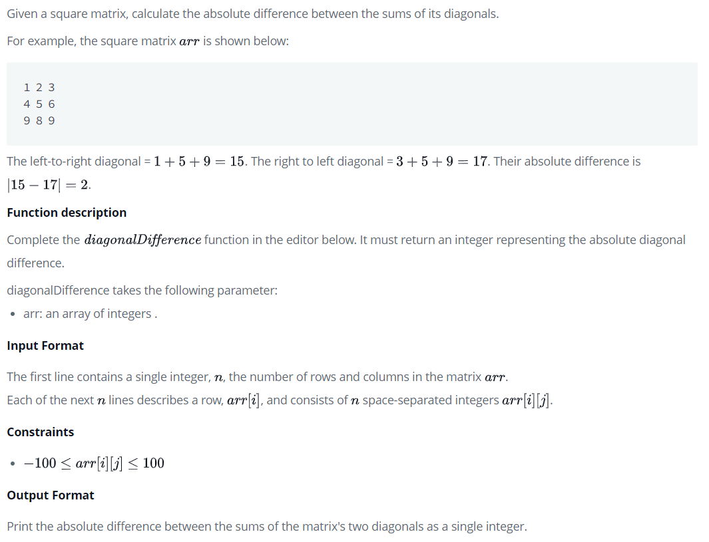

# Diagonal Difference
https://www.hackerrank.com/challenges/diagonal-difference/problem



# Input
```
3
11 2 4
4 5 6
10 8 -12
```

# Output
```
15
```

# Explanation
The primary diagonal is:
```
11
   5
     -12
```
Sum across the primary diagonal: 11 + 5 - 12 = 4

The secondary diagonal is:
```
     4
   5
10
```
Sum across the secondary diagonal: 4 + 5 + 10 = 19
Difference: |4 - 19| = 15

# Dev
```Java
import java.io.*;
import java.math.*;
import java.security.*;
import java.text.*;
import java.util.*;
import java.util.concurrent.*;
import java.util.function.*;
import java.util.regex.*;
import java.util.stream.*;
import static java.util.stream.Collectors.joining;
import static java.util.stream.Collectors.toList;

class Result {

    /*
     * Complete the 'diagonalDifference' function below.
     *
     * The function is expected to return an INTEGER.
     * The function accepts 2D_INTEGER_ARRAY arr as parameter.
     */

    public static int diagonalDifference(List<List<Integer>> arr) {

        int arrLength = arr.size(); // input arr size
        int primaryDiag = 0, secondDiag = 0;

        for (int i = 0; i < arrLength; i++) {
            primaryDiag += arr.get(i).get(i);
            secondDiag  += arr.get(arrLength - 1 - i).get(i);
        }

        return Math.abs(primaryDiag - secondDiag);
    }

}

public class Solution {
    public static void main(String[] args) throws IOException {
        BufferedReader bufferedReader = new BufferedReader(new InputStreamReader(System.in));
        BufferedWriter bufferedWriter = new BufferedWriter(new FileWriter(System.getenv("OUTPUT_PATH")));

        int n = Integer.parseInt(bufferedReader.readLine().trim());

        List<List<Integer>> arr = new ArrayList<>();

        IntStream.range(0, n).forEach(i -> {
            try {
                arr.add(
                    Stream.of(bufferedReader.readLine().replaceAll("\\s+$", "").split(" "))
                        .map(Integer::parseInt)
                        .collect(toList())
                );
            } catch (IOException ex) {
                throw new RuntimeException(ex);
            }
        });

        int result = Result.diagonalDifference(arr);

        bufferedWriter.write(String.valueOf(result));
        bufferedWriter.newLine();

        bufferedReader.close();
        bufferedWriter.close();
    }
}
```
