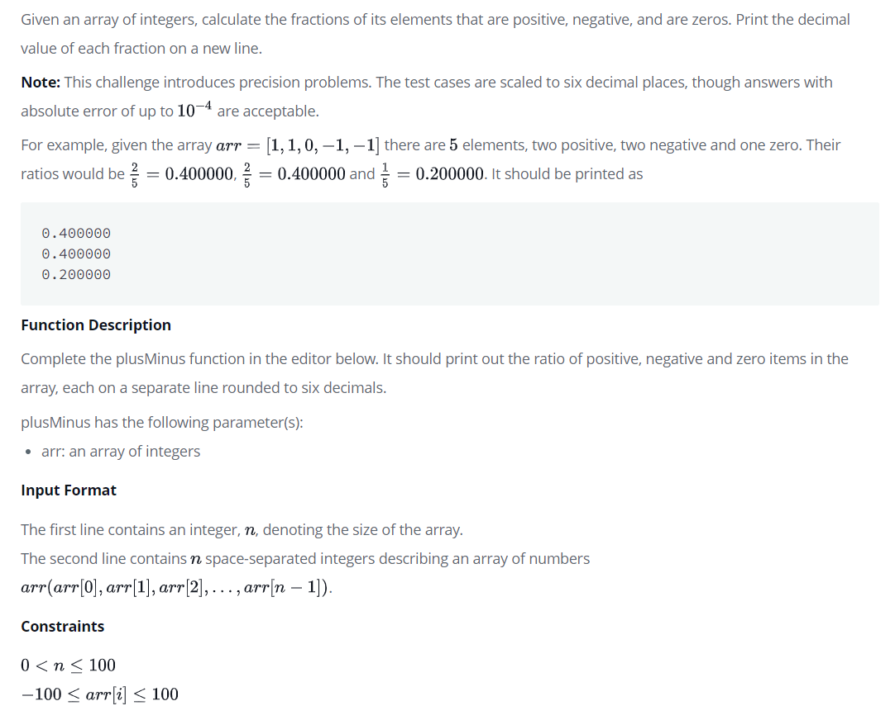

# Plus Minus Zero



# Input
```
6
-4 3 -9 0 4 1
```

# Output
```
0.500000
0.333333
0.166667
```

# Explanation
There are  $3$ positive numbers $2$,  negative numbers, $1$ and  zero in the array.
The proportions of occurrence are positive: ${3\over 6} = 0.500000$ , negative: ${2\over 6} = 0.333333$ and zeros: ${1\over 6} = 0.166667$.

# Dev
```Java
import java.io.*;
import java.math.*;
import java.security.*;
import java.text.*;
import java.util.*;
import java.util.concurrent.*;
import java.util.regex.*;

public class Solution {

    // Complete the plusMinus function below.
    static void plusMinus(int[] arr) {

        double     arrLength = arr.length;
        double  positive = 0, negative = 0, zero = 0;


        for (int i = 0; i < arrLength; i++) {
            if      (arr[i] > 0) positive += 1/arrLength;
            else if (arr[i] < 0) negative += 1/arrLength;
            else                 zero     += 1/arrLength;
        }

        System.out.println(String.format("%.6f", positive));
        System.out.println(String.format("%.6f", negative));
        System.out.println(String.format("%.6f", zero));

    }

    private static final Scanner scanner = new Scanner(System.in);

    public static void main(String[] args) {
        int n = scanner.nextInt();
        scanner.skip("(\r\n|[\n\r\u2028\u2029\u0085])?");

        int[] arr = new int[n];

        String[] arrItems = scanner.nextLine().split(" ");
        scanner.skip("(\r\n|[\n\r\u2028\u2029\u0085])?");

        for (int i = 0; i < n; i++) {
            int arrItem = Integer.parseInt(arrItems[i]);
            arr[i] = arrItem;
        }

        plusMinus(arr);

        scanner.close();
    }
}

```

# Conclusion
양수, 음수, 0 3가지의 백분률을 출력하는 간단한 문제로
3가지의 확률이 1이 넘으면 안되기 때문에 마지막에 출력을 할 때, 소수점 마지막 자리가 신경이 쓰였다.

처음에는 확률이 1이 넘는지를 확인해서 넘으면 소수점 처리를 해주려고 했는데, 자바에서 자동으로 자리수를 자르니까 소수점을 반올림해주어 문제가 생기지 않았다.

생각보다 간단한 문제도 고민을 해야하는 부분이 많은게 흥미롭다.
