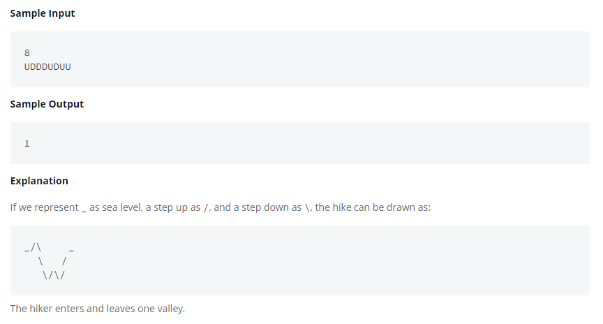

# Count Valleys
[](https://www.hackerrank.com/challenges/counting-valleys/problem?h_l=interview&playlist_slugs%5B%5D=interview-preparation-kit&playlist_slugs%5B%5D=warmup)




```java
import java.io.*;
import java.math.*;
import java.security.*;
import java.text.*;
import java.util.*;
import java.util.concurrent.*;
import java.util.function.*;
import java.util.regex.*;
import java.util.stream.*;
import static java.util.stream.Collectors.joining;
import static java.util.stream.Collectors.toList;

class Result {

    /*
     * Complete the 'countingValleys' function below.
     *
     * The function is expected to return an INTEGER.
     * The function accepts following parameters:
     *  1. INTEGER steps
     *  2. STRING path
     */

    public static int countingValleys(int steps, String path) {
    // Write your code here

        int v = 0;     // # of valleys
        int lvl = 0;   // current level

        int num = 1;

        for (char c : path.toCharArray()) {
            if (c == 'U') ++lvl;
            if (c == 'D') --lvl;

            if (lvl == 0 && c == 'U') ++v; // up check
        }

        return v;
    }

}

public class Solution {
    public static void main(String[] args) throws IOException {
        BufferedReader bufferedReader = new BufferedReader(new InputStreamReader(System.in));
        BufferedWriter bufferedWriter = new BufferedWriter(new FileWriter(System.getenv("OUTPUT_PATH")));

        int steps = Integer.parseInt(bufferedReader.readLine().trim());

        String path = bufferedReader.readLine();

        int result = Result.countingValleys(steps, path);

        bufferedWriter.write(String.valueOf(result));
        bufferedWriter.newLine();

        bufferedReader.close();
        bufferedWriter.close();
    }
}

```
