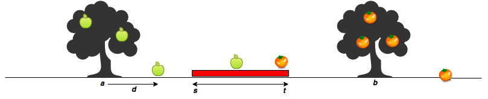

# Apple & Orange

Sam's house has an apple tree and an orange tree that yield an abundance of fruit. In the diagram below, the red region denotes his house, where $s$ is the start point, and $t$ is the endpoint. The apple tree is to the left of his house, and the orange tree is to its right. You can assume the trees are located on a single point, where the apple tree is at point $a$, and the orange tree is at point $b$.




When a fruit falls from its tree, it lands  units of distance from its tree of origin along the -axis. A negative value of  means the fruit fell  units to the tree's left, and a positive value of  means it falls  units to the tree's right.


## Function Description

Complete the countApplesAndOranges function in the editor below. It should print the number of apples and oranges that land on Sam's house, each on a separate line.

countApplesAndOranges has the following parameter(s):

* s: integer, starting point of Sam's house location.
* t: integer, ending location of Sam's house location.
* a: integer, location of the Apple tree.
* b: integer, location of the Orange tree.
* apples: integer array, distances at which each apple falls from the tree.
* oranges: integer array, distances at which each orange falls from the tree.

## Input Format

The first line contains two space-separated integers denoting the respective values of $s$ and $t$.
The second line contains two space-separated integers denoting the respective values of $a$ and $b$.
The third line contains two space-separated integers denoting the respective values of $m$ and $n$.
The fourth line contains $m$ space-separated integers denoting the respective distances that each apple falls from point $a$.
The fifth line contains $n$ space-separated integers denoting the respective distances that each orange falls from point $b$.

## Constraints

* $1 < s,t,a,b,m,n < 10^5$
* $-10^5 < d < 10^5$
* $a < s < t < b$

## Output Format

Print two integers on two different lines:

1. The first integer: the number of apples that fall on Sam's house.
2. The second integer: the number of oranges that fall on Sam's house.


# Dev
```java
import java.io.*;
import java.math.*;
import java.security.*;
import java.text.*;
import java.util.*;
import java.util.concurrent.*;
import java.util.regex.*;

public class Solution {

    // Complete the countApplesAndOranges function below.
    static void countApplesAndOranges(int s, int t, int a, int b, int[] apples, int[] oranges) {

        int appleCount = 0, orangeCount = 0;

        for (int i = 0; i < apples.length; i++) {
            int axis = apples[i] + a;
            if (axis >= s && axis <= t) appleCount++;
        }

        System.out.println(appleCount);

        for (int i = 0; i < oranges.length; i++) {
            int axis = oranges[i] + b;
            if (axis >= s && axis <= t) orangeCount++;
        }

        System.out.println(orangeCount);
    }

    private static final Scanner scanner = new Scanner(System.in);

    public static void main(String[] args) {
        String[] st = scanner.nextLine().split(" ");

        int s = Integer.parseInt(st[0]);

        int t = Integer.parseInt(st[1]);

        String[] ab = scanner.nextLine().split(" ");

        int a = Integer.parseInt(ab[0]);

        int b = Integer.parseInt(ab[1]);

        String[] mn = scanner.nextLine().split(" ");

        int m = Integer.parseInt(mn[0]);

        int n = Integer.parseInt(mn[1]);

        int[] apples = new int[m];

        String[] applesItems = scanner.nextLine().split(" ");
        scanner.skip("(\r\n|[\n\r\u2028\u2029\u0085])?");

        for (int i = 0; i < m; i++) {
            int applesItem = Integer.parseInt(applesItems[i]);
            apples[i] = applesItem;
        }

        int[] oranges = new int[n];

        String[] orangesItems = scanner.nextLine().split(" ");
        scanner.skip("(\r\n|[\n\r\u2028\u2029\u0085])?");

        for (int i = 0; i < n; i++) {
            int orangesItem = Integer.parseInt(orangesItems[i]);
            oranges[i] = orangesItem;
        }

        countApplesAndOranges(s, t, a, b, apples, oranges);

        scanner.close();
    }
}
```

# Conclusion

이해하면 굉장히 쉬운 문제였지만, 문제를 이해못해서 처음에 조금 헤맸다.
영어라 당황하지 말고 천천히 이해하면 쉬운 문제.
