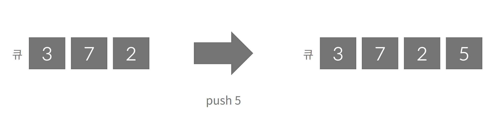
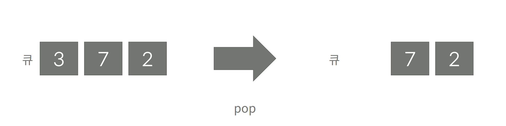

# Queue




* 한쪽 끝에서 자료를 넣고, 다른 한쪽 끝에서만 뺼 수 있는 자료구조
* First In First Out(FIFO) 구조: 먼저 넣은 것이 가장 먼저 나오는 구조
* 큐 메서드
  - push: 큐에 자료를 넣은 연산
  - pop: 큐에 자료를 빼는 연산
  - front: 큐의 가장 앞에 있는 자료 조회
  - back: 큐의 가장 뒤에 있는 자료 조회
  - empty: 큐가 비어있는지 아닌지 알아보는 연산
  - size: 큐의 저장 데이터 크기 조회 연산


# Create a queue
```java
private static class ManualQueue {

  private final int[] arr;
  private int begin;
  private int end;

  public ManualQueue(int size) {
    arr = new int[size];
    begin = 0;
    end = 0;
  }

  public void play(String msg) {
    /*
     * push X: 정수 X를 큐에 넣는 연산이다.
     * pop: 큐에서 가장 앞에 있는 정수를 빼고, 그 수를 출력한다. 만약 큐에 들어있는 정수가 없는 경우에는 -1을 출력한다.
     * size: 큐에 들어있는 정수의 개수를 출력한다.
     * empty: 큐가 비어있으면 1, 아니면 0을 출력한다.
     * front: 큐의 가장 앞에 있는 정수를 출력한다. 만약 큐에 들어있는 정수가 없는 경우에는 -1을 출력한다.
     * back: 큐의 가장 뒤에 있는 정수를 출력한다. 만약 큐에 들어있는 정수가 없는 경우에는 -1을 출력한다.
     */
    if (msg.contains("push")) {
      arr[end++] = Integer.parseInt(msg.replace("push ", ""));
    } else if (msg.contains("pop")) {
      if (isEmpty()) {
        System.out.println(-1);
      } else {
        System.out.println(arr[begin]);
        arr[begin++] = 0;
      }
    } else if (msg.contains("size")) {
      System.out.println(end - begin);
    } else if (msg.contains("empty")) {
      if (isEmpty()) {
        System.out.println(1);
      } else {
        System.out.println(0);
      }
    } else if (msg.contains("front")) {
      if (isEmpty()) {
        System.out.println(-1);
      } else {
        System.out.println(arr[begin]);
      }
    } else if (msg.contains("back")) {
      if (isEmpty()) {
        System.out.println(-1);
      } else {
        System.out.println(arr[end - 1]);
      }
    }
  }

  private boolean isEmpty() {
    return end - begin == 0;
  }
}
```


# Create a queue use library
```java
  Queue<String> linkedQueue = new LinkedList<>();
  Queue<String> priorityQueue =  new PriorityQueue<>();
```

* Java 의 Queue는 인터페이스로 다양한 속성을 가지는 구현체를 선택하여 사용해야한다.
  - [참고](https://docs.oracle.com/javase/7/docs/api/java/util/Queue.html)
* Queue 구현체
  - AbstractQueue
	- ArrayBlockingQueue
	- ArrayDeque
	- ConcurrentLinkedDeque
	- ConcurrentLinkedQueue
	- DelayQueue
	- LinkedBlockingDeque
	- LinkedBlockingQueue
	- LinkedList
	- LinkedTransferQueue
	- PriorityBlockingQueue
	- PriorityQueue
	- SynchronousQueue
