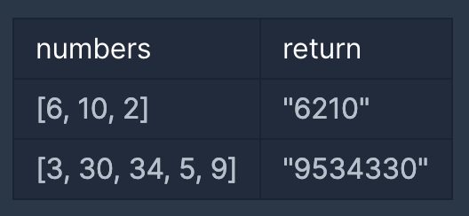

# Big Number Join

## 문제 설명
0 또는 양의 정수가 주어졌을 때, 정수를 이어 붙여 만들 수 있는 가장 큰 수를 알아내 주세요.

예를 들어, 주어진 정수가 [6, 10, 2]라면 [6102, 6210, 1062, 1026, 2610, 2106]를 만들 수 있고, 이중 가장 큰 수는 6210입니다.

0 또는 양의 정수가 담긴 배열 numbers가 매개변수로 주어질 때, 순서를 재배치하여 만들 수 있는 가장 큰 수를 문자열로 바꾸어 return 하도록 solution 함수를 작성해주세요.

## 제한 사항
* numbers의 길이는 1 이상 100,000 이하입니다.
* numbers의 원소는 0 이상 1,000 이하입니다.
* 정답이 너무 클 수 있으니 문자열로 바꾸어 return 합니다.

## 입출력 예


## 해결

```java
import java.util.*;
import java.util.stream.*;

class Solution {
    public String solution(int[] numbers) {
		String answer = Arrays.stream(numbers)
			.mapToObj(String::valueOf)
			.sorted((s1, s2) -> (s2 + s1).compareTo(s1 + s2))
			.collect(Collectors.joining());

    if (answer.startsWith("0")) return "0";
		return answer;
    }
}
```

* 간단하게 스트림으로 정렬
  - 문자열로 변환시켜 숫자를 더하고, 내림차순으로 정렬
  - 스트림 sorted 메서드를 이용해 문자 조합을 내림차순으로 정렬
* 마지막으로, 0으로 연속된 숫자가 들어올 경우 `ex) 000000`-> 0으로 리턴
