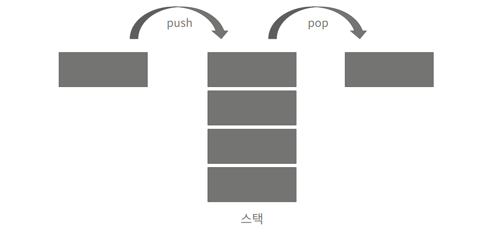

# Stack



* 스택은 한쪽 끝에서만 자료를 넣고 뺄 수 있는 자료구조
* 마지막으로 넣은 것이 가장 먼저 나오기 때문에, Last In First Out(LIFO)
* 스택용어
  - push: 스택에 자료를 넣은 연산
  - pop: 스택에 자료를 빼는 연산
  - top: 스택의 가장 위에 있는 데이터를 가져오는 연산
  - empty: 스택이 비어있는지 확인하는 연산
  - size: 스택에 저장되있는 자료의 개수를 조회하는 연산

# Create Stack Code

```java
private static class StackCus {
		private final int[] arr;
		private int size;

		public StackCus(int size) {
			this.arr = new int[size];
			this.size = 0;
		}

    private void top() {
			if (isEmpty()) {
				System.out.println(-1);
			} else {
				System.out.println(arr[size -1]);
			}
		}

		private void empty() {
			if (isEmpty()) {
				System.out.println(1);
			} else {
				System.out.println(0);
			}
		}

		private boolean isEmpty() {
			return size == 0;
		}

		private void size() {
			System.out.println(this.size);
		}

		private void pop() {
			if (isEmpty()) {
				System.out.println(-1);
			} else {
				System.out.println(arr[--size]);
				arr[size] = 0;
			}
		}

		private void push(String message) {
			this.arr[size++] = Integer.parseInt(message);
		}
}
```

# Create Stack 라이브러리

```java
import java.util.Stack;
Stack<Integer> stack = new Stack<>();
```
