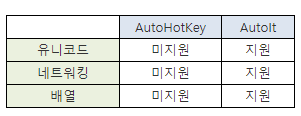
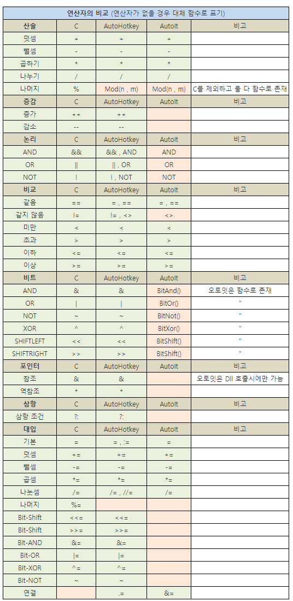

# Auto Hot Key(AHK)

https://www.autohotkey.com/
https://pnal.kr/
무료 오픈소스 기반의 스크립트 언어이다. 기본적인 프로그래밍이 가능하다.

이 프로그램은 2003년 경에 처음 공개되었는데, 사실 이보다 이전인 1999년경에 나온 AutoIt을 만들던 제작자 그룹 중 한 명이 AutoIt V2에서 V3로 넘어가는 시점에서 컨셉에 대한 견해차이로 따로 독자적으로 만들어 AutoIt 커뮤니티에 공개하면서 나온 물건이다. AutoIt V2를 기반으로 했기 때문에 그 문법을 그대로 차용하고 있으며, 현재의 AutoIt V3는 아예 다른 문법을 가지고 있다.

처음에는 AutoIt, AHK 모두 GPL 라이센스하에 소스를 공개했으나, AutoIt측은 "경쟁자가 지속적으로 우리의 소스를 베끼고 있다" 면서 소스 비공개로 바뀌었다

### 특징
* 오토핫키 스크립트는 프로그램 실행, 문서 열기, 키보드 입력, 마우스 입력[4]에 사용할 수 있다.
* 변수를 다루고 루프를 실행하고 창, 파일, 디렉터리를 조작할 수도 있다.
* 명령은 단축키로 실행할 수 있으며 특정 키를 활성화하거나 비활성화하고 재할당할 수 있다.
* '핫스트링'이라 불리는 자동으로 치환되는 문자열도 지원하여 축약어를 풀어쓰는데 사용할 수 있다.
* 방사선학계에서 의사들이 사용하기도 했다.
* 스크립트는 오토핫키가 없는 컴퓨터에서도 실행할 수 있는 실행 파일로 컴파일될 수 있다. 소스코드는 C++ 이며 비주*얼 스튜디오로 컴파일할 수 있다.
* C와 같은 포인터를 통한 메모리 접근을 할 수 있다.
* 인터넷을 제어하거나 WinApi등을 쓸 수 있다.

### 기능
https://www.autohotkey.com/docs/commands/index.htm
* 키보드 재할당. 쿼티에서 드보락이나 다른 자판으로의 재할당.
* 자주 사용하는 빈 칸 채우기 단축키.
* 키보드나 조이스틱으로 마우스 커서 조절.
* 단축키로 프로그램 실행, 문서 열기, 웹사이트 열기.
* 전자우편이나 인터넷 게시판에 서명 추가.
* 시스템 모니터링 및 불필요한 프로그램 자동 종료.
* 자동화된 알림 프로그램, 시스템 스캔 및 백업.

> 즉, 아래와 같은 형태의 코드가 적혀있을 때, 명령어와 매개변수를 구분해 볼 수 있습니다.

```autohotkey
AAAA, BBBB, CCCC, DDDD
```

* AAAA: 명령어
* BBBB: 첫 번째 매개변수
* CCCC: 두 번째 매개변수
* DDDD: 세 번쨰 매개변수

> 이떄, 다음와 같이 매개변수에 `[]` 대괄호가 쳐져 있다면, 그 매개변수는 생략이 가능합니다.

```autohotkey
AAAA, BBBB, [, CCCC, DDDD]
```

* AAAA: 명령어
* BBBB: 필수 매개변수
* CCCC: 선택 매개변수
* DDDD: 선택 매개변수

# Auto Hot Key & AutoIt

### 1) 오토핫키의 탄생

오토잇은 한 명의 개발자가 99년 부터 개인적으로 만들어 오다가 협력 개발자들이 늘어나면서 현재에 이르게 되었고, 오토잇 개발자중 한명이던 Chris Mallett이 오토잇의 지향점이 마음에 들지 않아 2003년 초, 혼자 나와서 만들기 시작한 것이 바로 오토핫키입니다. 이미 오토핫키 개발이 시작되던 무렵에 오토잇은 4년째를 맞고 있을 정도로 오토핫키가 많이 뒤쳐진 후발 주자였음에도 현재와 같은 결과를 낳았다는것은 시사하는 바가 큽니다. 단순히 오토잇의 복제품에 불과했다면 이미 훨씬전에 도태 되었겠죠.

오토핫키 개발자인 Chris가 오토잇 개발팀을 뛰처나올 정도로 싫어하던 오토잇이 지향하던 바는 무엇이었는지 그리고 Chris가 오토잇의 지향점 대신 독자적으로 지향하려 했던것이 무었이었는지는 약 4년이 흐른 현재에 이르러 명백해졌습니다.


(간혹 오해하는 것이 오토핫키가 오토잇 소스를 변조해 만들어졌다는 부분인데 오토핫키는 95% 이상이 처음부터 새로 만들어진 것이며 나머지는 오토잇 개발팀으로부터 허락을 받고 차용한 것입니다.)

### 2) 오토핫키 개발자 Chris가 원하던 지향점

오토핫키라는 이름에서 알 수 있듯이 표면적으로 가장 잘 드러나는 오토잇과의 차이점이 바로 핫키 기능이었습니다. 오토핫키는 특히 핫키를 다루는 부분에 있어서 독보적이며 부가적으로 핫스트링 (연속적인 문자열을 핫키로 쓰는 기능) 이라는 기능도 있습니다. 비단 오토잇뿐만이 아니라 다른 어떤 프로그램, 다른 어떤 프로그래밍 언어로도 이처럼 쉽고 간편하며 강력한 핫키 기능을 만들수는 없습니다. 어떤것은 아예 불가능하거나 또는 불편하거나 다양하지 못하다는 것이죠. 이런 차이는 코드 몇 줄만 봐도 차이가 명백히 드러납니다.


(핫키 기능에 관련한 오토핫키와 오토잇의 일화가 있습니다. 2003년 초에 개발자 Chris가 오토잇 개발팀에 핫키 기능을 제의했고 오토잇 개발팀이 아무런 관심도 보이지 않자 Chris가 오토핫키를 혼자 만들기 시작 했습니다. 그리고 2003년 11월에 첫 공개 베타가 공개 되고 약 7주가 흘러 2004년 1월에 오토잇 개발팀은 오토잇 버전3 베타에서 부랴부랴 핫키 기능을 넣었던 것이죠.)

> 오토잇 (4줄 / 55자)

```autoit
HotKeySet("{ESC}", "ExitApp")
Func Exitapp()
Exit
EndFunc
```

> 오토핫키 (1줄 / 12자)

```autohotkey
ESC::ExitApp
```

ESC 키를 누르면 스크립트를 종료시키는 간단한 기능 조차도 이미 줄수/글자수가 4배가 되는데 이런 차이는 오토핫키가 핫키 할당을 위해서 독자적인 문법( :: )을 갖고 있는데 반해 오토잇은 핫키 할당도 함수 호출 형태로 하기에 핫키를 할당 할 때 마다 함수를 만들어야 하기 때문입니다. 따라서 핫키가 복잡해지면 질수록 코드 양의 차이가 극명해지고 고작 간단한 핫키 하나를 쓰기 위해서 함수 정의 같은 언어의 문법에 대한 이해가 선행되어야 한다는 점이 차후에 다른 결과를 만들어 냅니다.

핫키 할당이 복잡하면 으레 기능은 더 강력하겠거니 생각이 들 수 있지만 전혀 그렇지 않습니다. 오토잇은 불편함을 가지고 있으면서도 강력하지 못했습니다. 이론적으로 오토핫키에서 핫키로 할당 할 수 없는 키라는 것은 존재하지 않는다고 볼 수 있는데 오토잇은 핫키로 할당 할 수 없는 키가 상당히 많이 있습니다. 오토잇 도움말에서는 아래와 같이 기술하고 있습니다.

물론 오토핫키에서는 위의 모든 경우가 핫키로 사용이 가능하며 심지어 마우스나 조이스틱과의 조합도 가능합니다. 오토잇의 제한적 핫키가 가장 문제가 되는 경우는 윈도우가 선점한 핫키와 다른 프로그램이 선점한 핫키를 쓸 수 없다는 것인데 이는 핫키 설정을 더욱 까다롭게 만들고 때로는 스크립트가 작성한대로 동작하지 않는 상황을 야기하기도 합니다. (핫키를 선점 당했으므로) 더해서 오토핫키는 핫키 모디파이어라는 독특한 기능을 갖고 있는데 `*, ~, $`이 바로 그것입니다. (`*`는 모디파이어키 조합을 필요로 할 때 쓰일 수 있으며 ~는 원래 키가 갖고 있는 기능을 막지 않고 추가적인 기능을 핫키에 부여 할 때 쓰며 $는 핫키가 스스로를 호출하는 상황을 방지 할 수 있습니다.)

이처럼 간편하고 독보적인 핫키와 핫스트링 기능으로 인해서 해외에서 가장 유명한 블로그중 하나인 Lifehacker에서는 오토잇은 언급도 안되는 것에 반해 오토핫키 활용팁이 종종 다뤄지고 있고 독일의 유명 테크잡지 ct에서 크게 소개 된 것을 계기로 오토핫키 독일 포럼까지 따로 생기게 되었죠. 그 외에도 각종 엄선 소프웨어 10선 같은 목록에 자주 오르기도 했었습니다. (Live Stick의 '아무도 모르지만 반드시 알아야 할 프리웨어 10선' 에서 1위(번역본) 및 Lifehacker의 '최고의 생산성 도구 10선'에서 4위등 참고로 이 순위의 1위는 펜과 종이, 2위는 텍스트 파일, 3위는 구글 데스크탑이었습니다.)

오토핫키 개발자 Chris가 오토잇 개발팀에서 나오게 된 시발점이 바로 이러한 핫키와 핫스트링 기능에 대한 견해차였는데 오토잇은 핫키를 특별하게 생각하지 않았고 오토핫키는 프로그램 이름에 까지 쓸 정도로 핫키를 굉장히 중요시 했습니다. 바로 이런 차이 때문에 오토잇이 비프로그래머에게 다가가기 힘든 스크립트 언어로 인식되던 반면에 오토핫키는 비프로그래머에게도 쓸만한 툴이 되었죠. 결과론적으로 오토핫키가 주지향점으로 삼었던 이러한 기능들은 오토핫키만의 정체성을 부여해 주었고 한참 뒤쳐졌던 후발 주자임에도 생존 할 수 있게한 원동력이었습니다.

### 3) 오토핫키와 오토잇, 철학의 차이

오토핫키의 개발이 시작되고 얼마 지나지 않아 오토잇은 버전3을 내놓게 되는데 오히려 남이라고 볼 수 있는 오토핫키가 오토잇 버전2와의 호환성을 유지 했던것과 다르게 오토잇은 문법을 완전히 바꿈으로써 스스로의 호환성을 버리게 된 버전이었고 기존 오토잇 버전2 사용자들을 오토핫키로 돌아서게 만든 원인이기도 했습니다. 오토핫키와 오토잇은 개발 방식의 차이도 있는데 오토잇은 소스를 공개하지 않고 팀을 이뤄서 민주적으로 개발하는 쪽입니다.

그러나 오토핫키는 오픈소스이지만 일반적으로 통용되는 오픈소스와는 다소 차이가 있습니다. 소스만 공개 되어 있을뿐 여럿이서 개발하는 오픈프로젝트는 아니기 때문이죠. 다시 말해서 대부분이 Chris 한 사람에 의해서 개발되어왔고 누구나 소스를 수정하고 업그레이드하는 것은 가능하지만 그것이 정식 버전으로 반영이 될 지 안될지는 순전히 개발자 Chris에게 달려 있습니다. 어떻게 보면 독재적인 방식이라고 볼 수 있는데 이것이 바로 중요한 차이를 만들어냈습니다.

오토잇은 VB 스타일의 문법 채택이나 DLL/COM을 이용한 다른 프로그래밍 언어로의 임베딩 지원등 여러가지를 고려해 볼 때 프로그래머를 위한 스크립트 언어를 지향한다고 볼 수 있습니다. 반면 오토핫키는 포럼에서 고급 사용자(프로그래머)들이 각종 기능을 넣도록 요구해도 개발자 Chris가 거절하는 경우가 있는데 순전히 비프로그래머를 고려해야 한다는 이유 때문인 경우가 많습니다. 비프로그래머가 처음 배울때의 혼란함을 가중시킬만한 요소는 거의 다 배제되고 있죠. 그러나 고급 사용자들은 굳이 내장 기능으로 구현하지 않아도 얼마든지 스스로 구현해서 쓸 수 있기 때문에 이 부분이 특별히 문제가 되지는 않았습니다.

오토핫키는 오토잇과 다르게 일반적인 프로그래밍 언어의 범주로 편입되길 원한다기 보다는 현재의 독특한 정체성을 유지하고자 노력합니다. (포럼의 전반적인 분위기도 이 정책을 지지하는 편) 비민주적으로 보였던 개발 정책이 오히려 단 한 사람이 방향을 정할 수 있었기 때문에 이러한 일관성을 유지 할 수 있었던 것 같습니다. 이러한 철학의 차이는 영문 포럼의 분위기에서도 상반되게 나타나는데 오토핫키 포럼은 비교적 초심자에게 관대하다는 평이 많고 오토잇의 포럼은 언어 자체를 배우려는 의지가 없는 초심자를 아주 싫어하는 분위기라는 평입니다. 간단히 오토핫키 포럼은 회원 가입 없이 익명 글쓰기도 가능하지만 오토잇 포럼은 불가능합니다.

즉 오토잇은 가능한 많은 기능을 집어 넣으려는 쪽이라면 오토핫키는 모든 사람에게 필요한 기능이 아니면 내부 기능이 아닌 사용자 라이브러리 형태의 외부 기능으로 남겨두고 필요한 사람만 가져다 쓰라는 주의라고 할 수 있습니다. '오토잇이 오토핫키 보다 명령어가 더 많기 때문에 오토잇이 더 강력하다'는 오해는 바로 여기에서 비롯 된 것입니다. 단지 내장 명령어로 편입시키지 않았을 뿐 오토잇으로 구현이 가능한 것이라면 그 어떤 것도 오토핫키로 가능합니다. 이런 철학 덕택에 오토핫키는 학습 곡선이 완만한 편이고 오토잇에 비해 비교적 쉬운편입니다.

### 4) 실질적인 차이는 무엇인가? (오토핫키가 부족한 점)


오토잇이 더 오래 되었고 사용자도 많고 개발도 팀 단위로 이루어지고 있기 때문에 분명 오토핫키에  비해 가지는 장점들이 있습니다. 명시적으로 나타나는 차이점을 나열 해보자면 이렇습니다.



4-1) 유니코드

주 사용환경이 한글인 입장에서 유니코드의 미지원은 꽤나 아쉬운 내용이지만 막상 써보면 유니코드의 부재가 야기하는 불편함은 의외로 그리 크지 않습니다. 한글을 자유롭게 출력 할 수 있고 한글을 읽을 수도 있으며 한글 문자열을 조작하는것도 무리가 없습니다. 심지어 아래와 같은 코드도 작동을 합니다.

변수 = 日本語テストです ;한글로 된 변수명에 일본어 문자열을 대입
MsgBox, %변수% ;문제 없이 출력 된다
StringReplace, 변수, 변수, 日本語, 한국어 ;'日本語'를 '한국어'로 치환
MsgBox, %변수% ;역시 문제 없이 출력 된다
만약 어떤 프로그램에 한글로 된 문자열을 직접 입력하듯이 보내야 할 필요가 있다면 이것도 까페매니저님이 만드신 함수로 가능합니다. 지금껏 사용 해오면서 유니코드 미지원 때문에 생긴 불편함은 오토핫키의 강점중 하나인 핫스트링을 한글로 쓸 수 없다는 것뿐이었습니다. 하지만 한글은 자음과 모음을 결합해야 의미를 갖는 문자고 그만큼 입력에도 시간이 소요되어 쓰다보면 한글 핫스트링은 특수한 경우(예를들면 브라우저 주소란에 ㅈㅈㅈ.라고 잘못 입력 했을 경우 www.로 바꿔주는 핫스트링) 가 아니라면 요원하지 않다는 것을 느낄 수 있습니다.

4-2) 네트워킹 (TCP/UDP, HTTP)

오토잇은 분명 네트워킹 관련 내장 명령어들을 갖고 있고 오토핫키 내장 명령어에는 UrlDownloadToFile을 제외하면 네트워킹 관련 내장 명령어가 없습니다. 그러나 네트워크에 대한 이해가 없다면 프로토콜을 직접 다루는 저러한 명령어가 있다고 해도 무용지물일겁니다. 그리고 원한다면 오토핫키도 똑같은 기능을 구현 할 수 있는데 오토잇의 네트워킹 기능은 WinAPI를 내장 명령어로 만든 것이고 오토핫키도 내장 명령어로 만들지 않았을뿐 WinAPI를 사용 할 수 있으므로 원론적으로 가능한 것입니다.

실제로 저는 영문 포럼의 독일인 유저와 함께 최근에 WinAPI중 WinINet을 이용하는 Httppost()라는 함수를 함께 작업했는데 이렇듯 필요하다면 얼마든지 직접 만들어 쓰거나 다른 사람이 이미 만들어 둔 함수를 쓸 수가 있습니다. 네트워크 관련 라이브러리로 유명한 libcurl 같은 경우 이미 상당 부분 오토핫키 라이브러리로 랩핑이 되어 있기 때문에 사실상 직접 만들어 쓸 일도 거의 없는 편입니다.

4-3) 배열

프로그래밍을 이전에 배운 경험이 있는 사람이라면 배열이 지원이 안된다는 것은 다소 어이가 없으실지도 모릅니다. 그러나 배열이라는 자료형이 명시적으로 존재하지 않을뿐 개념적으로는 존재한다고 볼 수 있습니다. Var%Index% := Value 와 같은 형태로 배열을 생성할 수 있고 다중적인 결과를 반환하는 몇몇 명령어들은 (WinSet, StringSplit) 위와 같은 배열의 형태로 결과를 반환하기 때문에 마치 배열을 쓰듯이 사용 할 수 있습니다. 아무래도 정식 지원이 되는 것보다 불편한 것은 사실이나 불가능 한 것은 아니라는 뜻입니다. 가령 WinAPI를 호출 할 때 어떤 함수들은 배열로 반환을 하는데 그런 경우도 다소 불편 할 지언정 사용에 무리가 없습니다.

상기 세 부분은 명시적으로 드러나는 부분이고 유니코드와 배열 같은 경우는 기약이 된 것은 아니나 ToDo 리스트의 최우선에 올라가 있는 상태입니다. 명시적으로 드러나지 않는 부분이라면 아무래도 오토잇은 누적 유저수가 많다 보니 오토핫키에 비해 이미 만들어진 함수가 풍부한 편입니다.

### 5) 실질적인 차이는 무엇인가? (오토핫키가 우세한 점)

이제 결론에 도달 할 때가 왔습니다.

분명 오토잇이 더 오래 된 만큼 누적 된 사용자 함수도 더 많고, 유니코드나 배열 같은 오토핫키에서는 아직 미지원인 부분들을 오토잇은 이미 갖고 있음에도 이 글의 제목 처럼 굳이 왜 오토잇이 아닌 오토핫키를 쓰는가?를 얘기 할 차례입니다.

5-1) 퍼포먼스와 CPU/메모리 점유율

가장 먼저 확인 할 수 있는 차이점은 앞서 '오토잇은 최대한 많은 기능을 집어 넣으려고 한다'라고 지적 했던 것의 결과인데 오토핫키는 오토잇에 비해 실행 속도가 빠른 편이며 CPU/메모리 점유율도 낮은 편입니다. (이것은 주관적인 평가가 아니라 오토잇 포럼, 오토핫키 포럼등에서 일반적으로 통용되는 객관적인 평가입니다.) 개발자 Chris가 개발 초기에 유저들에게 '실행 파일의 크기를 9% 가량 줄일 수 있다면 퍼포먼스가 떨어져도 괜찮은가?'이라는 설문을 한적이 있습니다. 결과는 100% 반대였습니다. 그 이후로 오토핫키가 무엇에 중점을 두고 개발되어 왔을지는 여러분의 판단에 맡깁니다.

5-2) 부담없이 배울 수 있는 쉬운 난이도

오토잇은 BASIC계열 프로그래밍 언어의 문법을 거의 계승하다 시피한 형태를 띄고 오토핫키는 기존의 프로그래밍 언어들 보다 훨씬 더 추상화 시킨 형태를 띄고 있습니다. 컴퓨터는 0과 1밖에 알아듣지 못하는데 사람은 0과 1로 대화하기 불편해서 만들어진 것이 어셈블리어고 사람의 기준에서 더 쉽게 컴퓨터와 대화를 하기 위해서 프로그래밍 언어는 점차 추상화 되어왔고 사람의 언어와 얼마나 가까운가를 기준으로 프로그래밍 언어를 분류하지 않습니까? 그런 분류로 보자면 오토핫키는 Ultra High Level Language라 할만하고 매우 직관적이라서 프로그래밍을 이전에 경험해보지 못한 사람도 쉽게 배울 수 있습니다. 이것은 오토핫키를 한 번 익혀두었다가 몇 개월이나 사용을 하지 않더라도 다시 필요 할 때 사용해보면 기억이 날 정도이기 때문에 학습의 부담을 덜어줍니다.

5-3) 같은 것도 더욱 간결하게 만들 수 있는 구조

물론 오토잇도 일반 프로그래밍 언어에 비하면 훨씬 더 빨리 만들 수 있는 구조이지만 오토핫키는 그런 오토잇 보다도 더 간결하게 만들어 나갈 수 있습니다. 이는 비단 핫키 구현을 얘기하는 것이 아니라 스크립트 전반에 해당하는 이야기입니다. 직접적으로 코드를 비교해보죠. 오토잇 포럼에서 무작위로 뽑아서 같은 기능을 하는 스크립트를 오토핫키로 만들었습니다. 무작위로 뽑은 것이기 때문에 좋은 비교가 될 지는 모르겠지만 결과가 말해주겠죠.

; 오토잇 버전 (36 라인)
; 출처 : http://www.autoitscript.com/forum/index.php?showtopic=54846

```autoit
#include <GUIConstants.au3>
#include <GUIList.au3>
#include <Misc.au3>

HotKeySet("{F9}", "Start")

Global $mask, $init

Global $STATE_ask = 0
Global $STATE_trap = 0

While 1
    Sleep(1)
WEnd

Func Start()
    If $STATE_trap = 1 Then
        GUIDelete($mask)
        WinSetOnTop($init, "", 0)
        $STATE_trap = 0
    ElseIf $STATE_trap = 0 Then
        $init = Init(WinGetTitle(""), WinGetHandle(WinGetTitle("")))
    EndIf
EndFunc

Func Init($sWinTitle, $hWindow)
    Global $mask = GUICreate("OnTask Mask Window", @DesktopWidth, @DesktopHeight, 0, 0, $WS_POPUPWINDOW,$WS_EX_TOOLWINDOW)
    GUISetBkColor(0x000000, $mask)
    WinSetTrans("OnTask Mask Window", "", 254)
    GUISetState(@SW_SHOW, $mask)
    WinSetState($sWinTitle, "", @SW_RESTORE)
    WinSetOnTop($sWinTitle, "", 1)
    $pos = WinGetPos($sWinTitle)
    $STATE_trap = 1
    Return $sWinTitle
EndFunc
```
; 오토핫키 버전 (21 라인)
```autohotkey
STATE_trap := 0

F9::
If (STATE_trap=1) {
    Gui, Destroy
    WinSet, AlwaysOnTop, Off, %sWinTitle%
    STATE_trap=0
}
Else If (STATE_trap=0) {
    WinGetActiveTitle, sWinTitle
    Init(sWinTitle)
}
Return

Init(WinTitle) {
    Global STATE_trap=1
    Gui, +LastFound +AlwaysOnTop +ToolWindow
    Gui, Color, 0x000000
    Gui, Show, w%A_ScreenWidth% h%A_ScreenHeight% NA, OnTask Mask Window
    WinSet, AlwaysOnTop, On, %WinTitle%
}
```

코드의 내용이 조금 달라 보일 수도 있으나 같은 방식으로 같은 결과를 구현한 것입니다. 오토잇은 라이브러리를 불러서 (#Include) 작성이 된 것인데 오토핫키 버전은 그냥 작성했습니다. 오토핫키 버전도 라이브러리를 하나 정도 불러서 작성 했다면 아마 코드가 몇 줄은 더 짧아졌을 것 같습니다.

어쨌든 비단 코드의 라인 수 뿐만 아니라 가독성에서도 차이가 납니다. 오토잇은 모든 명령어가 함수이기 때문에 보시다시피 괄호와 쌍따옴표가 많이 등장하고 변수명 앞에 $를 붙여줘야 하는 문법적 특징 때문에 특수 문자의 난립으로 가독성을 어지럽힙니다. (VB나 PHP를 했던분들에게는 오히려 친숙할수도 있겠습니다) 이외에도 파일 입출력이나 DLL 호출등을 비교해보면 오토핫키에서 한번으로 될 것을 오토잇에서는 굳이 열고-읽고-닫고의 과정을 거쳐야 합니다. 기존 프로그래밍 언어와 비슷하죠. 프로그래밍 언어를 닮으려고 한 탓인지 전혀 추상화 되어 있지 않습니다.

5-4) 전용 커뮤니티의 존재

제가 처음 오토잇과 오토핫키 사이에서 선택을 해야 했을 때, 전용 커뮤니티가 있다는 것은 큰 메리트였습니다. 국내뿐만 아니라 영문 포럼도 친절한 답변이 상당히 빨리 올라오기 때문에 지금까지도 많은 도움을 받고 있습니다. 현재 국내에서 오토잇은 UO라는 커뮤니티의 부속 카테고리로 존재하는 것이 전부인데 오토핫키는 이렇게 어엿한 전용 커뮤니티가 있다는 것 만으로도 든든하리라 생각합니다.

### 6) 결론

위에서 정리한 것 처럼 오토핫키는 성능상의 이점과 처음 배울 때 부담이 적고 간단한 핫키 기능만 이용하고자 할 때는 몇 일이면 충분하고 프로그래밍 경험이 없는 사람도 금새 익힐수 있을 정도로 쉽습니다. 제가 개인적으로 꼽는 최고의 장점은 오토잇이 기존 프로그래밍 언어를 닮아가려 노력하는데 반해 오토핫키는 현재의 '자동화 언어'라는 독특한 정체성을 유지하려 하기에 간편하고 빠르게 만들어서 바로 테스트하거나 혹은 직접 쓸 수 있는 구조를 갖고 있다는 것입니다. (반대로 이런 점 때문에 구조화가 힘들어서 코드가 일정 수준을 넘어가면 불편해지는 단점은 있습니다) 까페 메뉴에 링크가 걸려있는 donationcoder만 하더라도 직접 방문 해보면 1 hour software라는 타이틀 아래 수십가지의 자작 스크립트를 소개하고 있죠. 오토핫키에서 한 시간이란 어엿한 스크립트 하나를 만들어 낼 수 있는 시간입니다.

제가 오토핫키를 접하고 얼마 지나지 않아 프로그래머들 사이에서 요긴한 스크립트 언어로 평가 받는 파이썬을 배우기 시작 했었습니다. 그러나 아무리 배워도 활용 방도를 못 찾겠더군요. 처음에는 이유를 몰랐는데 그것은 바로 오토핫키 때문이었습니다. 프로그래머들은 스크립트 언어에 비해 생산성이 좋지 않은 컴파일러 언어를 쓰다가 파이썬을 만나고 생산성에 놀라지만 오토핫키를 접한 뒤의 파이썬은 전혀 놀랍지 않았기 때문입니다. 파이썬으로 만들 수 있는 간단한 snippet들은 오토핫키로도 같은 속도로 혹은 더 빠르게 만들 수 있고 파이썬이 못하는 GUI 환경의 자동화까지 할 수 있습니다. 이러니 파이썬의 메리트가 현저하게 떨어졌던 것이죠.

마지막으로 오토핫키에 대한 편견 중 하나는 '오토잇은 VB 문법과 비슷해서 프로그래머에게 친숙하지만 오토핫키는 그렇지 않다.'라는 부분입니다. 눈치 빠른 분들은 위에서 잠시 보신 코드로 눈치를 채셨을지 모르겠지만 오토핫키의 연산자나 { } 괄호로 여닫는 블록문은 프로그래밍 언어의 스탠다드인 C와 흡사합니다. 오히려 오토잇이 따르는 VB 스타일은 이미 지원이 끊긴 언어고 C 스타일은 스탠다드 답게 C/C++/Java/C# 등 호환되는 언어가 많다고 생각합니다. (물론 기반 명령어들은 문법적으로 일반 프로그래밍 언어와 달리 현격하게 추상화 되어 있지만 무조건 명령어를 늘리지 않고 억제를 하기 때문에 익혀야 하는 양이 많지 않고 직관적이라서 부담이 적습니다.)


더해서 C와 오토핫키, 오토잇의 연산자들을 비교해보죠.

C와 같은 연산자를 가진 것은 같은 색으로 아닌 것은 다른 색으로 표시 했습니다.


보시다시피 나머지 연산자를 빼면 모든 연산자가 C와 동일합니다. 이렇게 보니 오히려 오토잇 보다 더 프로그래머 친화적으로 보입니다. 개인적으로 오토핫키를 이미 아는 상태에서는 파이썬의 메리트가 느껴지지 않아서 C#을 배우기 시작 했습니다만 오토핫키를 쓰면서 무심코 익혔던 C 스타일 블록문과 연산자가 학습 시간을 많이 줄여주더군요. 이런데 과연 프로그래머 비친화적이라고 할 수 있을까요? '자동화 언어'에 C의 삼항 연산자나 포인터 연산자가 도입 되었던 것은 오토핫키 포럼에서 영향력 있던 초기 베테랑 유저 다수가 골수 C 팬이었던 까닭인것 같습니다.

오토핫키 포럼의 베테랑 중에는 C나 어셈블리등을 잘 다루는 능력 좋은 프로그래머들이 꽤 있는데 그렇게 강력한 C나 어셈블리를 잘 다루는 프로그래머들이 왜 오토잇이 아닌 오토핫키를 선택했을까?하는 궁금증은 이 글을 작성 할 때 개인 메세지를 주고 받으며 풀리게 됐습니다. 오토핫키가 비프로그래머를 수용 할 수 있으면서도 C 프로그래머들까지 수용 할 수 있게 만들어져 베테랑 프로그래머와 비프로그래머가 함께 어울린다는 것은 참으로 재미 있으면서도 희한한 현상입니다. 오토핫키를 잘 모르는 초심자들은 단순 핫키나 키보드 맵핑 또는 매크로 프로그램으로 쓰지만 저런 베테랑들이 오토핫키로 만들어 내는것들을 보면 오토핫키는 아는 만큼 활용도도 달라지는 것을 느낍니다.

정리 해보겠습니다.

오토핫키는 이런 분들께 추천합니다.

- 프로그래밍 경험이 없는 사람.
- 스크립트 언어를 배우는건 부담스럽고 간단히 핫키만 쓰고 싶은 사람
- 반복적인 타이핑이 잦은 일을 하는 사람.
- C계열 언어 경험이 있는 프로그래머. (또는 C계열 언어를 배울 계획이 있는 비프로그래머)

이런 분들께는 오토잇이 더 잘 맞을지도 모릅니다.

- BASIC계열 언어 경험이 있는 프로그래머.
- DLL/COM을 이용하여 프로그램에 임베딩하려는 프로그래머

# 오토핫키 포럼의 베테랑 유저들의 말 (번역)

개인적으로 물어서 얻은 답변들입니다. 최대한 원문 대로 번역하려 했습니다.

>tic
빠르고, 오픈소스이며, 코드는 따라하기 쉽고 자동화에 제격입니다. 무슨 말이 더 필요하겠어요? 아참, 오토핫키는 오토잇에 없는 gdi+ 랩퍼 라이브러리가 있죠! 내가 만들었다니까요! :)

tic씨는 영국에 사는 프로그래머로 gdi를 오토핫키에 접목해서 더 이쁘고 화려한 프로그램을 작성하는데 관심이 많습니다. 주 언어는 C++이라고 합니다

> derRaphael
난 오토핫키의 무한한 가능성을 좋아합니다. 스크립트 언어 주제에 모든 것이 가능하죠. 안되는게 없습니다.

derRaphael씨는 독일에 사는 취미 프로그래머입니다. 독일어 포럼과 영문 포럼을 오가며 다양한 활동을 했습니다. 최근에는 순수 오토핫키만으로 IRC 채팅 봇을 만들고 있다고 합니다.

> Laszlo
나는 직장에서의 잦은 수학 계산이나 타이핑을 도와 줄 수 있는 툴이 필요 했습니다. 하지만 그런 일을 해주는 프로그램들은 비싸기만 하고 만족스럽지 못해서 직접 만들 수 있는 가장 간단한 방법을 찾다가 적격인 오토핫키를 만났습니다. 사실, 나는 핫키와 핫스트링 기능 때문에 오토잇이나 다른 프로그래밍 언어를 고려해 본 적이 한 번도 없습니다. 이런 일들을 가장 간편하게 할 수 있는것이 바로 오토핫키여서 바꿀 이유가 전혀 없었기 때문입니다.

Laszlo씨는 하드 드라이브 제조사인 美 Seagate에서 연구원으로 재직중인 50대의 암호학 전문가이자 오토핫키 포럼에서 수학과 암호학에 대해 가장 잘 아는 사람입니다. 포럼에서는 해싱/암호화 관련 함수들을 만들어 기여했으며 오토핫키에서 기계어 및 C 를 인라인으로 쓸 수 있게하는 함수를 만들었고 오토잇 포럼에서 이 함수를 빌려가기도 했었습니다. 주 언어는 C 라고 합니다.

> Titan
오토잇은 마치 BASIC 처럼 너무 구식이라서 PHP/Javascript/C#을 사용하는 사람에게는 너무 불편합니다. 문법이 근본적으로 다르기 때문이죠. 게다가 느리고 번거롭기까지 합니다. 오토핫키에서 FileRead 커맨드로 한번에 처리하는 것과 달리 오토잇은 파일을 열고, 읽고, 닫아야 합니다. bash를 만든 30 년 전의 프로그래머들도 한 줄 명령어를 어떻게 만들어야 할 지 알고 있었는데 오토잇의 저러한 과정들은 매크로 언어로써는 완전히 실패작입니다.

Titan씨는 영국에 살며 아직 학생이지만 이미 각종 프로그래밍 언어를 잘 다루고 오토핫키 포럼에서 포스트 수가 5000개를 넘을 정도로 왕성한 활동을 했습니다. Anchor, grep, XML파서등 각종 유용한 함수들을 많이 만들어 기여했습니다. 최근에는 오토핫키로 컴파일한 실행파일의 크기를 줄일 수 있는 C# 버전의 대체 컴파일러를 만들고 있다고 합니다. 주 언어는 C# 이라고 합니다.

[[출처] 오토잇과 오토핫키 차이](http://blog.naver.com/PostView.nhn?blogId=hihihichoi&logNo=20167629621)
