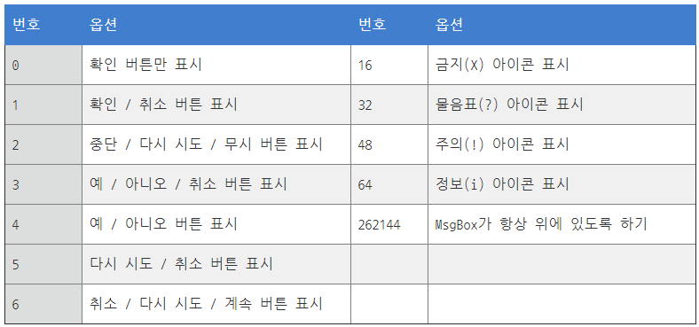
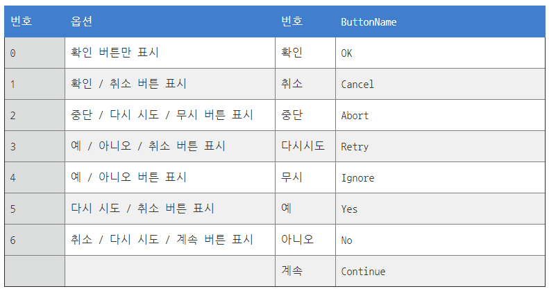
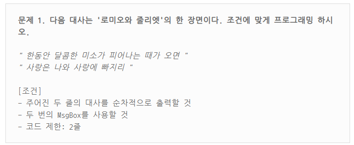
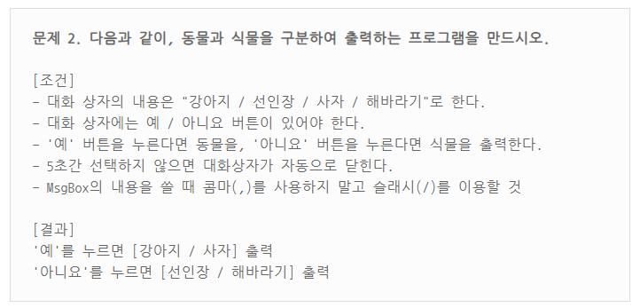

# MsgBox
원하는 메세지 알림창을 호출하는 기능

MsgBox라는 명령어에 우선 소개를 해드리겠습니다. MsgBox는 사용 방법이 두 가지인데요, 그중 쉬운 편인 첫 번째 방법을 먼저 소개해드리겠습니다.

1. 설정한 메세지를 출력하는 MsgBox 문법
```autohotkey
MsgBox, Text
```

2. 디테일한 설정이 가능한 MsgBox 문법
```autohotkey
MsgBox [, Options, Title, Text, Timeout]
```

> 위 문법에서 매개변수에 둘러싸여 있는 `[대활호]` 는 해당 매개변수를 생략해도 되는 부분이다.

MsgBox [, Options, Title, Text, Timeout]
* Option 매개변수는 버튼 유형과 MsgBox의 특성을 설정한다.

또한 다른 유형의 옵션끼리는 옵션 고유 번호를 더하여 중복 옵션을 구현할 수 있다.
$e.i:$ 예/아니오 버튼과, 금지 아이콘을 가진 대화 상자를 출력하고 싶으면, $4 + 16=20$을 적용하면 된다.
* Title 매개변수의 속성은 대화 상자의 제목을 설정한다.
* Text  매개변수의 속성은 대화 상자의 내용을 설정한다.
* Timeout 매개변수의 속성은 대화 상자가 자동으로 닫히는 시간을 설정한다.
    + 시간단위는 $(초: Second)$.


### IfMsgBox
MsbBox 버튼의 조건문으로, MsgBox의 버튼에 따라서 다른 행동을 하는 대화 상자 입니다.

```autohotkey
IfMsgBox, ButtonName
```
* 필수 파라메터 ButtonName을 설정해야하며, ButtonName은 MsgBox의 버튼으로, ButtonName은 아래 표와 같다.


* IfMsgBox 문법
  ```autohotkey
  MsgBox [, Option, Title, Text, Timeout]
  IfMsgBox, ButtonName
  {
    // Context
  }
  ```
$e.i:$ 대화 상자 Option을 4로 설정하면, 예/ 아니오 2개의 선택지가 있는 대화 상자가 나올때
```autohotkey
MsgBox, 4, 제목, 내용
IfMsgBox, Yes
{
  MsgBox, 예를 선택하였습니다.
}
IfMsgBox, No
{
  MsgBox, 아니오를 선택하였습니다.
}
```

# Programming


```autohotkey
MsgBox, 한동안 달콤한 미소가 피어나는 때가 오면
MsgBox, 사랑은 나와 사랑에 빠지리
```


```autohotkey
MsgBox, 4, 프로그래밍 문제(1), 강아지/선인장/사자/해바라기, 5
IfMsgBox, Yes
{
    MsgBox 강아지/사자
}
IfMsgBox, No
{
    MsgBox 선인장/해바라기
}
```


```autohotkey
MsgBox, 52, 프로그래밍 문제(1), 강아지/선인장/사자/해바라기, 5
IfMsgBox, Yes
{
    MsgBox 강아지/사자
}
IfMsgBox, No
{
    MsgBox 선인장/해바라기
}
```
