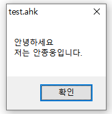

# Escape Sequence
오토핫키에서는 매개변수의 구분을 `,`, 변수의 사용은 `%`를 사용한다.
그렇다면 아래와 같이 해당 기호를 출력하려면 어떻게 해야 할까?


```autohotkey
MsgBox, ,% ;이렇게 코딩하면 에러가 날것이다.
```
이럴 때 필요한 것이 $이스케이프$ $문자$이다.

### 이스케이프 문자
1. 이스케이프 문자는 뒤에 오는 문자가 특수한 기능을 하는 문자일 경우, 해당 특수한 기능을 없애버리는 효과를 준다.
2. 오토핫키에서 이스케이프 문자는 $`$이다.

즉 특수한 기능을 했던 콤마($,$)와 퍼센트(%)앞에 $`$를 붙여준다면 해당 콤마와 퍼센트는 특수한 기능을 하는 문자가 아닌, **글자(문자)** 로서 작동하게 됩니다.

```autohotkey
MsgBox, `,%` ;특수 기능을 하는 예약어가 아닌, 문자로 취급되어 위와 같이 출력이 된다.
```

### 이스케이프 시퀀스
반대로, **특수한 기능을 하지 않는 문자가 이스케이프 문자 뒤에 온다면,** $특수한 기능을 하는 문자$로 변하게 된다.

```autohotkey
MsgBox, 안녕하세요 'n 저는 안종웅입니다.
```


이렇듯 `n은 개행을 의미한다.

* 여기서 중요한 점은 이스케이프 스퀀스는 문자열 취급이기 때문에 사용할 때 주의해야한다.

```autohotkey
var := 5
MsgBox, % "책상 위에 사과가" `n var "개 있습니다."
→ 오류

var := 5
MsgBox, % "책상 위에 사과가`n" var "개 있습니다."
→ 정상 작동!
```
