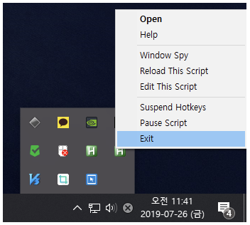

# ExitApp & Return

### ExitApp
핫키와 핫스트링을 사용했을 때, 사용을 중지하려면, 오토핫키를 강제로 중지해야 했다.


그 과정을 자동으로 해주는 명령어가 ExitApp로 매개변수는 없이 단일 명령어로 사용한다.

$e.i):$
```autohotkey
MsgBox, 여기는 실행되고요
ExitApp
MsgBox, 여기는 실행 안됩니다.
```

아래쪽 MsgBox가 실행되기 전에 오토핫키 스크립트가 종료된다.

```autohotkey
ESC::
MsgBox, ESC 핫키를 눌렀습니다.
ExitApp
```
위와 같이 응용하여 사용한다.


### Return
반면 return은, 스크립트가 정지되긴 하지만 종료되지 않는 구문으로, 기존에 ExitApp을 쓰지 않고 핫키를 사용했을 때와 동일한 효과를 준다.

```autohotkey
F1::
MsgBox, F1을 눌렀습니다

F2::
MsgBox, F2를 눌렀습니다

F3::
Exitapp
```

* F1을 누르면 대화 상자가 두번 나오고 오토핫키 스크립트가 종료되는 것을 볼 수 있다.
* 위 구문에서 원하는 것은 F1을 누르면 F1 대화상자만, F2를 누르면 F2 대화상자만 출력하고, F3을 눌렀을 때 종료하고 싶다.
* 이러한 사항일 경우에 Return을 사용하여 처리할 수 있다.

```autohotkey
F1::
MsgBox, F1을 눌렀습니다
return

F2::
MsgBox, F2를 눌렀습니다
return

F3::
Exitapp
```

* F1을 누르면 F1 대화상자만 출력
* F2를 누르면 F2 대화상자만 출력
* F3를 누르면 오토핫키 스크립트 종료

이러한 방법으로 사용하는 기능이다.
