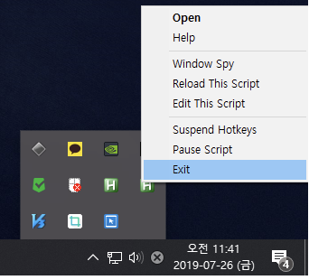
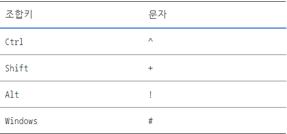

# Hotkey & HotString

핫키와 핫스트링은 사용 시 스크립트가 끝나도 자동으로 종료되지 않는다.
사용 후 종료하려면 작업 표시줄 트레이 아이콘을 우클릭하셔서 Exit 종료를 실행해주어야 한다.




# HotKey

핫키는 단축키 등록으로, **어떤 키를 눌럿을 때, 동작이 실행되도록 하는 이벤트 등록** 이다.

사용 문법은 아래와 같다.
* $Key::$

즉 A키를 눌렀을때, 대화 상자를 출력한다면,

```autohotkey
A::
MsgBox, A Key Click
```

# HotString
핫스트링은 **특정 문자를 입력했을 때, 동작이 실행되도록 한다.** 중요한 점은 영어만 인식한다.

사용 문법은 아래오 같다.
* $::String::$

즉 apple을 썻을 때 대화살자를 출력한다면,

```autohotkey
::apple::
MsgBox, 사과입력!
```

입력할 수 있는 창 뿐만 아니라, 바탕화면에서 입력하여도 실행된다.

# HotKey + HotString
$Ctrl$ + $C$ $or$ $Shift$ + $F5$ 같이 단축키 조합도 사용이 가능하다.
아래 표와 같이 사용을 할 수 있다.


```autohotkey
^A::
→ Ctrl + A를 눌렀을 때

+!Z::
→ Shift + Alt + Z를 눌렀을 때
```
