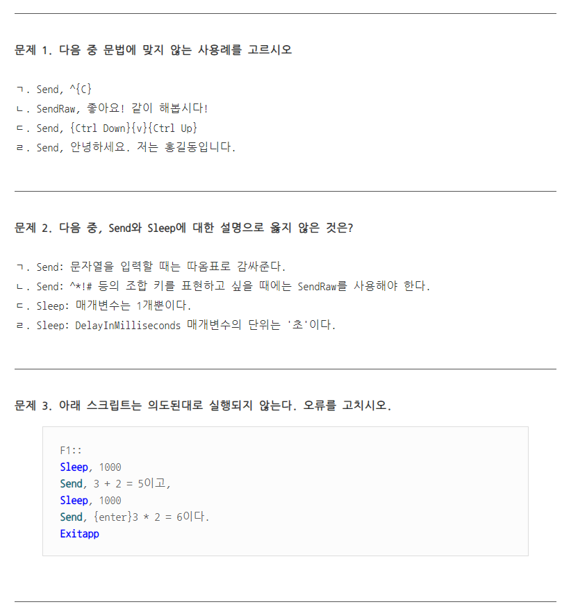

# Sleep & Send

# Send
키보드에 있는 키를 입력해주는 명령어로, 직접 키를 누르지 않아도 키를 누른 효과를 볼 수 있다.

```autohotkey
Send, 'Keys'
```
> Keys: 입력을 하려는 키 정보를 가진 매개변수
> 누를 키는 기본적으로 중괄호를 감싼 포맷으로 사용해야 한다.

$e.i):$
```autohotkey
Send, {A}
Send, {Enter}
Send, {Tab}
Send, {Ctrl}
```

> 매개변수 키를 입력할 때, 핫키와 핫스트링 조합키도 역시 사용가능하다.
> 이때 주의할 점은 조합키는 항상 소문자를 사용해야 한다.

```autohotkey
Send, ^{a}
return

^A::
MsgBox, Ctrl + A를 눌렀습니다.
ExitApp
```

# Send Detail
Send 이벤트 함수에 대해서 특이사항
* 조합키를 입력하지 않고, ! + ^ #을 그대로 출력하고 싶은 경우 Send를 SendRaw를 사용
* 키를 누르는 동작과, 떼는 동작을 따로 구분할 수 있다. 누르는 것은 {'Keys' Down}, 떼는 건 {'Keys' Up} 이다.(중간에 띄어쓰기는 필수이다.)
* 한영키는 {VK15}이다.
* 조합키는 `!a`나, `!{a}`의 꼴을 모두 허용한다. 그러나 조합키에서 대문자 사용은 불가능 하다.
* 키 이름 뒤에 숫자를 적어서 중복 입력을 허용 가능하다.
  ```autohotkey
  Send, {A 5}
  ```
  + A키 5번 입력


# Sleep
Sleep은 스크립트에 지연 시간($딜레이$)을 제공하는 명령어이다.

```autohotkey
Sleep, DelayInMilliseconds
```
> DelayInMilliseconds: 딜레이 시간을 입력하는 매개변수로, 시간 단위는 밀리초 이다.
> 1초 = 1000 밀리초 이다.

```autohotkey
Send, {A}
Sleep, 1000
Send, {AA}
Sleep, 1000
ExitApp
```




```autohotkey
;문제1.
; ㄱ. 조합키는 항상 소문자이어야 한다.

;문제2.
;ㄱ: 따옴표로 감싸지 않아도 문자열 표현이 가능하다
;ㄹ: 밀리초 단위이다.

;문제3.
F1::
Sleep 1000
SendRaw, 3 + 2 = 5이고
Sleep 1000
Send, {Enter}3 * 2 = 6이다.

ExipApp
```
