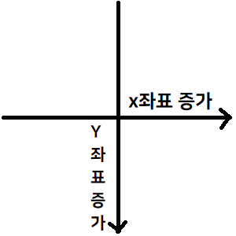
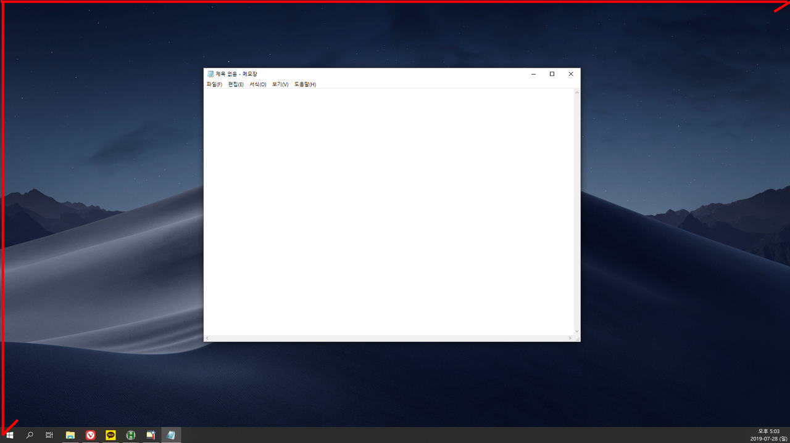
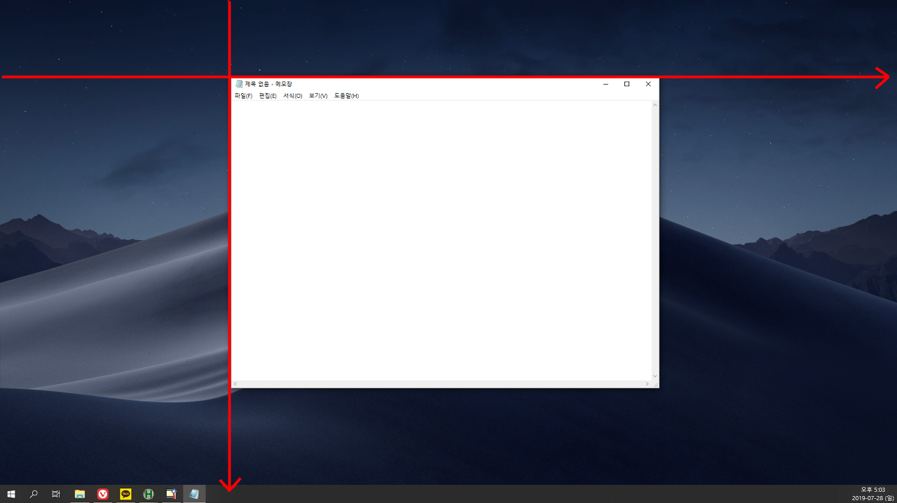
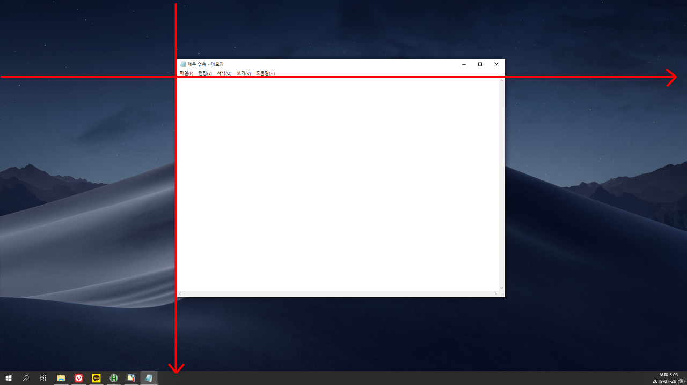
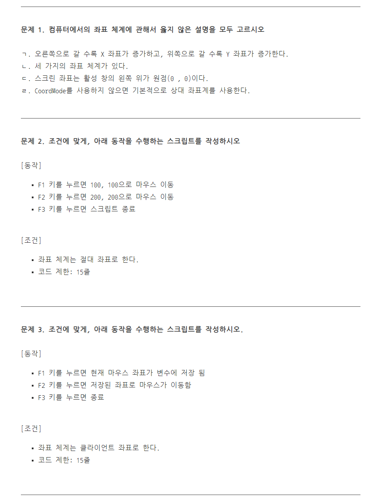

# Pc X-Y Coordinates
$활성 창$ 개념은 사용중인 컴퓨터와 사용자 간의 상화작용할 수 있는 상태를 나타내며, 작업표시줄 아이콘으 ㅣ배경색으로 알 수 있다.


# 3가지 좌표 기준
PC에서는 특정 위치를 표현하기 위해 2차원 좌표를 사용한다.
2차원 좌표를 표현하는 체계가 총 3가지가 존재하며, 이 3가지 모두 어느 상황에서도 **오른쪽 이동은 X방향으로 증가, 아래쪽 이동은 Y방향으로 증가** 라는 조건을 가진다.



이 3가지 좌표 체계는 좌표의 원점(0, 0)을 기준을 어디로 설정하는지에 따라 다르게 사용한다.

1. 스크린 좌표(절대 좌표): 모니터 좌측 상단이 원점(0, 0)

2. 상대 좌표: 활성 창의 좌측 상단이 원점(0, 0)

3. 클라이언트 좌표: 상대 좌표와 비슷하지만, 프로그램 창의 제목과 메뉴 바 부분을 제외한 원점



# 좌표 기준 설정

```autohotkey
CoordMode, TargetType [,RelativeTo]
```

> TargetType: 좌표 값 설정 매개변수
* Pixel
* Mouse

> RelativeTo: 좌표 체계 타입 설정 매개변수
* Screen
* Relative
* Client

Default 설정
* CoordMode를 사용하지 않는다면, 기본 좌표 체계는 상대 좌표입니다.
* RelativeTo 매개변수를 생략하고 TargetType 매개변수만 써준다면 스크린 좌표로 설정됩니다.


# MouseMove

```autohotkey
MouseMove, X, Y [, Speed, Relative]
```
> X, Y: 이동하려는 X, Y 좌표
> Speed: 마우스가 이동하는 속도로 0 ~ 100 까지 범위를 가진다.
> Relative: 매개변수값을 R을 입력하면, 지정한 좌표 체꼐를 무시하고 현재 마우스 위치 기준으로 이벤트 함수가 실행된다.

```autohotkey
CoordMode, Mouse, Screen

F1::
MouseMove, 500, 500
Sleep, 500
MouseMove, 700, 500
Sleep, 500
MouseMove, 700, 700
Sleep, 500
MouseMove, 500, 700
Sleep, 500
MouseMove, 500, 500
return

F2::
ExitApp
```

# MouseClick

```autohotkey
MouseClick [, WhichButton, X, Y, ClickCount, Speed, DownOrUp, Relative]

MouseClick [, WhichButton, X, Y, ClickCount]
```

> WhichButton: Left, Middle, Right 매개변수로 마우스 클릭 대상(우클릭, 좌클링, 휠클릭)
> X, Y: X, Y 좌표
> ClickCount: 클릭 횟수

### Default Setting
* MouseMove와 MouseClick의 Speed 매개변수는 2가 기본 속도이며, 0이 즉시 이동입니다.
* MouseClick의 WhichButtons 매개변수에는 Left | Middle | Right를 줄여서 L | M | R로 쓸 수 있습니다.
* MouseClick의 WhichButtons 매개변수에 마우스의 편의 키를 지정하고 싶다면 X1, X2...로 써주시면 됩니다.
* MouseClick의 모든 파라미터를 생략하면 Send, {LButton}과 동일합니다.

# MouseGetPos
현재 마우스의 좌표를 가져오는 이벤트함수

```autohotkey
MouseGetPos [, OutputVarX, OutputVarY]
```

> OutputVarX: 현재 마우스 X좌표
> OutputVarY: 현재 마우스 Y좌표

```autohotkey
CoordMode, Mouse, Screen
MouseGetPos, screenX, screenY
CoordMode, Mouse, Relative
MouseGetPos, relativeX, relativeY
CoordMode, Mouse, Client
MouseGetPos, clientX, clientY
MsgBox, 현재 마우스 좌표`n`n절대 좌표: %screenX%`, %screenY%`n상대 좌표: %relativeX%`, %relativeY%`n클라이언트 좌표: %clientX%`, %clientY%

MsgBox, % "현재 마우스 좌표`n`n절대 좌표: " screenX ", " screenY "`n상대 좌표: " relativeX ", " relativeY "`n클라이언트 좌표: " clientX ", " clientY

Exitapp
```


