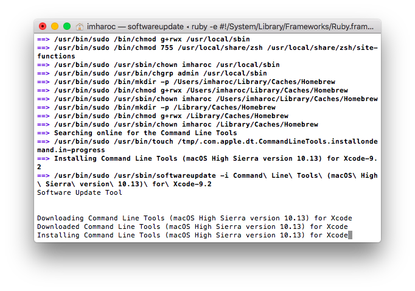
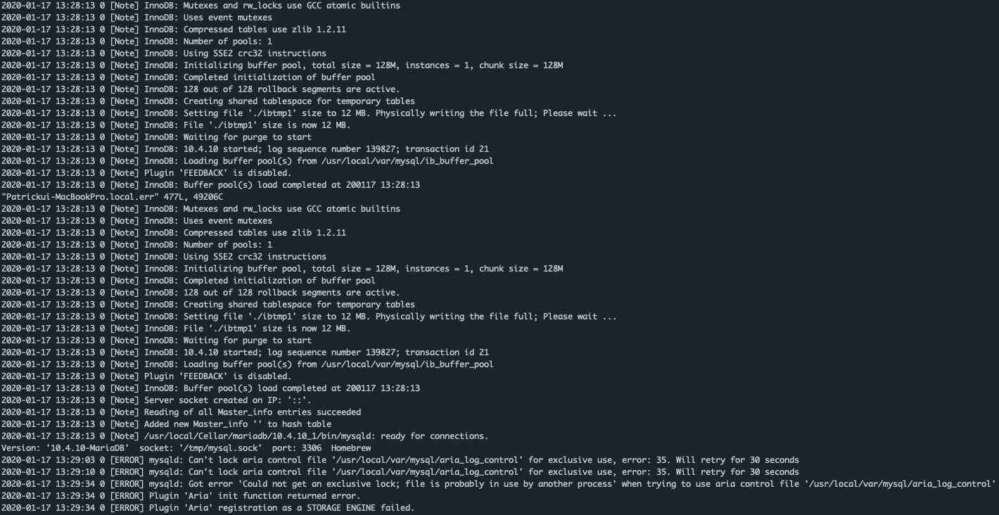

# Mac

링크: [Mac MariaDB Install & Setting](https://github.com/helloheesu/SecretlyGreatly/wiki/%EB%A7%A5%EC%97%90%EC%84%9C-mysql-%EC%84%A4%EC%B9%98-%ED%9B%84-%ED%99%98%EA%B2%BD%EC%84%A4%EC%A0%95%ED%95%98%EA%B8%B0,)

MariaDB란?

MariaDB는 오픈 소스의 관계형 데이터베이스 관리 시스템(RDBMS)이다. MySQL과 동일한 소스 코드를 기반으로 하며, GPL v2 라이선스를 따른다. 오라클 소유의 현재 불확실한 MySQL의 라이선스 상태에 반발하여 만들어졌으며, 배포자는 몬티 프로그램 AB(Monty Program AB)와 저작권을 공유해야 한다.[1] 이것은 MySQL과 높은 호환성을 유지하기 위함이며, MySQL API와 명령에 정확히 매칭하여, 라이브러리 바이너리와 상응함을 제공하여 교체 가능성을 높이고자 함이다.[2] 마리아 DB에는 새로운 저장 엔진인 아리아(Aria)뿐만 아니라, InnoDB를 교체할 수 있는 XtraDB 저장 엔진을 포함하고 있다.[3] 이것은 트랜잭션과 비트랜잭션 엔진 그리고 미래에 나올 MySQL 판에 대응하고자 함일 것이다.[4]

마리아 DB의 주요 개발자는 MySQL과 몬티 프로그램 AB를 설립한 마이클 몬티 와이드니어스(Michael Monty Widenius)이다. 그는 이전에 자신의 회사, MySQL AB를 썬마이크로시스템즈에 10억 달러에 판매를 한 적이 있으며, 마리아 DB는 그의 둘째 딸인 마리아의 이름을 딴 것이다.

# Install

1. XCode설치
2. 홈브루 설치
3. MariaDB 설치
4. MariaDB 이용하기

## homebrew?

루비와 Git으로 개발된 OS X용 패키지 매니저. 자칭 ‘OS X에서 필요하지만 애플에서 제공하지 않는 소프트웨어를 제공’ 한다. 애플에서 호스팅 하는 맥포트와 달리, 오픈소스 개발자들이 Github를 기반으로 굴리고 있으며 또한 아래 내용을 터미널에 복붙하고 엔터치면 [2] 설치가 완료되기에 편하기도 하다. 리눅스 터미널에 익숙해져 있다면 쓰는것도 괜찮다. 단, 이게 바이너리 파일을 받는게 아닌, 파일을 받아서 자체 컴파일[3]을 시켜버리기 때문에 큰 프로그램의 경우 시간이 꽤나 걸릴수 있다.

터미널 상 명령어는 보통 brew로 시작되며 자주 쓰이는 명령어는 설치 (brew install 설치대상), 홈브류 업데이트 (brew update) 등이 있다.

## Install

```ruby
ruby -e “$(curl -fsSL https://raw.githubusercontent.com/Homebrew/install/master/install)”
```



## MariaDB Install

```ruby
brew update
brew install mariadb
```

### MariaDB Status

```ruby
mysql.server status # 상태확인
mysql.server stop   # 정지
mysql.server start  # 시작
```


# Error

### Can't lock aria control file

```ruby
[ERROR] mysqld: Cant lock aria control file '/usr/local/var/mysql/aria_log_control' for exclusive use,
error: 35. Will retry for 30 seconds
```


