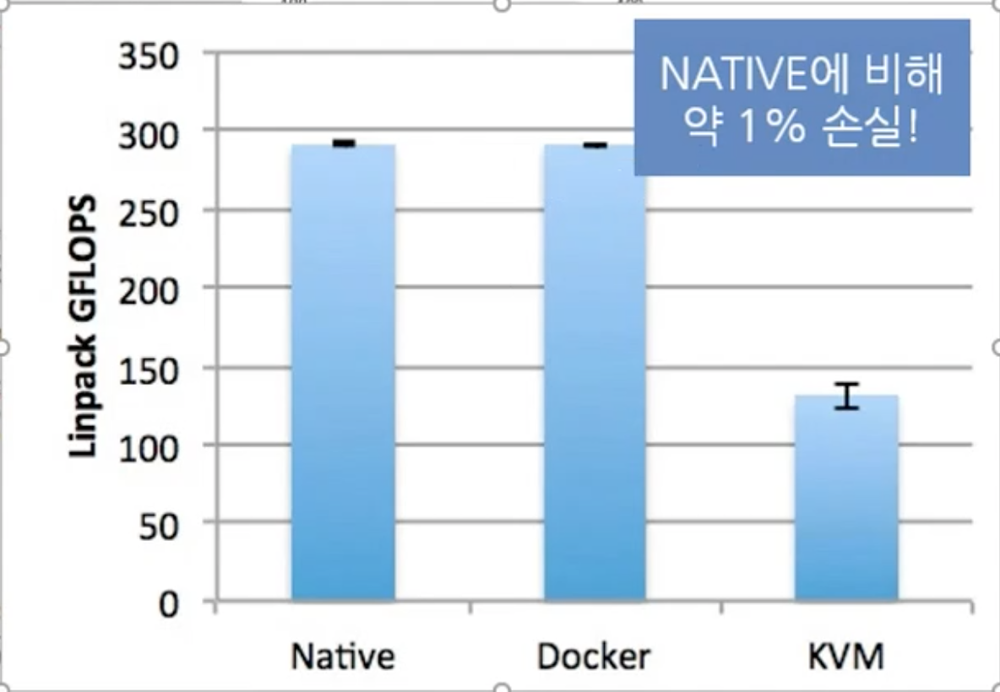
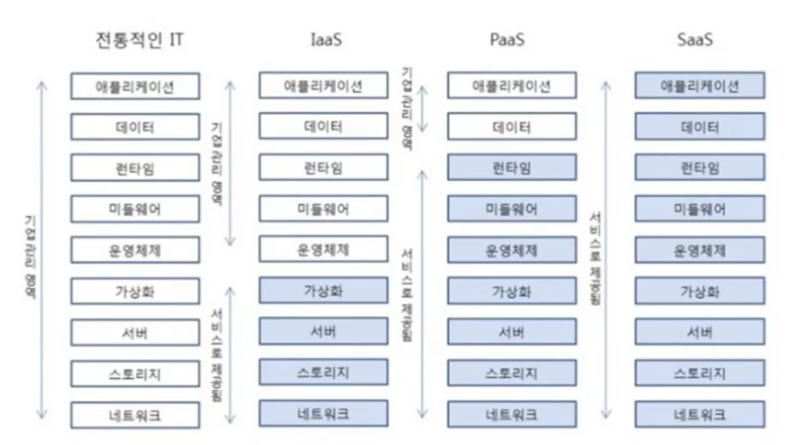
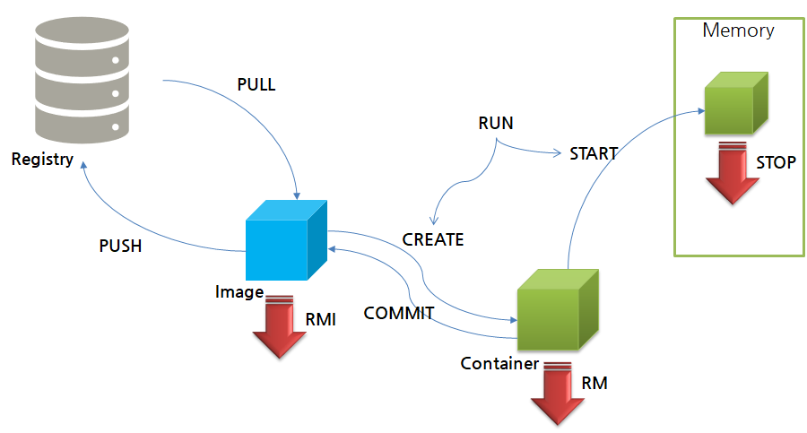

# Docker
* [도커의 이해](https://subicura.com/2017/01/19/docker-guide-for-beginners-1.html)
* 하드웨어 가상화 없는 격리된 환경에서 실행되는 프로세스

# 도커와 마이크로서비스 이해

## 모놀리식(Monolithic architecture) 아키텍쳐

* 서비스가 하나의 어플리케이션으로 돌아가는 구조
* 다양한 기능을 동작하는 서비스를 서버에서 실행하는 구조

### 모놀리식 아키텍쳐 단점
+ 모놀리식 서비스 아키텍쳐를 스케일링 할 경우

  - 기존의 어플리케이션을 그대로 복제하여 로드밸런싱
  - 불필요한 서비스까지 모두 복제(비효율적)
+ 종속적인 라이브러리의 충돌
 
  - 각각의 기능들이 서로 다른 라이브러리 버전의 종속성을 가지는 경우
  - 각 기능의 따른 라이브러리를 매 업데이트 마다 관리하기 매우 어려움
+ 추가 기능 or 수정 시 전체 빌드 및 배포가 필요
  
  - 소스코드 전체가 하나로써 동작하기 때문에, 작은 수정사항이 생길때마다, 전체 빌드 배포
  - 프로젝트가 커질 수록, 빌드 및 테스트 과정과 배포 속도가 매우 오래걸림

## 마이크로서비스 아키텍쳐

* 모놀리식 아키텍처의 대안으로 반대되는 개념
* 애플리케이션의 각각의 기능을 분리하여 개발 및 관리


### MSA 장점
* 서비스 단위의 빠른 개발
* 배포 용이
  + 개별 서비스 단위로 개발, 패키징, 빌드, 테스트, 배포로 각 서비스마다 유연한 스케줄
* 서비스 단위 고효율 저비용 Scale-Out 구조
  + 서비스 단위로 스케일링이 가능하여, 불필요한 서비스는 줄이고, 더 많은 자원이 필요한 서비스만 확장
* 라이브러리 종속성을 고려할 필요 X

  + 독립적으로 실행할 수 있는 컨테이너 환경

### MSA 단점
* 분산 시스템 환경에서 Transaction 보장
* 테스트
* 배포 및 관리 복잡
  + 효율적으로 빌드배포를 하기위해 도커와 쿠버네티스를 사용하여 컨테이너 환경으로 사용

# 컨테이너, 도커, 쿠버네티스 이해


## 컨테이너

* 컨테이너는 가상머신을 사용해 각 마이크로 서비스를 격리 하는 기술
* 가상머신처럼 하드웨어를 전부 구현하지 않기 때문에 매우 빠른 실행 가능
  * 가상머신과 컨테이너 갯수에 따라 실행 속도 비교
    
  * 가상머신과 컨테이너, 도커 속도 비교
    
* 프로세스의 문제가 발생할 경우, 컨테이너 전체를 조정해야 하기 떄문에 하나의 컨테이너에 하나의 서비스를 구현하는것이 좋다.

###  컨테이너를 격리하는 기술
* 리눅스 네임 스페이스: 각 프로세스가 파일 시스템 마운트, 네트워크, 유저(uid), 호스트 네임(uts)등 에 대해 시스템에 독립 뷰를 제공
  
* 리눅스 컨트롤 그룹: 프로세스로 소비할 수 있는 리소스 양(CPU< 메모리, I/O, 네트워크 대역대, device 노드 등)을 제한
  

> 이 두가지를 이용해 컨테이너를 만들어 사용 -> 쉽게 제공하는 인터페이스가 도커

## 도커
* 컨테이너 기술을 지원하는 프로젝트 중 하나
* 컨테이너 기술의 사실상 표준
* 다양한 운영체제에서 사용 가능(리눅스, 윈도우, 맥)
  + 결국엔 리눅스 기반으로 컨테이너를 격리하기 떄문에, 윈도우 같은 경우는 하이퍼바이저를 이용해 리눅스 환경을 생성하여 컨테이너화 시킨다
* 애플리케이션에 국한 되지 않고, 의존성 및 파일 시스템까지 패키징하여, 빌드배포 및 실행 단순화
* 리눅스의 네임스페이스와 컨트롤 그룹 같은 커널 기능을 사용하여 가상화


* 도커 이미지: 필요한 프로그램과 라이브러리, 소스를 설치한 뒤 만든 하나의 파일
* 컨테이너: 이미지를 격리하여 독립된 공간에서 실행한 가상 환경



### 도커의 아키텍쳐


* Docker engine: 이미지, 네트워크, 디스크 등의 관리 역활
* Containerd: OCI 구현체(주로 runC)를 이용해 container를 관리해주는 daemon
* 두 프로그램이 각각 돌아가기 때문에 Docker Engine을 재시작해도 각 이미지에 영항 없음

### 도커의 장점
* 컨테이너를 통해 가상머신을 격리하여, 여러 소프트웨어 서비스 간에 종속성과 라이브러리 충돌을 방지
* 또한 가상머신처럼 모든 하드웨어를 전부 구현하지 않기 때문에, 매우 빠른 실행 가능
* 가상머신을 제어할때 필요한 하이퍼바이저가 필요가 없어 더 효율적으로 자원을 사용가능


### 도커의 한계

* 총 8 x 4 대의 서버로 구성될 경우
  + 서비스가 커지면 커질 수록 관리해야 하는 컨테이너의 양이 급격하게 증가
  + 각각의 서버에 연결하여 각각의 컨테이너를 확인하고 관리해야하는 번거로움
  + 모든 서버를 동일하게 관리하기 위해 사용되는 것이 쿠버네티스

## 쿠버네티스

* 구글의 컨테이너 운영 오픈소스(go)
* 다수의 컨테이너를 자동으로 운영하기 위한 오케스트레이션 도구
* 많은 시스템을 통합, 컨테이너를 다루기 위한 API 제공

### DevOps 모델
* 데브옵스는 소프트웨어 개발과 아이티 운영을 결합한 합성어
* 기존의 분리된 소프트웨어 개발팀과 IT운영팀의 협업으로 전체 라이프사이클을 함꼐 안전하고 쉽게 관리할 수 있는 환경
* 개발과 릴리즈가 편해지므로 안정성이 확보, 협업 강화

---


# Docker Install
```bash
apt install docker.io
```

# Docker 레지스트리

* github 처럼 도커 이미지를 자유롭게 배포하고, 받을 수 있는 환경
  + [Docker-Hub](https://hub.docker.com/)
    - `/` 경로가 있는경우, 일반 유저가 올린 이미지이며,
    - `/` 경로가 없는경우, 공식 이미지라고 생각하면 됨
  + 검색을 통해 쉽게 이미지를 받을 수 있다.
  + 명령어로 검색하는 경우
    ```bash
    sudo docker search tomcat
    sudo docker search {search-image}

    sudo docker pull tomcat //download

    sudo docker images //로컬 시스템에 있는 도커 이미지 검색
    ```

# Docker 라이프사이클 이해하기

* `RUN` : `CREATE` + `START` + [`IMAGE PULL`]:optional
  + `RUN` 은 일종의 간편 명령어로 사용
  + 실행하려는 이미지가 없는 경우 docker-hub에서 이미지를 pull
  + 실행하려는 이미지가 있는 경우, image `CREATE` -> `START` 한번에 실행
  + <span style="color:red">같은 이미지를 `RUN` 할 경우, 컨테이너에서 새로운 이미지를 생성하고 실행</span>
    - `RUN` 명령어와 `START` 명령어를 잘 구분해서 사용
* `PULL`
* `PUSH`


# Docker 이미지의 레이어

* 왼쪽: 이미지 A를 지워도, 이미지 B에서 레이어 A,B,C를 사용하고 있어, 실제로 지워지지 않음
* 오른쪽: 이미 존재하는 레이어 A,B는 동일하게 사용하기 때문에, 새로 다운받을 필요가 없음

```bash
docker info # 설치된 도커의 상세 정보 확인
```
* 도커 루트 경로 확인

  + 경로 구성 파일
  
  + image 폴더 안에는 image-db, layer-db 에 관한 정보
    - image-db 에는 layer-db에 관련한 정보를 가지고 있다
    - layer-db 는 `overlay2`폴더의 관련된 정보를 가지고 있다
  + 실질적으로 컨테이너를 생성하고, 관련된 데이터를 가지고 있는것은 `overlay2` 폴더 안에 파일 시스템을 가지고 있다

# Docker 이미지 생성 및 빌드
python를 사용해 단순한 서비스를 시작 작성한다. 다음 파일을 작성하여 test_server.py로 저장한다.

```py
# test_server.py
import socket

with socket.socket() as s:
  s.bind(("0.0.0.0", 12345))
  s.listen()
  print("server is started")
  conn, addr = s.accept()
  # conn 클라이언트와 통신할 소켓
  # addr 클라이언트의 정보가 들어있음
  with conn:
    print("Connected by", addr)
    while True:
      data = conn.recv(1024)
      if not data: break
      conn.sendall(data)
```

```bash
python3 test_server.py

---

nc 127.0.0.1 12345
```

## 11.2 도커 파일 생성

별도의 디렉토리를 생성하고 dockfile과 위에서 생성한 python파일을 새 디렉토리에 배치한다.

```bash
mkdir my_first_project
mv test_server.py ./my_first_project/
cd my_first_project/
gedit dockerfile
```

dockerfile

```docker
FROM python:3.7

RUN mkdir /echo
COPY test_server.py /echo

CMD ["python", "/echo/test_server.py"]
```

빌드 후 테스트

```bash
ls
dockerfile test_server.py

sudo docker build -t ehco_test .
sudo docker images
sudo docker run -t -p 12345:12345 --name et --rm echo_test
```

```bash
nc 127.0.0.1 12345
```

# Docker private image registry
프로젝트 개발로 생성한 이미지를 Docker-Hub에 올리지 않고, 프라이빗하게 사용하는 방법

```bash
docker run -d --name docker-registry -p 5000:5000 registry
```

* docker run을 통해 이미지를 생성
* 브라우저를 통해 registry 확인
  
* private registry 이미지 푸쉬
  ```bash
  sudo docker tag echo_test 127.0.0.1:5000/echo_test
  sudo docker push 127.0.0.1:5000/echo_test
  ```

* 도커 API 관련 링크: [https://docs.docker.com/registry/spec/api/](https://docs.docker.com/registry/spec/api/)

* 인증 관련 참고 링크: [https://docs.docker.com/registry/configuration/#auth](https://docs.docker.com/registry/configuration/#auth)


---

# Docker Command

## Docker version check
```bash
docker -v

docker info # 설치된 도커의 상세 정보
```
* 도커 버전


* 도커 루트 경로 확인


## Docekr Image Search
```bash
docker search {image:name}
```

## Docker Image Download & Delete
```bash
docker pull {image-name}:{tag}
docker rmi {image-name}:{tag}
```

## Docker Image View
```bash
docker images
```

### Docker Image Push
도커 이미지를 Docker-Hub에 업로드 하려면 회원가입 및 로그인이 되있어야 한다
```bash
docker login # Docker-Hub ID/PW
docker tag {image:name} [DOCKER-HUB-LOGIN:ID]/{image:name} # 새로운 태그 생성
docker images # 새로 생성한 테그 이미지 조회
docker push [DOCKER-HUB-LOGIN:ID]/{image:name}
```

### Docker Image History
도커 이미지 버전 별로 커밋 히스토리를 확인 가능
```bash
docker history {image:name}:[version]
```


## Docker Container Create
```bash
docker create {option} {image-name}:{tag}
```

## Docker Container Running
```bash
docker run {option} IMAGE{:tag|@digest} {command} {arg...}
```

* `RUN` 명령어는 이미지가 없다면 이미지를 자동으로 pull 받아온다
* 추가로 가져온 이미지를 컨테이너에 `CREATE` + `START` 를 실행한다.
* `RUN` 명령어는 컨테이너를 계속 생성하는 것이기 떄문에, 같은 이미지로 중복되게 생성할 위험이 있다.
* -d:	데몬으로 실행(뒤에서 - 안 보이는 곳(백그라운드)에서 알아서 돌라고 하기)
* -it:	컨테이너로 들어갔을 때 bash로 CLI 입출력을 사용할 수 있도록 해 줍니다.
* --name: {이름}	컨테이너 이름 지정
* -p: {호스트의 포트 번호}:{컨테이너의 포트 번호}	호스트와 컨테이너의 포트를 연결합니다. -> 포트 포워딩
* --rm:	컨테이너가 종료되면{내부에서 돌아가는 작업이 끝나면} 컨테이너를 제거합니다.
* -v: {호스트의 디렉토리}:{컨테이너의 디렉토리}	호스트와 컨테이너의 디렉토리를 연결합니다.
* -e: 환경 변수를 설정할 수 있다.
  ```bash
  docker run -d --name nx -e env_name=test1234 nginx # printenv env_name

  > sudo docker exec -it nx bash

  printenv # 환경변수 확인
  printenv {env:name} # 특정 환경변수 네임 확인
  ```

### Docker Container Check
```bash
docker ps #모든 컨테이너 조회

docker ps -a #실행중인 컨테이너 조회
```


### Docker Container Inner Shell
```bash
docker exec -tc {container:name | container:id} /bin/bash
```

### Dcoker Container File Copy
```bash
sudo docker cp <path> <to container>:<path>   # 로컬에서 컨테이나로
sudo docker cp <from container>:<path> <path> # 컨테이너 에서 로컬로
sudo docker cp <from container>:<path> <to container>:<path> # 컨테이너에서 컨테이너로
```

### Docker Container logs
```bash
docker logs {container:name | container:id} # stdout, stderr
```

## Docker Container Stop
```bash
docker stop {container:name | container:id}
```

* 도커이미지를 통해 생성된 컨테이너의 고유 ID or Names 로 종료

## Docker Container Delete
```bash
docker rm {container-name | container:id}

sudo docker stop `sudo docker ps -a -q` # 모두 정리
sudo docker rm `sudo docker ps -a -q`   # 모두 삭제
```
