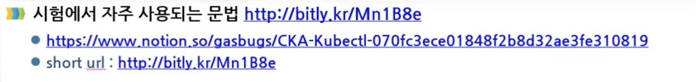

# Kubernetes or k8s
* 어플리케이션 개발자와 시스템 관리자가 수천 개의 어플리케이션과 서비스를 관리하는데 도움
* 수십만 대의 시스템을 가동할 때 사용률이 조금만 향상되도 수백만 달러의 비용 절감 효과


* 인프라의 추상화
  
  + 컨테이너 시스템에서 컨테이너 어플리케이션을 쉽게 배포 및 관리 가능한 소프트웨어
  + 기본 인프라를 추상화하여, 개발 및 배포, 관리를 단순화
  + 모든 노드가 하나의 거대한 컴퓨터인 것처럼 수천개의 컴퓨터 노드에서 소프트웨어 어플리케이션 실행

# k8s 장점
* 어플리케이션 배포 단순화
* 하드웨어 활용도 극대화
  + 클러스터 구조의 서버 환경에서 주변 서버로 자유롭게 이동하여 실행중인 다양한 어플리케이션 구성 요소를 클러스터 노드의 가용 리소스에 최대한 맞춰 효율적으로 운용 가능
  + 노드의 하드웨어 리소스를 최상으로 활용
* 상태 확인 및 자가 치유
  + 컨테이너 장애 시 자동으로 장애 복구
  + 어플리케이션 구성 요소와 실행되는 노드를 모니터링
  + 노드를 모니터하며 장애 발생 시 다른 노드로 일정을 자동 재조정
* 오토스케일링
  + 개별 어플리케이션의 부하를 지속적으로 모니터링 할 필요 없다
  + 자동으로 리소스를 모니터링하고, 각 어플리케이션에서 실행되는 인스턴스 수를 계속적으로 자동 재조정
* 어플리케이션 개발 단순화
  + 어플리케이션 수정 시 빠른 배포
  + 버그 발견 및 수정 용이
  + 새로운 버전 배포 후 장애 발생 시 롤아웃
* 핵심 어플리케이션 개발에 집중
  + 어플리케이션 개발자가 특정 인프라 관련 서비스 때문에 시간낭비를 하지 않아도됨
  + 쿠버네티스에 의존해 서비스를 제공
    - 서비스 검색, 확장, 로드밸런싱, 자가치유, 리더 선충 등
  + 어플리케이션 개발자는 어플리케이션 기능 개발에만 집중
  + 인프라 환경을 파악하거나, 통합하는 시간 낭비X
* 효과적인 리소스 활용
  + 실행을 유지하고 서로 통신할수 있도록 컴포넌트 제공
  + 어플리케이션이 어떤 노드에서 실행되는지 신경 쓸 필요가 없음
  + 언제든지 어플리케이션 재배치 가능
  + 어플리케이션을 혼합하고 매칭시킴으로써 리소스를 매칭

# k8s 아키텍쳐

* 쿠버네티스의 클러스터는 하드웨어 수준에서 많은 노드로 구성되며 두가지 타입의 노드로 구성
  1. 마스터 노드: 전체 쿠버네티스 시스템을 관리하고 통제하는 쿠버네티스 컨트롤 플레인을 관장
  2. 워커 노드: 실제 배포하고자 하는 어플리케이션의 실행을 담당

# k8s 상세 아키텍쳐

* 컨트롤 플레인(마스터 노드)
  + 마스터노드는 워커노드의 클러스터를 관리하는 기능
  + 단일 마스터 노드에서 실행하거나, 여러 노드(마스터 노드의 클러스터화)로 분할되고 복제하여 고가용성을 보장
  + 클러시터의 상태를 유지하고 제어하지만, 어플리케이션을 실행하지 않음
  * 컨트롤 플레인(마스터 노드) 구성요소
    - 쿠버네티스 API서버: 사용자, 컨트롤 플레인과 통신
    - 스케줄려: 컨테이너 어플리케이션 예약(어플리케이션의 배포 가능한 각 구성요소(컨테이너)에 워커 노드 할당)
    - 컨트롤 매니저: 구성 요소 복제, 워커 노드 추적, 노드 장애 처리 등 클러스터 수준 기능 실행
    - 데이터 스토리지: etcd는 클러스터 구성을 지속적으로 저장하는 안정적인 분산
* 워커 노드
  + 워커 노드는 컨테이너화된 어플리케이션을 실행하는 시스템
  + 어플리케이션에 서비스를 실행, 모니터링 등 다양한 기능을 수행
  * 워커 노드 구성요소
    - Kubelet: API 서버(마스터 노드)와 통신하고, 워커노드에서 컨테이너 관리
    - 컨테이너 런타임: 컨테이너를 실행하는 도커
    - 쿠버네티스 서비스 및 프록시: 어플리케이션 간의 네트워크 트래픽을 분산 및 연결


---

# k8s ubuntu install

* k8s 구성 사항
  + Master node: k8s 마스터 노드 설정될 호스트(마스터 노드 혼자 워커도느 역확도 가능하긴함 -> 권장 X)
  + Work node(2): 필수 사항은 아니지만, work노드를 클러스터

VM 설정
---
* hostname 변경: /etc/hostname
* 네트워크 인터페이스 변경
* NAT 네트워크 설정
* (hostname -> rename -> reboot)
---

* k8s 관리하는 명령어
  + kubeadm: 클러스터를 부트스트랩하는 명령
    - k8s 마스터 노드 구성 및 설정
  + kubelet: 클러스터의 모든 시스템에서 실행되는 구성 요소로, 창 및 컨테이너 시작과 같은 작업을 수행
    - 데몬이 항상 동작하고 있기 떄문에, 서비스 형태로 구성
  + kubectl: 커맨드 라인 util은 당신의 클러스터와 대화
    - 클라이언트 프로그램

## Master 노드 초기화
```bash
sudo kubeadm init
```
* 스왑 에러 발생 시 스왑 기능 제거
  ```bash
  sudo swapoff -a   # 현재 커널에서 스왑 기능 끄기
  sudo sed -i `/swap/s/^\(.*\)$#\1/g` /etc/fstab # 리붓 후에도 스왑 기능 유지
  reboot
  ```
  + k8s 에서 스왑 기능을 비활성하는 이유
      - k8s 1.8 버전 이후, 노드에서 스왑을 비활성해야함
      - k8s의 아이디어는 인스턴스를 최대한 100%에 가깝게 성능을 발휘하는 것
      - 모든 배포는 CPU/메모리 제한을 고정하는 것이 필요
      - 다라서 스케줄러가 포드를 머신에 보내면 스왑을 사용하지 않는 것이 필요하기 떄문에
      - 스왑 발생 시 속도가 느려지는 이유 발생
      - 성능을 위해 스왑 기능을 비활성화
* 클러스터 사용 설정
  + 사용자 계정으로 실행
  + Pod Network 추가
* 슬레이브 노드 추가
* 연결된 노드들의 연결 상태 확인


---

# k8s ubuntu install detail

[Kubernetes Install Docs](https://kubernetes.io/ko/docs/setup/production-environment/tools/kubeadm/install-kubeadm/)

> Before Install

* 호환되는 리눅스 머신. 쿠버네티스 프로젝트는 데비안 기반 배포판, 레드햇 기반 배포판, 그리고 패키지 매니저를 사용하지 않는 경우에 대한 일반적인 가이드를 제공한다.
* 2 GB 이상의 램을 장착한 머신. (이 보다 작으면 사용자의 앱을 위한 공간이 거의 남지 않음)
* 2 이상의 CPU.
* 클러스터의 모든 머신에 걸친 전체 네트워크 연결. (공용 또는 사설 네트워크면 괜찮음)
* 모든 노드에 대해 고유한 호스트 이름, MAC 주소 및 product_uuid. 자세한 내용은 여기를 참고한다.
* 컴퓨터의 특정 포트들 개방. 자세한 내용은 여기를 참고한다.
* 스왑의 비활성화. kubelet이 제대로 작동하게 하려면 반드시 스왑을 사용하지 않도록 설정한다.
* Installed Docker

## Network Setting
* MAC 주소 및 product_uuid가 모든 노드에 대해 고유한지 확인
  + 사용자는 ip link 또는 ifconfig -a 명령을 사용하여 네트워크 인터페이스의 MAC 주소를 확인할 수 있다.
  + 44product_uuid는 sudo cat /sys/class/dmi/id/product_uuid 명령을 사용하여 확인할 수 있다.

* 필수 Port
  


# kubeadm, kubelet 및 kubectl 설치
모든 머신에 다음 패키지들을 설치

* kubeadm: 클러스터를 부트스트랩하는 명령이다.
* kubelet: 클러스터의 모든 머신에서 실행되는 파드와 컨테이너 시작과 같은 작업을 수행하는 컴포넌트이다.
* kubectl: 클러스터와 통신하기 위한 커맨드 라인 유틸리티이다.

> 버전 관련 주의
kubeadm은 kubelet 또는 kubectl 을 설치하거나 관리하지 않으므로, kubeadm이 설치하려는 쿠버네티스 컨트롤 플레인의 버전과 일치하는지 확인해야 한다. 그렇지 않으면, 예상치 못한 버그 동작으로 이어질 수 있는 버전 차이(skew)가 발생할 위험이 있다. 그러나, kubelet과 컨트롤 플레인 사이에 하나의 마이너 버전 차이가 지원되지만, kubelet 버전은 API 서버 버전 보다 높을 수 없다. 예를 들어, 1.7.0 버전의 kubelet은 1.8.0 API 서버와 완전히 호환되어야 하지만, 그 반대의 경우는 아니다.

> 경고: 이 지침은 모든 시스템 업그레이드에서 모든 쿠버네티스 패키지를 제외한다. 이는 kubeadm 및 쿠버네티스를 업그레이드 하는 데 특별한 주의가 필요하기 때문이다.
---

## Install Command
1. apt 패키지 색인을 업데이트하고, 쿠버네티스 apt 리포지터리를 사용하는 데 필요한 패키지를 설치한다.
```basn
sudo apt-get update
sudo apt-get install -y apt-transport-https ca-certificates curl
```

2. 구글 클라우드의 공개 사이닝 키를 다운로드 한다.

```bash
sudo curl -fsSLo /usr/share/keyrings/kubernetes-archive-keyring.gpg https://packages.cloud.google.com/apt/doc/apt-key.gpg
```

3. 쿠버네티스 apt 리포지터리를 추가한다.
```bash
echo "deb [signed-by=/usr/share/keyrings/kubernetes-archive-keyring.gpg] https://apt.kubernetes.io/ kubernetes-xenial main" | sudo tee /etc/apt/sources.list.d/kubernetes.list
```

4. apt 패키지 색인을 업데이트하고, kubelet, kubeadm, kubectl을 설치하고 해당 버전을 고정한다.

```bash
sudo apt-get update
sudo apt-get install -y kubelet kubeadm kubectl
sudo apt-mark hold kubelet kubeadm kubectl
```

# Install after
설치를 마치고 나면, K8s 클러스터 구성대로 `Master node` 와 `Work node` 로 구분하여 구성:

1. `Master Node` Setting:

    * Master 생성 및 초기화 command
      ```bash
      sudo kubeadm init
      ```
    * 초기화 결과 return
      ```bash
      Your Kubernetes control-plane has initialized successfully!

      To start using your cluster, you need to run the following as a regular user:

        mkdir -p $HOME/.kube
        sudo cp -i /etc/kubernetes/admin.conf $HOME/.kube/config
        sudo chown $(id -u):$(id -g) $HOME/.kube/config

      You should now deploy a Pod network to the cluster.
      Run "kubectl apply -f [podnetwork].yaml" with one of the options listed at:
        /docs/concepts/cluster-administration/addons/

      You can now join any number of machines by running the following on each node
      as root:

        kubeadm join <control-plane-host>:<control-plane-port> --token <token> --discovery-token-ca-cert-hash sha256:<hash>
      ```
2. `Client or User Setting` :[스터디 및 테스트 환경에서는 마스터 노드에 생성함]
    * 마스터 노드 초기화 결과물에서 나온 폴더 및 설정파일 생성
      ```bash
      mkdir -p $HOME/.kube
      sudo cp -i /etc/kubernetes/admin.conf $HOME/.kube/config
      sudo chown $(id -u):$(id -g) $HOME/.kube/config
      ```
3. `Work Node` Setting:
    * 마스터 노드 초기화 결과물에서 나온 `join` 명령어 입력
      ```bash
      kubeadm join <control-plane-host>:<control-plane-port> --token <token> --discovery-token-ca-cert-hash sha256:<hash>
      ```
4. `Master node` input command
    ```bash
    export KUBECONFIG=/etc/kubernetes/admin.conf
    ```

> 위와 같이 진행하면, Master node 및 work node 설정왼료

# Create a cluster with Kubeadm
마지막으로 설정한 마스터 노드와 워크 노드의 클러스터링을 위해 마스터 노드에 Network add-on 을 설정해야 한다.

[Create a cluster with Kubeadm](https://kubernetes.io/docs/setup/production-environment/tools/kubeadm/create-cluster-kubeadm/)

The kubeadm tool is good if you need:

* A simple way for you to try out Kubernetes, possibly for the first time.
* A way for existing users to automate setting up a cluster and test their application.
* A building block in other ecosystem and/or installer tools with a larger scope.

## Installing a Pod network add-on

* [쿠버네티스 네트워크 모델 종류 참고](https://kubernetes.io/docs/concepts/cluster-administration/networking/#how-to-implement-the-kubernetes-networking-model)

> 다양한 종류 중 `Weave` 를 설치

## Integrating Kubernetes via the Addon With Weave

[k8s network add-on Weave](https://www.weave.works/docs/net/latest/kubernetes/kube-addon/)

1. 마스터 노드에 add-on 을 적용
  ```bash
  $ kubectl apply -f "https://cloud.weave.works/k8s/net?k8s-version=$(kubectl version | base64 | tr -d '\n')"
  ```
2. 적용 후 설정이 완료되면 command `kubectl get nodes` 노드 확인
  ```bash
  $ kubectl get nodes
  ```
  
3. k8s 노드들의 status 가 `Not-Ready` -> `Ready` 라면 설정 완료

---
# GKE 활용한 k8s 사용
Google cloud의 관려형 k8s 서비스인 GKE(Google Kubernetes Engine)
* GKE는 k8s 를 쉽게 사용자가 활용할 수 있도록 관리형으로 제공
* 규모에 맞춘 컨테이너식 어플리케이션 관리
* 다양한 어플리케이션 배포
* 고가용성을 통한 원활한 운영
* 수요에 맞게 간편하게 확장
* Google 네트워크에서의 안전한 실행
* 온프레미스 및 클라우드 간의 자유로운 이동

---

# AWS EKS
Amazon Elastic Container Service for Kubernetes(Amazon EKS)
* AWS에서 쿠버네티스를 손쉽게 실행하도록 하는 관리형 서비스
* 여러 가용 영역에서 쿠버네티스 제어 플레인 인스턴스를 실행하여 고가용성을 보장
* 비정상 제어 플레인 인스턴스를 자동으로 감지하고 교체
* 자동화된 버전 업그레이드 제공
* 여러 AWS 서비스와 통합되여 다음을 포함한 어플리케이션에 대한 확장성과 보안을 제공
  - 컨테이너 이미지용 Amazon ECR
  - 로드 배포용 Elastic Load Balancing
  - 인증용 IAM
  - 격리용 Amazon VPC


## EKS 이용 방법 2가지
1. eksctl 로 시작
    + Amazon EKS를 시작하기 가장 빠르고 쉬운 방법
    + 클러스터를 생성 및 관리하기 위한 간단한 명령중 유틸리티 eksclt 제공
    + 필요한 모든 리소스 설치
    + kubectl 명령 줄 유틸리티
2. AWS Management
    + AWS Management 콘솔 사용
    + Amazon EKS를 시작할 떄 필요한 모든 리소스를 생성 가능
    + Amazon EKS Ehsms AWS CloudFormation 콘솔을 사용하여 각 리소스를 수동으로 생성
    + 각 리소스의 생성 방법 및 리소스 간의 상호 작용을 완벽하게 파악 가능
    + Amazon EKS를 시작하는 방법으로는 더 복잡하고 시간도 많이 걸림


---
# 쿠버네티스 관리자 인증 시험(CKA)
Certified Kubernetes Administrator (CKA)
* 리눅스 재단과 협력하여 쿠버네티스 생태계 개발을 돕기 위해 CNC(Cloud Native Computing)
* CNC 재단은 쿠버네티스 관리자 커뮤니티를 성장시키기 위해 노력
* 쿠버네티스를 사용하는 광범위한 회사 및 조직에서 지속적으로 성장
* $300 비용으로 온라인 시험(쿠폰 검색하면 쿠폰 나옴)
* WebCam을 통해 수험자를 모니터링하고 크롬으로 시험 진행
* 재시험 1회 무료 응시

## CKA 출제 범위
* Application Lifecycle Management - 8%
* Installation, Configuration, Validation - 12%
* Core Concepts - 19%
* Networking - 11%
* Scheduling - 5%
* Security - 12%
* Cluster Maintenance - 11%
* Logging / Monitoring - 5%
* Storage - 7%
* Trubleshooting - 10%




---

# 강의
* [k8s 기초 강의](https://www.youtube.com/watch?v=X48VuDVv0do)
* [k8s 인프라 CI/CD 처리](https://saramin.github.io/2020-05-01-k8s-cicd/)
