# Apache Kafka
LinkedIn에서 최초로 만들고 opensource화 한 확장성이 뛰어난 분산 메시지 큐(FIFO : First In First Out)
* 링크드 인에서 2011년 오픈소스로 개발
* 분산 아키텍쳐 구성, Fault-tolerance한 architecture(with zookeeper), 데이터 유실 방지를 위한 구성이 잘되어 있음
* AMQP, JMS API를 사용하지 않은 TCP기반 프로토콜 사용
* Pub / Sub 메시징 모델을 채용
* 읽기 / 쓰기 성능을 중시
* Producer가 Batch형태로 broker로 메시지 전송이 가능하여 속도 개선
* 파일 시스템에 메시지를 저장하므로, 데이터의 영속성 보장
* Consume된 메시지를 곧바로 삭제하지 않고 offset을 통한 consumer-group별 개별 consume가능
* 카프카는 MSA 구조와 같은 다양한 어플리케이션에서 데이터를 처리할 때, 각각의 어플리케이션에서 처리하는 것이 아닌, 카프에서(중앙집중화) 처리하여, 간편한 관리를 제공
* 카프카는 대용량 데이터를 수집하고 이를 사용자들이 실시간 스트림으로 소비할 수 있는 일종의 중추 신경 역활
  + 짧은 시간내에 엄청난 데이터를 처리 가능 -> 파티션을 통한 분산 처리와 병렬처리가 가능하기 때문에 빠른 속도 제공
  + 폭넓은 확장성으로, 이미 사용 중이라도, 신규 브로커를 확장해서 추가하기 쉽다.
  + 또는 이미 replica로 복제된 데이터는 안전하게 보관되고 있기 때문에, 만약 브로커 몇개가 문제가 생겨도, 복제된 데이터로 인해 문제 없이 수행
  + 다른 플랫폼과 다르게, 컨슈머가 데이터를 가져가도, 데이터가 사라지지 않는다.
  + 안정적인 운영과 빠른 확장성을 가질 수 있다.

* 주요 사이트
  + [Kafka website](http://kafka.apache.org/)
  + [Github](https://github.com/apache/kafka)
  + [Kafka contributors](https://github.com/apache/kafka/graphs/contributors)

# Kafka 주요 성능 정리

# Kafka 사용 주요 사례
* LinkedIn : activity streams, operational metrics, data bus(400 nodes, 18k topics, 220B msg/day in May 2014)
* Netflix : real-time monitoring and event processing
* Twitter : as part of their Storm real-time data pipelines
* Spotify : log delivery, Hadoop
* 11번가 : [카프카를 이용한 비동기 주문시스템(카프카 컨슈머 애플리케이션 배포 전략 medium post)](https://medium.com/11st-pe-techblog/%EC%B9%B4%ED%94%84%EC%B9%B4-%EC%BB%A8%EC%8A%88%EB%A8%B8-%EC%95%A0%ED%94%8C%EB%A6%AC%EC%BC%80%EC%9D%B4%EC%85%98-%EB%B0%B0%ED%8F%AC-%EC%A0%84%EB%9E%B5-4cb2c7550a72)

# Kafka Architecture

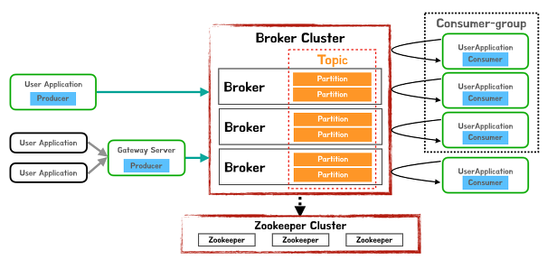

* Topic : Data가 저장되는 곳
* Broker : Kafka를 구성하는 각 서버 1대 = 1 broker
* Producer : Broker에 data를 write하는 역할
* Consumer : Broker에서 data를 read하는 역할
* Consumer-Group : 메세지 소비자 묶음 단위(n consumers)
* Zookeeper : Kafka를 운용하기 위한 Coordination * service
* Partition : topic이 복사(replicated)되어 나뉘어지는 단위

## Kafka Topic
---
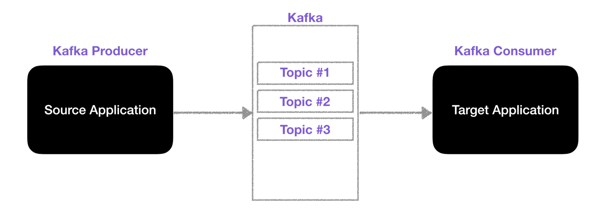
* 데이터베이스 테이블이나, 파일시스템의 폴더와 유사한 성질
* Kafka Producer(가) 데이터를 입력
* Kafka Consumer(가) 데이터를 조회

### Kafka Inner Topic
---
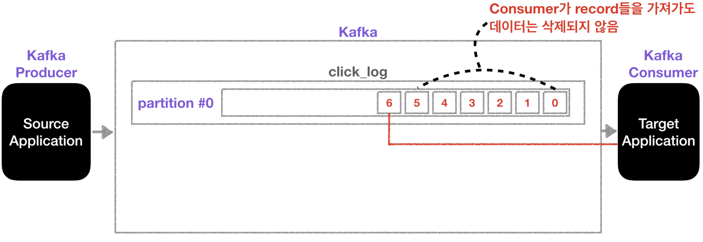
* 하나의 토픽에는 여러개의 파티션을 구성 가능
* 파티션은 데이터의 입력 순서대로 저장
* 컨슈머는 가장 먼저 들어온 데이터부터 순서대로 데이터를 조회
  + **컨슈머가 데이터를 조회**해도, 파티션에 있는 **데이터는 삭제되지 않는다.**
  + 동일 데이터에 대해서 다른 컨슈머 그룹에서 **처음부터 데이터 조회 가능**
  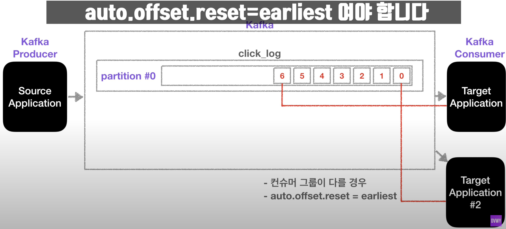
* 파티션이 2개 이상일 경우
  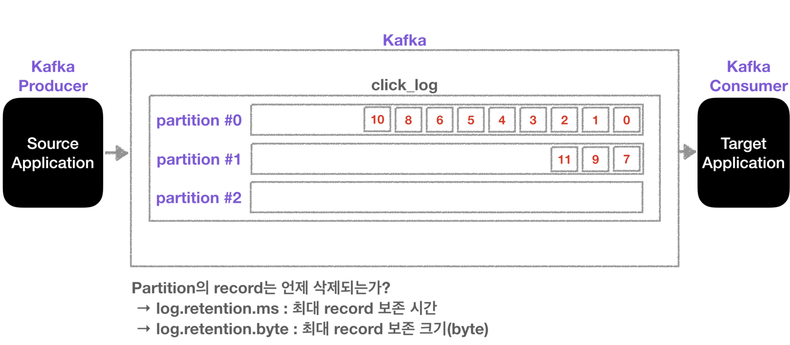
  + 파티션이 여러개라면, 데이터는 `Round-Robin`으로 파티션이 설정되어 저장
  + 파티셔닝을 하는 이유는, 다수의 컨슈머에게 적절하게 데이터를 분배하기 위해
  + <b><span style="color:red">파티션은 자유롭게 늘릴 수 있지만, 삭제는 불가능</span></b>
* 각 파티션 마다 데이터가 쌓이면, 파티션 큐에 일종의 offset 순번을 하나 하나 씩 증가 시킨다.
  + 오프셋 번호의 최대값은 어떻게 처리될까?
  ```java
  private static final Field.Int64 OFFSET = new Field.Int64("offset", "The offset found");
  ```
  + 보통 오프셋은 `int64` 로 지정되어 있어, 최대값은 `9,223,372,036,854,775,807`
  + 이 값은 하루에 1조개의 record를 쌓더라도 25,269년이 걸리는 어마어마한 값
  + 게다가 파티션을 1개만 사용하지 않고, 보통 2개 이상으로 구성하는 경우, 하루에 1경개 이상 record를 쌓지 않는 이상 이슈는 없을 것

## Kafka Broker
* 카프카가 설치되어 있는 서버 단위
* 최소 `Broker: 3개` 구성을 권장
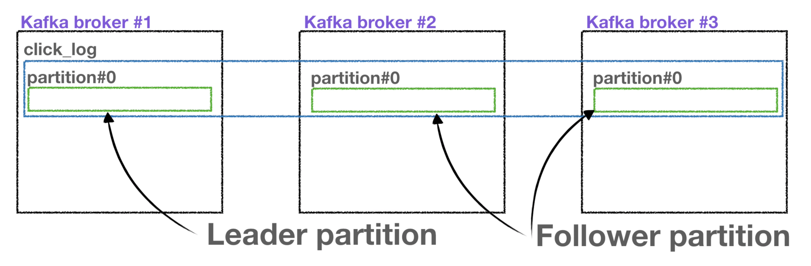
  + `Partition: 1`, `Replication(복제): 3` 설정의 카프카
  + `Replication(복제)` 설정은 `Broker` 갯수를 넘을 수 없다.
  + `Leader partition` + `Follwer partition` = `ISR(In-Sync-Replication)`
  + `Producer`로 부터 데이터를 전달 받는것은 `Leader partition` 이 전달받아 저장
  + `Follower partition`은 `Leader partition`이 문제가 생겼을 때, 사용하는 복제판
* `producer`로 부터 `ack 설정` 에 따른 데이터 전달 및 응답확인 설정
  + `ack = 0`
  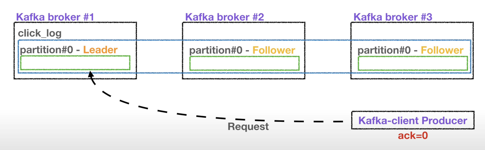
    - 프로듀서가 브로커에 데이터를 전달하고, 응답 확인 X
    - 응답을 확인하지 않아, 속도가 가장 빠름
    - 응답을 확인하지 않기 떄문에, 데이터 유실 가능성
  + `ack = 1`
  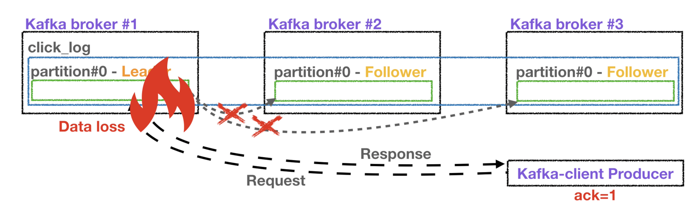
    - 프로듀서가 브로커에 데이터를 전달하고 응답을 확인하는 통신
    - 프로듀서가 전달하는 리더파티션에 데이터를 잘 받았는지 응답을 확인
    - 그러나 복제 리플리케이션 파티션에 데이터가 전달됬는지 확인 X
  + `ack = all`
  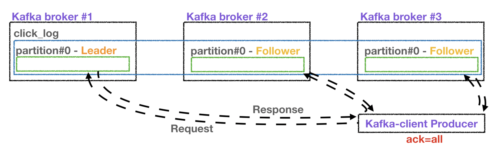
    - 프로듀서가 브로커에 데이터를 전달하고, 리더 및 리플리케이션 파티션 모두 응답 확인 방법
    - 모든 파티션에 데이터 전달 유무를 확인하여, 데이터 유실되지 않음
    - 모든 파티션을 확인하기 떄문에 속도가 느리다.

## Kafka Producer
* Topic에 해당하는 메세지 생성
* 특정 Topic으로 데이터 Publish
* 데이터 전송 처리 실패/재시도

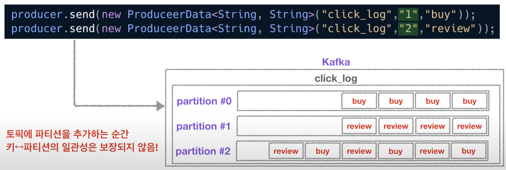
* Topic의 `partition` 과 `key`의 갯수가 동일 할 경우, `key` - `Partition` 은 연결되어 저장
* **만약, key-partition이 연결 상태에서, 새로운 파티션이 추가 된다면, 파티션 일관성은 보장 되지 않는다.**


## Kafka Consumer
* Topic의 Partition에 저장된 데이터를 polling
* Partition offset 위치 기록(commit)
* Consumer group을 통해 병렬처리

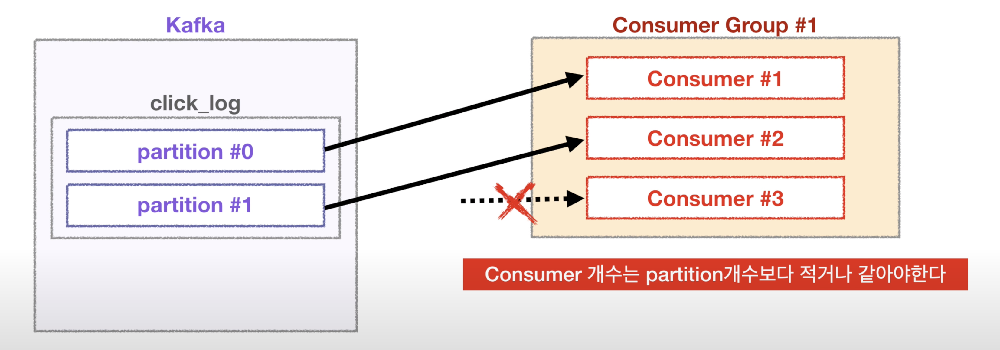
* Consumer의 개수는 partition 개수보다 적거나 같아야한다.
* 만약 Consumer가 1개, partition이 2개라면, Consumer는 모든 partition의 정보를 가져온다.

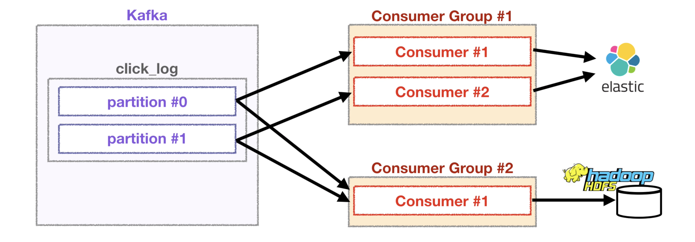
* 만약 컨슈머그룹1과 컨슈머 그룹2는 서로 다른 Offset을 관리함으로, 각자 원하는대로 데이터 처리가 가능

# Kafka Partitioner
파티셔너는 2가지 종류
* Kafka Producer Partitioner
* Kafka Consumer Partitioner

## Kafka Producer Partitioner
카프카 프로듀서는 레코드를 전송하기 위해 파티셔너를 제공합니다.

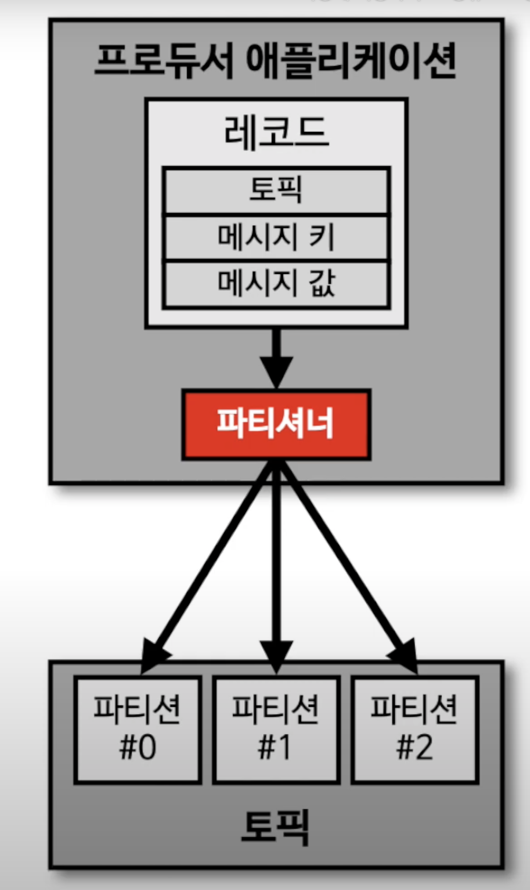
* 프로듀서가 데이터를 보낼 때, 파티셔너를 통해서 브로커에 데이터를 전달
* 파티셔너를 매칭하는 기준은 프로듀서 파티셔너 인터페이스에 따른다.
  + [Producer-Partitioner-interface](https://kafka.apache.org/25/javadoc/?org/apache/kafka/clients/producer/Partitioner.html)
* 프로듀서를 사용할 때, 특정한 파티션을 설정하지 않으면 default: UniformStickyPartitioner 로 설정
* Topic에 데이터를 전달할 때, key의 유무에 따라 파티셔너의 역활이 달라진다.
* 메세지 Key가 있을때:
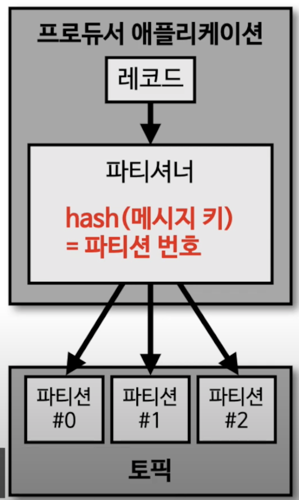
  - 메시지 키가 있을 경우에는 파티셔너의 종류와 관계없이 동일하게 동작
  - 메시지 키의 해쉬값을 구해서 해당 해쉬값과 파티션을 매칭하여 적재
  - 메세지를 전달 할 때, Key를 기준으로 해쉬값을 구하여, 이 해쉬값 기준으로 저장되는 파티션을 설정
  - 동일한 메세지 Key를 통해 해쉬값을 구하면, 항상 동일한 파티션에 순서대로 저장(큐 이기 떄문에)
    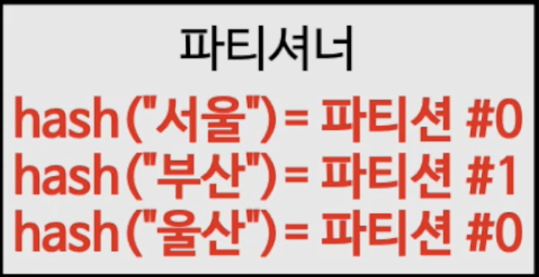
  - 다만 주의할 점은 파티션 개수가 늘어날 때 입니다.
  - 파티션 개수가 늘어나면 메시지 키 해시값과 파티션 매칭이 틀어지게 되어 파티션 증가 전후로 동일한 메시지 키더라도 다른 파티션에 레코드가 들어갈 수 있으므로 주의해야 합니다.
+ 메세지 Key가 없을때: 2가지 방법
  - UniformStickyPartitioner
  - RoundRobinPartitioner
  - 프로듀서에서 배치로 모을 수 있는 레코드를 모아서 파티셔너로 데이터 전달(이 방식이 라운드 로빈 방식으로 적용) -> 데이터가 파티션에 적절하게 분배됨

### UniformStickyPartitioner
유니폼 스티키 파티션은 2.4.0 부터 기본 설정으로 사용되는 파티셔너

* 스티키 파티션은 라운드-로빈 파티셔너와 다르게 프로듀서 내부동작에 특화되어 있습니다.
* 특히 배치전송에 특화되어 있는데요. 프로듀서는 파티션에 데이터를 전송하기 전에 어큐뮤레이터(Accumulator)에 데이터를 버퍼로 쌓아 놓고 발송합니다.
* 스티키 파티셔너를 사용할 경우 어큐뮤레이터의 버퍼를 채워서 보내기 때문에 성능향상에서 유리합니다.

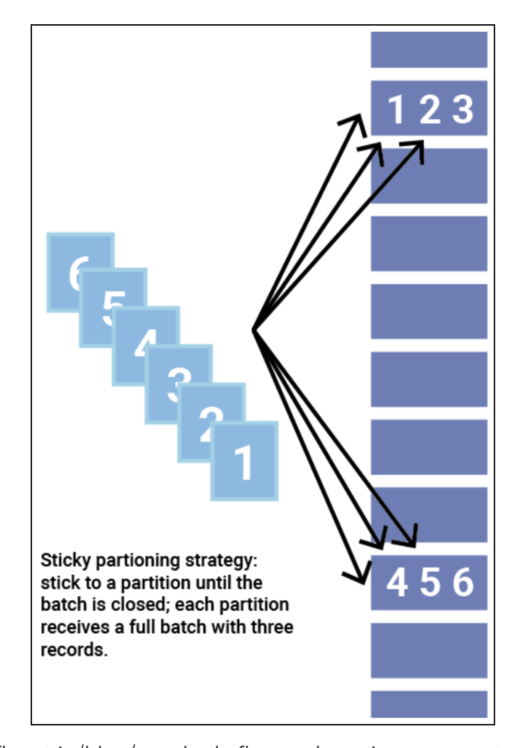

### RoundRobinPartitioner
메시지 키가 없을 경우, 라운드-로빈 방식으로 데이터가 들어오는대로 파티션을 순회하면서 레코드를 넣습니다.
* 파티션 개수가 늘어날때도 마찬가지로 순회하면서 지속적으로 데이터를 분배하면서 넣습니다.

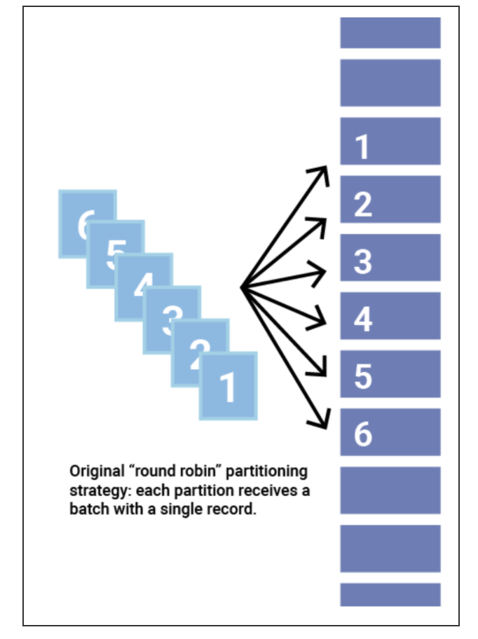


## Kafka Consumer Partitioner
카프카 컨슈먼은 토픽의 파티션과 매칭하여 레코드를 가져온다.

* 파티션을 매칭하는 기준은 컨슈머 파티션 어사이너 기준을 따른다.
  + [Consumer-Partition-Assignor](https://kafka.apache.org/25/javadoc/org/apache/kafka/clients/consumer/ConsumerPartitionAssignor.html)
* 파티션 어사이너 종류(파티셔너 종류) 4가지
  + RangeAssignor
  + RoundRobinAssignor
  + StickyAssignor
  + CooperativeStickyAssignor

###  RangeAssignor
* 기본 설정되는 파티션 어사이너
* 토픽의 파티션을 숫자기준으로 나열하고, 컨슈머의 이름을 사전순으로 나열한 뒤에 배정하는 정확히 반으로 나누어 배정
* 만약 딱 반으로 안나뉘어지는 홀수개의 파티션을 나눌 경우에는 앞쪽 순서의 컨슈머가 파티션을 더 많이 할당

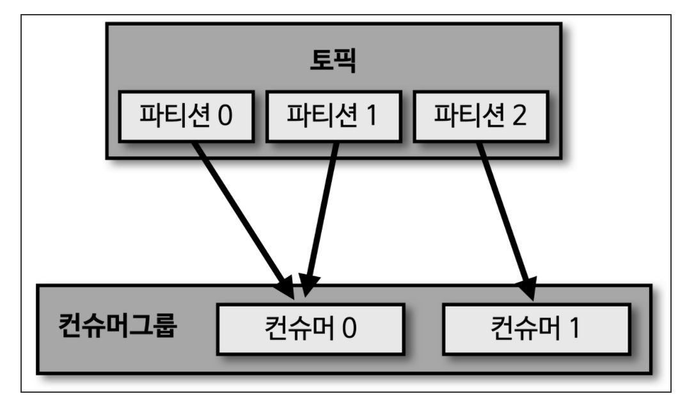
* 예를들어 파티션이 3개인 토픽(p0, p1, p2)과 컨슈머가 2개(c0, c1)가 있다고 가정
* 파티션 3개를 컨슈머에 분배하려면 2개와 1개를 배분
* 앞쪽 순서의 컨슈머는 파티션을 2개 가지게 됩니다.

### RoundRobinAssignor
* 라운드-로빈 어사이너는 파티션을 컨슈머에 번갈아가며 할당하는 방식
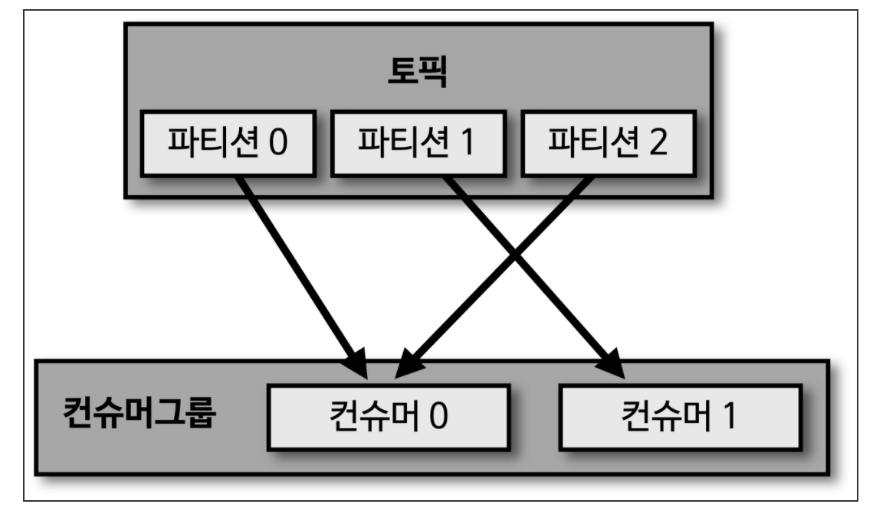
* 파티션이 3개인 토픽(p0, p1, p2)과 컨슈머 2개(c0, c1)가 있다고 가정
* 파티션 3개를 컨슈머에 분배하는데 파티션 순서를 번갈아 가면서 할당하게 되어 아래와 같이 매칭됩니다.

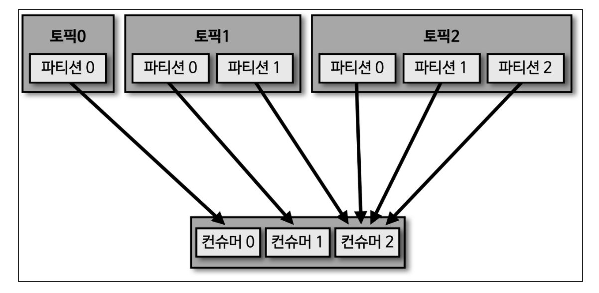
* 라운드-로빈 어사이너를 사용할 경우 특정 상황에서는 일부 컨슈머에 파티션이 몰릴 수도 있습니다.
* 예를들어 파티션이 1개인 토픽, 2개인 토픽, 3개인 토픽이 있고 3개의 컨슈머가 각각 토픽 1번, 토픽 2번, 토픽 3번을 매칭하면 아래와 같이 라운드-로빈 로직으로 인해 일부 컨슈머에 파티션이 몰릴 수 있으므로 주의해야 합니다.

### StickyAssignor
스티키 어사이너는 두가지 목적으로 사용
1. 최대한 파티션을 균등하게 매칭하기 위함
    - 균등하게 매칭이라고 뜻하는것은 아래와 같은 정책을 내포
    - 컨슈머에 매칭된 파티션의 개수가 최대 1개 이상을 넘지 않도록 합니다.
    - each consumer that has 2+ fewer topic partitions than some other consumer cannot get any of those topic partitions transferred to it.
2. 리밸런싱이 일어날 경우 최대한 파티션의 이동을 줄이는데 목적
    - 파티션 매칭 이동을 줄이면, 리밸런싱 발생시 오버헤드를 줄일 수 있다.

* 스티키 어사이너를 사용할 경우 최대한 균등하게 파티션을 컨슈머에 나눕니다.
* 라운드로빈과 비슷하다고 생각할수도 있지만 실제로 동작은 그렇지 않습니다.
* 그리고 리밸런싱 발생시에 동작이 다름을 확인할 수 있습니다.
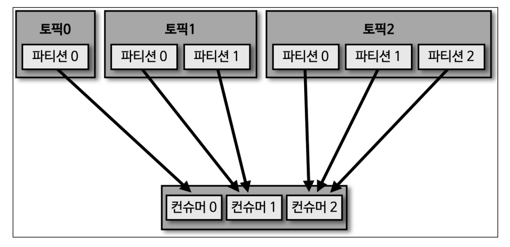

* 예를 들어 3개의 컨슈머가 있고 3개의 토픽(각각 1개, 2개, 3개 파티션 보유)이 있다고 가정
* 라운드 로빈 어사이너로 분배했을 경우에는 이전 예시와 같이 몰리는 현상이 발생할 수 있지만 스티키 파티셔너의 경우 다르게 동작하여 아래와 같이 매칭되는 것을 확인할 수 있습니다.
* 추가적으로 스티키 어사이너를 사용할 경우 이미할당된 파티션의 대부분이 남아있다는 특징을 리밸런스 리스너에서 활용할 수 있습니다.
  + [관련 내용은 링크에서 확인할 수 있습니다](https://kafka.apache.org/25/javadoc/org/apache/kafka/clients/consumer/StickyAssignor.html)

### CooperativeStickyAssignor
* 코퍼레이티브 스티키 어사이너는 스티키 어사이너와 유사하지만 coopertive rebalancing을 지원합니다.
* 이 어사이너를 사용하려면 2.3 이상의 브로커와 클라이언트를 사용해야 합니다.
  + [관련 상세 내용은 링크에서 확인할 수 있습니다](https://kafka.apache.org/25/javadoc/org/apache/kafka/clients/consumer/CooperativeStickyAssignor.html)


## Kafka Consumer Lag

프로듀서가 넣은 데이터들 마지막 순번의 offset과 컨슈머가 순대대로 읽은 offset 의 차이를 **consumer lag** 이다.
* 해당 토픽에 대한 파이프라인에 대한 컨슈머 or 프로듀서의 상태 파악
* Partition이 여러개라면, `Lag`은 여러개가 있을 수 있다.
  + 그 중에 가장 큰 값을 확인하면, 상태 파악에 더 도움이 된다.
* 컨슈머 단위 `Lag` 을 확인하려면, 컨슈머에서 확인하는 것은 바람직하지 않음
  + 컨슈머에서 장애가 발생해 비정상적으로 종료된다면 더이상 컨슈머 `Lag` 을 측정할 수 없는 위험요소 발생
  + 컨슈머가 개발될 때마다 `Lag` 관리 기능을 추가해야하는 번거로움
+ **효과적으로 모니터링 할 수 있도록 `Burrow` 출시**
  + 독립적으로 카프카 lag 모니터링
  + 멀티 카프카 클러스터 지원
  + Sliding window를 통해 컨슈머의 status 체크
  + Http api 를 제공해 다양한 추가 생태계 조성 가능


# Kafka 데이터 쓰기, 복제, 저장
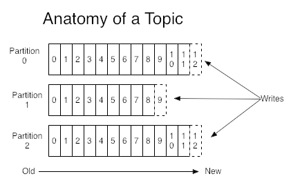
> Producer는 1개이상의 partition에 나뉘어 데이터를 write한다.
> 상기 partition에 적힌 번호는 각 partition의 offset번호임.

* 각 Topic의 partition은 1개의 Leader Replica + 0개 이상의 follower Replica로 구성
* Leader Replica에 데이터를 write, 다른 broker에 follower replica로 복제
* Topic의 데이터(log) 중 replica 데이터는 log segment라는 파일(disk)에 기록
* 메모리가 남아 있으면 페이지 캐시 사용

# Kafka 데이터 읽기
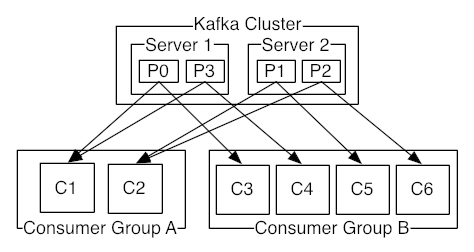

* Consumer는 Partition단위로 데이터를 병렬로 읽을 수 있음
* 복수의 Consumer로 이루어진 Consumer group을 구성하여 1 topic의 데이터를 분산하여 처리 가능
* Topic partition number >= Consumer Group number 일 경우만 가능
  + (Topic partition number < Consumer Group number일 경우 1개 이상의 consumer는 유휴 상태가 됨)


https://blog.voidmainvoid.net/category/%EB%B9%85%EB%8D%B0%EC%9D%B4%ED%84%B0/Kafka

# Kafka Client Application
* Kafka Producer or Consumer Service 개발
* Kafka 데이터를 pub or sub 할 수 있다.
* 처리 실패/재시도 여부

### Add Dependency

```xml
// maven
<dependency>
    <groupId>org.apache.kafka</groupId>
    <artifactId>kafka-clients</artifactId>
    <version>2.8.0</version>
</dependency>
```
```ruby
// gradle
implementation group: 'org.apache.kafka', name: 'kafka-clients', version: '2.8.0'
```
* 의존성 추가할 때 주의해야할 점은 버전을 잘 확인해야 한다.
* 카프카(broker) 서버 버전과 카프카 클라이언트(producer, consumer) 버전의 하위 호환을 확인해야한다.
  + [하위 버전 호환 정리](https://blog.voidmainvoid.net/193)
  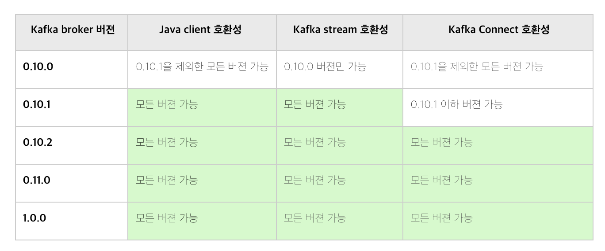


# Kafka 환경

### ZooKeeper 설정
* [ZooKeeper 설치](https://twofootdog.tistory.com/89)
* ZooKeeper 환경설정
  /usr/local/zookeeper/conf/zoo.cfg(설치경로) :
  ```ruby
  tickTime=2000
  initLimit=10
  syncLimit=5
  dataDir=/data
  clientPort=2181
  server.1=zk01:2888:3888
  server.2=zk02:2888:3888
  server.3=zk03:2888:3888
  ```
  - tickTime : 주키퍼가 사용하는 시간에 대한 기본 측정 단위(밀리초)
  - initLimit : 팔로워가 리더와 초기에 연결하는 시간에 대한 타임아웃 tick의 수
  - syncLimit : 팔로워가 리더와 동기화 하는 시간에 대한 타임아웃 tick의 수(주키퍼에 저장된 데이터가 크면 더 크게 잡아야 함)
  - dataDir : 주키퍼의 트랜잭션 로그와 스냅샷이 저장되는 저장경로. 이 글에서는 /data로 생성했었기 때문에 zoo.cfg에서도 /data로 지정함
  - clientPort : 주키퍼 사용 TCP 포트
  - server.x : 주키퍼 앙상블 구성을 위한 서버 설정. server.myid 형식으로 사용. 2888:3888은 기본 포트이며, 앙상블 내 노드끼리 연결 & 리더 선출에 사용

# 참고 리소스
* **[Docker로 kafka 테스트 환경 만들기](https://www.joinc.co.kr/w/man/12/Kafka/docker)**
* [Linux JVM 메모리 부족 해결](https://gre-eny.tistory.com/177)
* [Kafka 주요 운영 및 설정](https://getto215.github.io/kafka-architecture-2/)
* [로컬에서 Docker를 이용하여 kafka 서버 환경 구축](https://jobc.tistory.com/213)
* [카프카 스트림즈 애플리케이션 초기화 명령](https://blog.voidmainvoid.net/416?category=698302)
* [카프카의 토픽 데이터를 REST api로 주고받자 - Kafka rest proxy 사용](https://blog.voidmainvoid.net/345?category=698302)
* [자바 멀티스레드 카프카 컨슈머 애플리케이션 구현 코드](https://blog.voidmainvoid.net/339?category=698302)
* [스파크 스트리밍-Kafka Data source 소개](https://blog.voidmainvoid.net/290?category=698302)
* [카프카를 쿠버네티스 위에 올리는게 좋은 선택일까?](https://blog.voidmainvoid.net/280?category=698302)
* [Kafka stream과 KSQL 소개 및 설명, 차이점](https://blog.voidmainvoid.net/266?category=698302)
* [빅 데이터 처리를 위한 아파치 Kafka 개요 및 설명](https://blog.voidmainvoid.net/179?category=698302)
* [Spring boot에서 kafka 사용시 application.yaml 설정](https://blog.voidmainvoid.net/169?category=698302)
* [Spring boot scheduler를 활용한 kafka producer/consumer 예제](https://blog.voidmainvoid.net/168?category=698302)
* [스파크 스트리밍 + 카프카( Spark streaming + Kafka)](https://tommypagy.tistory.com/155)
* [Strping for apach kafka docs](https://docs.spring.io/spring-kafka/reference/html/#preface)
