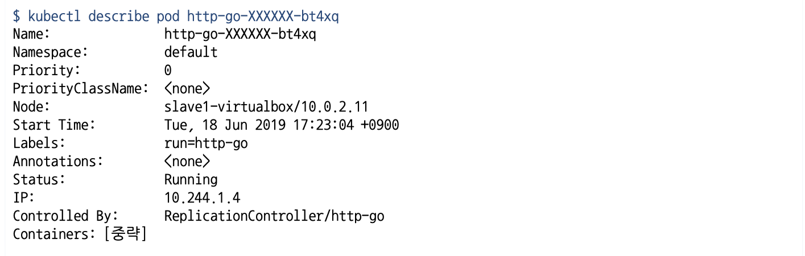

# Kubernetes or k8s
* 어플리케이션 개발자와 시스템 관리자가 수천 개의 어플리케이션과 서비스를 관리하는데 도움
* 수십만 대의 시스템을 가동할 때 사용률이 조금만 향상되도 수백만 달러의 비용 절감 효과


* 인프라의 추상화
  
  + 컨테이너 시스템에서 컨테이너 어플리케이션을 쉽게 배포 및 관리 가능한 소프트웨어
  + 기본 인프라를 추상화하여, 개발 및 배포, 관리를 단순화
  + 모든 노드가 하나의 거대한 컴퓨터인 것처럼 수천개의 컴퓨터 노드에서 소프트웨어 어플리케이션 실행

# k8s 장점
* 어플리케이션 배포 단순화
* 하드웨어 활용도 극대화
  + 클러스터 구조의 서버 환경에서 주변 서버로 자유롭게 이동하여 실행중인 다양한 어플리케이션 구성 요소를 클러스터 노드의 가용 리소스에 최대한 맞춰 효율적으로 운용 가능
  + 노드의 하드웨어 리소스를 최상으로 활용
* 상태 확인 및 자가 치유
  + 컨테이너 장애 시 자동으로 장애 복구
  + 어플리케이션 구성 요소와 실행되는 노드를 모니터링
  + 노드를 모니터하며 장애 발생 시 다른 노드로 일정을 자동 재조정
* 오토스케일링
  + 개별 어플리케이션의 부하를 지속적으로 모니터링 할 필요 없다
  + 자동으로 리소스를 모니터링하고, 각 어플리케이션에서 실행되는 인스턴스 수를 계속적으로 자동 재조정
* 어플리케이션 개발 단순화
  + 어플리케이션 수정 시 빠른 배포
  + 버그 발견 및 수정 용이
  + 새로운 버전 배포 후 장애 발생 시 롤아웃
* 핵심 어플리케이션 개발에 집중
  + 어플리케이션 개발자가 특정 인프라 관련 서비스 때문에 시간낭비를 하지 않아도됨
  + 쿠버네티스에 의존해 서비스를 제공
    - 서비스 검색, 확장, 로드밸런싱, 자가치유, 리더 선충 등
  + 어플리케이션 개발자는 어플리케이션 기능 개발에만 집중
  + 인프라 환경을 파악하거나, 통합하는 시간 낭비X
* 효과적인 리소스 활용
  + 실행을 유지하고 서로 통신할수 있도록 컴포넌트 제공
  + 어플리케이션이 어떤 노드에서 실행되는지 신경 쓸 필요가 없음
  + 언제든지 어플리케이션 재배치 가능
  + 어플리케이션을 혼합하고 매칭시킴으로써 리소스를 매칭

# k8s 아키텍쳐

* 쿠버네티스의 클러스터는 하드웨어 수준에서 많은 노드로 구성되며 두가지 타입의 노드로 구성
  1. 마스터 노드: 전체 쿠버네티스 시스템을 관리하고 통제하는 쿠버네티스 컨트롤 플레인을 관장
  2. 워커 노드: 실제 배포하고자 하는 어플리케이션의 실행을 담당

# k8s 상세 아키텍쳐

* 컨트롤 플레인(마스터 노드)
  + 마스터노드는 워커노드의 클러스터를 관리하는 기능
  + 단일 마스터 노드에서 실행하거나, 여러 노드(마스터 노드의 클러스터화)로 분할되고 복제하여 고가용성을 보장
  + 클러시터의 상태를 유지하고 제어하지만, 어플리케이션을 실행하지 않음
  * 컨트롤 플레인(마스터 노드) 구성요소
    - 쿠버네티스 API서버: 사용자, 컨트롤 플레인과 통신
    - 스케줄려: 컨테이너 어플리케이션 예약(어플리케이션의 배포 가능한 각 구성요소(컨테이너)에 워커 노드 할당)
    - 컨트롤 매니저: 구성 요소 복제, 워커 노드 추적, 노드 장애 처리 등 클러스터 수준 기능 실행
    - 데이터 스토리지: etcd는 클러스터 구성을 지속적으로 저장하는 안정적인 분산
* 워커 노드
  + 워커 노드는 컨테이너화된 어플리케이션을 실행하는 시스템
  + 어플리케이션에 서비스를 실행, 모니터링 등 다양한 기능을 수행
  * 워커 노드 구성요소
    - Kubelet: API 서버(마스터 노드)와 통신하고, 워커노드에서 컨테이너 관리
    - 컨테이너 런타임: 컨테이너를 실행하는 도커
    - 쿠버네티스 서비스 및 프록시: 어플리케이션 간의 네트워크 트래픽을 분산 및 연결

---
# 컨트롤 플레인(마스터 노드)
구성
* 큐브 API 서버
* 큐브 컨트롤러 매니저
* 큐브 스케줄러
* etcd

> 컨트롤 플레인 구성을 하는 api서버, 컨트롤러 매니저, 스케줄러, etcd는 결국 팟으로 구성되어 서비스 된다.

## k8s 시스템 구성 확인
`$ kubectl get pod -n kube-system`

* 마스터 노드 구성이 팟으로 구성
* 커스터마이징 또는 설정 확인 가능
  + 
  + api 서버, 컨트롤러매니저, 스케줄러 모두 설정 확인 및 커스터마이징 가능


## 큐브 API 서버(kube-apiserver)
* 쿠버네티스 시스템 컴포넌트는 오직 API서버와 통신
* 컴포넌티끼리 서로 직접 통신 불가
  + 직접 통신이 불가능하기 떄문에, etcd와 통신하는 유일한 컴포넌트 api 서버
* RESTful API서버를 통해 클러스터 상태를 쿼리,수정할 수 있는 기능 제공
* API 서버의 구체적인 역활
  + 인증 플러그인을 사용한 클라이언트 인증
  + 권한 승인 플러그인을 통한 클라이언트 인증
  + 승인 제어 플러그인을 통해 요청 받은 리소스를 확인/수정
  + 리소스 검증 및 영구 저장

## 큐브 컨트롤러 매니저(kube-Controller-manager)
* API 서버는 궁극적으로 아무 역활을 하지 않음
* 컨트롤러에는 다양한 컨트롤러가 존재
* 이 컨트롤러는 API에 의해 받아진 요청을 처리하는 역활
  + 레플리케이션 매니저(레플리케이션 컨트롤러)
  + 레플리카셋, 데몬셋, 잡 컨트롤러
  + 디플로이먼트 컨트롤러
  + 스테이트풀셋 컨트롤러
  + 노드 컨트롤러
  + 엔드포인트 컨트롤러
  + 네임스페이스 컨트롤러
  + 영구 볼륨 컨트롤러
  + etc

## 큐브 스케줄러(kube-scheduler)
* 일반적으로 실행할 노드를 직접 정해주지 않음
* 요청 받은 리소스를 어느 노드에 실행할지 결정하는 역활
* 현재 노드의 상태를 점검하고 최상의 노드를 찾아 배치
* 다수의 포드를 배치하는 경우에는 라운드로빈(LB)을 사용하여 분산


## ETCD

* Key-Value 데이터 셋으로 구성
  + 다중 Key를 가질수 있어서 일반적인 RDB처럼 사용이 가능
* 쿠버네티스의 전체 설정 정보를 ETCD에 저장
  + 구조
  
* ETCD 접근(CRUD Setting) 설정
  + [etcdctl-github](https://github.com/etcd-io/etcd/releases)
    ```bash
    $ wget https://github.com/etcd-io/etcd/releases/download/v3.3.13/etcd-v3.3.13-linux-arm64.tar.gz # 파일 다운로드
    $ tar -xf etcd-v3.3.13-linux-arm64.tar.gz # 압축 해제
    $ cd ./etcd-v3.3.13-linux-arm64 # 파일 안에 etcdctl 명령이 존재

    # 모든 key 설정 조회
    $ sudo ETCDCTL_API=3 ./etcdctl --endpoints 127.0.0.1:2379 --cacert /etc/kubernetes/pki/etcd/ca.crt --cert /etc/kubernetes/pki/etcd/server.crt --key /etc/kubernetes/pki/etcd/server.key get / --prefix --keys-only
    ```
  + `key` 와 `value` 설정 밑 조회
    ```bash
    $ sudo ETCDCTL_API=3 ./etcdctl --endpoints 127.0.0.1:2379 --cacert /etc/kubernetes/pki/etcd/ca.crt --cert /etc/kubernetes/pki/etcd/server.crt --key /etc/kubernetes/pki/etcd/server.key put key1 value1 # key value 넣기
    OK
    $ sudo ETCDCTL_API=3 ./etcdctl --endpoints 127.0.0.1:2379 --cacert /etc/kubernetes/pki/etcd/ca.crt --cert /etc/kubernetes/pki/etcd/server.crt --key /etc/kubernetes/pki/etcd/server.key get key1 # key를 사용해 value 얻기
    key1
    value1
    ```

---

# Pod


* 쿠버네티스는 `kubectl get container` 같은 컨테이너를 취급안함
* 대신 여러 위치에 배치된 컨테이너 개념인 컨테이너 그룹을 포드(Pod) 개녕으로 사용
* Pod는 하나 또는 다수의 컨테이너를 가진다.(하나의 컨테이너를 권장)
  - 하나 이상의 밀접하게 관련된 컨테이너로 구성된 그룹
  - 컨테이너의 공동 배포된 그룹으로, 쿠버네티스의 기본 빌딩 블록을 대표
  - 컨테이너를 개별적으로 배포하는 것이 아닌, 컨테이너를 포함한 포드를 배포하여 운영
  - 포드는 다수의 노드에 생성되지 않고 단일 노드에서만 실행
  - 여러 프로세스를 실행하기 위해서는 컨테이너 당 단일 프로세스가 적합
  - 다수의 프로세스를 제어하려면 -> 다수의 컨테이너를 다룰 수 있는 그룹이 필요
* Pod는 독립적인 하나의 IP를 부여 받아, 다른 Pod와 통신이 가능
  - 동일한 리눅스 네임스페이스와 동일한 워커노드에서 항상 함께 실행
  - 각 포드는 애플리케이션을 실행하는 자체 IP, 호스트이름, 프로세스 드잉 있는 별도의 논리적 시스템
* 장점:
  +  포드를 통해 밀접하게 연관된 프로세스를 함께 실행하고, 마치 하나의 환경에서 동작하는 것처럼 운영 및 실행
    - 포드의 모든 컨테이너는 동일한 네트워크 및 UTS 네임스페이스 사용 및 실행
    - 같은 호스트 이름 및 네트워크 인터페이스를 공유(포트 충돌 가능성 있음)
    - 포드의 모든 컨테이너는 동일한 IPC 네임스페이스 아래에서 실행되며 IPC를 통해 통신 가능
  + 그러나, 동일한 환경을 제공하면서도, 다소 격리된 상태로 유지 가능

* POD의 네트워크 구조
  
  + Pod 사이에는 NAT 게이트웨이가 존재 하지 않음 -> Pod IP를 통해서 외부에서 접근 불가
  + 외부 서비스를 통해여 접근 가능


---


> Pod는 실제 직접 생성하는 것이 아닌, Deployment로 부터 만들어 진다.

## Pod create descriptor
`kubectl` 실행 명령으로 간단한 리소스 작성 방법도 가능하지만 일부 항목에 대해서만 가능하며 저장이 용의하지 않음
* 모든 쿠버네티스 객체를 YAML로 정의하여, 버전 제어 시스템에 저장 가능
* 모든 API에 대한 내용은 [k8s cheatsheet 참조](http://kubernetes.io/docs/reference/)

* **Pod 정의 YAML 구성 요소**
  + apiVersion: 쿠버네티스 api버전 정보
  + kind: 어떤 리소스 유형인지 결정(포드 레플리카컨트롤러, 서비스등)
  + meta-data: pod와 관련된 이름, 네임스페이스, 레이블, 그 밖의 정보
  + spec: 컨테이너, 볼륨 등의 정보
  + status: 포드의 상태, 각 컨테이너의 설명 및 상태, 포드 내부의 IP 및 그밖의 기존 정보들(k8s가 자동 상태 체크)
* default Pod yaml:
  ```ruby
  # 이 디스크립터는 쿠버네티스 API v1를 사용
  apiVersion: v1
  # 리소스 포드에 대한 설명
  kind: Pod
  metadata:
  # 포드의 이름
    name: http-go
  spec:
    containers:
  # 생성할 컨테이너의 컨테이너 이미지
    - image: gasbugs/http-go
      name: http-go
      ports:
  # 응답 대기할 애플리케이션 포트
      - containerPort: 8080
        protocol: TCP
  ```

## Pod Probe
Pod Probe 는 3가지 종류 `Liveness Probe`, `Readiness Probe`, `Startup Probe` 로 구성

[Configure Liveness, Readiness and Startup Probes](https://kubernetes.io/docs/tasks/configure-pod-container/configure-liveness-readiness-startup-probes/)

* `Liveness Probe`
  + 컨테이너의 상태를 스스로 판단하여 교착 상태에 빠진 컨테이너를 재시작
  + 컨테이너가 살아있는지 판단하고, 만약 죽어있다면 다시 시작하는 기능
  + 버그가 생겨도 높은 가용성을 보임
* `Readiness Probe`
  + Pod가 준비된 상태에 있는지 확인하고, 정상 서비스를 시작하는 기능
  + Pod가 적절하게 준비되지 않은 경우, 로드밸런싱에서 제외하여 장애 유발을 방지
* `Startup Probe`
  + 애플리케이션 시작 시기를 확인하여 가용성을 높이는 기능
  + `Liveness` 와 `Readiness` 기능을 비활성화하여, 서비스 가동 시간을 단축
  + 애플리케이션이 시작되면 `Liveness`, `Readiness` 가동 가능
  + Pod이 시작할 떄까지 검사를 수행
  + `ex)`: 30번을 검사하며, 10초 간격으로 수행 등 설정 가능
    - 300초(30초 * 10번) 후에도 Pod가 정상 동작하지 않을 경우 종료


### Example Probe

`Liveness` 커맨드 설정: 파일 존재 여부 확인
* 리눅스 환경에서 커맨드 실행 성공시 `0` 리턴
* 실패하면 그 외의 값을 출력 -> 컨테이너 재시작
* 웹 설정으로 http request를 보내 상태 확인
  + 정상작동: Pod의 서버 응답 코드가 200 ~ 400 사이

파일 상태로 Pod을 관리하는 `Liveness` 설정
```YAML
apiVersion: v1
kind: Pod
metadata:
  labels:
    test: liveness
  name: liveness-exec
spec:
  containers:
  - name: liveness
    image: k8s.gcr.io/busybox
    args:
    - /bin/sh
    - -c
    - touch /tmp/healthy; sleep 30; rm -rf /tmp/healthy; sleep 600 # touch로 파일생성, 30초 뒤에 파일 삭제
    livenessProbe:
      exec:
        command:
        - cat
        - /tmp/healthy        # cat 으로 파일을 확인 // # 파일이 없으면 Pod 재시작
      initialDelaySeconds: 5  # Pod 생성 후 5초 뒤 실행
      periodSeconds: 5        # 5초 간격으로 Liveness Probe 확인
```

Http 요청으로 상태를 파악하는 `Liveness` 설정
```YAML
apiVersion: v1
kind: Pod
metadata:
  labels:
    test: liveness
  name: liveness-http
spec:
  containers:
  - name: liveness
    image: k8s.gcr.io/liveness
    args:
    - /server
    livenessProbe:
      httpGet:
        path: /healthz
        port: 8080
        httpHeaders:
        - name: Custom-Header
          value: Awesome
      initialDelaySeconds: 3
      periodSeconds: 3
```

위의 이미지는 go server 코드로,
```go
http.HandleFunc("/healthz", func(w http.ResponseWriter, r *http.Request) {
    duration := time.Now().Sub(started)
    if duration.Seconds() > 10 {
        w.WriteHeader(500)
        w.Write([]byte(fmt.Sprintf("error: %v", duration.Seconds())))
    } else {
        w.WriteHeader(200)
        w.Write([]byte("ok"))
    }
})
```
* 이미지 서버가 실행되면,
  + 10초 전에는 응답 200을 리턴
  + 10초 후에는 응답 500을 리턴
* 500을 리턴하면, http 장애로 Liveness에 의해 Pod가 재실행 된다.


Define a TCP liveness probe
```yaml
apiVersion: v1
kind: Pod
metadata:
  name: goproxy
  labels:
    app: goproxy
spec:
  containers:
  - name: goproxy
    image: k8s.gcr.io/goproxy:0.1
    ports:
    - containerPort: 8080
    readinessProbe:
      tcpSocket:
        port: 8080
      initialDelaySeconds: 5
      periodSeconds: 10
    livenessProbe:
      tcpSocket:
        port: 8080
      initialDelaySeconds: 15
      periodSeconds: 20
```
* `$ kubectl apply -f https://k8s.io/examples/pods/probe/tcp-liveness-readiness.yaml`
* `$ kubectl describe pod goproxy`

---

# Lable
* 모든 리소스를 구성하는 매우 간단하면서도 강력한 k8s 기능
* 리소스에 첨부하는 임의의 키/값 쌍(`ex)` `app`: `kubernetes-app`)
* 레이블 셀렉터를 사용하면 각종 리소스를 필터링하여 선택 가능
* 리소스는 한개 이상의 레이블을 가질 수 있음
* 리소스를 만드는 시점에 레이블을 첨부
* 기존 리소스에도 레이블의 값을 수정 및 추가 기능
* 모든 사람이 쉽게 이해할 수 있는 체계적인 시스템을 구축 가능
  + app: 애플리케이션 구성요소, 마이크로서비스 유형 지정
  + rel: 애플리케이션 버전 지정(releases 약자)
* Lable 배치 전략(확장 가능한 쿠버네티스 레이블 예제)
  
  + [레이블 배치 전략 9가지](https://www.replex.io/blog/9-best-practices-and-examples-for-working-with-kubernetes-labels?fbclid=IwAR0S2tT3iw8FIkVYWwyjL8OW6IWi_gXfk0fDkAk57o6re1rRnoSRRzFVXiM)
---
* `Lable` 확인 명령어
  + 전체 조회
    ```bash
    $ kubectl get pod --show-labels
    ```
      
  + 특정 레이블 조회
    ```bash
    $ kubectl get pod -L app,rel
    ```
      
  + 레이블로 필터링하여 조회
    ```bash
    $ kubectl get pod --show-labels -l {filter-config}
    ```
      
* `Lable` 추가 및 수정, 삭제
  + 추가하는 방법
    ```bashrc
    $ kubectl label pod {pod-name} key=value
    ```
  + 기존의 레이블을 수정할 때 `--overwrite` option 추가
    ```bash
    $ kubectl label pod {pod-name} key=value --overwrite
    ```
  + 레이블 삭제
    ```bash
    $ kubectl labe pod {pod-name} key- # delete 하려는 key - 입력하면 레이블 삭제
    ```

레이블을 이용한 포드 구성 설정 예제


## Deployment
* 실제 Pod를 생성하는 것이 아닌, Deployment를 생성하면 설정에 의해 Pod가 생성된다.
* `kubectl create deploy` 명령어로 Deployment 생성
* 해당 Deployment가 관리하는 포드의 포트를 노출해야하는 명령이 필요
* `Deployment`는 `Replicas Set`을 생성
  - `Replicas Set`은 수를 지정하면 그 수만큼 `Pod` 를 유지
  - 어떤 이유로든 Pod가 사리자면, `Replicas Set`은 누락된 Pod를 대체할 새로운 Pod를 생성


> Deployment 를 생성하여, Replicas Set 설정으로 Pod가 생성되고, 이를 외부 서비스로 사용하려면 서비스 설정이 필요

## Service


* Pod는 일시적이므로 언제든지 사라질 가능성이 존재
* Pod가 다시 시작되는 경우, 언제든 IP와 ID가 변경됨
* 서비스는 변화하는 포드 IP 주소의 문제를 해결하고, 단일 IP 및 포트 쌍에서 여러 개의 포드 노출
* `kubectl expose deployment` 명령어로 Service 생성
* 서비스가 생성되면 정적 IP를 얻게 되고, 서비스의 수명 내에서는 변하지 않음
* 클라이언트는 포드에 직접 연결하는 대신 서비스의 IP를 통해 포드 안에 컨테이너 서비스를 이용
* 서비스는 포드 중 하나로 연결을 포트포워딩 역활
* 로드 밸런서 역활을 하여, 만약 3개의 Pod이 있다면, 외부의 유입으로 부터 적절하게 분배

```bash
kubectl expose deployment http-go --name http-go-svc --port=8080 --type=LoadBalancer
```

---


# Kubernetes Command
Kubernetes Command 정리 및 모음

# Create

* deployment 생성
  ```bash
  kubectl create deploy {set:deployment-name} --image={docker-hum-image-name}
  ```
* service 생성
  ```bash
  kubectl expose deploy {get:old-deployment-name} --name {set:service-name} --port {set:port-number}
  ```


# Select
조회 관련 Command
```bash
kubectl get
```

* -w : 옵션을 주면 지속적으로 상태 변화를 감지 가능

---
* pod 조회
  ```bash
  kubectl get pod
  ```
  + 특정 네임스페이스 팟 조회
    ```bash
    kubectl get pod -n {namespace}

    ex) kubectl get pod -n kube-system # 시스템 컴포넌트 네임스페이스 팟 조회
    ```
    

    > k8s 노드가 3개라서 프록시 팟이 3개

* deployment 조회
  ```bash
  kubectl get deploy
  ```
* service 조회
  ```bash
  kubectl get svc
  ```

기본적인 조회 외에도 상세하게 조회도 가능
* pod의 위치 확인
  ```bash
  kubectl get pod -o wide
  ```


* **pod의 상세한 내용 살펴보기: 예정된 노드, 시작시간, 실행 중인 이미지 등 유용한 정보 포함**
  ```bash
  kubectl describe pod {pod-name}
  ```
  


---
# Pod 관련 command
Pod 생성, 삭제 및 관련 모든 커맨드 정리

* Pod 디스크립터 작성 요령 확인:
  ```bash
  $ kubectl explain pods
  ```
  

* Pod 디스크립터 생성:
  ```bash
  $ kubectl create -f {yaml-file-name}
  ```

* Pod 로그 확인:
  ```bash
  $ kubectl logs {pod-name}
  ```

* Pod 상태 확인:
  ```bash
  $ kubectl get pod

  $ kubectl get pod -w # watch 속성으로 상태 변화를 계속 확인

  $ kubectl get pod -o wide
  $ kubectl get pod -o yaml
  $ kubectl get pod -o json
  ```

* **컨테이너에서 호스트로 포트 포워딩**
  + 디버깅 혹은 다른 이유로 서비스를 거치지 않고 특정 포드와 통신하고 싶을 떄 사용
  ```bash
  $ kubectl port-forward {pod-name} {forward-port-number}:{target-port-number}

   # Example
  $ kubectl port-forward jenkins 8888:8080 # jenkins Pod을 8888:8080 포트포워드 설정
  ```
    - 마지막에 `&`을 넣으면 `background` 에서 실행

* Pod 주석 추가(yaml 속성 추가)
  + 각 포드나 API rorcp tjfauddl cnrk
  + 클러스터를 사용하는 모든 사람이 각 객체의 정보를 빠르게 확인 가능
  + 총 `256KB` 까지 포함 가능
  ```bash
  $ kubectl annotate pod {pod-name} key="value"
  ```
  + 설정한 주석 조회는 `$ kubectl get pod {pod-name} -o yaml` 로 속성 확인

* Pod 삭제
  ```bash
  $ kubectl delete pod {pod-name}
  ```

---

# Label

* `Lable` 추가 및 수정, 삭제
  + 추가하는 방법
    ```bashrc
    $ kubectl label pod {pod-name} key=value
    ```
  + 기존의 레이블을 수정할 때 `--overwrite` option 추가
    ```bash
    $ kubectl label pod {pod-name} key=value --overwrite
    ```
  + 레이블 삭제
    ```bash
    $ kubectl labe pod {pod-name} key- # delete 하려는 key - 입력하면 레이블 삭제
    ```


## 수평 스케일링
쿠버네티스를 사용해 얻을 수 있는 큰 이점 중 하나는 간단하게 컨테이너 확장이 가능
* Pod 개수를 쉽게 확장 가능

```bash
kubectl scale deploy {deploymsnt-name} --replicas={reflicas-set-number}
```

## 모든 서비스 삭제
k8s 모든 서비스 삭제
```bash
kubectl delete all --all
```

---

# GKE 활용한 k8s 사용
Google cloud의 관려형 k8s 서비스인 GKE(Google Kubernetes Engine)
* GKE는 k8s 를 쉽게 사용자가 활용할 수 있도록 관리형으로 제공
* 규모에 맞춘 컨테이너식 어플리케이션 관리
* 다양한 어플리케이션 배포
* 고가용성을 통한 원활한 운영
* 수요에 맞게 간편하게 확장
* Google 네트워크에서의 안전한 실행
* 온프레미스 및 클라우드 간의 자유로운 이동

---

# AWS EKS
Amazon Elastic Container Service for Kubernetes(Amazon EKS)
* AWS에서 쿠버네티스를 손쉽게 실행하도록 하는 관리형 서비스
* 여러 가용 영역에서 쿠버네티스 제어 플레인 인스턴스를 실행하여 고가용성을 보장
* 비정상 제어 플레인 인스턴스를 자동으로 감지하고 교체
* 자동화된 버전 업그레이드 제공
* 여러 AWS 서비스와 통합되여 다음을 포함한 어플리케이션에 대한 확장성과 보안을 제공
  - 컨테이너 이미지용 Amazon ECR
  - 로드 배포용 Elastic Load Balancing
  - 인증용 IAM
  - 격리용 Amazon VPC


## EKS 이용 방법 2가지
1. eksctl 로 시작
    + Amazon EKS를 시작하기 가장 빠르고 쉬운 방법
    + 클러스터를 생성 및 관리하기 위한 간단한 명령중 유틸리티 eksclt 제공
    + 필요한 모든 리소스 설치
    + kubectl 명령 줄 유틸리티
2. AWS Management
    + AWS Management 콘솔 사용
    + Amazon EKS를 시작할 떄 필요한 모든 리소스를 생성 가능
    + Amazon EKS Ehsms AWS CloudFormation 콘솔을 사용하여 각 리소스를 수동으로 생성
    + 각 리소스의 생성 방법 및 리소스 간의 상호 작용을 완벽하게 파악 가능
    + Amazon EKS를 시작하는 방법으로는 더 복잡하고 시간도 많이 걸림

---
# 쿠버네티스 관리자 인증 시험(CKA)
Certified Kubernetes Administrator (CKA)
* 리눅스 재단과 협력하여 쿠버네티스 생태계 개발을 돕기 위해 CNC(Cloud Native Computing)
* CNC 재단은 쿠버네티스 관리자 커뮤니티를 성장시키기 위해 노력
* 쿠버네티스를 사용하는 광범위한 회사 및 조직에서 지속적으로 성장
* $300 비용으로 온라인 시험(쿠폰 검색하면 쿠폰 나옴)
* WebCam을 통해 수험자를 모니터링하고 크롬으로 시험 진행
* 재시험 1회 무료 응시

## CKA 출제 범위
* Application Lifecycle Management - 8%
* Installation, Configuration, Validation - 12%
* Core Concepts - 19%
* Networking - 11%
* Scheduling - 5%
* Security - 12%
* Cluster Maintenance - 11%
* Logging / Monitoring - 5%
* Storage - 7%
* Trubleshooting - 10%

# CKA Tips

* [시험에 자주 나오는 유형들](https://www.notion.so/kCKA-Kubectl-070fc3ece01848f2b8d32ae3fe310819)
* [kubernetes cheat sheet](https://kubernetes.io/docs/reference/kubectl/cheatsheet/)
* [CKA udemy 필수 강의](https://www.udemy.com/course/certified-kubernetes-administrator-with-practice-tests/)

---

# 강의
* [k8s 기초 강의](https://www.youtube.com/watch?v=X48VuDVv0do)
* [k8s 인프라 CI/CD 처리](https://saramin.github.io/2020-05-01-k8s-cicd/)


---
