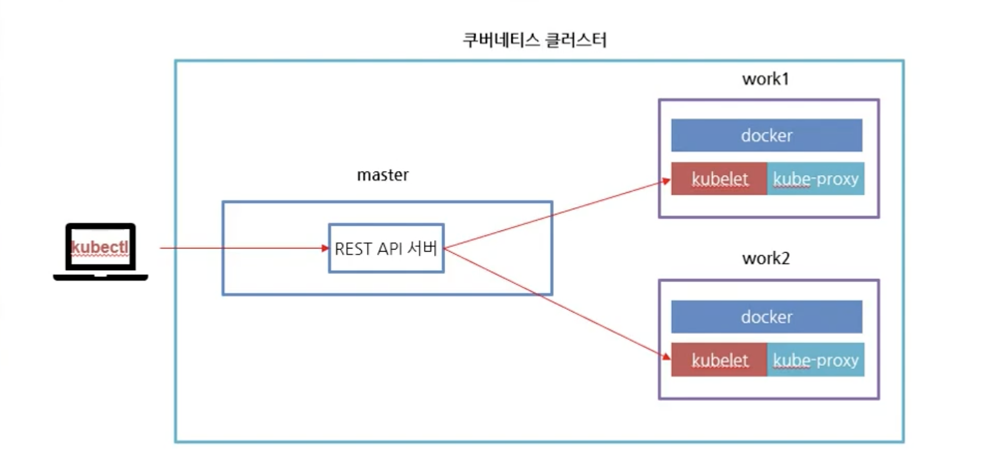
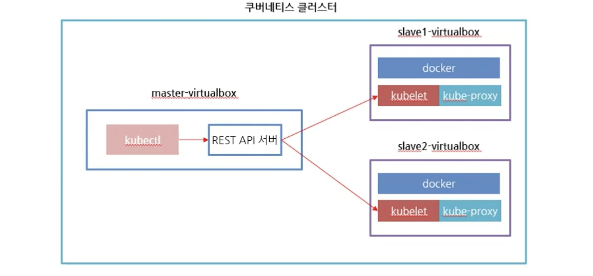
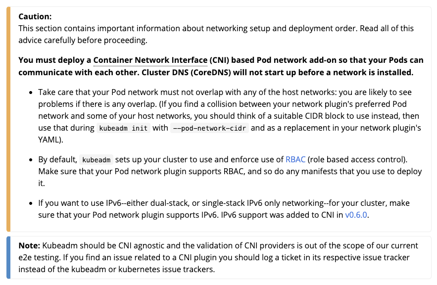
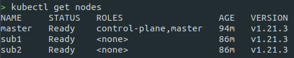

# Kubernetes ubuntu install

* k8s 구성 사항
  + Master node: k8s 마스터 노드 설정될 호스트(마스터 노드 혼자 워커도느 역활도 가능하긴함 -> 권장 X)
  + Work node(2): 필수 사항은 아니지만, work노드를 클러스터

VM 설정
---
* hostname 변경: /etc/hostname
* 네트워크 인터페이스 변경
* NAT 네트워크 설정
* (hostname -> rename -> reboot)
---

* k8s 관리하는 명령어
  + kubeadm: 클러스터를 부트스트랩하는 명령
    - k8s 마스터 노드 구성 및 설정
  + kubelet: 클러스터의 모든 시스템에서 실행되는 구성 요소로, 창 및 컨테이너 시작과 같은 작업을 수행
    - 데몬이 항상 동작하고 있기 떄문에, 서비스 형태로 구성
  + kubectl: 커맨드 라인 util은 당신의 클러스터와 대화
    - 클라이언트 프로그램


---

# k8s ubuntu install detail

[Kubernetes Install Docs](https://kubernetes.io/ko/docs/setup/production-environment/tools/kubeadm/install-kubeadm/)

> Before Install

* 호환되는 리눅스 머신. 쿠버네티스 프로젝트는 데비안 기반 배포판, 레드햇 기반 배포판, 그리고 패키지 매니저를 사용하지 않는 경우에 대한 일반적인 가이드를 제공한다.
* 2 GB 이상의 램을 장착한 머신. (이 보다 작으면 사용자의 앱을 위한 공간이 거의 남지 않음)
* 2 이상의 CPU.
* 클러스터의 모든 머신에 걸친 전체 네트워크 연결. (공용 또는 사설 네트워크면 괜찮음)
* 모든 노드에 대해 고유한 호스트 이름, MAC 주소 및 product_uuid. 자세한 내용은 여기를 참고한다.
* 컴퓨터의 특정 포트들 개방. 자세한 내용은 여기를 참고한다.
* 스왑의 비활성화. kubelet이 제대로 작동하게 하려면 반드시 스왑을 사용하지 않도록 설정한다.
* Installed Docker

## Network Setting
* MAC 주소 및 product_uuid가 모든 노드에 대해 고유한지 확인
  + 사용자는 ip link 또는 ifconfig -a 명령을 사용하여 네트워크 인터페이스의 MAC 주소를 확인할 수 있다.
  + 44product_uuid는 sudo cat /sys/class/dmi/id/product_uuid 명령을 사용하여 확인할 수 있다.

* 필수 Port
  


# kubeadm, kubelet 및 kubectl 설치
모든 머신에 다음 패키지들을 설치

* kubeadm: 클러스터를 부트스트랩하는 명령이다.
* kubelet: 클러스터의 모든 머신에서 실행되는 파드와 컨테이너 시작과 같은 작업을 수행하는 컴포넌트이다.
* kubectl: 클러스터와 통신하기 위한 커맨드 라인 유틸리티이다.

> 버전 관련 주의
kubeadm은 kubelet 또는 kubectl 을 설치하거나 관리하지 않으므로, kubeadm이 설치하려는 쿠버네티스 컨트롤 플레인의 버전과 일치하는지 확인해야 한다. 그렇지 않으면, 예상치 못한 버그 동작으로 이어질 수 있는 버전 차이(skew)가 발생할 위험이 있다. 그러나, kubelet과 컨트롤 플레인 사이에 하나의 마이너 버전 차이가 지원되지만, kubelet 버전은 API 서버 버전 보다 높을 수 없다. 예를 들어, 1.7.0 버전의 kubelet은 1.8.0 API 서버와 완전히 호환되어야 하지만, 그 반대의 경우는 아니다.

> 경고: 이 지침은 모든 시스템 업그레이드에서 모든 쿠버네티스 패키지를 제외한다. 이는 kubeadm 및 쿠버네티스를 업그레이드 하는 데 특별한 주의가 필요하기 때문이다.
---

## Install Command
1. apt 패키지 색인을 업데이트하고, 쿠버네티스 apt 리포지터리를 사용하는 데 필요한 패키지를 설치한다.
```bash
$sudo apt-get update
$sudo apt-get install -y apt-transport-https ca-certificates curl
```

2. 구글 클라우드의 공개 사이닝 키를 다운로드 한다.

```bash
$sudo curl -fsSLo /usr/share/keyrings/kubernetes-archive-keyring.gpg https://packages.cloud.google.com/apt/doc/apt-key.gpg
```

3. 쿠버네티스 apt 리포지터리를 추가한다.
```bash
echo "deb [signed-by=/usr/share/keyrings/kubernetes-archive-keyring.gpg] https://apt.kubernetes.io/ kubernetes-xenial main" | sudo tee /etc/apt/sources.list.d/kubernetes.list
```

4. apt 패키지 색인을 업데이트하고, kubelet, kubeadm, kubectl을 설치하고 해당 버전을 고정한다.

```bash
$sudo apt-get update
$sudo apt-get install -y kubelet kubeadm kubectl
$sudo apt-mark hold kubelet kubeadm kubectl
```

# Install after
설치를 마치고 나면, K8s 클러스터 구성대로 `Master node` 와 `Work node` 로 구분하여 구성:

## Master 노드 초기화
```bash
sudo kubeadm init
```
* 스왑 에러 발생 시 스왑 기능 제거
  ```bash
  $sudo swapoff -a   # 현재 커널에서 스왑 기능 끄기
  $sudo sed -i '/ swap / s/^\(.*\)$/#\1/g' /etc/fstab # 리붓 후에도 스왑 기능 유지
  reboot
  ```
  + k8s 에서 스왑 기능을 비활성하는 이유
      - k8s 1.8 버전 이후, 노드에서 스왑을 비활성해야함
      - k8s의 아이디어는 인스턴스를 최대한 100%에 가깝게 성능을 발휘하는 것
      - 모든 배포는 CPU/메모리 제한을 고정하는 것이 필요
      - 다라서 스케줄러가 포드를 머신에 보내면 스왑을 사용하지 않는 것이 필요하기 떄문에
      - 스왑 발생 시 속도가 느려지는 이유 발생
      - 성능을 위해 스왑 기능을 비활성화
* 클러스터 사용 설정
  + 사용자 계정으로 실행
  + Pod Network 추가
* 슬레이브 노드 추가
* 연결된 노드들의 연결 상태 확인




1. `Master Node` Setting:

    * Master 생성 및 초기화 command
      ```bash
      sudo kubeadm init
      ```
    * 초기화 결과 return
      ```bash
      Your Kubernetes control-plane has initialized successfully!

      To start using your cluster, you need to run the following as a regular user:

        mkdir -p $HOME/.kube
        sudo cp -i /etc/kubernetes/admin.conf $HOME/.kube/config
        sudo chown $(id -u):$(id -g) $HOME/.kube/config

      You should now deploy a Pod network to the cluster.
      Run "kubectl apply -f [podnetwork].yaml" with one of the options listed at:
        /docs/concepts/cluster-administration/addons/

      You can now join any number of machines by running the following on each node
      as root:

        kubeadm join <control-plane-host>:<control-plane-port> --token <token> --discovery-token-ca-cert-hash sha256:<hash>
      ```
2. `Client or User Setting` :[스터디 및 테스트 환경에서는 마스터 노드에 생성함]
    * 마스터 노드 초기화 결과물에서 나온 폴더 및 설정파일 생성
      ```bash
      mkdir -p $HOME/.kube
      sudo cp -i /etc/kubernetes/admin.conf $HOME/.kube/config
      sudo chown $(id -u):$(id -g) $HOME/.kube/config
      ```
3. `Work Node` Setting:
    * 마스터 노드 초기화 결과물에서 나온 `join` 명령어 입력
      ```bash
      kubeadm join <control-plane-host>:<control-plane-port> --token <token> --discovery-token-ca-cert-hash sha256:<hash>
      ```
4. `Master node` input command
    ```bash
    export KUBECONFIG=/etc/kubernetes/admin.conf
    ```

> 위와 같이 진행하면, Master node 및 work node 설정왼료

# Create a cluster with Kubeadm
마지막으로 설정한 마스터 노드와 워크 노드의 클러스터링을 위해 마스터 노드에 Network add-on 을 설정해야 한다.

[Create a cluster with Kubeadm](https://kubernetes.io/docs/setup/production-environment/tools/kubeadm/create-cluster-kubeadm/)

The kubeadm tool is good if you need:

* A simple way for you to try out Kubernetes, possibly for the first time.
* A way for existing users to automate setting up a cluster and test their application.
* A building block in other ecosystem and/or installer tools with a larger scope.

## Installing a Pod network add-on

* [쿠버네티스 네트워크 모델 종류 참고](https://kubernetes.io/docs/concepts/cluster-administration/networking/#how-to-implement-the-kubernetes-networking-model)

> 다양한 종류 중 `Weave` 를 설치

## Integrating Kubernetes via the Addon With Weave

[k8s network add-on Weave](https://www.weave.works/docs/net/latest/kubernetes/kube-addon/)

1. 마스터 노드에 add-on 을 적용
  ```bash
  $ kubectl apply -f "https://cloud.weave.works/k8s/net?k8s-version=$(kubectl version | base64 | tr -d '\n')"
  ```
2. 적용 후 설정이 완료되면 command `kubectl get nodes` 노드 확인
  ```bash
  $ kubectl get nodes
  ```
  
3. k8s 노드들의 status 가 `Not-Ready` -> `Ready` 라면 설정 완료

---

# Kubernetes Setting
k8s settings
* kubectl autocomplete command
* etcdctl command setting

## Kubectl autocomplete command

BASH
```bash
source <(kubectl completion bash) # setup autocomplete in bash into the current shell, bash-completion package should be installed first.
echo "source <(kubectl completion bash)" >> ~/.bashrc # add autocomplete permanently to your bash shell.
```

You can also use a shorthand alias for kubectl that also works with completion:
```bash
alias k=kubectl
complete -F __start_kubectl k
```

ZSH
```bash
source <(kubectl completion zsh)  # setup autocomplete in zsh into the current shell
echo "[[ $commands[kubectl] ]] && source <(kubectl completion zsh)" >> ~/.zshrc # add autocomplete permanently to your zsh shell
```

## etcdctl command setting
ETCD 접근(CRUD Setting) 설정
+ [etcdctl-github](https://github.com/etcd-io/etcd/releases)
  ```bash
  $ wget https://github.com/etcd-io/etcd/releases/download/v3.3.13/etcd-v3.3.13-linux-arm64.tar.gz # 파일 다운로드
  $ tar -xf etcd-v3.3.13-linux-arm64.tar.gz # 압축 해제
  $ cd ./etcd-v3.3.13-linux-arm64 # 파일 안에 etcdctl 명령이 존재

  # 모든 key 설정 조회
  $ sudo ETCDCTL_API=3 ./etcdctl --endpoints 127.0.0.1:2379 --cacert /etc/kubernetes/pki/etcd/ca.crt --cert /etc/kubernetes/pki/etcd/server.crt --key /etc/kubernetes/pki/etcd/server.key get / --prefix --keys-only
  ```
+ `key` 와 `value` 설정 밑 조회
  ```bash
  $ sudo ETCDCTL_API=3 ./etcdctl --endpoints 127.0.0.1:2379 --cacert /etc/kubernetes/pki/etcd/ca.crt --cert /etc/kubernetes/pki/etcd/server.crt --key /etc/kubernetes/pki/etcd/server.key put key1 value1 # key value 넣기
  OK
  $ sudo ETCDCTL_API=3 ./etcdctl --endpoints 127.0.0.1:2379 --cacert /etc/kubernetes/pki/etcd/ca.crt --cert /etc/kubernetes/pki/etcd/server.crt --key /etc/kubernetes/pki/etcd/server.key get key1 # key를 사용해 value 얻기
  key1
  value1
  ```
