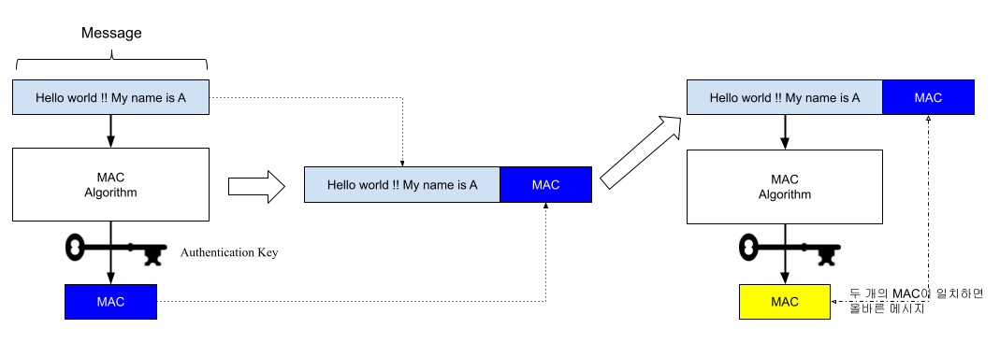
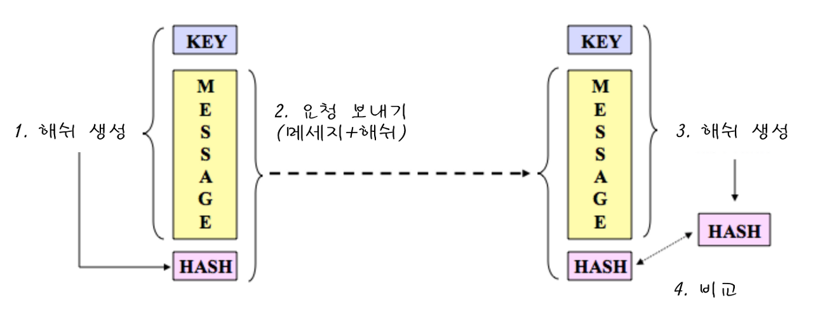

# HMAC

HMAC이란, REST API가 요청을 받았을 때, 받은 요청이 신뢰할 수 있는 호출인지 확인하는 방법중 하나이다.
사용자의 ID와 암호 같이 민감한 정보를 직접 받을 필요 없이 사전에 공유한 `secret key`와 `message`를 기반으로 MAC를 검증해서 `secret key`를 소유한 클라이언트가 보낸 메시지가 맞는지 인증할 수 있다.

## MAC?
MAC은 Message Authentication Code의 약자로, 메세지를 인증하기 위해 사용하는 정보

예를 들어, 유저 A가 인터넷으로 연결된 유저 B에게 메시지를 보냈다고 가정합니다. 이 메시지에서 A가 보냈다는 것은 매우 중요한 정보를 담고 있으며, 따라서 위조 혹은 변조되면 안 됩니다. 메시지가 인터넷을 가로지르면 메시지 변조와 위조의 위험에 노출됩니다.

* 이러한 문제를 해결하기 위해서 메세지의 무결성과 메세지 인증이 담보되어야 한다
  + 메세지 무결성: 메세지가 변조되지 않았다는 성질
  + 메세지 인증: 올바른 송신자로부터 온 메세지라는 성질

### MAC 동작 원리

1. 송신 메세지 준비
2. 송신 메세지를 MAC 함수를 이용해 MAC 정보 생성
3. 메세지와 MAC 정보를 더해 메세지 수신
4. 수신측 역시 MAC 함수를 이용해 수신한 메세지로 MAC 정보 생성
5. **2개의 MAC 정보를 비교해 일치하면, 안전한 메세지로 인증**

## HMAC
HMAC: Hash + MAC(Message Authentication Code)

### HAMC의 동작원리

1. 해쉬 생성: 클라이언트는 `key` + `message` 를 HMAC 알고리즘으로 처리하여 해쉬 값을 생성
2. 요청 보내기: 생성된 `hash` 와 `message` 를 HTTP 요청으로 REST API 서버에 전송(보통 해쉬는 HTTP 헤더 또는 url에 포함)
3. 해쉬 생성: 서버는 클라이언트에게 받은 요청 내의 `message` 를 서버가 가지고 있는 `key`로 HMAC `hash` 생성
4. 해쉬 비교: 클라이언트에서 수신한 `hash`와 서버에서 생성한 `hash`를 비교-> **동일하면 인증 성공**

# 전자서명과 비교

HMAC 대신 전자 서명을 사용하면 더 안전하고 견고해지지만, 클라이언트에게 인증서를 발급하고 등록 및 분실/만료시 재발급/갱신해야 하는 부딤이 있습니다.
특히 전자 서명은 HMAC 방식에 비해서 많은 연산을 필요로 하므로, 서버 부하가 많이 생기고 속도가 느린 단점이 있어 REST API 등에는 HMAC를 사용하는 것이 효율적이고, 전자계약 등 사용자의 부인 방지가 필요한 업무에만 전자 서명을 사용하는 것이 좋습니다.
