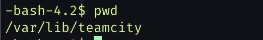
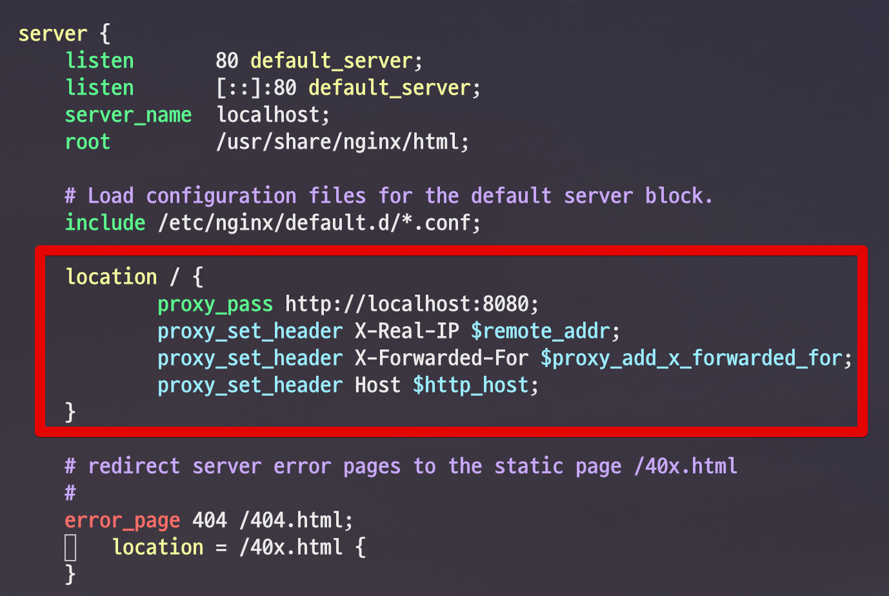
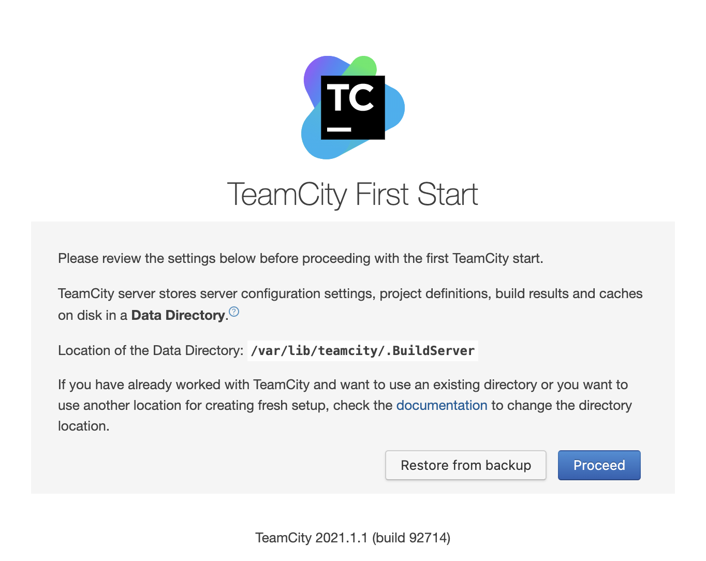
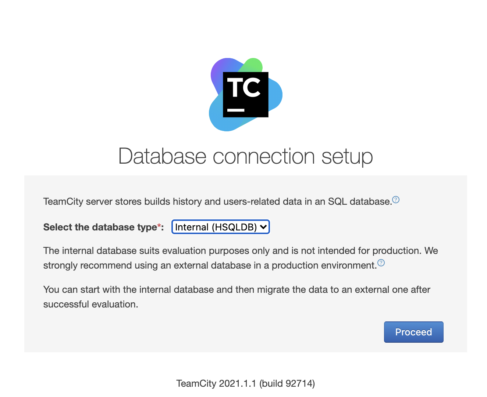

# TeamCity
* JetBrain 에서 개발한 CI/CD tool
* Java 기반으로 개발되어 거의 모든 os를 지원
* 무료로 풍부한 기능 사용가능

# Linux Setting


1. 환경확인
팀시티는 자바 기반 소프트웨어로 자바 8버전 이상 설치되 있어야 한다.
```cmd
java -version
---
openjdk version "1.8.0_282"
OpenJDK Runtime Environment (build 1.8.0_282-b08)
OpenJDK 64-Bit Server VM (build 25.282-b08, mixed mode)
```

2. teamcity download
> 가장 최신 버전 2021.1.1

```cmd
sudo wget https://download.jetbrains.com/teamcity/TeamCity-2021.1.1.tar.gz
```

* 압축 해제 및 경로 설정
    + teamcity를 nginx나 jenkins처럼 관리하기 위해 /var/lib 디렉토리에 신규로 생성


```cmd
sudo tar -xzvf TeamCity-2021.1.1.tar.gz

sudo mkdir /var/lib/teamcity
sudo cp -r /var/lib/TeamCity/* /var/lib/teamcity/

sudo mkdir /var/lib/teamcity/.BuildServer
```
* .BuildServer
    + TeamCity의 Data 들을 담아놓은 별도의 디렉토리입니다.
    + 여러 설정들이 담긴 디렉토리로 보시면 됩니다.


3. 사용자 추가

teamcity 라는 사용자를 추가해서, 모든 실행 권한 위임
```cmd
sudo useradd teamcity
sudo chown -R teamcity:teamcity /var/lib/teamcity/
```
* sudo chown -R teamcity:teamcity /var/lib/teamcity/
    + /var/lib/teamcity/ 를 포함하여 하위 디렉토리, 파일들의 소유 권한을 모두 teamcity 로 변경합니다.
    + -R 옵션으로 하위에 있는 모든 디렉토리, 파일을 대상으로 합니다.

```cmd
sudo usermod -d /var/lib/teamcity teamcity

```

* teamcity 사용자는 항상 teamcity 관련된 내용만 담당할거라 Home 위치를 TeamCity가 설치된 /var/lib/teamcity로 변경


```cmd
sudo su - teamcity
```

* 계정 변경 후 경로 확인


4. Service 추가


```cmd
sudo vim /etc/init.d/teamcity
```

```vim
#!/bin/bash
### BEGIN INIT INFO
# Provides:          teamcity
# Required-Start:    $local_fs
# Required-Stop:     $local_fs
# Default-Start:     2 3 4 5
# Default-Stop:      0 1 6
# Short-Description: TeamCity
# Description:       TeamCity
### END INIT INFO

TEAMCITY_USER=teamcity
TEAMCITY_DIR=/var/lib/teamcity
TEAMCITY_PATH=$TEAMCITY_DIR/bin/runAll.sh
TEAMCITY_DATA_DIR=$TEAMCITY_DIR/.BuildServer

case $1 in

  start)
    echo "Starting Team City"
    su - $TEAMCITY_USER -c "TEAMCITY_DATA_PATH=$TEAMCITY_DATA_DIR $TEAMCITY_PATH start"
    ;;
  stop)
    echo "Stopping Team City"
    su - $TEAMCITY_USER -c "TEAMCITY_DATA_PATH=$TEAMCITY_DATA_DIR $TEAMCITY_PATH stop"
    ;;
  restart)
    echo "Restarting Team City"
    su - $TEAMCITY_USER -c "TEAMCITY_DATA_PATH=$TEAMCITY_DATA_DIR $TEAMCITY_PATH stop"
    su - $TEAMCITY_USER -c "TEAMCITY_DATA_PATH=$TEAMCITY_DATA_DIR $TEAMCITY_PATH start"
    ;;
  *)
    echo "Usage: /etc/init.d/teamcity {start|stop|restart}"
    exit 1
    ;;
esac

exit 0
```

* ### BEGIN INIT INFO ~ ### END INIT INFO
    + 없으면 chkconfig 에 추가되지 않습니다.
* 미리 만들어둔 .BuildServer을 환경변수로 사용하여 runAll.sh 스크립트를 실행합니다.
    + start, stop, restart 으로 이루어져있습니다.

* 스크립트 파일 생성 후 teamcity 계정에 실행 권한 부여
```cmd
sudo chmod +x /etc/init.d/teamcity

sudo chkconfig --add teamcity
```

* 서비스 등록 후 service 명령어로 teamcity 실행
```cmd
sudo service teamcity start
```

5. nginx 설치

*  TeamCity의 기본 포트는 8111입니다.
80포트로 리버스 프록시, 정적 파일 (css/js/image 등)캐시, Let's Encrypt 를 통한 SSL 등록 등 여러가지 확장 포인트를 가질 수 있도록 Nginx을 설치
```cmd
sudo yum install nginx -y
```

* nginx 설치 후 설정 변경
```cmd
sudo vim /etc/nginx/nginx.conf
```



```vim
proxy_pass http://localhost:8111;
proxy_set_header X-Real-IP $remote_addr;
proxy_set_header X-Forwarded-For $proxy_add_x_forwarded_for;
proxy_set_header Host $http_host;
```

* nginx 실행
```cmd
sudo service nginx start
sudo service nginx stop
```

* 실행 확인
```cmd
ps -ef | grep nginx
```


# Teamcity 실행

```cmd
sudo service teamcity start
```

* nginx 로 80포트를 통해 접속 가능


* Proceed 후 DB 설정


* TeamCity는 젠킨스와 달리 빌드 이력/사용자 정보/빌드 결과/일부 런타임 데이터 등을 RDB에 저장
* 외부의 데이터베이스나 같은 서버에 설치된 데이터베이스 모두를 사용할 수 있기 때문에 데이터의 백업과 관리에 좋다
* 테스트 용도기 때문에, TeamCity에서 내장형으로 제공하는 HSQLDB를 사용


# Study

[CI/CD with JetBrains TeamCity | TeamCity Tutorial](https://www.youtube.com/watch?v=zqi4fDF-S60) - feat.**Nana**
