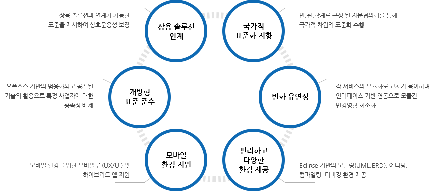
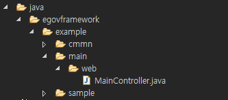
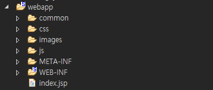
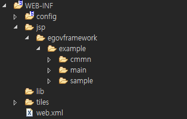
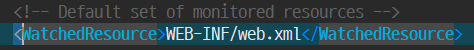
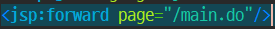
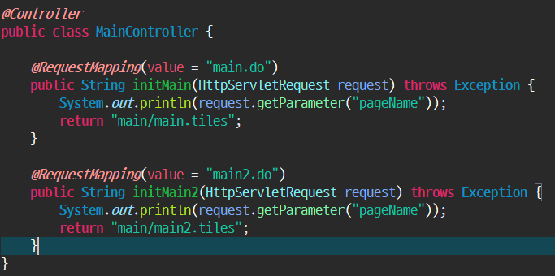

# EgovFrameWork

Categoris

* [Egovframework](#egovframework-View)
* [Interceptor Setting](#interceptor-setting)
* [Logger Setting](#logger-setting)
* [QueryString Setting](#querystring-setting)
* [Maria DB Connection](#maria-db-connection)
* [EgovFrameWork]
## Egov Framework View


> - 전자정부 프레임워크는 대표적으로 스프링(spring), 아이바티스(ibatos)등 대표적인 오픈소스를 조합하여 만든 자바 기반의 프레임워크이다.
> - 스프링 프레임워크를 기반으로 하기 때문에 수많은 오픈소스 또는 상용 솔루션 탑재 및 연계를 할 수 있는 범용성이 있다.
> - 닷넷(.NET), php, asp를 위한 프레임워크가 아니로 오로지 Java 기반의 정보시스템(웹, 홈페이지, 하이브리드 앱) 등을 구축하기 위한 개발환경이다.

현재 전자정부 프레임워크는 3.8 버전까지 상용화
통합 개발 환경 가이드 - http://www.egovframe.go.kr/wiki/doku.php?id=egovframework:%EA%B0%9C%EB%B0%9C%ED%99%98%EA%B2%BD%EA%B0%80%EC%9D%B4%EB%93%9C
* [3.8 개발자 가이드](http://www.egovframe.go.kr/wiki/doku.php?id=egovframework:dev3.8:dev3.8)
* [3.7 개발자 가이드](http://www.egovframe.go.kr/wiki/doku.php?id=egovframework:dev3.7:dev3.7)
* [3.6 개발자 가이드](http://www.egovframe.go.kr/wiki/doku.php?id=egovframework:dev3.6)
### 특징


# 전자정부 표준 프레임워크 3.7 Version

* 프레임워크 개발환경
* 개발자 개발환경
* 서버 개발환경

## 프레임워크 개발 환경
전자정부 표준프레임워크의 개발환경 대해 전체적인 개요를 설명한다.

전자정부 표준프레임워크 개발환경은 비즈니스 프로그램 개발, 버전관리, 단위 테스트, 빌드 등의 개발 Life-Cycle 전반에 대한 지원 도구를 제공한다.
* Implementation Tool
* Test Tool
* Configuration & Change Management Tool
* Deployment Tool

전체 구조 및 구성요소


| 구성| 설명 |
|:--|:--|
| Implementation Tool| 프로그램 개발, 테스트, 디버그 등 개발자 개별 개발환경을 제공  |
| Test Tool  | 개발 프로그램에 대한 단위 테스트용 프로그램 작성 및 개별 배치 테스트 지원  |
| Conf. & Change & Batch Mgt. Tool  | 개발 프로그램에 대한 형상 식별, 버전관리, 이슈 관리
및 모니터링 도구 제공  |
| Deployment Tool   |	CI (Continuous Integration)와 서버 이관 관련 도구 제공  |

### 개발자 개발환경

개발자 개발환경은 Implementation Tool(Editor, Debug, IDE, Common Component, Mobile IDE, Batch IDE)과 Test Tool(Test Reporting, Unit Test, Batch Test)로 구성되어있다.

개발자 개발환경의 세부 기능을 좀 더 자세히 살펴보면 개발자들이 필수적으로 사용해야 하는 기능과 개발 편의성을 위해 선택적으로 사용하는 기능으로 구분됨을 알 수 있다.

이에 따라 전자정부 표준프레임워크에서는 개발환경을 경량화하기 위해 개발자 필수 기능만으로 구성된 경량 개발환경을 제공한다.
경량 개발환경은 개발자들이 간편하게 설치하여 사용할 수 있으며 소규모 프로젝트에서 사용하기 용이한 개발환경이다.

또한 전자정부 표준프레임워크에서는 개발자 필수 기능과 개발 편의성 향상을 위한 선택적 기능을 모두를 설치한 통합 개발환경도 제공한다.
개발자는 프로젝트의 상황에 적합한 환경을 다운로드하여 사용하도록 한다.

### 서버 개발환경
서버 개발환경은 Deployment Tool(Build, Deploy)과 Conf. & Change Mgt. Tool(Configuration Management, Change Management)로 구성되어 있다.

전자정부 표준프레임워크에서는 서버 개발환경 역시 프로젝트에서 필수적으로 사용하는 기능과 선택적으로 사용하는 기능으로 구분하였다.
프로젝트 상황에 따라 Deployment Tool과 Conf. & Change Mgt. Tool 중 일부 기능을 선택적으로 사용할 수 있다.(서버 개발환경)

## 개발 프로세스

개발환경에서 제공하는 개발환경 도구를 기반으로 개발을 진행할 경우 제시될 수 있는 개발 프로세스이다.
개발 프로세스는 아래의 4개 영역으로 분류되며 각 영역에서 수행하는 상세 프로세스는 그림에서 확인할 수 있다.

* 개발자 PC
* 형상관리 서버
* CI 서버
* 어플리케이션 서버


## 개발 버전 차이

* 개발환경 3.7.0

|항목 | 권장버전 | 비고|
|:--|:--|:--|
|Java Development Kit | 8.0 이상 | 7.0 미지원|
|Servlet | 2.5 이상 |
|Eclipse IDE for Java EE Developers | 4.6.3 (Neon.3) | http://www.eclipse.org/neon/|

* 개발환경 3.6.0

|항목 | 권장버전 | 비고|
|:--|:--|:--|
|Java Development Kit | 7.0 이상 | 8.0 지원|
|Servlet | 2.4 이상 |
|Eclipse IDE for Java EE Developers | 4.5.2 (Mars.2) | http://www.eclipse.org/mars/|

* WAS

|이름 |권장버전|	자바호환성|	비고|
|:--|:--|:--|:--|
|Apache Tomcat|	8	| JDK 7.0 이상	|
|Jboss application platform|	7	|JDK 7.0 이상	|
|Tmax JEUS|	7	|JDK 7.0 이상	|
|Oracle WebLogic Server	|12C|	JDK 7.0 이상	|

* DBMS

|이름	|권장버전|	비고|
|:--|:--|:--|
|Mysql|	5.1.30	||
|Tibero|	3.0(sp2)	||
|Altibase DBMS Server	|5.1.3.18	||
|Oracle	|9.2(mp3)	||

### 전자정부 표준 프레임워크 라이센스
[전자정부 표준프레임워크 라이센스](http://www.egovframe.go.kr/EgovLicense.jsp?menu=1&submenu=4)는 Apache License, Version 2.0 을 채택합니다.
단, 표준프레임워크 내에서 사용된 외부 오픈소스의 경우 원 오픈소스의 라이선스 정책을 유지합니다.

### 전자정부 프레임워크 폴더 구조

* Java
  - 자바코드(컨트롤러, 모델)를 관리 한다.
  - MVC Model (Controller, Service, Mapper)
  - VO(Visual Object)
  - cmmn (공통 업무)


* resources
  - spring, mapper, sql 자바 코드에서 사용할 리소스를 관리 한다.


* webapp
  - View 관련 소스 및 js, jsp, css, image 등등을 관리 한다.
  - jsp를 제외한 js, css, image 등은 webapp의 하위 폴더에 명시 되있다.
  - jsp 폴더의 경로는 webapp/WEB-INF/jsp 로 구성되 있다.
    
  - jsp 폴더 구조와 java 폴더의 구조가 같다.

### 전자정부 프레임워크 첫 실행 흐름
로컬 이클립스에서 톰캣으로 서버를 실행하고, 웹 브라우져에서 http://localhost:8080/first/ 로 접속을 하면 화면에 보여지는 흐름은 이렇다.

  1. 이클립스의 톰캣 서버의 설정-module-path 탭에 저장된 path가 입력이 됬는지 확인
  2. 톰캣 서버의 localhost-config 폴더안에 context.xml에 <WatchedResource> 테그로 경로로 요청
  
  3. WEB-INF/web.xml 에 <welcome-file-list> 테그로 웹 요청시 지정한 리소스를 Call
  
  4. jsp 페이지 내에 forward 액션 태그를 만나게 되면, 그전까지 출력 버퍼에 저장되어 있던 내용을 제거하고 forward 액션 태그가 지정하는 page 속성의 논리적 주소로 Get방식 이동
  
  5. Get방식으로 넘겨받은 논리적 주소값이 @RequestMapping 명령어의 Value 속성값과 일치하면 하위 메서드가 실행
  
  6. return 명령어의 지시는 경로/파일이름으로 main.jsp의 논리적 주소로 이동
  7. main.jsp로 인해 웹 브라우져에서 view가 보여지게 됩니다.


---

## 디테일한 전자정부 프레임워크 실행 흐름 정리

톰캣서버 명칭 (Local Web Server& Web Containar)

JSP 구동 방식
> 정적 어플리케이션(Css, Js, Javascript)

+ 과거방식(정적 어플리케이션)
  웹 클라이언트가 요청하면 웹 서버가 요청을 받아 관리자가 인식하여 DB 조회를 통한 결과물 반환

+ 현재방식(동적 웹 어플리케이션)
  정적 어플리케이션에 동적 서비스가 존재하여, 결과물을 동적으로 전송

> 동적 서비스(관리자가 했던 작업을 웹 컨터이너(톰캣)이 응답을 받아서 DB 조회를 통해 결과물 반환)

### Web Containar란?
톰캣 설정파일-  Server.xml에 Context라는 테그가 존재한다.
> Context 태그: 하나의 웹 컨테이너에는 하나의 컨텍스트가 생성 된다. 정적인 웹 루트를 표시해 주어서
> Context 명: 최초 프로젝트 시작 할 때, 프로젝트명으로 최초 주소를 만들어 주는 정적 웹 주소로, 하나의 웹 컨테이너 당 하나의 컨텍스트가 만들어지며, 정적 웹 자원 어플리케이션 루트를 표시해준다.
> 그렇기 떄문에 웹 실행시  Context.xml - Web.xml - Welcomefilelist - index.jsp - dispatcher-servlet.xml
# 어노테이션 선언의 목적(@)

0. 어노테이션을 사용하는 이이유
1. 하위 어노테이션을 사용하기 위해서
2. 모든 어노테이션은 인터페이스로 구성되어 있다.


### Dispatcher Servlet.xml

Dispatcher-Servlet 내부
  - Component-Scan : 컴포넌트가 붙어있는 객체만, 구분하여 , Bin으로 설치
  - 즉 RquestMpiing :
Spring은 @Component 어노테이션이 붙어있는 객체만 @Bean으로 등록시키는 인젝션이 일어난다.
Spring은 @Component 붙어있는 객체만 @Bean으로 등록시키는 Injection이 일어난다.
dispatcher-Servlet.xml - component-scan 에 등록되있는 경로만 자동으로 등록되도록 한다.
---
@Controllere 어노테이션을 선언하지 않으면, @RequestMapping을 사용할 수 없다.

* RequestMappingHandlerAdapter
* RequestMappingHandlerMapping

1. 위 RequestMappingHandler Adapter, Mapping2이 논리적 주소(Ex.'/main.do')를 받아서 @bean으로 등록되 있는 정보들 중 @Controller 어노테이션이로 이동한다.
2. @Controller하위에 존재하는 @RequestMapping 벨류 정보와  논리적 주소가 매칭되는 메서드를 찾는다.
3. 그 서비스 메서드가 작동되어 서비스, 서비스임플, 맵퍼를 통해 MVC를 탄다.
4. DB 조회 후 결과물을 리턴받아 데이터를 처리하고 화면으로 올릴 데이터를 모델에 넣는다.
5. 정보를 넣은 모델이 화면으로 바로 가는 것이 아니라, **다시 Dispatcher-Servlet으로 간다.**
> 즉 Dispatcher-Servlet은 2가지를 받는다.
>> 1. return 하는 화면의 논리적 주소
>> 2. 모델 정보

6. Dispatcher-Servlet에 있는 viewResolver(Jstlview)가 2개의 정보를 받는다.
7. 정보를 받은 JstlView는 HTML(DOM)을 그리기 시작한다.
8. DOM을 그리다가, HTML이 아닌 Ex)forEach(Jstl문)이 나온다면, HTML 정보가 아니기 떄문에 정보가 없고, Jstlview가 (No.6)에서 받은 정보 중 모델에 있는 데이터를 찾아서 화면을 그리게 된다.
9. 화면을 다 그린 JstlView는 다시 Dispatcher-Servlet에게 화면에 관련된 정보를 준다.
10. Dispatcher-Servlet은 화면 결과물을 브라우저 서블릿 컨터이너에 결과를 전달한다.
11. HTTP 통신을 하려면, Dispatcher-Servlet에서 받은 결과물을 서블릿 컨테이너가 받아서,  HTTP 통신에 맞는 규격으로 맞춰 사람이 볼수 있도록 파싱하여 브러우저에서 화면이 보이게 된다.

> 브라우저 통신 방식: HTTP 통신
> HTTP 통신을 하려면, Dispatcher-Servlet에서 받은 결과물을 서블릿 컨테이너가 받아서,  HTTP 통신에 맞는 규격으로 맞춰 사람이 볼수 있도록 파싱하여 브러우저에서 화면이 보이게 된다.


---

# QueryString Setting

쿼리스트링은 사용자가 웹프로그램으로 입력 데이터를 전달하는 가장 단순하고 또한 널리 사용되는 방법이다. 이 방법은 URL 주소 뒤에 입력 데이터를 함께 제공하는 방법으로 다음과 같은 형식을 취한다.

```Java
http://hostname[:port]/folder/file?변수1=값1&변수2=값2&변수3=값3
```
위 형식에서 “?” 뒤의 표현된 부분이 쿼리스트링 이다. URL 주소와 쿼리스트링은 “?”로 구분되며 변수와 값의 쌍(변수=값)으로 구성된다. 만약 여러 쌍의 변수와 값을 전달할 경우 각각의 쌍을 “&”로 구분해주면 된다.

---

## Get Query String

**Java**
* HTTPServletRequest 클래스
HTTPServletRequest 클래스는 쿼리스트링 데이터뿐만 아니라 클라이언트 IP 등의 정보를 가져오거나, 쿠키, 헤더로 전송한 값을 가져오는데 주로 사용한다.

    + getParameter: 메서드는 하나의 값만 가져올 수 있다.(만약 화면에서 올린 키가 배열(체크박스 같은)이라면, 여러개 데이터를 받아야 하지만, 가장 처음 데이터 하나만 받는다.)
    
    + getParameterValues: 메서드는 동일한 키가 여러개면, 배열을 받을 수 있다. 즉 배열은 위 메서드로 받으면 안되고 Values 메서드를 사용해야 한다.

**Jsp**
* param
  - EL (Expression Language)로 param 은 파라미터값으로 이전 화면에 정보를 가지고 있는 객체를 뜻하고 data는 그 데이터중 data이라는 키의 데이터의 값을 가져온다.

> 주의
> 1. param으로 파라미터값을 받아오려면 동적 텍스트를 출력을 위해 항상 c:out 을 사용해야한다(보안문제).
> 2. 사용하기 위해서는 JSTL 디렉티브를 추가해야 한다.
> 
> 3. 데이터 전송을 GET방식으로 할 경우에 한글 사용을 하려면 인코딩을 해주어야 한다.(Tomcat Server Localhost Config/server.xml)

# VO (Value Object) 형식에 대해서
Mapper XML 에서 VO경로를 설정해줘야 한다. - sel-mapper-config.xml

> VO의 사용처
> 초기값이 있어야 하는 경우는 Map보다 VO를 사용하는 방법이 훨신 더 좋다.

그 외의 경우는 Map을 사용하는 것이 더 좋다.
**Map이 속도가 훨신 빠르기 떄문**
