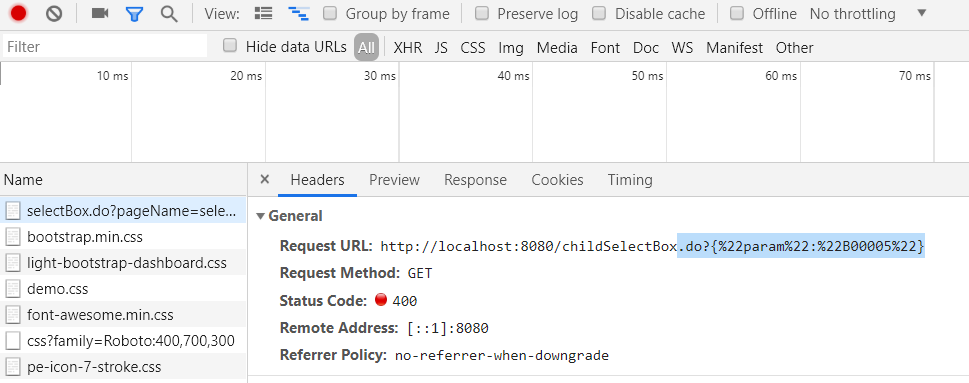
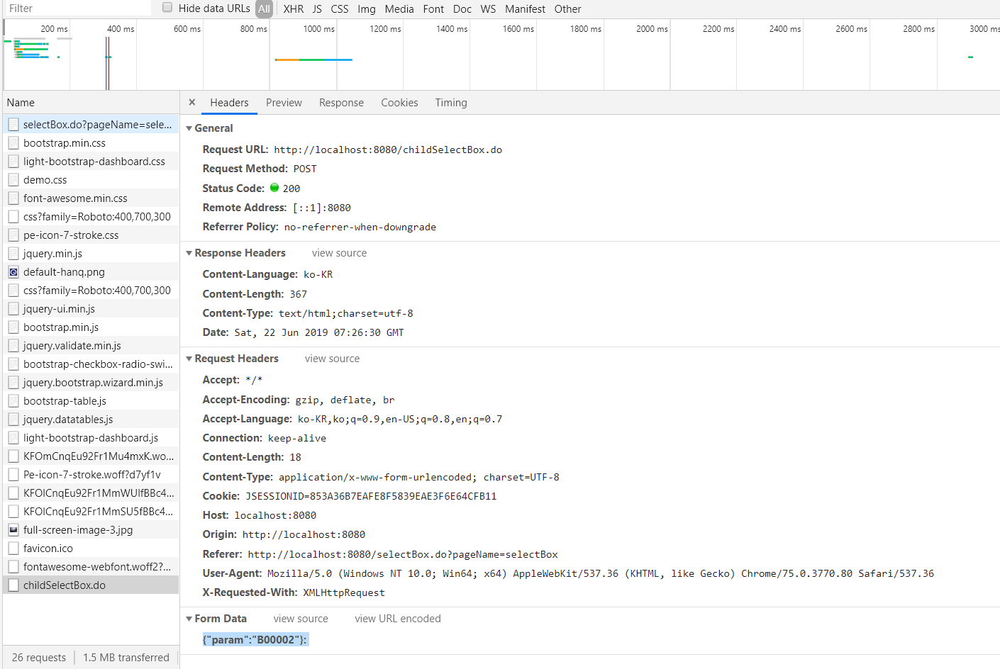

# Ajax <-> JSTL

화면을 그릴 때, Ajax와 JSTL 2개 중 속도가 빠른것은 JSTL이므로 더 좋은방법

JSTL은 View를 그리면서 그리기 때문에 Ajax보다 훨신 빠른 속도 성능이 나온다.
JSTL과 AJAX를 비교하는 이유는 속도 차이떄문이고, JSTL이 당연히 화면을 그리면서 그리기 떄문에 속도가 훨신 빠르다.

>> JSTL 로 화면을 그리는 방식?과정은

1.  JSTL VIEW가 화면을 그리면서, Model을 참고해서 그린다.

## AJAX 사용 조건

  1. JSTL을 사용할 수 없을때,
  2. 화면은 그대로이면서, Data만 바꾸거나 변할 때,
  3. JSTL은 딱 한번(화면을 그릴때) 그린다. -> Submit 방법
  4. Ajax는 화면을 다 그리고 나서도 계속적인 변화가 필요할때,

## AJAX POST < - > GET

GET

POST

## 반복문

for in
향상된 for
Jstl
jquery 반복문
배열 전용 반복문

반복문 관련 내용 모두 정리하기

# 숙제

2 중 Ajax 구현하기 - post 방식으로 진행

기능 구현의 분리가 필요(ajax를 호출 할 떄, 또 다른 메서드를 생성하서 호출하는 방법으로 구현)

## @RequestBody
