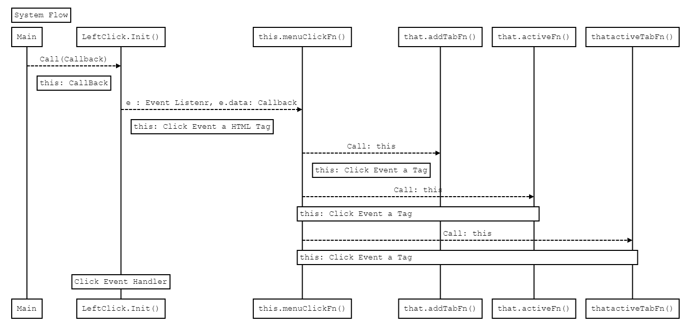

#  탭 기능 관련 사전 로직

* Left Menu는 1depth, 2depth로 나누어진다.
    + 1depth: 대 분류
    + 2depth: 소 분류
    + Left Menu 클릭 시 하이라이트 처리(탭, Left Munu)
* Tab의 기준
    + Left Menu List 중에서 2depth를 클릭할때 활성화 된다.
    + Left Menu List 와 1:1으로 매칭되어 중복되지 않아, 중복 여부를 판단한다.
    + 각 Tab마다 고유의 컨텐츠 내용을 가진다.
    + Tab 클릭 시 하이라이트 처리(탭, Left Munu)
* 개발의 편리함을 위해  'Tab'과 'Left Menu 2depth'와 '고유 컨텐츠 내용'을 긴밀하게 연결시킨다.
    + Menu: Menu를 구성하는 a 테그의 data-code 속성에 Left Menu마다, 고유한 값을 저장
    + Tab : Tab을 구성하는 li 테그의 data-code 속성에 클릭한 Left Menu의 a 테그 data-code 속성과  동일한 값을 저장
    + Content : Content 영역을 구성하는 div 테그 Id 속성에 클릭한 Left Menu의 a 테그 data-code 속성과  동일한 값을 저장
 코드 분석


# 탭 로직 흐름도



```sequence
Title: System Flow
Main-->LeftClick.Init(): Call(Callback)
Note right of Main: this: CallBack
LeftClick.Init()-->this.menuClickFn(): e : Event Listenr, e.data: Callback
Note right of LeftClick.Init(): this: Click Event a HTML Tag
this.menuClickFn()-->that.addTabFn(): Call: this
Note right of this.menuClickFn(): this: Click Event a Tag
this.menuClickFn()-->that.activeFn(): Call: this
Note over  this.menuClickFn(),that.activeFn(): this: Click Event a Tag
this.menuClickFn()-->thatactiveTabFn(): Call: this
Note over  this.menuClickFn(),thatactiveTabFn(): this: Click Event a Tag
# Example of a comment.
Note over  LeftClick.Init(): Click Event Handler
```


# 코드 분석

### 이벤트 핸들러 메서드 등록

```javascript
leftClick.init.call(callBack); // 탭 추가 및 하이라이트 처리 메서드가 구현되있는 callBacks 렉시컬 스코프를 전달
```

### 이벤트 핸들러 2가지

* LeftMenu Click
* TabMenu Click

```javascript
// this : CallBack Class
// EventHandler Send this
$(".lnb a").click(this, this.menuClickFn); //LeftMenu Click

// 이 메소드 실행 시점은  Dom을 다 그리고 동적으로 생성된 태그들 제어는 상기 이벤트로는 적용이 되지 않음
// $("#tabList > li > a") 타겟 잡히지 않음
// on을 사용하면, 동적으로 생성된 테그를 잡을 수 있다.
// 여러개의 타겟을 잡지 않고, 한개의 타겟을 잡은 다음에, on을 사용하여 하위 요소타겟을 잡으면 속도가 훨신 빠르다.
// $("#tabList > li > a").on("click",function() {}); 보다, $("#tabList").on("click", "li >a", funtion() {}); 가 더 빠르다.
$("#tabList").on("click", "li > a", function() {}); // TabMenu Click
```

### LeftMenu Click Event Function

* 탭의 중복여부 확인
    + 탭 생성 시 배열에 Left(a)-Tab(li)-Content(div) 3개의 태그가 가지는 고유의 값을 배열에도 저장
    + 메뉴 클릭 시 고유의 값과 배열안에 내용을 비교하면 중복여부 확인가능
* 탭 생성 시 처리해야 할 로직
    + 중복 여부를 체크하는 배열에 고유의 값을 넣는다.
    + 탭을 구성하는 li 태그에 고유의 값을 넣는다.
    + 컨탠츠를 구성하는 div 태그에 고유의 값을 넣는다.
- 하이라이트 처리
    - 탭의 중복 여부를 떠나 무조건 하이라이트 처리(조건X)

```javascript
menuClickFn : function(e) {

    var that = e.data; // e.data: callBack
    var onOrSlt = $(this).parent().hasClass("sub-tit") ? "select" : "on"; //this : Click Target A Tag

    // 선택한 메뉴의 중복 여부 확인
    if (CmmnField.tabArr.indexOf($(this).data("code")) === -1) { // -1 배열에 데이터가 없음

        // 1뎁스를 누를 시 탭을 추가시키지 않는다.
        if (onOrSlt === "on") {

            /* 탭 생성 시
             * 중복 여부를 체크하는 배열에 고유의 값을 넣는다.
             * 탭을 구성하는 li 태그에 고유의 값을 넣는다.
             * 컨탠츠를 구성하는 div 태그에 고유의 값을 넣는다.
             */
            that.addTabFn.call(this); // 2뎁스를 누를 시 탭을 생성
        }
    }

    // 레프트 하이라이트 메서드 호출
    // 동적으로 타겟을 지정할 수 있어, 어디서든 이 메서드로 레프트 하이라이트 처리 할 수 있다.
    that.activeFn.call(this, onOrSlt);

    // 탭 하이라이트 처리
    // 동적으로 타겟을 지정할 수 있어, 어디서든 이 메서드로 탭을 하이라이트 처리 할 수 있다.
    that.activeTabFn.call(this);
},
```

 # Javascript Function Argument & Parameter

* PARAMETER
    매개변수라는 뜻으로 함수를 정의 할 때, 외부로부터 받아들이는 임의의 값을 의미

* ARGUMENT
    인수로서, 함수를 호출할 때 사용하게 되는 일련의 값들을 아규먼트라 한다.

> 자바스크립트의 함수는 정의하는 매개변수 개수와 실제 호출에 사용되는 인자의 개수가 반드시 지 않아도 된다.

함수에서 정의한 매개변수의 수보다 많은 수의 인자값이 전달되면, 자바스크립트는 Arguemnts 타입의 객체를 생성하고
(Arguments 타입의 객체는 함수가 호출되면 자바스크립트가 자동으로 생성하는 객체이다.)
객체의 값을 앞에서부터 차례로 받아서 매개변수에 할당하고, 남은 인자값을 무시하기 때문이다.

매개변수보다 인자가 많으면, 남은 인자들은 Arguments 객체에 담아 저장되며,
반대로 정해진 매개변수의 수보다 인자가 적으면, 앞에서부터 매개변스의 값이 차례로 채워지고 , 받지 못한 매개변수는 undefined 가 된다.

예로, Left Menu 하이라이트 처리해주는 activeFn 을 예제로 사용


```javascript
// 구현부
var callBack = {
    activeFn 	: ActiveLeftMenu,
}

function ActiveLeftMenu() {

    if (arguments === null) { // argument.length === 0

        return;
    } else {

        var onOrSlt = arguments[0]; //메서드의 매개변수가 아닌 인자로 받아 올 수 있다.
        var $this = $(this);

        if (onOrSlt === "select") {

            $(".lnb dt").removeClass("select");
        }

        $(".lnb li").removeClass("on");
        $this.parent().addClass(onOrSlt);
    }
}

// 호출부
// 하이라이트 메서드 호출
callBack.activeFn.call(this, onOrSlt);
```
