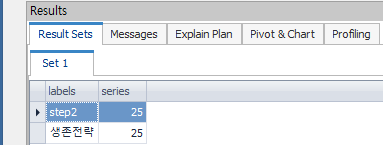

# 7Week

팀숙제 : 제일 수강자 수가 많은 과목과, 제일 수강자 수가 적은 과목을 뺀 나머지 과목 수강자 % 조회


```sql
SELECT B.class_NM, ROUND(B.series / (SELECT COUNT(*)
                                       FROM (SELECT gi.class_nm
                                              FROM t_user ur
                                              JOIN t_gisu gi
                                                ON ur.user_id = gi.user_id
                                             UNION ALL
                                            SELECT '생존전략' class_nm
                                              FROM t_user ur
                                             WHERE not exists (SELECT user_id
                                                                 FROM t_gisu
                                                                WHERE user_id = ur.user_id)
                                            ) A ) * 100) as series
  FROM (SELECT A.class_nm
              ,COUNT(A.class_nm) as series  
          FROM (
                SELECT gi.class_nm
                  FROM t_user ur
                  JOIN t_gisu gi
                    ON ur.user_id = gi.user_id
                 UNION ALL
                SELECT '생존전략' class_nm
                  FROM t_user ur
                 WHERE not exists (SELECT user_id
                                     FROM t_gisu
                                    WHERE user_id = ur.user_id)
                ) A
         GROUP BY A.class_nm
         ) B
 WHERE B.series != (SELECT MAX(B.series)
                      FROM (SELECT COUNT(A.class_nm) as series  
                              FROM (
                                    SELECT gi.class_nm
                                      FROM t_user ur
                                      JOIN t_gisu gi
                                        ON ur.user_id = gi.user_id
                                     UNION ALL
                                    SELECT '생존전략' class_nm
                                      FROM t_user ur
                                     WHERE not exists (SELECT user_id
                                                         FROM t_gisu
                                                        WHERE user_id = ur.user_id)
                                    ) A
                             GROUP BY A.class_nm
                             ) B)
  AND B.series != (SELECT MIN(B.series)
                      FROM (SELECT COUNT(A.class_nm) as series  
                              FROM (
                                    SELECT gi.class_nm
                                      FROM t_user ur
                                      JOIN t_gisu gi
                                        ON ur.user_id = gi.user_id
                                     UNION ALL
                                    SELECT '생존전략' class_nm
                                      FROM t_user ur
                                     WHERE not exists (SELECT user_id
                                                         FROM t_gisu
                                                        WHERE user_id = ur.user_id)
                                    ) A
                             GROUP BY A.class_nm
                             ) B)

```

<br><br><br><br><br><br>
## 결과


## 분석
위의 문제를 해결하기 위해서 4가지 조회가 필요하다.

1. 모든 수강생들 수
2. 과목 별 수강자 수
3. 최대 수강자 인원과 과목
4. 최소 수강자 인원과 과목

## 최종
**최대, 최소 인원인 과목을 제외하고, 나머지 과목을 수강 인원/ 전제인원 * 100 계산하여 백분율로 표시**

## 상세 분석


### 1. 모든 수강생 수

```sql
SELECT COUNT(*)
  FROM (SELECT gi.class_nm
          FROM t_user ur
          JOIN t_gisu gi
            ON ur.user_id = gi.user_id
         UNION ALL
        SELECT '생존전략' class_nm
          FROM t_user ur
         WHERE not exists (
                           SELECT user_id
                             FROM t_gisu
                            WHERE user_id = ur.user_id
                          )
       )
```

### 2. 과목 별 수강자 수

```sql
SELECT  A.class_nm
       ,COUNT(A.class_nm) as series  
  FROM (
        SELECT gi.class_nm    
          FROM t_user ur
          JOIN t_gisu gi
            ON ur.user_id = gi.user_id
         UNION ALL
        SELECT '생존전략' class_nm
          FROM t_user ur
         WHERE not exists (
                           SELECT user_id
                             FROM t_gisu
                            WHERE user_id = ur.user_id
                          )
        ) A
 GROUP BY A.class_nm
```

### 3. 최대 수강자 인원인 과목

```sql
SELECT MAX(B.series)
  FROM (
    SELECT COUNT(A.class_nm) as series  
      FROM (
           SELECT gi.class_nm
             FROM t_user ur
             JOIN t_gisu gi
               ON ur.user_id = gi.user_id
            UNION ALL
           SELECT '생존전략' class_nm
             FROM t_user ur
            WHERE not exists (
                              SELECT user_id
                                FROM t_gisu
                               WHERE user_id = ur.user_id
                               )
               ) A
      GROUP BY A.class_nm
     ) B
```

### 4. 최소 수강자 인원인 과목

```sql
SELECT MIN(B.series)
  FROM (
    SELECT COUNT(A.class_nm) as series  
      FROM (
           SELECT gi.class_nm
             FROM t_user ur
             JOIN t_gisu gi
               ON ur.user_id = gi.user_id
            UNION ALL
           SELECT '생존전략' class_nm
             FROM t_user ur
            WHERE not exists (
                              SELECT user_id
                                FROM t_gisu
                               WHERE user_id = ur.user_id
                               )
               ) A
      GROUP BY A.class_nm
     ) B
```

# 기본적으로 위의 4개의 쿼리가 전체적으로 중복이 된다.

중복되는 쿼리를 WITH 절로 재귀쿼리를 만들면 간단하다.

```sql
WITH A1 as
(SELECT class_nm, COUNT(*) as cnt
   FROM t_gisu
  GROUP BY class_nm
  UNION ALL
 SELECT '생존전략' class_nm, COUNT(*) as cnt
   FROM t_user ur
  WHERE NOT EXISTS (
                    SELECT user_id
  		        			  FROM t_gisu
  					         WHERE user_id = ur.user_id
                   )
)

SELECT A1.class_nm as labels
      ,ROUND(A1.cnt / (SELECT SUM(A1.cnt) FROM A1) * 100) as series
  FROM A1
 WHERE A1.cnt NOT IN (
                      (SELECT MAX(A1.cnt) FROM A1),
                      (SELECT MIN(A1.cnt) FROM A1)
                     );

```
<br><br><br><br>
## 결과

