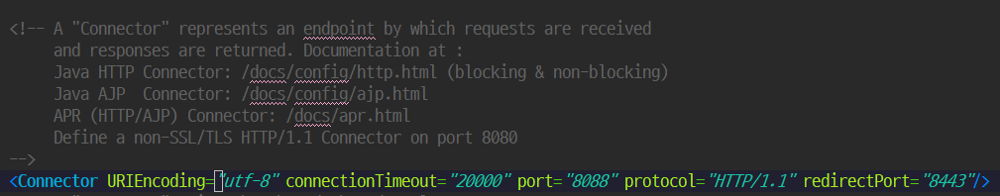

# 3Week 수업 정리

## JavaScript Funtcion

```JavaScript
// 함수 정의문 // 인스턴스 객체
function leftChkFn(menuStr) {// { } : 함수 스코프 명칭

  // : 클래스 안에 프로퍼티
  // 함수를 넣은 프로퍼티를 메서드
  // 예외적으로 윈도우 객체 안에있는 함수가 들어있는 프로퍼티는 함수이다.

  // Window 객체의 프로퍼티
  //Get방식 페이지이동 : Head부분에 데이터를 전달하여 데이터 전송(url에 포함된다)
  // Get방식으로 여러개의 쿼리스트링을 보낼 때 &(앤퍼센트)를 추가한다.
  location.href = "/" + menuStr + ".do?pageName=" + menuStr + "&otherKey=한글";
}
```

```HTML
<!-- id 속성: 하나의 문서 내에서 유니크한 식별자 -->
  <li id="one">
      <a href="/main.do">
          <i class="pe-7s-graph"></i>
          <p>DashBoard</p>
      </a>
      <!-- "#" 은 정적으로 페이지 이동을 원하지 않을 때 넣는다. -->
      <!-- "onclick" 속성의 값으로는 반드시 자바스크립트만 들어갈 수 있다. -->
      <!-- 인라인 이벤트 모델: HTML에 자바스크립트 객체를 사용하는 이벤트 -->
      <!-- 호출 함수: 함수를 호출하는 함수 명 -->
      <a href="#" onclick="leftChkFn('one')">
          <i class="pe-7s-graph"></i>
          <p>one</p>
      </a>
  </li>
```

## JQuery 필터셀렉터(:)

```jQuery
:fitst
첫번째로 일치하는 요소를 가져온다.

:last
마지막으로 일치하는 요소를 가져온다.

:even
짝수번째 요소를 모두 가져온다 ( first index : 0 )

:odd
홀수번째 요소를 모두 가져온다 ( first index : 0 )

:eq(index)
인자로 전달된 index에 해당하는 요소를 가져온다. ( first index : 0 )

:gt(index)
인자로 전달된 index 보다 큰 index를 가진 요소를 모두 가져온다.

:lt(index)
인자로 전달된 index 보다 작은 index를 가진 요소를 모두 가져온다.

:has(selector)
인자로 전달된 selector 요소를 하나 이상 포함하고 있는 요소를 가져온다.

:not(selector)

인자로 전달된 selector 와 일치하지 않는 모든요소를 가져온다.
```


# 서버

## UTF-8 Encoding



