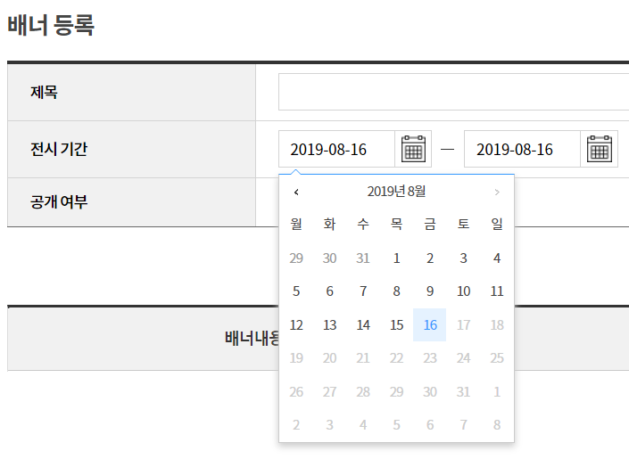

# Step3 2주차 과제

목차
* [로직분석](#로직분석)
* [캘린더 리펙토링](#캘린더_리펙토링)

---

# 로직분석

금주 수업의 가장 중요한 업무 흐름은 2가지로 요약

1. [ jqgird 테이블의 row 추가](#1._jqgird_테이블의_row_추가)
2. [캘린더 날짜 유동적 설정](#2._캘린더_날짜_유동적_설정)

## 1. jqgird 테이블의 row 추가

행추가 기능: 테이블의 행 추가 기능으로, 행에 유니크한 ID를 부여하면서 추가한다.(단, 유니크한 행 ID는 당연히 중복되지 않아야 하며, 1부터 시작해 점차 증가해 부여한다.)

```java
$("#dpBnnrDtl").jqGrid({

        colModel 	 : [
            {label  : "배너내용",		name : "bnnrText",  	width : 150,    align : "left"},
            {label  : "배너이미지",		name : "imgAttcFile",   width : 200,    align : "left"},
            {label  : "URL",			name : "cnntUrl",     	width : 130,    align : "center"},
            {label  : "노출순서",		name : "sortSeq",      	width : 50,     align : "center"}, // formatter
            {label  : "구분",			name : "btn",      		width : 50,     align : "center", formatter : gubunBtn} // 사용자 호출 콜백함수 gubunBtn() 추가
        ],
        autowidth	: true,
        cellEdit	: true,
        cellsubmit	: "clientArray"	// default : "remote" // jqGrid 테이블을 변경할 때매다, Ajax를 실행하려는 기본 설정을, 변경될 때마다, 배열에 저장하도록 설정
    								// ajax를 타지 않고 어떤 다른 이벤트 (클릭해서 저장같은) 를 통해서 데이터를 처리해줘야한다. 즉, 바로 ajax태우지 않을 것이라는 것이다.
    });
```

jqGrid의 rowId 전부를 배열로 리턴해주는 메소드로 현재 존재하는 유니크한 ID를 가져와 최대값을 구해 다음 추가할 row의 id를 부여한다.

> $TARGET.jqGrid("getDataIDs");
> 그리드의 모든 행에 대한 유니크한 ID를 배열로 리턴해주는 메서드

```java

// 타켓으로 잡은 그리드의 모든 rowID를 배열로 리턴해주는 메서드
var idsArr      = $dpBnnrDtl.jqGrid("getDataIDs");

// 배열의 최대값을 리턴 //apply메서드를 이용해 배열의 최대값을 구함
var totalRecord = idsArr.length === 0 ? 0 : Math.max.apply(null, idsArr);
```

row 추가 시 필요한 데이터모델 만들기

```java
var colModelArr	= $dpBnnrDtl.getGridParam("colModel");

for(var i = 0; i < colModelArr.length; i++) {

        // row의 각 컬럼별 셋팅으로, 행삭제 버튼 부분은 수정 불가능 하게 설정
		$dpBnnrDtl.setColProp(colModelArr[i].name, colModelArr[i].name === "btn" ? {editable : false} : {editable : true})

        // 동적으로 배열의 요소와 속성 설정 // 행 추가이므로 빈값 할당
		addData[colModelArr[i].name] = "";
	}

    // 실행 시 gubunBtn() 메서드 호출
    // 테이블의 row id는최대값에 +1 증가시켜 부여
    $dpBnnrDtl.addRowData(totalRecord + 1, addData);
```

### 행삭제 버튼 생성 formatter : gubunBtn

jqGrid를 선언할 때 colmodel에 행삭제 버튼을 만들기 위해 주었던 속성으로,
행삭제 버튼을 만들어주는 gubunBtn 메서드가 실행된다.


실행순서는 추가버튼을 클릭 했을때, addRowFn() -> $jqGrid.addRowData() -> gubunBtn() 순으로 실행 된다.


## 캘린더 리펙토링

현재 캘린더는 실행 시 전시 시작 시간 설정에 장애가 있다.
 페이지를 최초 로딩 하여, 전시기간 시작 날짜 설정이 오늘 기준으로 미래 날짜가 선택 비활성화 되있는 문제이다.



## 이유

이러한 결과는 전시기간 설정 input태그(전시시작, 전시종료 일자)를  반복문으로 초기화 해주는 부분에 있다.

즉, 반복문 로직 상 시작일자를 먼저 초기화 하고, 그 다음 종료일자 초기화 하는데, 종료일자를 초기화 하는 순간에, Change 이벤트 핸들러가 발생하기 떄문이다.

 $("[data-date]").on("change", function(){} Change 이벤트 핸들러가 실행되서 미래의 날짜가 비활성화 되게 된다. 이 부분을 수정해야 한다.

## 결론

해결책: 최초 초기화 로직이 다 실행되고 나서,  이벤트 핸들러를 등록하면 해결된다.

초기화 반복문과, 이벤트 핸들러를 분리한다.

```javascript
$(".cal-wrap").each(function () {

    var $this 	= $(this);
    var $input 	= $this.children("input");

    // 가독성을 위해서 find보다 children을 사용함으로써, 자로 자식이라는 것을 의미해 가독성이 좋다.
    $this.children("input").datepicker("setDate", "today");

});

// 최초 실행 시 데이터 초기화 후 이벤트 등록 되도록 이벤트 분리
// 데이터 속성에 change 이벤트를 걸어서 원하는 날짜를 disabled하는 기능
$("[data-date]").on("change", function() {

    var $this		= $(this),
        code 		= $this.data("date"),
        dateVal		= $this.val(),
        getV		= code === "start" ? "end" : "start";

    var $target = getV === "start" ? $this.parent().prev().children("input") : $this.parent().next().children("input");

    if (getV === "start") {

        if ($target.val() > dateVal) {
            $target.val(dateVal);
        }
    } else {

        if ($target.val() < dateVal) {
            $target.val(dateVal);
        }
    }
});
```
