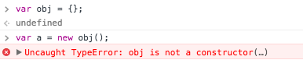
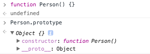
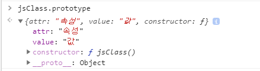
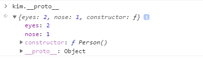
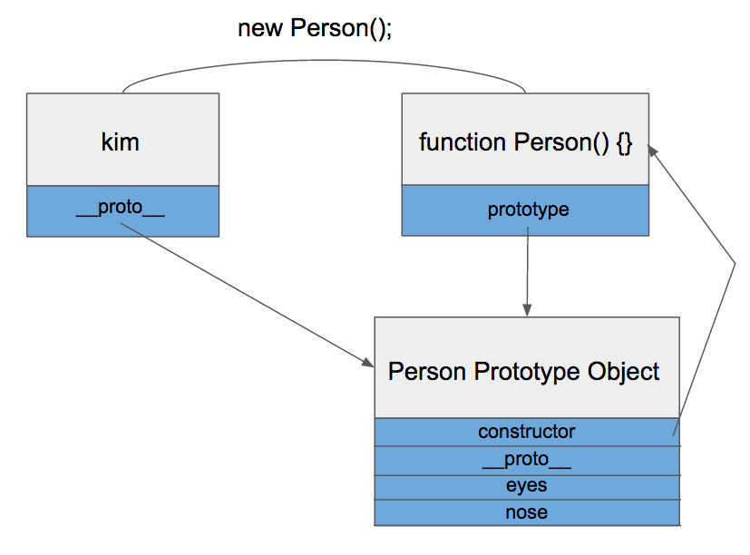
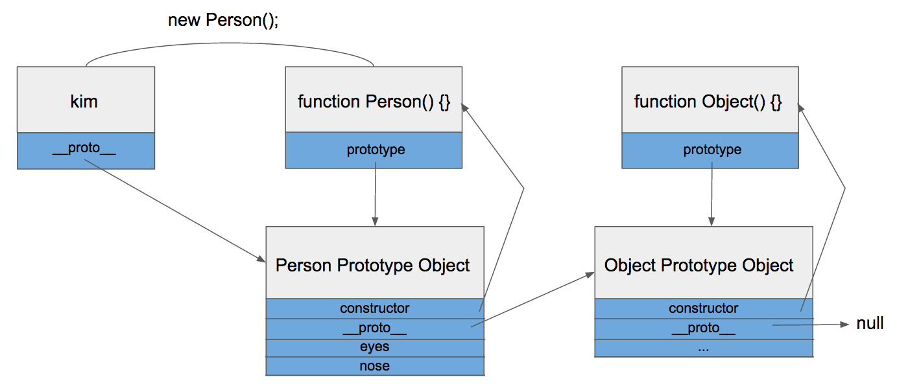
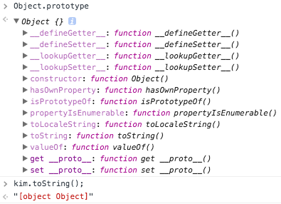

#

jqgrid 상속

---
selectric

select 박스를 꾸며주는 라이브러리 클래스

---
와일드카드
---

# Javascript
자바스크립트의 고찰과 개인 공부

수업을 진행하면서 Jquery 확장 기능에 대한 메서드를 배우다가 문득 자바스크립트의 객체화애 대한 기억이 났습니다.
**분명 수업을 통해 배웠던 내용이지만 한번더 정리하여 확실하게 개념을 잡기 위해 정리하였습니다.**

---

자바스크립트는 프로토타입 기반 언어라고 불리며,
자바스크립트는 자바와 달리 class가 존재하지 않는다(ES6에서는 존재). 하지만, prototype을 사용하여 class를 구현할 수 있다.

```Javascript
function jsClass() {
  this.attr = "속성",
  this.value = "값"
}

// 객체생성
var people = new jsClass();
var animal = new jsClass();
```
분명 이렇게 객체를 할당하면 2개의 변수가 원하는 속성을 가질 수 있지만, 메모리 적인 측면으로 총 4개의 변수가 할당이 된다.

적은 객체라면 상관이 없을 수 도 있지만, 범용성있는 객체라면은 이러한 요소도 고려해야하며, 이런 부분에 대한 해결점이 바로 prototypedlek.

```Javascript
function jsClass() {};

jsClass.prototype.attr = "속성";
jsClass.prototype.value = "값";

var people = new jsClass();
var animal = new jsClass();
```

간략한 개념은 이러한 내용이지만, 알고싶은 것은 왜 이렇게 사용해야 하는지, 효율적인 개념에 대한 정리를 하고 싶었습니다.

## Prototype

프로토타입 두가지

 * prototype : 자신의 프로토타입 객체, 하위로 물려줄 프로토타입 정보(prototype Object)
* &#95;&#95;proto&#95;&#95; : 상위에서 물려 받은 객체의 프로토타입에 대한 정보(prototype link)


### prototype Object

Javascript 객체는 언제나 함수(Function)으로 생성이 된다.

```javascript
function funObj() {} // 함수

var funObject = new funObj(); // 함수로 객체를 생성
```

객체를 생성할 때, 함수를 이용하기 떄문입니다.

즉 평소에 자주 사용하는 객체(Object) 선언문

```Javascript

var arrtObj = {}; // 함수로 객체 생성
```

역시 함수를 사용하여 생성한 객체로 내용은 아래와 같다.

```Javascript

var arrObj = new Object();
```

찾아보니 Object는 자바스크립트에서 제공하는 기본 함수로, Function, Array등 도 모두 함수로 정의되어 있었습니다.

함수로 정의가 되면 2가지의 속성이 생성됩니다.

1. 해당 함수에 constructor(생성자) 자격이 부여

생성자 자격이 부여되어야만 new 연산자를 통해 객체를 생성할 수 있습니다.
이것이 함수만 new 연산자를 사용할 수 있는 이유 입니다.



2. 해당 함수의 Prototype Object 생성 및 연결

함수를 정의하면 함수만 생성되는 것이 아니라, Prototype Object도 같이 생성


그리고 생성도니 함수는 prototype 이라는 속성을 통해 Prototype Object에 접근 할 수 있게 되고
Prototype Object는 일반적인 객체와 같으며, 기본 속성으로 constructor 와 &#95;&#95;proto&#95;&#95; 를 가지고 있습니다.



즉 prototype 속성을 통해 Prototype Object에 접근 하고, 이 객체에 속성을 추가/삭제가 가능하게 됩니다.

```Javascript
function jsClass() {};

jsClass.prototype.attr = "속성";
jsClass.prototype.value = "값";

var people = new jsClass();
var animal = new jsClass();
```

즉 위 코드의 prototype 접근은



jsClass.protottype으로 참조 할수 있게 된다.

### Prototype Link

```javascript
function Personm() {}

Person.prototype.eyes = 2
Person.prototype.nose = 1

var kim = new person();
```

위와 같이 선언을 하면,




kim 객체에는 eyes, nose 속성이 없지만, Person Prototype Object를 통해 kim.eyes, kim.nose 를 참조 할 수 있다.

이것이 Prototype Link의 개념으로 &#95;&#95;proto&#95;&#95; 속성을 통해 접근이 가능하다.

**&#95;&#95;proto&#95;&#95;**: 객체가 생성될 때 조상이었던 함수의 Prototype Object를 가리킨다.
kim객체는 Person함수로부터 생성되었으니 Person 함수의 Prototype Object를 가리켜 속성을 참조할수 있다.



kim객체가 eyes를 직접 가지고 있지 않기 때문에 eyes 속성을 찾을 때 까지 상위 프로토타입을 탐색하여 최상위인 Object의 Prototype Object까지 못찾았을 경우 undefined를 리턴을 한다.

이렇게 &#95;&#95;proto**&#95;&#95; 속성을 통해 상위 프로토타입과 연결되어있는 형태를 **프로토타입 체인(Chain)** 이라 한다.



프로토타입 체인 구조로 인해 모든 객체는 Obect의 자식 관계가 되고, Object Prototype Object에 있는 모든 속성을 사용 할 수 있게 된다.




---
## Jquery extend()

JQuery.extend() 함수는 복수의 오브젝트를 합쳐서(merge) 되돌려 주는 함수이다.

(플러그인 소스에서 디폴트 설정치를 덮어 쓸때 자주 사용)

jQuery.extend(target[, object1][, objectN])


```javascript
var objA = { a: 1, b: 2 }
var objB = { c: 3, d: 4 }

var objC = new Object;
objC = $.extend({}, objA, objB);
```


# 데이터 타입에 대한 고려

항상 수업시간에 당황하게 되는 부분 중 큰 이슈로 데이터 타입에 대한 고려와 벨리데이션이 헷갈립니다.

## 숙제 Check Box Validation
if (type === "checkbox") {

	if ($v.is(":checked")) valArr.push($v.val());

	val = valArr;

}
