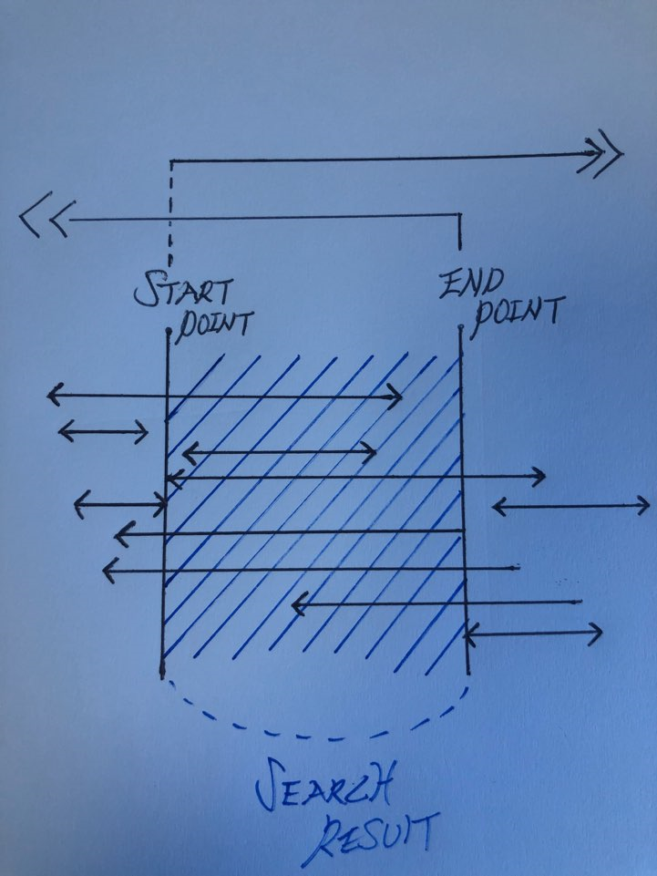

# 8주차 과제

* [OVER() 함수 분석하기](#분석함수)
* [효율적인 쿼리 개선](#쿼리_개선)

# 분석함수

테이블에 있는 로우에 대해 특정 그룹별로 집계값을 산출할 때 사용한다.
GROUP BY 절이 그룹별로 로우 수가 줄어들게 하는데 반해, 집계 함수는 **로우 손실이 없이 집계값을 산출** 한다.
분석 함수에서 사용하는 로우별 그룹을 WINDOW라고 하는데, 집계값 계산을 위한 로의 범위를 결정하는 역활을 한다.

## 유형

```SQL
분석함수(매개변수) OVER   (PARTITION BY EXPR1, EXPR2, ...
                          ORDER BY EXPR3, EXPR4, ...
                            WINDOW ...)
```

### 함수의 종류

AVG / SUM / MAX / MIN / COUNT / CUME_DIST / DENSE_RANK / PERCENT_RANK / FIRST / LAST / LAG / LEAD / ROW_NUMBER 등

### OVER() 란?

OVER함수는 ORDER BY, GROUP BY 서브쿼리를 개선하기 위해 나온 함수로,

즉 실제 데이터와 함께 해당 테이블의 전체 로우 컬럼을 쉽고 편리하게 추출할 수 있다.

#### ★ OVER() 에 사용되는 OPTION

1. PARTITION BY
2. ORDER BY ASC/DESC
3. NULLS FIRST : NULL 데이터를 먼저 출력.
4. NULLS LAST : NULL 데이터를 나중에 출력.

### OPTION절의 설명

* PARTITION BY : 분석 함수로 계산될 대상 로우 그룹(파티션)을 지정한다.
* ORDER BY : 파티션 안에서의 출력 순서를 지정
* WINDOW ... : 파티션으로 분할된 그룹에서 더 상세한 그룹으로 분할할 때 사용
(AVG / CORR / COUNT / COVAR_POP / COVAR_SAMP / FIRST_VALUE / LAST_VALUE / MAX / MIN / NTH_VALUE / STDDEV 등)

### 사용 종류

```SQL
COUNT(*)OVER() : 전체행 카운트
COUNT(*)OVER(PARTITION BY 컬럼) : 그룹단위로 나누어 카운트

MAX(컬럼)OVER() : 전체행 중에 최고값
MAX(컬럼)OVER(PARTITION BY 컬럼) : 그룹내 최고값


MIN(컬럼)OVER() : 전체행 중에 최소값
MIN(컬럼)OVER(PARTITION BY 컬럼) : 그룹내 최소값


SUM(컬럼)OVER() : 전체행 합
SUM(컬럼)OVER(PARTITION BY 컬럼) : 그룹내 합


AVG(컬럼)OVER() : 전체행 평균
AVG(컬럼)OVER(PARTITION BY 컬럼) : 그룹내 평균


STDDEV(컬럼)OVER() : 전체행 표준편차
STDDEV(컬럼)OVER(PARTITION BY 컬럼) : 그룹내 표준편차


RATIO_TO_REPORT(컬럼)OVER() : 현재행값/SUM(전체행값) 퍼센테이지로 나타낼경우 100곱하면 됩니다.
RATIO_TO_REPORT(컬럼)OVER(PARTITION BY 컬럼) : 현재행값 / SUM(그룹행값) 퍼센테이지로 나타낼경우 100곱하면 됩니다.
```


### 응용 예제

* ROW_NUMBER

DEPARTMENT_ID 파티션으로 분할된 그룹별로 각 로우에 대한 순번 반환
```Sql
SELECT  DEPARTMENT_ID
        , EMP_NAME
        , ROW_NUMBER() OVER (PARTITION BY DEPARTMENT_ID
                             ORDER BY DEPARTMENT_ID, EMP_NAME) DEP_ROWS
FROM    EMPLOYEES;
```

* RANK

DEPARTMENT_ID 파티션별로 순위를 반환
```sql
SELECT  DEPARTMENT_ID
        , EMP_NAME
        , SALARY
        , RANK() OVER (PARTITION BY DEPARTMENT_ID
                       ORDER BY SALARY) DEP_RANK
FROM    EMPLOYEES;
```


# 쿼리 개선

기존쿼리

```Sql
AND NOT ( (DATE(DBM.DP_STRT_DT) > DATE(#{dpStrtDt}) AND DATE(DBM.DP_STRT_DT) > DATE(#{dpEndDt}))
     OR (DATE(#{dpStrtDt}) > DATE(DBM.DP_END_DT)  AND DATE(#{dpEndDt}) > DATE(DBM.DP_END_DT))
      )	 

```

위 쿼리는 DB에 등록된 배너 목록 중에 배너 활성화 기간이 조건에 맞는 배너면 검색하는 쿼리이다.

조건은 배너 시작 날짜와, 배너 종료 날짜 2개로 이 2개의 기간 사이에 활성화 되는 배너만 검색하는 쿼리이다.

이 조건을 그림으로 표현아면 아래와 같다.

 


즉 간단하게
배너 활성화 시작 일자가 검색 기간의 끝보다 작거나 같고,
배너 활성화 종료 일자가 검색 기간의 시작보다 크거나 같으면 활성화 조건에 부합한다.

이를 식으로 표현하면 아래와 같다.

```sql
AND     (DATE(DBM.DP_STRT_DT) <= DATE(#{dpEndDt}) AND DATE(#{dpStrtDt}) <= DATE(DBM.DP_END_DT))
```

**Mybatis 에서 비교 연산자 중 > 를 제외하고 (<, =)는 비교연산자인지 괄호의 시작 혹은 대입 연산자 같이 알 수 없기 때문에 사용할 수 없다.**

그렇기 때문에 비교연산지 > 만 이용해서 위 식을 표현하려면 아래와 같다.


```Sql
AND NOT (DATE(DBM.DP_STRT_DT) > DATE(#{dpEndDt}) OR DATE(#{dpStrtDt}) > DATE(DBM.DP_END_DT))

```
