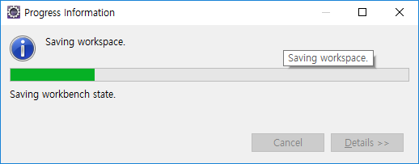
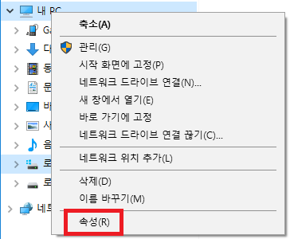
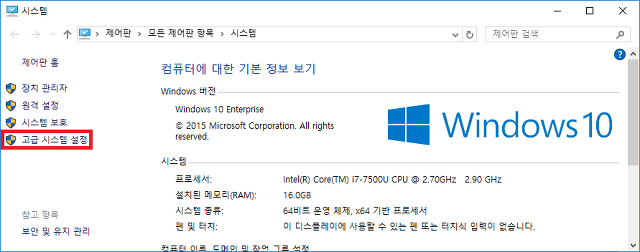
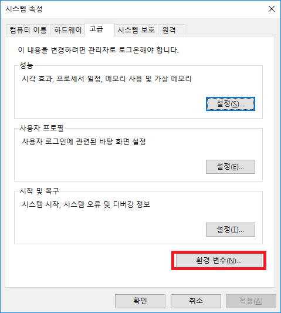
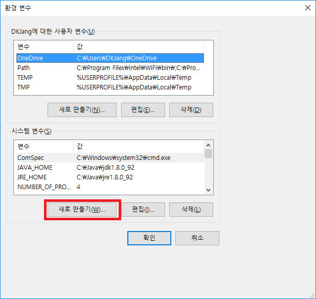
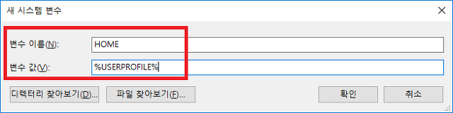

# Eclipse Config Setting

이클립스를 저장 시 멈추는 현상(행)이 걸리는 경우가 있습니다.

이유는 여러가지가 있는 것을 생각됩니다.

이클립스의 Workspace의 .metadata 폴더 내의 .log 파일에 아래의 오류가 있을 경우 처리하는 방법입니다.

# Error List

* !MESSAGE Warning: The environment variable HOME is not set.
* !MESSAGE Using platform encoding (UTF-8 actually) to copy filtered resources, i.e. build is platform dependent!

# !MESSAGE Warning: The environment variable HOME is not set.

```py
!MESSAGE Warning: The environment variable HOME is not set.

The following directory will be used to store the Git

user global configuration and to define the default location to store repositories: 'C:\Users\UserID'.

If this is

not correct please set the HOME environment variable and restart Eclipse.

Otherwise Git for Windows and

EGit might behave differently since they see different configuration options.

This warning can be switched off on the Team > Git > Confirmations and Warnings preference page.
```


1. 아래와 같이 종료가 안될 경우 log파일에서 위의 메세지를 확인합니다.

   해결 방법은 윈도우즈 환경 변수에 HOME을 설정해주면 됩니다.




2. 파일 탐색기에서 내PC를 선택 후 마우스 우측 버튼을 클릭하여 속성을 클릭합니다.



3. 외쪽 메뉴에서 고급시스템설정을 클릭합니다.




4. 시스템 속성의 고급 탭에서 환경변수 버튼을 클릭합니다.




5. 환경 변수 화면에서 시스템 변수의 새로 만들기(W)... 버튼을 클릭합니다.




6. 아래와 같이 변수 이름에 HOME 그리고 변수 값에 %USERPROFILE%을 입력하고, 확인 버튼을 클릭하면 해당 문제는 해결됩니다.




# !MESSAGE Using platform encoding (UTF-8 actually) to copy filtered resources, i.e. build is platform dependent!

Ecliplse Maven프로젝트를 사용시

Using platform encoding (UTF-8 actually) to copy filtered resources, i.e. build is platform dependent!

와 같은 Warning Message를 만나게 되면 아래와 같이 Encoding 설정을 pom.xml에 추가한다.

```xml
<properties>

    <project.build.sourceEncoding>utf-8</project.build.sourceEncoding>

 <project.reporting.outputEncoding>utf-8</project.reporting.outputEncoding>

</properties>
```
