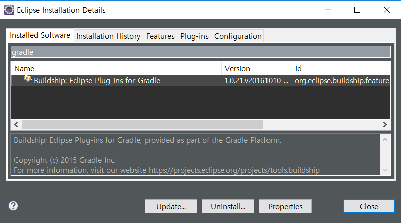
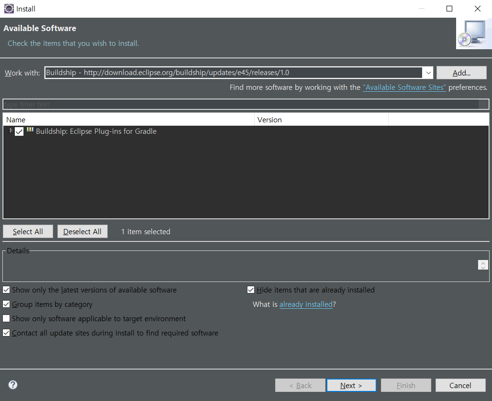
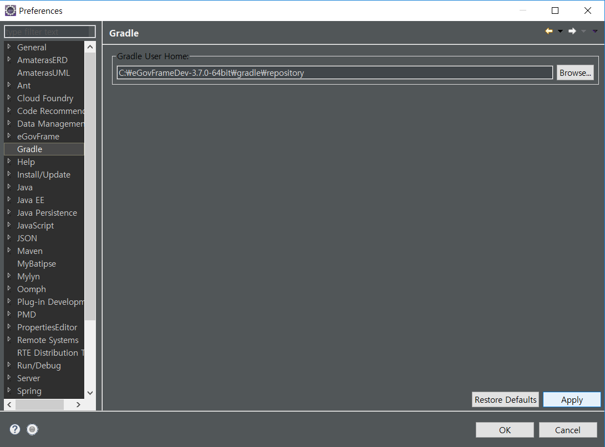
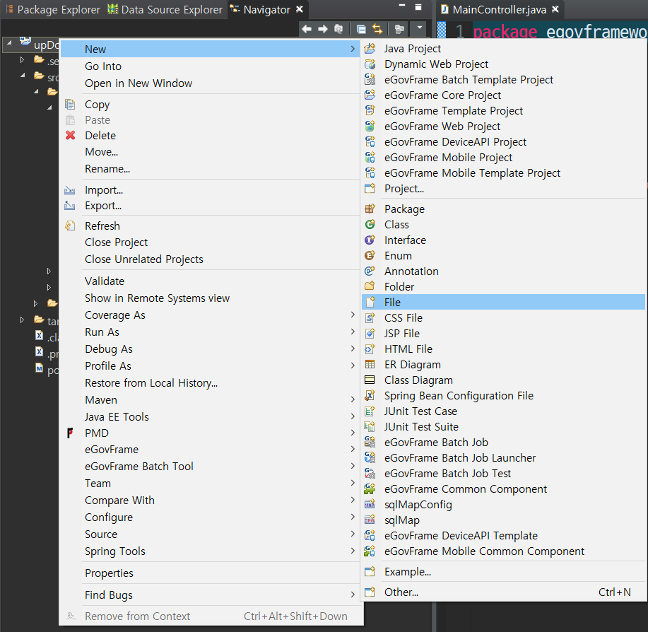
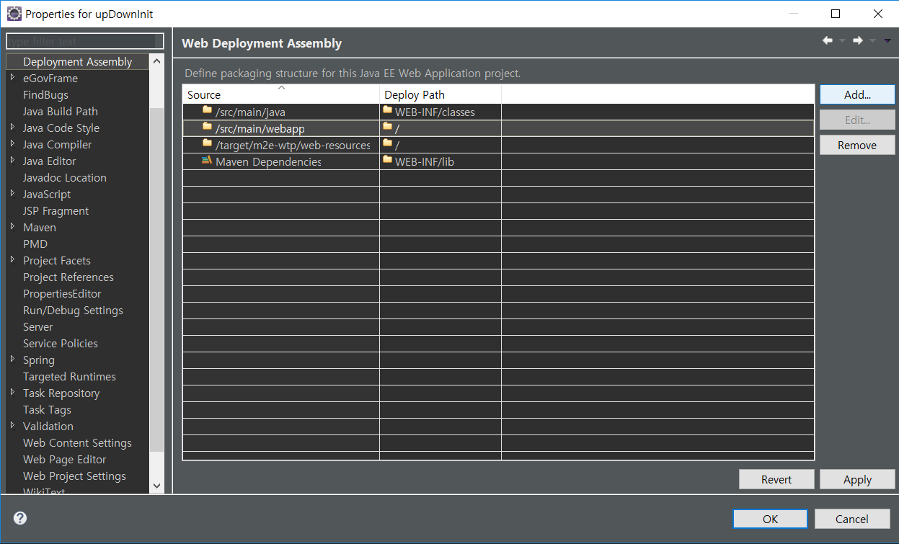

# Gradle Setting

  1. Check Gradle Install Y&N
  
  2. Delete Gradle Set
  
  3. Install Gradle
  
  
  4. Add Gradle View
  
  5. Gradle Location Setting
  
  6. Make Gradle files
  
  
  7. Setting Gradle Add Dependency Config
  ```JAVASCRIPT
  plugins {
	id 'org.springframework.boot' version '2.1.5.RELEASE'
	id 'java'
  }

  apply plugin: 'io.spring.dependency-management'

  group = 'com.example'
  version = '0.0.1-SNAPSHOT'
  sourceCompatibility = '1.8'

  configurations {
  	developmentOnly
  	runtimeClasspath {
  		extendsFrom developmentOnly
  	}
  }

  repositories {
  	mavenCentral()
  }

  dependencies {
  	implementation 'org.springframework.boot:spring-boot-starter-web'
  	implementation 'org.springframework.boot:spring-boot-starter-web-services'
  	implementation 'org.mybatis.spring.boot:mybatis-spring-boot-starter:2.0.1'
  	developmentOnly 'org.springframework.boot:spring-boot-devtools'
  	runtimeOnly 'mysql:mysql-connector-java'
  	testImplementation 'org.springframework.boot:spring-boot-starter-test'
  }

  ```
  8. Disabled Marven Nature
  
  9. Add Gradle Nature
  
  10. Add Deployment Assembly
  
  
