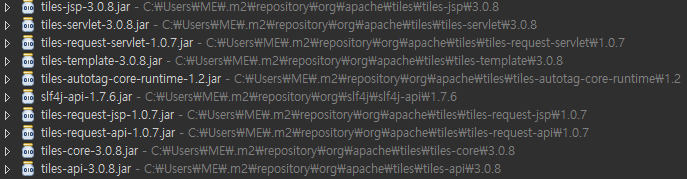

# Tiles Setting&Compare With SiteMesh


타일즈는 Composite View 패턴을 사용하며, 간단하게 View를 모듈화하여 필요한 View를 동적으로 배치한다.

타일즈는 최종 View에 대한 전체적인 layout을 정의하고, 이 layout에 서브 View를 동적으로 삽입하여 보여주므로, layout에 해당하는파일 하나만 수정하면 된다. 따라서 공통된 부분이 존재하는 View의 비율이 증가 할수록 재사용 성이 향상된다.

뷰 단을 구성하는 템플릿 프레임워크는 크게 타일즈(Tiles)와 사이트매쉬(siteMesh) 로 나뉜다.


## 사이트매쉬와 타일즈의 차이

타일즈는 Composite View 패턴을 사용하고, 사이트매쉬는 Decorator 패턴을 사용한다.

이 [두 패턴의 차이점](http://tiles.apache.org/framework/tutorial/pattern)을 비교해보자면 다음과 같다.


## Composite View vs. Decorator

Tiles is a composite view framework: it allows to reuse page pieces across the application.

But another approach to achieve the same result is using the Decorator pattern. For example, Sitemesh is based on the Decorator pattern.

Instead of creating a template and organizing the pieces together, the Decorator pattern (in this case) takes a simple HTML page, transforms it adding the missing pieces (in our example, adding header, footer and menu) and finally renders it.

Here you can find a comparison table between the two patterns.

|  <center>Aspect</center> |  <center> Composite View </center> | <center>Decorator</center> |
|:--------|:--------|:--------|
|**Reusability** | The different parts of the page (template and pieces)  can be reused across the whole application |Each decorator can be reused, but the decoration itself  can be applied to one page at a time. |
|**Ease of configuration** | Each page must be defined explicitly. | The decorator can be applied even to the entire application. |
|**Runtime configuration** | The pages can be configured and organized at runtime |Since one page is decorated at a time, this feature is not  present.|
|**Performances** | Low overhead for composition.  | The page to be decorated has to be parsed. |

* 재사용성 :
 Composite View패턴의 Tiles의 경우 페이지의 모든 부분을 모두 재사용할 수 있다. 반면 Decorator 패턴의 Sitemesh는 각각의 데코레이터를 재사용 할수는 있지만 데코레이션 자체는 한 페이지씩 적용할 수 있다고 한다.
* 설정 :
Composite View 패턴은 각 페이지를 명시적으로 정의해야하지만, Decorator패턴은 전체적으로 적용할 수 있다.
* 실행중 설정여부 :
 Composite View 패턴은 런타임중에 각페이지의 설정을 변경할 수 있고, Decorator 패턴은 최초 한번에 적용이 되기 때문에 런타임중 수정할 수 있는 기능은 존재하지 않는다.
* 성능 :
 Composite View패턴에 비해 매번 페이지를 파싱해야하는 Decorator 패턴은 상대 패턴보다 나은 성능을 기대하긴 어려울것으로 보인다.

---
<br><br>

# EgovFramwork With Tiles

전자정부프레임워크(EgovFramwork)에서 타일즈를 설정하려면 크게 3가지 환경설절이 필요하다.

1. [pom.xml](#pom.xml)
    - [타일즈 선언 및 버전 설정](#타일즈-선언-및-버전-설정)
    - [의존성 주입(Dependency)](#의존성-주입)
2. [dispatcher-servlet.xml](#dispatcher-servlet.xml)
3. [default-layout.xml](#dispatcher-servlet.xml)

## pom.xml

### 타일즈 선언 및 버전 설정

타일즈의 선언과 사용할 버전을 입력해 준다.

**properties 테그**: 타일즈 버전입력

```Java
<org.apache.tiles-version>3.0.8</org.apache.tiles-version>
```  

### 의존성 주입

Spring Framework의 주요기능인 의존성을 주입하여 jar파일을 다운

**dependency 테그**: 타일즈 관련 라이브러리 jar파일 다운로드

```Java
<dependency>
  <groupId>org.apache.tiles</groupId>
  <artifactId>tiles-jsp</artifactId>
  <version>${org.apache.tiles-version}</version>
</dependency>
<dependency>
  <groupId>org.apache.tiles</groupId>
  <artifactId>tiles-core</artifactId>
  <version>${org.apache.tiles-version}</version>
</dependency>
```
(Package Explorer - Maven Dependencies 경로에서 타일즈 관련 jar파일 확인가능)



## dispatcher-servlet.xml

* ViewResolver 의 우선 순위 변경 (1순위 -> 2순위)
* 타일즈의 우선순위를 1순위로 변경

**UrlBasedViewResolver 클래스** 우선순위 설정(기존 Default 설정 순위를 2로 변경)

```Java
<bean class="org.springframework.web.servlet.view.UrlBasedViewResolver" p:order="2"
  p:viewClass="org.springframework.web.servlet.view.JstlView"
  p:prefix="/WEB-INF/jsp/egovframework/example/" p:suffix=".jsp"/>
--------------------------------------------------------------------------
<bean class="org.springframework.web.servlet.view.UrlBasedViewResolver">  		
  <property name="viewClass" value="org.springframework.web.servlet.view.tiles3.TilesView" />  		
  <property name="order" value="1" /> 	
</bean> 	
```

> MainContorller에서 return 명령어에서 jsp파일 상위 경로가 생략되있는 이유는 UrlBasedViewResolver 클래스 설정과정에 **"/WEB-INF/jsp/egovframework/example/"** 경로가 명시되있기 떄문이다.

**TilesConfigurer 클래스** 타일즈 레이아웃 설정(경로지정 : /WEB-INF/tiles/default-layout.xml)

```Java
<bean class="org.springframework.web.servlet.view.tiles3.TilesConfigurer">
<property name="definitions">
<list>
  <value>/WEB-INF/tiles/default-layout.xml</value>
</list>
</property>
</bean>
```

## default-layout.xml

원하는 화면 구성 및 jsp 파일 경로 설정

```Java
<tiles-definitions>
  <definition name="layouts-tiles" template="/WEB-INF/jsp/egovframework/example/cmmn/default-layouts.jsp">
      <put-attribute name="header" value="/WEB-INF/jsp/egovframework/example/cmmn/default-header.jsp" />
      <put-attribute name="left" value="/WEB-INF/jsp/egovframework/example/cmmn/default-left.jsp" />
      <put-attribute name="nav" value="/WEB-INF/jsp/egovframework/example/cmmn/default-nav.jsp" />
      <put-attribute name="content" value="" />
      <put-attribute name="notification" value="/WEB_INRF/jsp/egovframwork/example/cmmn/default-notification.jsp" />
  </definition>

  <definition name="*/*.noside_tiles" extends="layouts-noside_tiles">
    <put-attribute name="content" value="/WEB-INF/jsp/egovframework/example/{1}/{2}.jsp" />
  </definition>
</tiles-definitions>
```

> 고정적인 화면설정에 경우jsp로 파일을 지정해주어서 타일즈 jsp를 지정해준다.
> URL패턴 요청에 따라 변동적인 타일은 영역을 설정해준다.


## default-layouts.jsp

전체 레이아웃 구성

```Java
<%@ page language="java" contentType="text/html; charset=UTF-8" %>
<%@ taglib uri="http://tiles.apache.org/tags-tiles" prefix="tiles"%>
<!DOCTYPE html>
<html>
	<head>
		<tiles:insertAttribute name="header"/>
	</head>
	<body>
		<tiles:insertAttribute name="nav"/>
		<div class="content">
    		<tiles:insertAttribute name="left"/>
			<tiles:insertAttribute name="content"/>
		</div>
	</body>
</html>
```

> **tiles:insertAttribute** 테그를 사용하려면 디렉티브 <%@ taglib uri="http://tiles.apache.org/tags-tiles" prefix="tiles"%>를 추가해야 한다.
