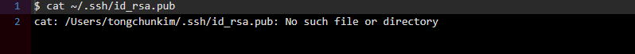
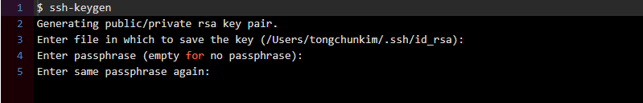
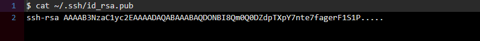
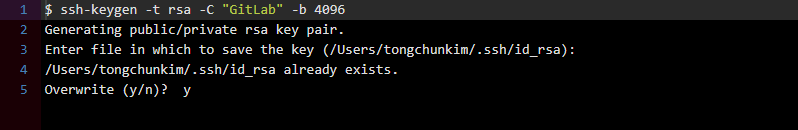

# Git Content

# Categories

0. [What is Git?](#what-is-git?)
0. [Git Command](#git-command)


---

# What is Git?

[What is Git: Bitbucket](!https://www.atlassian.com/git/tutorials/what-is-git)

Git is a **distributed version control[^1]** system for tracking changes in source code during software development.

It is designed for coordinating work among programmers, but it can be used to track changes in any set of files.

Its goals include speed, data integrity, and support for distributed, non-linear work flows.


[^1]: In software development, distributed version control is a form of version control where the complete code base - including is full history - is mirrored on every developer's computer. This allows branching and merging to be managed automatically, increases speeds of most operations.


# Git Command

## Getting Started

> First-Time Git Setup

Now that you have git on your system, you'll want to do a few things to customize your git environment.
You should have to do these things only once on any given computer.
They'll stick around between upgrades.
You can also change them at any time by running through the commands again.

### Step.0 Identity

The first thing you should do when you install Git is to set your user name and email address.
This is important because every Git commit uses this information, and it's immutably baked into the commits you start creating

```Git
$ git config --global user.name "Your Git Nmae"
$ git config --global user.email "Your Git Email"
```

```git
$ git config --global user.name  "charllossDev"
$ git config --global user.email "charlloss.dev@gmail.com"

```
### Step.1.1 All Checking Your Settings

If you want to check your configuration settings, you can use the *git config --list* command to list all the settings Git can find at that point.

```Git
$ git config --list
```

or You can also check what git thinks a specific key's value is by typing *git config <key>*

> Check Your specific key Configure Setting

```Git
$ git config user.name
$ git config user.email
```

### Step.2  Getting a Git Repository

#### Initializing a Repository in an Existing Directory

If you have a project directory that is currently not under version control and you want to start controlling it with Git, you first need to go to that project's directory.
If you've never done this, it looks a little different depending on which system you're running.

```Git
$ git init
```

This create a new subdirectory named .git that contains all of your necessary repository files -- a Git repository skeleton.
At this point, noting in your project is tracked yet.

Next If you want to start version-controlling existing files (as opposed to an empty directory), you should probably begin tracking those files and do an initial commit.
You can accomplish that with a few git add commands that specify the files you want to track, followed by a git commits

```Git
$ git add files or directory

$ git commit -m "Message"
```


> Message Tips!

First Title Keywords

* feat
* fix
* docs
* style
* refactor
* test
* chore


### Step.3 Push Commit Data Set

```Git
$ git remote add origin "Github Repository URL"
```

```Git
$ git push origin master
```

**기존 Push data를 무시하고 강제로 Push**
```Git
$ git push -u origin +master
```


# Git clone

github source copy command

```Git
git clone 'url'
```


# Git Ignore Setting

> gitignore - Specifies intentionally untracked files to ignore

### Description

A **gitignore** file specifies intentionally untracked files that Git should ignore.
Files already tracked by Git are not affected.

https://git-scm.com/docs/gitignore

```
$ cat .gitignore
```

Create Git Igonore File(In git root path) : .gitignore


이제 .gitignore 파일에 버전 관리를 하지 않을 파일 목록들을 작성하면 됩니다.

그런데 .gitignore 파일에 작성한 파일이 이미 버전 관리가 되고 있으면 git은 이 파일을 원래대로 추적합니다.

따라서 이미 버전 관리가 되고 있는 파일들은 수동으로 삭제해줘야 합니다.


git rm --cached 파일명  ( 대쉬가 2개 입니다. )

이 명령어를 입력하면 작성한 파일명을 Git 버전 관리에서 제외한다는 의미가 됩니다.

폴더를 제외하고 싶다면, git rm --cached 폴더명\ -r 명령어를 실행하면 됩니다.


위의 명령어를 실행한 후 꼭 git commit 커밋을 해야 합니다.

출처: https://victorydntmd.tistory.com/80 [victolee]

---

# ERROR

```
 ! [rejected]        master -> master (non-fast-forward)
error: failed to push some refs to 'https://github.com/charllossDev/TIL.git'
```

"git merge" used to allow merging two branches that have no common base by default, which led to a brand new history of an existing project created and then get pulled by an unsuspecting maintainer, which allowed an unnecessary parallel history merged into the existing project. The command has been taught not to allow this by default, with an escape hatch "--allow-unrelated-histories" option to be used in a rare event that merges histories of two projects that started their lives independently.


현상
github에서 저장소 생성 후 저장소 주소를 remote에 입력(git remote add origin https://github…..)했고, 로컬에서도 정상적으로 초기화(git init)했는데도 git pull 또는 git merge 명령이 동작하지 않고 git push origin master시 [rejected] master -> master (non-fast-forward)이런 에러가 발생하는 경우

원인
깃허브에 생성된 원격 저장소와 로컬에 생성된 저장소 간 공통분모가 없는 상태에서 병합하려는 시도로 인해 발생. 기본적으로 관련 없는 두 저장소를 병합하는 것은 안되도록 설정되어 있음.

해결방법
아래와 같이 git pull 시에 –allow-unrelated-histories 옵션 추가하여 관련 없었던 두 저장소를 병합하도록 허용

git pull origin master --allow-unrelated-histories


# Git Error Code: GH001: Large files detected.

GitHub 에는 기본적으로 100MB 이상 되는 파일을 올릴 수 없다.

대용량의 파일을 올리려고 시도할 경우 아래와 같은 에러 메서지가 나온다.

> Error Message

```git-error
$ git push
Counting objects: 3086, done.
Delta compression using up to 4 threads.
Compressing objects: 100% (2980/2980), done.
Writing objects: 100% (3086/3086), 363.25 MiB | 935.00 KiB/s, done.
Total 3086 (delta 1236), reused 111 (delta 57)
remote: error: GH001: Large files detected. You may want to try Git Large File Storage — https://git-lfs.github.com.
remote: error: Trace: ***
remote: error: See http://git.io/iEPt8g for more information.
remote: error: File *** is 120.94 MB; this exceeds GitHub’s file size limit of 100.00 MB
To git@github.com:***
 ! [remote rejected] master -> master (pre-receive hook declined)
 ! [remote rejected] *** -> *** (pre-receive hook declined)
error: failed to push some refs to ‘git@github.com:***’
```

HEAD의 마지막 Commit에는 100MB가 넘는 파일이 없더라도 이전 Commit 중에 100MB 이상의 파일이 포함된 적이 있다면 이 경고를 피할 수 없다.

### 해결책

Commit 과정에서 지정한 파일을 작게 조각내주는 Git extension인 git-lfs — Git Large File Storage https://git-lfs.github.com/ — 를 로컬에 설치한 뒤, 적용하려는 Repository 경로에서 다음 명령을 실행한다.

```git
$ git lfs install
Updated pre-push hook.
Git LFS initialized.
```
그다음 용량이 큰 파일을 git-lfs의 관리 대상으로 등록해준다. 다음 예시는 120MB 정도의 exe 파일을 Stage에 추가한 상황에서, 확장자가 exe인 모든 파일을 git-lfs의 관리 대상으로 지정하고 Commit을 수행한 모습이다.

```git
$ git lfs track “*.exe”
Tracking *.exe
$ git commit -m “Large file included”
[master (root-commit) dd2b715] Large file included
(...)
```

이제 하단에 있는 3번 과정대로 Github에 push를 시도하면 된다. 그런데 기존에 100MB 이상의 파일을 Commit한 적이 있다면 여전히 100MB 이상의 파일을 올릴 수 없다는 경고 메시지를 보게 된다. 그럴 땐 다음 2번 과정을 적용해야 한다.

2. BFG Repo-Cleaner 적용
기존 Commit에서 100MB보다 큰 파일의 로그를 강제로 없애줘야 한다. BFG Repo-Cleaner — BFG Repo-Cleaner https://rtyley.github.io/bfg-repo-cleaner/ — 를 이용하면 그 작업을 손쉽게 적용할 수 있다.

공식 사이트에서 bfq-x.x.x.jar — x.x.x는 버전 — 를 받고, 대상이 되는 Repository에서 다음과 같이 그동안의 Commit에 포함된 100MB 이상의 파일을 정리하는 명령을 실행한다.
```git
$ java -jar bfg-1.13.0.jar --strip-blobs-bigger-than 100M
```

실행 결과 에러 시

```git-bfq-x.x.x.jar-Eroor
Using repo : C:\eGovFrameDev-3.6.0-64bit\workspace2\Eagle-Eye-Admin\.git

Scanning packfile for large blobs: 1108
Scanning packfile for large blobs completed in 67 ms.
Warning : no large blobs matching criteria found in packfiles - does the repo need to be packed?
Please specify tasks for The BFG :
bfg 1.13.0
Usage: bfg [options] [<repo>]

  -b, --strip-blobs-bigger-than <size>
                           strip blobs bigger than X (eg '128K', '1M', etc)
  -B, --strip-biggest-blobs NUM
                           strip the top NUM biggest blobs
  -bi, --strip-blobs-with-ids <blob-ids-file>
                           strip blobs with the specified Git object ids
  -D, --delete-files <glob>
                           delete files with the specified names (eg '*.class', '*.{txt,log}' - matches on file name, not path within repo)
  --delete-folders <glob>  delete folders with the specified names (eg '.svn', '*-tmp' - matches on folder name, not path within repo)
  --convert-to-git-lfs <value>
                           extract files with the specified names (eg '*.zip' or '*.mp4') into Git LFS
  -rt, --replace-text <expressions-file>
                           filter content of files, replacing matched text. Match expressions should be listed in the file, one expression per line - by default, each expression is treated as a literal, but 'regex:' & 'glob:' prefixes are supported, with '==>' to specify a replacement string other than the default of '***REMOVED***'.
  -fi, --filter-content-including <glob>
                           do file-content filtering on files that match the specified expression (eg '*.{txt,properties}')
  -fe, --filter-content-excluding <glob>
                           don't do file-content filtering on files that match the specified expression (eg '*.{xml,pdf}')
  -fs, --filter-content-size-threshold <size>
                           only do file-content filtering on files smaller than <size> (default is 1048576 bytes)
  -p, --protect-blobs-from <refs>
                           protect blobs that appear in the most recent versions of the specified refs (default is 'HEAD')
  --no-blob-protection     allow the BFG to modify even your *latest* commit. Not recommended: you should have already ensured your latest commit is clean.
  --private                treat this repo-rewrite as removing private data (for example: omit old commit ids from commit messages)
  --massive-non-file-objects-sized-up-to <size>
                           increase memory usage to handle over-size Commits, Tags, and Trees that are up to X in size (eg '10M')
  <repo>                   file path for Git repository to clean

```

그럴 땐 아래 명령을 먼저 수행하고 다시 위의 bfg-x.x.x.jar에 의한 명령을 실행한다.

```git
$ git repack && git gc
Counting objects: 3002, done.
(...)
```
> 마지막으로
> git-push 재시도
> 위 과정들을 적용한 뒤 push를 시도하면 다음과 같이 성공 메시지를 볼 수 있다.

https://medium.com/@stargt/github%EC%97%90-100mb-%EC%9D%B4%EC%83%81%EC%9D%98-%ED%8C%8C%EC%9D%BC%EC%9D%84-%EC%98%AC%EB%A6%AC%EB%8A%94-%EB%B0%A9%EB%B2%95-9d9e6e3b94ef

# CRLF will be replaced by LF ERROR

https://blog.jaeyoon.io/2018/01/git-crlf.html

이 기능은 개발자가 git에 코드를 추가했을 때 (예컨대 커밋할 때)에는 CRLF를 LF로 변환해주고, git의 코드를 개발자가 조회할 때 (예컨대 clone한다거나 할 때)에는 LF를 CRLF로 변환해준다.

그러므로 윈도우 사용자의 경우 이러한 변환이 항상 실행되도록 다음과 같은 명령어를 입력한다. 물론 시스템 전체가 아닌 해당 프로젝트에만 적용하고 싶다면 —global 을 빼주면 된다.

git config --global core.autocrlf true
리눅스나 맥을 사용하고 있는 경우, 조회할 때 LF를 CRLF를 변환하는 것은 원하지 않을 것이다. 따라서 뒤에 input이라는 명령어를 추가해줌으로써 단방향으로만 변환이 이루어지도록 설정한다.

git config --global core.autocrlf true input
혹은 이러한 변환 기능을 원하지 않고, 그냥 에러 메시지 끄고 알아서 작업하고 싶은 경우에는 아래 명령어로 경고메시지 기능인 core.safecrlf를 꺼주면 된다.

git config --global core.safecrlf false


# Git & GitLab SSH Key 할당

1. 키 존재 여부 확인


2. 키 생성

  Enter file in which to save the key (/Users/tongchunkim/.ssh/id_rsa):
  어디에 key를 만들지 묻는다.
  그냥 엔터를 처서 기본 위치에 기본 파일명으로 만들면 된다.
  Enter passphrase (empty for no passphrase):
  key에 대한 비밀번호를 만들라고 나오는데 보통 그냥 엔터로 넘어간다.

그럼 키가 만들어지고 기본 위치(/Users/tongchunkim/.ssh/id_rsa)에 파일이 생성

3. 키 확인


4. GitLab을 위한 SSH Key 생성

