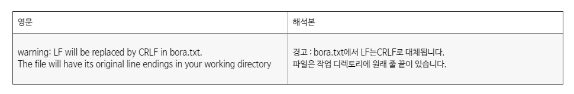

# warning: LF will be replaced by CRLF in File

git add warning message

git add 시에 다음과 같은 경고 메세지가 출력되는 경우가 있다.


```
warning: LF will be replaced by CRLF in bora.txt.
The file will have its original line endings in your working directory
```



# LF(Line-Feed)
* Mac, Linux (Unix 계열) 줄바꿈 문자열 = \n
* ASCII 코드 = 10
* 커서 위치는 그대로 두고 종이의 한라인 위로 올리는 동작
* 현재 위치에서 바로 아래로 이동
* 종이를 한칸올리기


# CR(Carriage-Return)
* Mac 초기 모델 줄바꿈 문자열 = \r
* ASCII 코드 = 13
* 커서 위치를 맨앞으로 옮기는 동작
* 커서 위치를 앞으로 이동


# CRLF (Carriage-Return+Line-Feed)
* Windows, DOS 줄바꿈 문자열 = \r\n
* CR(\r) + LR(\n) 두 동작을 합쳐서 (\r\n)
* 커서를 다음라인 맨앞으로 옮겨주는 동작

> 즉 OS 마다 줄바꿈 처리 문자열이 다르기 때문에 형상관리 해주는 Git 입장에서 줄바꿈 문자열이 다르다고 경고해주는 것

# 해결방법

check-in, check-out 할 때 파일을 어떻게 처리할지 설정하는 변수

* core.autocrlf = true

CRLF > LF 변경
* core.autocrlf = false

## Window, Dos 설정

```
git config --global core.autocrlf true
```


## Mac, Linux 설정

```
git config --global core.autocrlf input
```
