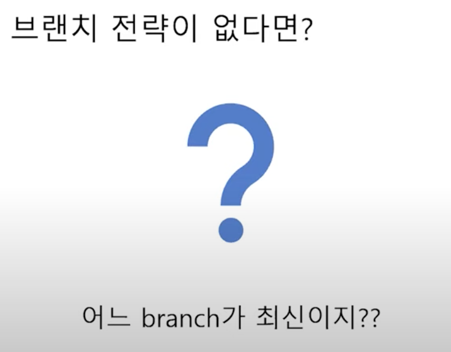
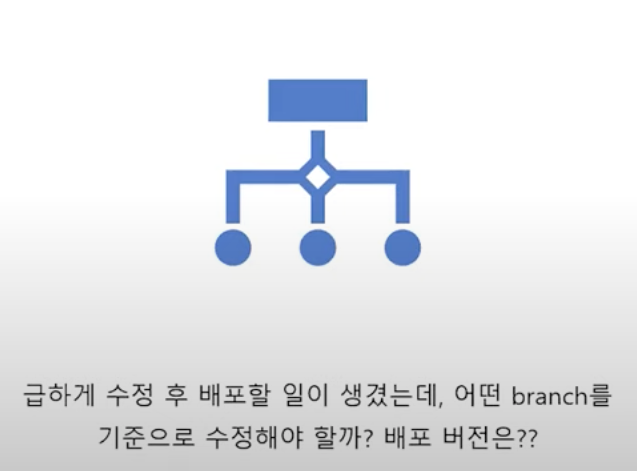

# Git branch management strategy

브랜치 전략이란?

* 여러 개발자가 협업하는 환경에서 git 저장소를 효과적으로 활용하기 위한 work-flow
* 브랜치의 생성,삭제,병합이 자유로운 git의 유연한 구조를 활용하여 다양한 방식으로 소스 관리

## git-flow

* 메인 브랜치: 항상 유지
  - master: 제품으로 출시될 수 있는 브랜치
  - devepop: 다음 출시 버전을 개발하는 브랜치
* 보조 브랜치: merge되면 제거
  - feature: 기능을 개발하는 브랜치
  - release: 이번 출시 버전을 준비하는 브랜치
  - hotfix: 출시 버전에서 발생한 버그를 수정하는 브랜치
* 장점
  - 주기적으로 배포하는 서비스에 적합
  - 가장 유명한 전략인 만큼 많은 IDE 가 지원

참고 - [우아한형제들 git-flow 적용기](https://woowabros.github.io/experience/2017/10/30/baemin-mobile-git-branch-strategy.html)
