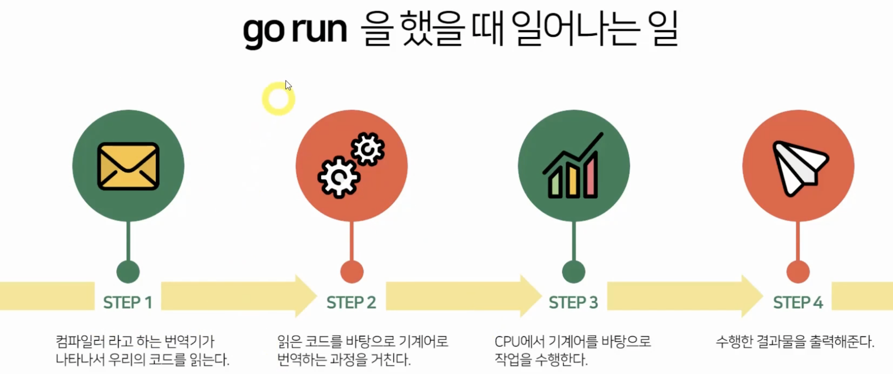
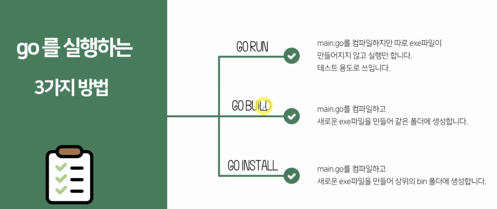

# Go
* 2009년 google에서 개발된 언어
* 가비지 컬렉션 기능
* 병행성을 잘 지원하는 컴파일 언어

# Go run



# Go input & output lib
```go
import "fmt"

var a int // 변수 선언

_, _ = fmt.Scanln(&a) // 출력

fmt.Println(a) // 입력
```

# Go 반복문
* for 문
  ```go
  sum := 0
  for i := 0; i < 5; i++ {
    sum += i
  }
  ```
    - for : range 문
      ```go
      z := []string{"아메리카노", "카페라떼", "돌체라떼"}

      for index, menu := range z {
        fmt.Println(index, menu)
      }
      ```
* if 문
  ```go
  결제수단 := "미정"

  if 결제수단 == "카드"
    fmt.Println("카드결제")
  else if 결제수단 == "현금"
    fmt.Println("현금결제")
  else
    fmt.Println("결제 방법이 잘못됨")
  ```
    - 변수를 선언하는 if 문
    ```go
      var password string
    	fmt.Scanln(&password)
    	if pass := "abc"; pass == password {
    		fmt.Println("비밀번호가 맞습니다.")
    	}
    ```
* switch 문
  ```go
  switch password {
  case "abc":
    fmt.Println("유저")
  case "bcd":
    fmt.Println("관리자")
  default:
    fmt.Println("실패")

  }
  ```

# Go function
* 매개변수 갯수를 아는 경우
  ```go
  func add(a, b int) int {
    return a + b
  }
  ```
* 매개변수 갯수가 다양한 경우
  ```go
  // 들어온 인트 매개변수를 배열로 받아 모두 더한다.
  func addAll(li ...int) int {
    result := 0
    for _, n := range li {
      result += n
    }
    return result
  }
  ```

# Go Array

* 배열
  ```go
  var a [5]int
  var b [5]string

  c := [5]int{1,2,3,4,5}
  ```
* slice: 배열은 갯수를 지정해 주지만, slice는 배열 자료형의 갯수를 유연하게 가지는 자료형
  ```go
  var a []int // 언제든 늘리고, 배열을 추가할 수 있다

  a := make([]int, 3) // 3개 배열 생성
  ```
* map: key-value 구조 타입의 자료형
  ```go
  m := make(map[string]int) // key: string, value:int 타입의 맵 생성

  m["a"] = 3
  m["b"] = 7

  delete(m, "a")
  a, exi := m["a"] // a =3, exi=true
  c, exp := m["c"] // c =0, exp=false
  ```


# Go structor
* struct
  ```go
  type person struct {
  	name string
  	age int
  	job string
  }
  func main() {

  	p1 := person{"austin", 30,  "programmer"}
  	p2 := person{name: "sopia", age: 29, job: "producer"}

  	fmt.Println(p1, p2)
  	fmt.Println(p1.name, p2.age)
  }
  ```


## Go Application
* k8s
* docker
