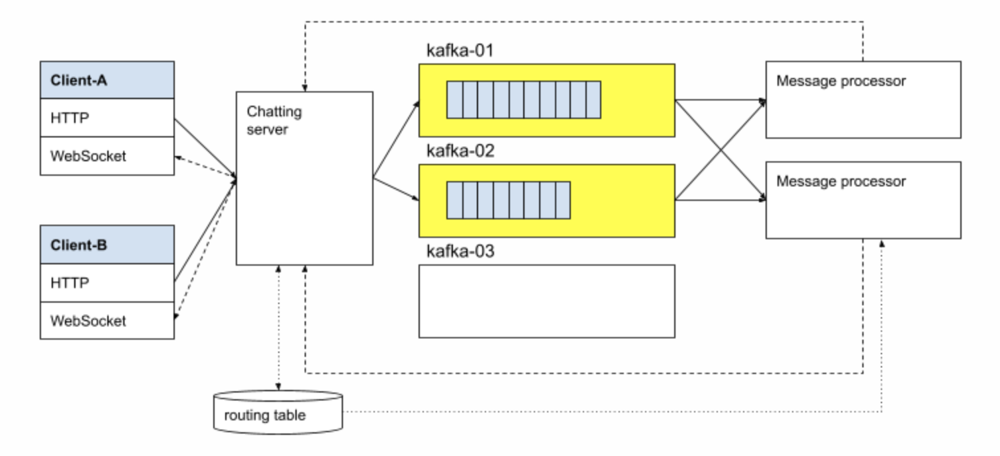
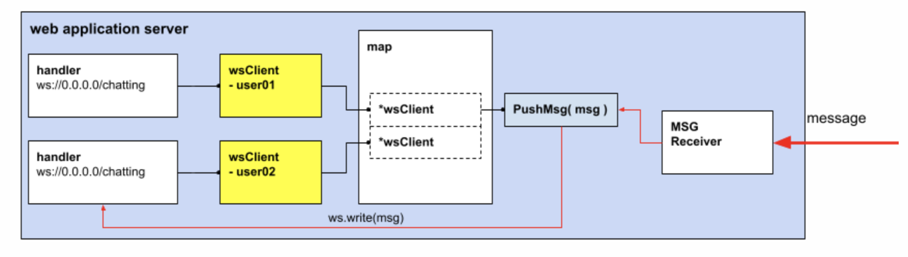

# Go - kafka chatting program

* 클라이언트는 WebSocket, HTTP, MQTT 등의 메시지 인터페이스
  + 웹 브라우저를 사용하는 서비스라면 HTTP와 WebSocket 조합 혹은 Websocket만으로 구성
  + IoT 서비스 혹은 네티이브 애플리케이션을 대상으로 하는 서비스라면 WebSocket과 MQTT 조합으로 구성
* 최종적으로 카프카를 연습하기 위한 구조로 클라이언트는 웹 브러우저 기반
  + 메세지 전송은 Http
  + 메세지 수신은 WebSocket 으로 구현
* 클라이언트가 메세지를 보내면, Chatting server로 전성
* Chatting server
  + 서버는 메세지 게이트웨이로, 메세지에 대한 인증/권한 검사 및 메세지 송수신을 담당
    - Message gateway
    - HTTP, Websocket interface
  + 카프카 연결  
    - 카프카 프로듀서 역활
    - 서버는 메세지를 kafka 클러스터 토픽으로 전송
    - 카프카 프로듀서는 카프카 토픽으로 부터 채팅 메세지를 읽고 처리하여, 다시 서버로 전송
    
* Kafka
  + kafka 는 3개의 클러스터로 구성
  + 메세지를 위한 토픽은 `chatting` 구성
  + 토픽 가용성을 위해 2개의 리플리카 구성
  + Kafka Consumer
    - 메세지를 읽어 누가 누구에게 보내는 제세지 인지 확인
