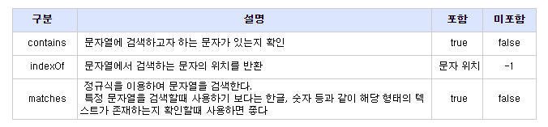

# String Find Method

특정 문자열에서 원하는 문자가 포함되어 있는지 확인해야 할 때가 있습니다.
다양한 방법들 중 자바 문자열 관련 지원하는 메서드 3가지를 정리하려고 합니다.

* contains
* indexOf
* matches

# Code
```Java
public class StringFinder {

    public static void main(String[] args) {
        // TODO Auto-generated method stub


        String txt1 = "가나다라" ;
        String txt2 = "해당 내용은 테스트 입니다" ;
        String txt3 = "가격은 29,000원 입니다" ;


        // contains를 이용한 방법(true, false 반환)
        if(txt1.contains("나다"))
            System.out.println("문자열 있음!");
        else
            System.out.println("문자열 없음!");


        // indexOf를 이용한 방법
        if(txt2.indexOf("테스트") > -1)
            System.out.println("문자열 있음!");
        else
            System.out.println("문자열 없음!");


        // matches를 이용한 방법
        if(txt2.matches(".*테스트.*"))
            System.out.println("문자열 있음!");
        else
            System.out.println("문자열 없음!");


        // matches를 이용하여 정규 표현식으로 문자열에 숫자가 있는지 확인
        if(txt3.matches(".*[0-9].*"))
            System.out.println("숫자 있음!");
        else
            System.out.println("숫자 없음!");

    }

}
```


