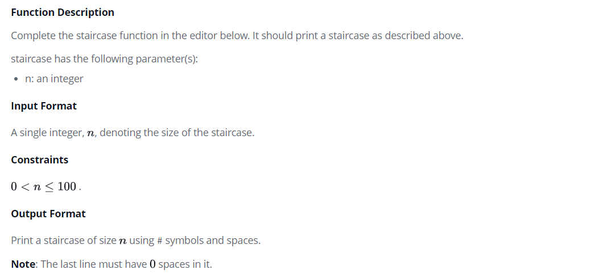

# Staircase
https://www.hackerrank.com/challenges/staircase/problem?h_r=next-challenge&h_v=zen&h_r=next-challenge&h_v=zen

Consider a staircase of size : $n = 4$

```
    #
   ##
  ###
 ####
```

Observe that its base and height are both equal to $n$, and the image is drawn using # symbols and spaces. The last line is not preceded by any spaces.

Write a program that prints a staircase of size  $n$.



# Input
```
6
```

# Output
```
     #
    ##
   ###
  ####
 #####
######
```

# Explanation

The staircase is right-aligned, composed of # symbols and spaces, and has a height and width $n = 6$.

# Dev
```Java
import java.io.*;
import java.math.*;
import java.security.*;
import java.text.*;
import java.util.*;
import java.util.concurrent.*;
import java.util.regex.*;

public class Solution {

    // Complete the staircase function below.
    static void staircase(int n) {

        for (int i = 0; i < n; i++) {
            for (int j = 0; j < n; j++) {
                if (n-i-1 > j) System.out.print(" ");
                else System.out.print("#");  

            }
            System.out.println();
        }
    }

    private static final Scanner scanner = new Scanner(System.in);

    public static void main(String[] args) {
        int n = scanner.nextInt();
        scanner.skip("(\r\n|[\n\r\u2028\u2029\u0085])?");

        staircase(n);

        scanner.close();
    }
}
```
