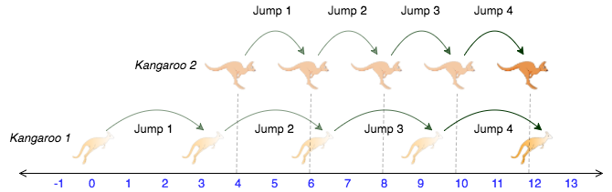

# Kangaroo

You are choreographing a circus show with various animals. For one act, you are given two kangaroos on a number line ready to jump in the positive direction (i.e, toward positive infinity).

* The first kangaroo starts at location $x1$ and moves at a rate of $v1$ meters per jump.
* The second kangaroo starts at location $x2$ and moves at a rate of $v2$ meters per jump.
You have to figure out a way to get both kangaroos at the same location at the same time as part of the show. If it is possible, return YES, otherwise return NO.


## Function Description

Complete the function kangaroo in the editor below. It should return YES if they reach the same position at the same time, or NO if they don't.

kangaroo has the following parameter(s):

* x1, v1: integers, starting position and jump distance for kangaroo 1
* x2, v2: integers, starting position and jump distance for kangaroo 2

## Input Format

A single line of four space-separated integers denoting the respective values of $x1$, $v1$, $x2$, and $v2$.

## Constraints
* $0 < x1 < x2 < 10000$
* $1 < v1 < 10000$
* $1 < v2 < 10000$
## Output Format

Print YES if they can land on the same location at the same time; otherwise, print NO.

Note: The two kangaroos must land at the same location after making the same number of jumps.

## Explanation

The two kangaroos jump through the following sequence of locations:



From the image, it is clear that the kangaroos meet at the same location (number $12$ on the number line) after same number of jumps ($4$ jumps), and we print YES.


# Dev
```js
import java.io.*;
import java.math.*;
import java.security.*;
import java.text.*;
import java.util.*;
import java.util.concurrent.*;
import java.util.regex.*;

public class Solution {

    // Complete the kangaroo function below.
    static String kangaroo(int x1, int v1, int x2, int v2) {

        if( ( x1 < x2 && v1 > v2 ) || ( x1 > x2 && v1 < v2 ) ) {
            if( Math.abs(x1-x2)%Math.abs(v1-v2) == 0) return "YES";
        }      

        return "NO";
    }

    private static final Scanner scanner = new Scanner(System.in);

    public static void main(String[] args) throws IOException {
        BufferedWriter bufferedWriter = new BufferedWriter(new FileWriter(System.getenv("OUTPUT_PATH")));

        String[] x1V1X2V2 = scanner.nextLine().split(" ");

        int x1 = Integer.parseInt(x1V1X2V2[0]);

        int v1 = Integer.parseInt(x1V1X2V2[1]);

        int x2 = Integer.parseInt(x1V1X2V2[2]);

        int v2 = Integer.parseInt(x1V1X2V2[3]);

        String result = kangaroo(x1, v1, x2, v2);

        bufferedWriter.write(result);
        bufferedWriter.newLine();

        bufferedWriter.close();

        scanner.close();
    }
}

```
