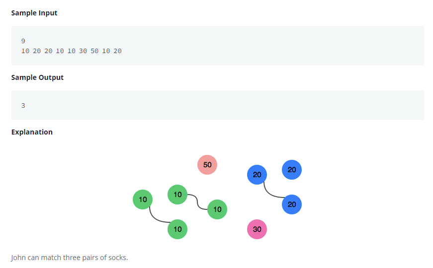

# Sock Merchant
[](https://www.hackerrank.com/challenges/sock-merchant/problem)




```java
import java.io.*;
import java.math.*;
import java.security.*;
import java.text.*;
import java.util.*;
import java.util.concurrent.*;
import java.util.regex.*;

public class Solution {

    // Complete the sockMerchant function below.
    public static int sockMerchant(int n, int[] ar) {

        int totalSocks = 0; // count total sock
        Set<Integer> colors = new HashSet<Integer>(); // check color set

        for (int key : ar) {
            if (!colors.contains(key)) {
                colors.add(key);
            } else {
                totalSocks++;
                colors.remove(key);
            }
        }

        return totalSocks;
    }

    private static final Scanner scanner = new Scanner(System.in);

    public static void main(String[] args) throws IOException {
        BufferedWriter bufferedWriter = new BufferedWriter(new FileWriter(System.getenv("OUTPUT_PATH")));

        int n = scanner.nextInt();
        scanner.skip("(\r\n|[\n\r\u2028\u2029\u0085])?");

        int[] ar = new int[n];

        String[] arItems = scanner.nextLine().split(" ");
        scanner.skip("(\r\n|[\n\r\u2028\u2029\u0085])?");

        for (int i = 0; i < n; i++) {
            int arItem = Integer.parseInt(arItems[i]);
            ar[i] = arItem;
        }

        int result = sockMerchant(n, ar);

        bufferedWriter.write(String.valueOf(result));
        bufferedWriter.newLine();

        bufferedWriter.close();

        scanner.close();
    }
}

```
