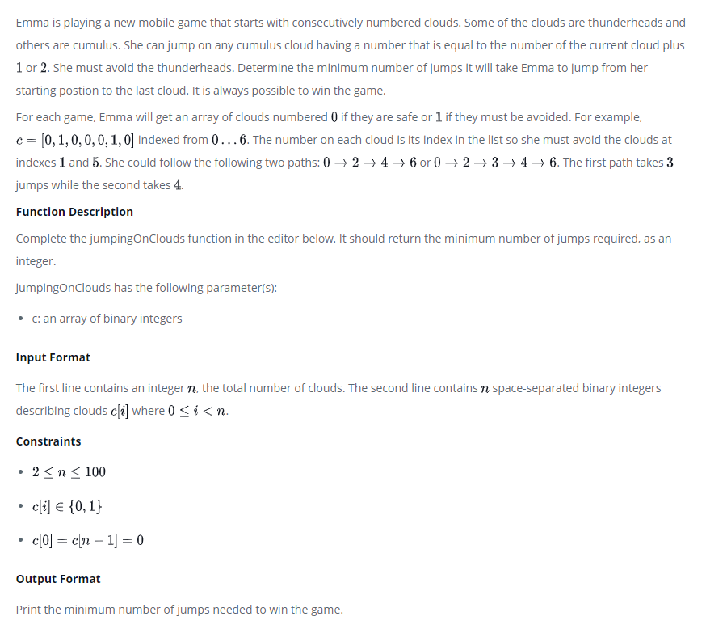
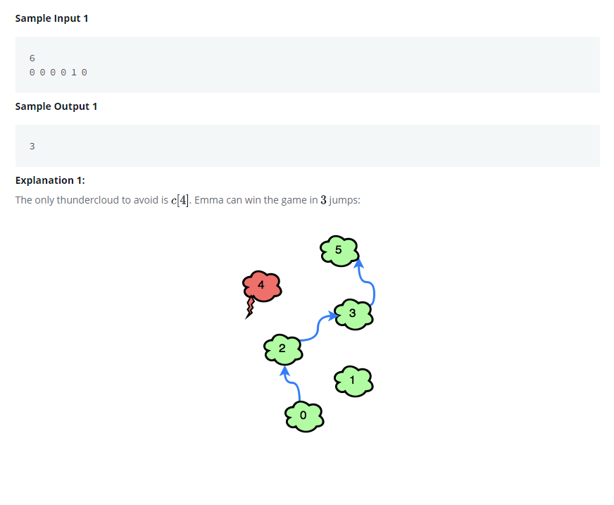

# Jumping on the Clouds
[](https://www.hackerrank.com/challenges/jumping-on-the-clouds/problem?h_l=interview&playlist_slugs%5B%5D=interview-preparation-kit&playlist_slugs%5B%5D=warmup)







# Result

```java

import java.io.*;
import java.math.*;
import java.security.*;
import java.text.*;
import java.util.*;
import java.util.concurrent.*;
import java.util.regex.*;

public class Solution {

    // Complete the jumpingOnClouds function below.
    static int jumpingOnClouds(int[] c) {

        int i = 0;
        int minJumpCnt = 0;
        int lastIndex = c.length -1;

        while(i < lastIndex) {

            if ((i+2) <= lastIndex && c[i+2] == 0) i++;

            minJumpCnt++;
            i++;
        }

        return minJumpCnt;
    }

    private static final Scanner scanner = new Scanner(System.in);

    public static void main(String[] args) throws IOException {
        BufferedWriter bufferedWriter = new BufferedWriter(new FileWriter(System.getenv("OUTPUT_PATH")));

        int n = scanner.nextInt();
        scanner.skip("(\r\n|[\n\r\u2028\u2029\u0085])?");

        int[] c = new int[n];

        String[] cItems = scanner.nextLine().split(" ");
        scanner.skip("(\r\n|[\n\r\u2028\u2029\u0085])?");

        for (int i = 0; i < n; i++) {
            int cItem = Integer.parseInt(cItems[i]);
            c[i] = cItem;
        }

        int result = jumpingOnClouds(c);

        bufferedWriter.write(String.valueOf(result));
        bufferedWriter.newLine();

        bufferedWriter.close();

        scanner.close();
    }
}

```

# Refactor

* for문을 이용해서 점프수를 구하면, 배열의 길이 n번 만큼 반복하며, 점프 수를 구한다.

```java

static int jumpingOnClouds(int[] arr)
int lastIndex = arr.length -1;
boolean superJumgFlag = false;

for (int i = 0; i < arr.length - 1; i++) {

    if (superJumgFlag) {
        superJumgFlag = false;
    } else {
        if ((i+2) <= lastIndex && arr[i+2] == 0) {
            superJumgFlag = true;
        }
        ++minJumpCnt;
    }

    return minJumpCnt;
}
```

* while문으로, 배열의 길이 n번 만큼이 아닌, 최소 점프수 result 번 반복하여 결과를 구한다.

```java
static int jumpingOnClouds(int[] c) {

    int i = 0;
    int minJumpCnt = 0;
    int lastIndex = c.length -1;

    while(i < lastIndex) {

        if ((i+2) <= lastIndex && c[i+2] == 0) i++;

        minJumpCnt++;
        i++;
    }

    return minJumpCnt;
}
```
