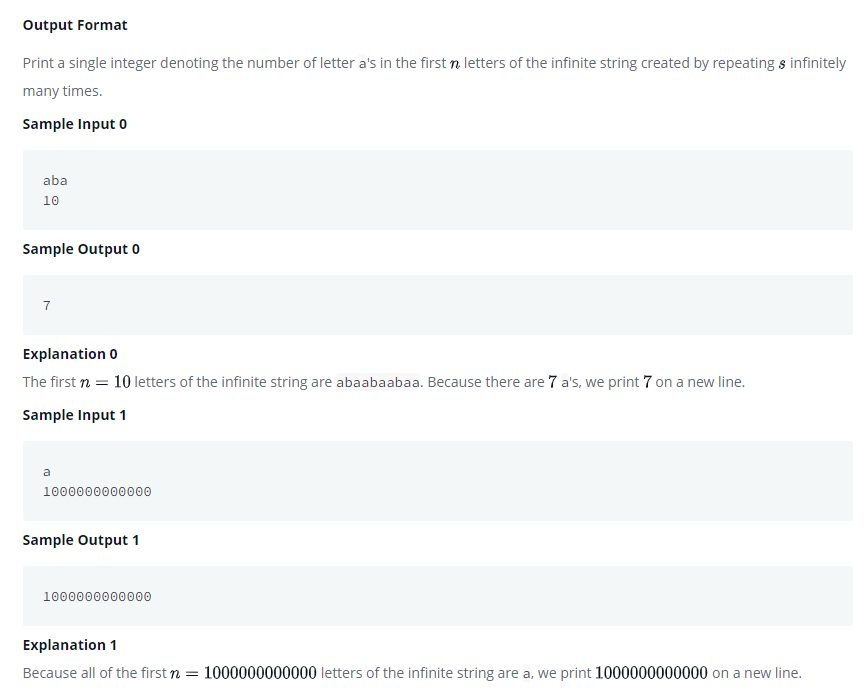

# Repeated String





# Code

```Java
import java.io.*;
import java.math.*;
import java.security.*;
import java.text.*;
import java.util.*;
import java.util.concurrent.*;
import java.util.regex.*;

public class Solution {

    // Complete the repeatedString function below.
    public static long repeatedString(String str, Long len) {

        long result, count = 0;
        long repeate = len/str.length();
        long num = len - (str.length() * repeate );


        for (char s : str.toCharArray()) {
            if (s == 'a') count++;
        }
        result = count * repeate;

        if (num != 0) {

            String s = str.substring(0, (int) num);
            result += repeatedString(s, (long) s.length());
        }

        return result;
    }
    private static final Scanner scanner = new Scanner(System.in);

    public static void main(String[] args) throws IOException {
        BufferedWriter bufferedWriter = new BufferedWriter(new FileWriter(System.getenv("OUTPUT_PATH")));

        String s = scanner.nextLine();

        long n = scanner.nextLong();
        scanner.skip("(\r\n|[\n\r\u2028\u2029\u0085])?");

        long result = repeatedString(s, n);

        bufferedWriter.write(String.valueOf(result));
        bufferedWriter.newLine();

        bufferedWriter.close();

        scanner.close();
    }
}
```

# Result
가끔 자바에서 나눗셈 연산의 정확한 값을 도출하지 못해 예상 밖의 결과가 나와 당황스러운 경험이 있다.

자바에서 나눗셈을 하는 경우에는 내부 구현 상의 이유로 인해 float나 double형을 사용하면 정확한 값을 구하지 못하는 경우가 발생한다. 물론 간단한 연산을 하는 경우에 큰 문제가 발생하지 않을 수도 있지만 아주 미세한 차이만 발생하더라도 치명적인 상황이 발생할 수 있는 금융, 공학 분야에서는 큰 문제일 것이다.

따라서 일반적인 경우에도 BigDecimal을 이용하는 것이 좋을 것 같다. BigDecimal객체 생성시에는 인수 값으로 double, float형보다는 String형으로 넘겨주는 것이 좋으며 객체간 비교시에는 compareTo메소드를 이용하는 것이 좋다고 한다. 나눗셈에 대한 정확한 이해와 함께 BigDecimal 사용하는 것이 오류를 예방할 수 있는 방법이 될 것 같다.

### BigDecimal
- double로 표현이 되지 않는 부동소수점 표현을 위한 class
- 부동소수점 계산시 정확한 계산을 위해 이용
