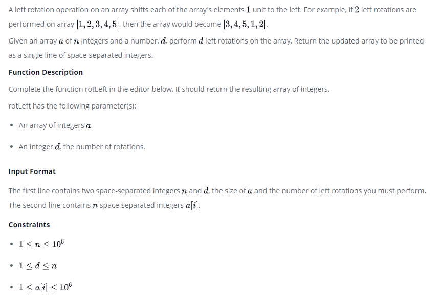

# Left Rotation




# Code

```Java
import java.io.*;
import java.math.*;
import java.security.*;
import java.text.*;
import java.util.*;
import java.util.concurrent.*;
import java.util.regex.*;

public class Solution {

    // Complete the rotLeft function below.
    static int[] rotLeft(int[] a, int d) {
        int arrayLength = a.length;
        int[] temp = new int[arrayLength];

        for (int j = 0; j < arrayLength; j++) {

            // one time
            int num = d + j;
            temp[j] = a[num > (arrayLength-1) ? num-arrayLength : num];
        }

        return temp;
    }

    private static final Scanner scanner = new Scanner(System.in);

    public static void main(String[] args) throws IOException {
        BufferedWriter bufferedWriter = new BufferedWriter(new FileWriter(System.getenv("OUTPUT_PATH")));

        String[] nd = scanner.nextLine().split(" ");

        int n = Integer.parseInt(nd[0]);

        int d = Integer.parseInt(nd[1]);

        int[] a = new int[n];

        String[] aItems = scanner.nextLine().split(" ");
        scanner.skip("(\r\n|[\n\r\u2028\u2029\u0085])?");

        for (int i = 0; i < n; i++) {
            int aItem = Integer.parseInt(aItems[i]);
            a[i] = aItem;
        }

        int[] result = rotLeft(a, d);

        for (int i = 0; i < result.length; i++) {
            bufferedWriter.write(String.valueOf(result[i]));

            if (i != result.length - 1) {
                bufferedWriter.write(" ");
            }
        }

        bufferedWriter.newLine();

        bufferedWriter.close();

        scanner.close();
    }
}

```


## Feedback

최초에는 이중 반복문을 이용해서 문제해결을 시도했다.

```Java
static int[] tempLeft(int[] a, int d) {

    int arrayLength = a.length;
    int[] temp = new int[arrayLength];

    for (int i = 0; i < d; i++) {
        for (int j = 0; j < arrayLength; j++) {

            if (j == 0) temp[arrayLength-1] = a[j];
            else temp[j-1]= a[j];
        }
        a = temp.clone();
    }
    return a;
}
```

Left 하는 횟수가 늘어날 수록 속도가 느려지는 복잡도를 가지기 떄문에, 개선여지가 필요했다.

예를 들어

* Array length: 73642
* Shift count: 60581

이러한 상황이라면, 무수히 많은 반복을 하여 수십여초가 걸렸고, 한번에 쉬프트하는 로직이 필요하여, 쉬프트 횟수를 응용해서 한번에 해결하는 로직으로 코딩했다.
