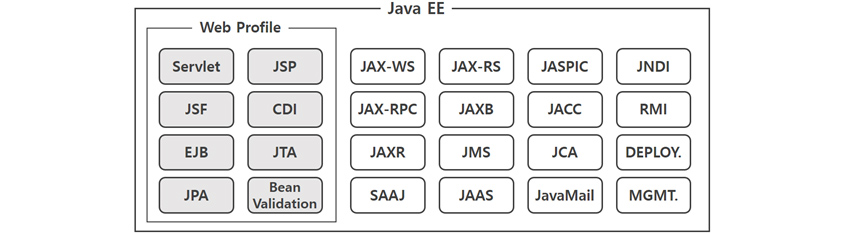
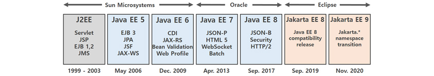
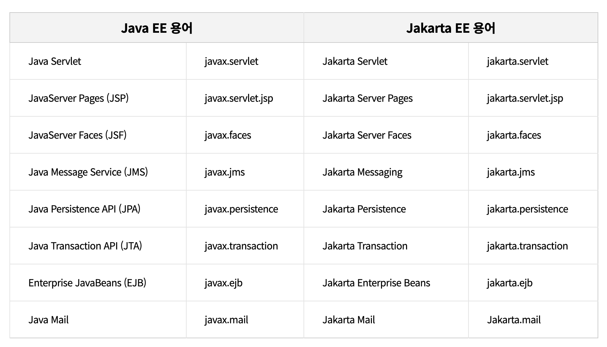

# Jakarta EE

자바 기술자라면 Java EE(Java Platform, Enterprise Edition) 또는 J2EE(Java 2 Platform, Enterprise Edition)를 들어봤을 것입니다.
자바를 이용한 서버 개발 플랫폼으로 한 때 엔터프라이즈 자바 기술을 선도하며 막강한 영향력을 발휘했지만 기술 변화와 시장 요구에 제때 대응하지 못하면서 현재는 명맥만 유지하는 암울한 상황에 처해 있습니다. 그럼에도 불구하고 자바EE는 가장 성공적인 상업용 표준 플랫폼의 하나이며 대부분의 웹 애플리케이션 서비스를 위한 미들웨어 기술로 꾸준히 사용되고 있습니다.
2018년 자바EE는 자카르타(Jakarta)EE로 명칭을 바꾸고 새로운 변화에 나섰습니다. 본 아티클에서는 오픈소스 기반으로 변경된 자카르타EE의 현재 모습을 살펴보고 미래를 전망해보겠습니다.

## Java EE(Java Platform, Enterprise Edition)
* `Java EE`는 1999년 썬 마이크로시스템즈가 J2EE(Java2 Enterprise Edition)명으로 발표한 분산 어플리케이션 개발 목적의 표준 플랫폼
* 기업용 애플리케이션을 개발/실행하기 위한 기술과 환경을 제공
  + Servlet, JSP, EJB, JDBC, JNDI, JMX, JTA등의 알려진 기술들이 포함
* `Java EE`의 주요 목적은 특정 운영체제와 미들웨어에 종속되지 않고, 정보 교한 및 애플리케이션 호환이 가능한 플랫폼을 제공하는 것
* `Java EE`의 기술 사양은 자바SE(Java Platform, Standard Edition)와 동일하게 JCP(Java Communitiy Process)의 표준화 과정을 통해 만들어 진다.
* 새로운 기술 요건들은 자바 스펙 요구서 JSR(Java Specifiocation Request)라는 표준 명세로 제안
  + 제안된 명세가 구현될 수 있음을 증명하는 참조 구현 RI(Reference Implementations)
  + 구현을 검증할 수 있는 기술 호환성 키트 TCK(Technology Compatibility Kits)가 제공
* 위와 같은 명세들이 모여서 하나의 `Java EE`버전이 정의되며, 각 벤더들은 해당 명세를 구현하여 호환 구현을 CI(Compatible Implementations) 만들어 제공
* 이렇게 만들어진 호환 구현 제품이 웹 애플리케이션 서버 WAS(Web Application Server)

### Java EE의 한계
* `Java EE`는 출시 초창기에 기업용 자바 플랫폼이라는 생태계를 열며 큰 성과를 이룸
  + 하지만, 상업용 플랫폼의 한계와 스프링 프레임워크 등 오픈소스 SW의 발전으로 주가 하락
  + 또한, 릴리즈의 주기가 2년에서 4년으로 길어지면서 빠르게 변화하는 기술 트랜드를 반영하지 못하여 인기 하락

### Java EE 히스토리

## Jakarta EE(Jakarta, Enterprise Edition)
* 이클립스 재단으로 이관된 자바EE의 공식 명칭이 `Jakarta EE`, 프로젝트 명은 `EE4J`(Eclipse Enterprise for Java)로 변경
* `Jakarta EE`는 기존 JCP(Java Communitiy Process) 정책이 아닌 오픈소스 기반의 `JESP`(Jakarta EE Specification Process)라는 개방적이고 중립적인 정책을 기준
  + 오라클이 자바EE 프로젝트를 이관했지만, 자바 상표권은 여전히 보유하고 이씩 떄문에 자바 네임스페이스 사용에 제약
  + 이러한 이유로 `Jakarta EE`에서는 `Java` 키워드 관련 네임스페이스 패키지 명을 사용할 수 없다.
    -`Java` 네임스페이스가 `Jakarta`로, API 패키지명은 `Javax.*` -> `Jakarta.*` 로 변경

* `Jakarta EE`는 기존 자바EE를 대체하지 않고 둘 다 공존
* `Jakarta EE`는 기존 자바EE에서 하드포크된 새로운 플랫폼으로, 기존 자바EE와 호환되지 않는다.
* `Java EE`는 계속 유지되지만, 8버전을 마지막으로 더 이상의 릴리즈와 추가 기능을 제공되지 않는다.
  + 즉 개발자는 자바EE를 계속 사용할 것인지, 아니면 자카르타EE로 마이그레이션 할 것인지를 선택해야 한다.
* `Jakarta EE`의 핵심 목표는 클라우드 네이티브 환경을 위한 엔터프라이즈 자바 기술로, 마이크로서비스, 컨테이너 등의 최신 기술 트렌드를 반영
