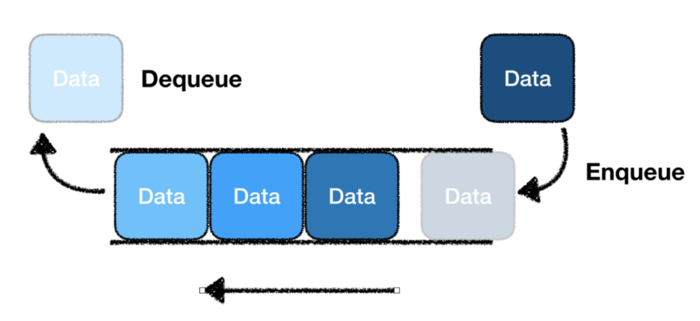
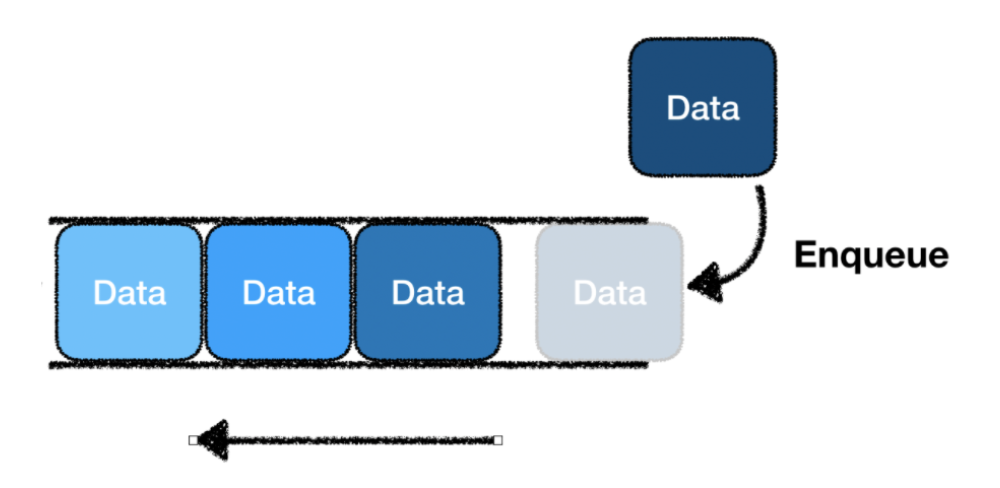
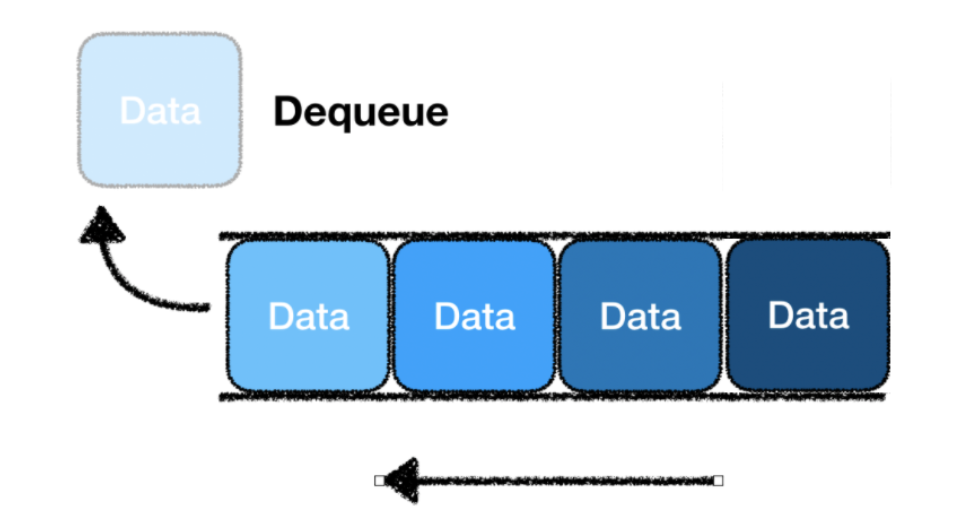

# Queue

* Queue는 줄을 지어 순서대로 처리되는 자료구조
* 큐는 데이터를 일시적으로 쌓아두기 위한 자료구조로 스택과 다르게 FIFO(First In First Out) 형태


* Enqueue: 큐 맨 뒤에 데이터 추가
* Dequeue: 큐 맨 앞쪽의 데이터 삭제

## Queue의 특징
1. FIFO 구조: 먼저 들어간 자료가 먼저 나오는 구조
2. 큐는 한 쪽 끝은 프런트 역활로 삭제 연산만 수행
3. 다른 한쪽은 리어 역활로 삽입 연산만 수행
4. 그래프의 넓이 우선 탐색(BFS)에 주로 사용
5. 컴퓨터 버퍼에서 주로 사용, 마구 입력이 되었으나 처리를 하지 못할 때, 버퍼(큐)를 만들어 대기 후 순서대로 처리

## Queue 사용법

### Queue 생성

```java
import java.util.Queuq;
import java.util.LinkedList;

Queue<Integer> intQueue = new LinkedList<>();
Queue<String> strQueue = new LinkedList<>();
```

### Queue Enqueue
큐에 데이터를 삽입

```java
Queue<Integer> intQueue = new LinkedList<>();

// Queue 값 추가 // Enqueue
intQueue.add(1);
intQueue.add(2);
intQueue.add(3);
intQueue.offer(4); // Enqueue
```

Enqueue 2가지
* add
* offer

> add(Value) 메서드로 큐를 삽입에 성공하면 True 반환, 큐에 여유 공간이 없어 삽입에 실패하면 IllegalStateException 발생



### Queue Dequeue
큐에 데이터를 출력(삭제)

```java
Queue<Integer> intQueue = new LinkedList<>();
intQueue.add(1);
intQueue.offer(4);

// Queue 값 삭제 // Dequeue
intQueue.poll(); // queue에 첫번째 값을 반환하고 제거, 비어있다면 null
intQueue.remove(); // queue의 첫번째 값 제거
intQueue.peek(); // queue의 첫번째 값 참조 or 반환
intQueue.clear(); // queue 모든 요소 초기화
```


